# CPU 基础 

## CPU 基本构成

CPU 发展至今已经集成了大规模复杂的电路，可以把它看作是一个由很多小块组成的复杂机器，然而无论 CPU 的具体实现怎么变、晶体管数量翻多少番，这些小块从功能的角度大致可以划分成**三大部分：算术逻辑单元、存储单元和控制单元**。

当然这里面其实只是一个简图，实际上中央处理单元，它的整个连线，整个 IO，整个具体的控制流程是非常的复杂的，接下来简单介绍这些组成单元以及单元之间是怎么互相配合的。


### 算术单元

CPU 的主要功能就是运算，这正是通过算术逻辑单元（ALU，Arithmetic Logic Unit）实现的。ALU 电路内部由算术单元（AU）和逻辑单元（LU）组合而成，可对两个输入值（操作数）执行算术或逻辑运算并产生一个输出值。

算术单元负责对二进制数执行加减等数学运算，而逻辑单元执行与、或、非等逻辑运算，以及对两个操作数进行比较等。另外 ALU 还具备位移功能，将输入的操作数向左或向右移动从而得到新的操作数.不只是 CPU，其他如图形处理器 GPU 等几乎所有的微处理器中，ALU 都是最基本的组件。

除了执行与加法和减法相关的计算外，ALU 还可以处理两个整数的乘法，因为它们旨在执行整数计算；因此，它的结果也是一个整数。但是，除法运算通常不能由 ALU 执行，因为除法运算可能会产生浮点数的结果。相反，浮点单元 （FPU，floating-point unit）通常处理除法运算；FPU 也可以执行其他非整数计算。

> 浮点数的由来：用科学计数法的方式表示小数时，小数点的位置就变得「漂浮不定」了，这就是相对于定点数，浮点数名字的由来。

虽然 ALU 是处理器中的主要组件，但 ALU 的设计和功能在不同的处理器中可能会有所不同。例如，有些 ALU 设计为仅执行整数计算，而有些则用于浮点运算。一些处理器包含单个算术逻辑单元来执行操作，而其他处理器可能包含许多 ALU 来完成计算。ALU 执行的操作是：

1. **逻辑运算**：逻辑运算包括 NOR、NOT、AND、NAND、OR、XOR 等。

2. **移位操作**：它负责将位的位置向右或向左位移一定数量的位置，也称为乘法运算。

3. **算术运算**：虽然它执行乘法和除法，但这是指位加法和位减法。但是乘法和除法运算的成本（逻辑复杂度和面积）更高。在乘法运算中，加法可以用作除法和减法的替代。

如图所示，ALU 包含各种输入和输出连接，这使得外部电子设备和 ALU 之间可以投射数字信号。ALU 输入从外部电路获取信号，作为响应，外部电子设备从 ALU 获取输出信号。

1. **数据**：ALU 包含三个并行总线，包括两个输入和输出操作数。这三个总线处理的信号数量是相同的。

2. **操作码**：当 ALU 将要执行操作时，操作选择码描述了 ALU 将执行哪种类型的运算或逻辑运算。

3. **输出**：ALU 操作的结果由状态输出以补充数据的形式提供，因为它们是多个信号。通常，诸如溢出、零、执行、负数等状态信号都包含在通用 ALU 中。当 ALU 完成每个操作时，外部寄存器包含状态输出信号。这些信号存储在外部寄存器中，使它们可用于未来的 ALU 操作。

4. **输入**：当 ALU 执行一次操作时，状态输入允许 ALU 访问更多信息以成功完成操作。此外，存储的来自先前 ALU 操作的进位被称为单个“进位”位。

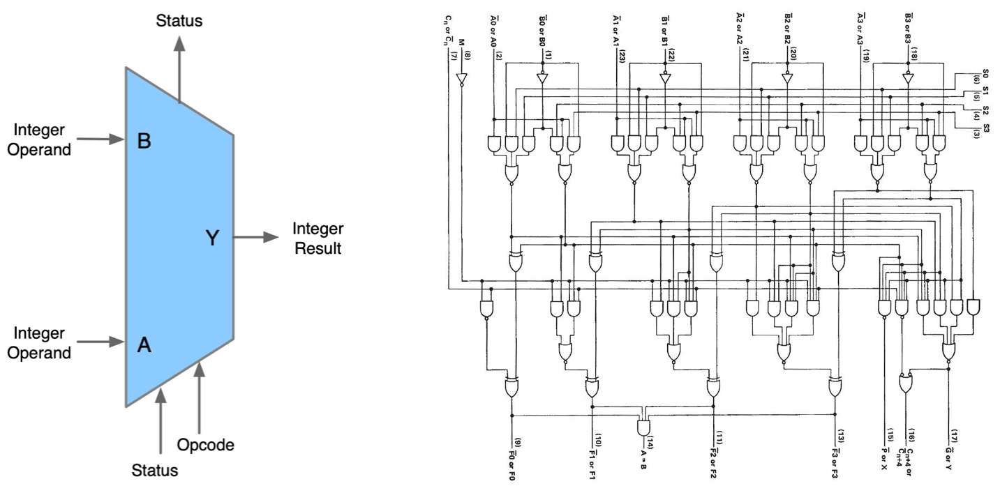

ALU 是一种组合逻辑电路，这意味着它的输出将随着输入变化而异步变化。在正常操作中，稳定信号被施加到所有 ALU 输入，当信号通过 ALU 电路传播足够的时间（称为“传播延迟”）时，ALU 操作的结果出现在 ALU 输出。连接到 ALU 的外部电路负责确保 ALU 输入信号在整个操作过程中的稳定性，并在对 ALU 结果进行采样之前留出足够的时间让信号通过 ALU 传播。

通常，外部电路通过向 ALU 的输入施加信号来控制 ALU。通常，外部电路采用时序逻辑来控制 ALU 操作，该操作由频率足够低的时钟信号来控制，以确保 ALU 输出有足够的时间在最坏情况下稳定下来。

### 存储单元

存储单元（MU，Memory Unit）也可以称为寄存器，为什么会出现寄存器？因为我们知道，程序在内存中装载，由 CPU 来运行，CPU 的主要职责就是用来处理数据。那么这个过程势必涉及到从存储器中读取和写入数据，因为它涉及通过控制总线发送数据请求并进入存储器存储单元，通过同一通道获取数据，这个过程非常的繁琐并且会涉及到大量的内存占用，而且有一些常用的内存页存在，其实是没有必要的，因此出现了寄存器，存储在 CPU 内部。

没有寄存器的话，CPU 将需要不断地从内存中读取和写入数据，这将严重降低计算机的性能。因为寄存器比内存更快，所以使用寄存器可以加速计算机的操作和计算。此外，寄存器还可以用于存储中间结果和操作数，从而简化了 CPU 内部的计算过程。

寄存器主要分为两种指令寄存器和数据寄存器，负责暂存指令、ALU 所需操作数、ALU 算出结果等。算术逻辑单元 ALU 在执行计算的时候，需要读取存储在寄存器中的操作数，计算结果则保存到累加器中（也是一种寄存器），ALU 执行的命令则来自指令寄存器。

比如，当将两个数字相加时，一个数字放在 A 寄存器中，另一个放在 B 寄存器中，ALU 执行加法后将结果放入累加器中。如果是逻辑操作，则把要比较的数据放进输入寄存器中，比较的结果 1 或 0 放入累加器中。无论是逻辑运算还是算术运算，累加器内容都会被放入缓存中。

寄存器的存储容量是根据其位数来决定的，不同的寄存器有不同的位数，可以存储的数据数量也不同。例如，一个 8 位的寄存器（INPR）可以存储 256 个不同的值。

另外，寄存器的存储容量也可以根据其用途和设计来决定。例如，在 CPU 中，指令寄存器通常只能存储一条指令，而数据寄存器则可以存储多个数据。有了寄存器，才能让 CPU 快速地存储、访问和操作指令和数据，从而提高了计算机的整体性能和效率。

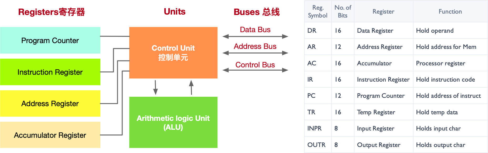

如上图所示寄存器的种类有很多，下面我们来看看几个常见寄存器的功能：

1. **数据寄存器（DR）**：数据寄存器（Data Register，DR）又称数据缓冲寄存器，数据寄存器用于存放操作数，其位数应满足多数数据类型的数值范围，其主要功能是作为 CPU 和主存、外设之间信息传输的中转站，用以弥补 CPU 和主存、外设之间操作速度上的差异。数据寄存器用来暂时存放由主存储器读出的一条指令或一个数据字；反之，当向主存存入一条指令或一个数据字时，也将它们暂时存放在数据寄存器中。数据寄存器的作用是：

   a. 作为 CPU 和主存、外围设备之间信息传送的中转站；

   b. 弥补 CPU 和主存、外围设备之间在操作速度上的差异；

   c. 在单累加器结构的运算器中，数据寄存器还可兼作操作数寄存器。

2. **地址寄存器（AR）**：地址寄存器（Address Register，AR）用来保存 CPU 当前所访问的主存单元的地址。其本身可以具有通用性，也可用于特殊的寻址方式，如用于基址寻址的段指针（存放基地址）、用于变址寻址的变址寄存器和用于堆栈寻址的栈指针。地址寄存器的位数必须足够长，以满足最大的地址范围。由于在主存和 CPU 之间存在操作速度上的差异，所以必须使用地址寄存器来暂时保存主存的地址信息，直到主存的存取操作完成为止。

3. **累加寄存器（AC）**：累加寄存器通常简称累加器（AC），是一个通用寄存器。累加器的功能是当运算器的算术逻辑单元 ALU 执行算术或逻辑运算时，为 ALU 提供一个工作区，可以为 ALU 暂时保存一个操作数或运算结果。显然，运算器中至少要有一个累加寄存器。

4. **程序计数器（PC）**：程序计数器（PC），具有寄存信息和计数两种功能，一般用来存放下一条指令在主存储器中的地址。在程序执行之前，首先必须将程序的首地址，即程序第一条指令所在主存单元的地址送入 PC，因此 PC 的内容即是从主存提取的第一条指令的地址。当执行指令时，CPU 能自动递增 PC 的内容，使其始终保存将要执行的下一条指令的主存地址，为取下一条指令做好准备。但是，当遇到转移指令时，下一条指令的地址将由转移指令的地址码字段来指定，而不是像通常的那样通过顺序递增 PC 的内容来取得。

5. **指令寄存器（IR）**：指令寄存器（Instruction Register，IR），用来保存当前欲执行的指令。当执行一条指令时，首先把该指令从主存读取到数据寄存器中，然后再传送至指令寄存器。指令包括操作码和地址码两个字段，为了执行指令，必须对操作码进行测试，识别出所要求的操作，指令译码器就是完成这项工作的。指令译码器对指令寄存器的操作码部分进行译码，以产生指令所要求操作的控制电位，并将其送到微操作控制线路上，在时序部件定时信号的作用下，产生具体的操作控制信号。指令寄存器中操作码字段的输出就是指令译码器的输入。操作码一经译码，即可向操作控制器发出具体操作的特定信号。

除此之外，寄存器的种类还有很多，感兴趣的读者可以自行查阅资料学习。

上述的寄存器（Register）即 CPU 内部的存储单元，用于存储供 CPU 访问的数据和指令，以及存储任何计算或任务的中间结果。处理的最终结果也会被保存到存储单元中，然后将这些结果发布到输出设备提供给用户。不过 CPU 内部存储单元的容量极为有限，大量数据只能保存在 CPU 之外的 RAM（随机存取存储器）芯片中，就是我们平常所说的内存，也被称之为主存。存储器单元负责从主存中检索并临时存储数据，负责管理 CPU 和主存之间的数据流。相信，提起内存，很多人对这个东西很熟悉。虽然他们都是可以存储数据，但是还是千差万别。下面我们简要概括寄存器和内存的区别：

1. 功能：寄存器是中央处理器内的组成部件，用于暂存指令和数据，可用来高速地存放操作数和中间结果，以及作为 CPU 内部和外部存储器之间或和输入/输出设备之间进行数据交换的缓冲区。内存主要功能是存放 CPU 的运算数据，以及与硬盘等外部存储器交换的数据。

2. 速度：寄存器位于 CPU 内部，执行速度快。内存的速度相对较慢。寄存器的速度非常快，通常可以在几个纳秒内完成数据的存取操作。相比之下，内存的速度相对较慢，但也是非常快速的存储器之一，可比硬盘快多了。

3. 容量：寄存器通常只有几字节到几十字节的容量。内存的存储容量通常远远大于寄存器，可以扩展到几个 GB 或者更大。

那寄存器既然这么重要，速度这么快，为什么不把它搞大一点呢？其原因在于好的东西其价格都很贵，从成本角度不如内存合适。

### 控制单元

控制单元（CU，Control Unit）的主要工作用一句话概括就是告知最有效的工作方法。控制单元从主存中检索和选取指令，对其进行解码，然后发出适当的控制信号，指导计算机的其他组件执行所需的操作。控制单元自身并不执行程序指令，它只是输出信号指示系统的其他部分如何做。

如果说 CPU 是计算机的大脑，那么控制单元就是 CPU 的大脑，也是 CPU 中最重要的部分。控制单元的任务可以分为解码指令、生成控制信号，并将这些信号发送给其他组件，例如 ALU、MU、存储器和输入/输出设备等。接下来的部分将详细介绍控制单元的任务，并举例说明。

1. **指令解码**：控制单元负责从存储器中读取指令，并对其进行解码。指令解码是将二进制指令转换为对计算机各个部件的控制信号的过程。通过解码，控制单元能够识别指令的类型、操作数和执行方式，并为后续的执行步骤做好准备。

   举例：假设有一条指令 "ADD R1, R2, R3"，表示将寄存器 R2 和 R3 中的值相加，并将结果存储到寄存器 R1 中。控制单元会解码这条指令，识别出这是一条加法指令，并生成相应的控制信号，指示运算单元从 R2 和 R3 中读取数据，并将结果写入 R1。

2. **控制信号生成**：控制单元根据解码的指令类型和操作数，生成相应的控制信号，以控制计算机中各个部件的操作。这些控制信号包括时钟信号、读/写信号、地址选择信号、操作数选择信号等。控制单元会根据指令的需求生成适当的控制信号，确保计算机的各个部件按照指令的要求进行操作。

   举例：对于一条存储指令 "LOAD R1, 2000"，表示将内存地址 2000 处的数据加载到寄存器 R1 中。控制单元会生成读取数据的控制信号，将地址 2000 发送给存储器，并将读取到的数据写入 R1。

3. **指令执行顺序**：控制控制单元还负责管理指令的执行顺序。它会按照指令序列的顺序，逐条调度指令的执行，并确保每条指令的操作在正确的时钟周期内完成。控制单元能够根据不同指令的需求，控制指令的跳转、分支和循环等控制流程。

   举例：在一段程序中，有一条条件分支指令 "IF R1 == R2 THEN GOTO 100"，表示如果寄存器 R1 的值等于 R2 的值，则跳转到标号为 100 的指令继续执行。控制单元会根据条件判断的结果，生成相应的控制信号，决定是否跳转到标号 100 处执行。

学习了控制单元 CU 的工作任务就是接收指令，指挥执行。我们接下来看看 CU 的工作过程如下图所示，CU 所接收的输入有三个：节拍发生器（Step Counter）、操作译码器（Instruction）、标志信号（Condition Signal）

1. **节拍发生器**：时钟会给节拍发生器发出一定频率的时钟脉冲，节拍发生器根据时钟脉冲的次数，向 CU 循环发送节拍信号。如果规定每个机器周期中包含十二个时钟周期，那么当节拍发生器收到第十三个时钟脉冲时，它会重新发出节拍信号“1”。而 CU 也会根据此节拍信号进入下一个机器周期——CU 会“点亮”取指 FE、间指 IND、执行 EX、周期 INT 四个指令周期寄存器中的一个（事实上这四个触发器集成在 CU 内部），表示当前整体处在哪个机器周期。

2. **操作译码器**：寄存器 IR 会将指令中的 n 位二进制操作码发送给操作译码器——n 位二进制对应着 $2^n$ 种状态，译码器需要与 CU 连接 $2^n$ 根线，每一种状态对应一根线，使得 CU 可以识别该操作码。

3. **标志信号**：标志是接收反馈的信号——经过 ALU 处理后的数字是正数还是负数、数字有没有溢出、鼠标有没有点击、哪个键盘敲击了等等，都是反馈信号。

CU 接收这三个外部参数后，就能够发出控制信号——微命令（Control Signals），来指挥 CPU 做出微操作。

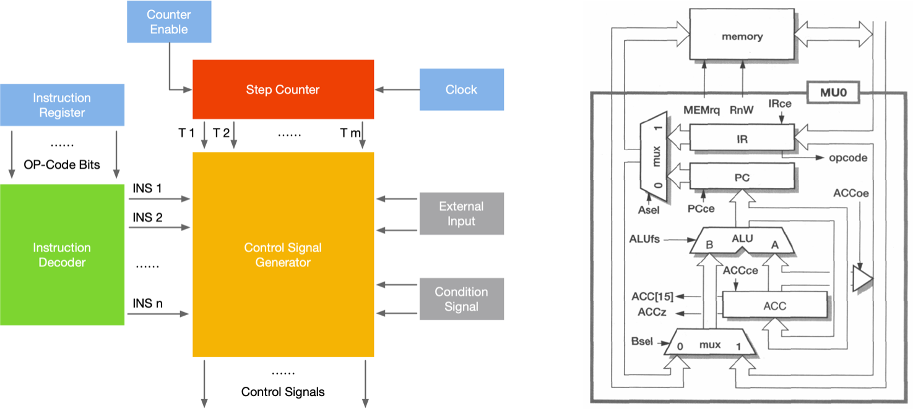

### CPU 组成总结

下图所示的是一张英特尔酷睿 CPU 的架构图，从复杂的控制流程中，我们还是可以清晰的看到 ALU，MU 以及 CU 这些我们刚刚学习过的内容，当然读者朋友要是想设计这么一张架构图还是需要很多的知识储备的。

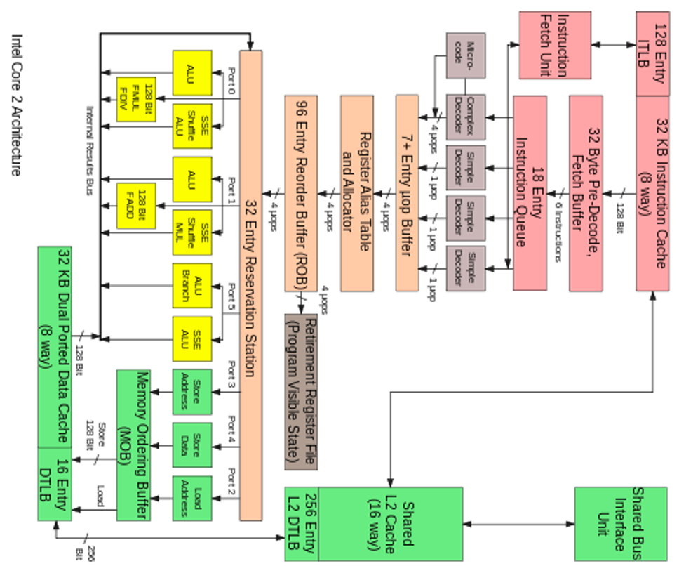

## CPU 工作流

接下来我们来介绍一下这些主要单元是如何相互配合完成的也就是 CPU 的工作流，主要分为 4 步：

1. **取指**：从内存提取指令的阶段，是将内存中的指令读取到 CPU 中寄存器的过程，程序寄存器用于存储下一条指令所在的地址

2. **解码**：解码指令译码阶段，在取指令完成后，立马进入指令译码阶段，在指令译码阶段，指令译码器按照预定的指令格式，对取回的指令进行拆分和解释，识别区分出不同的指令类别以及各种获取操作数的方法。

3. **执行**：执行指令阶段，译码完成后，就需要执行这一条指令了，此阶段的任务是完成指令所规定的各种操作，具体实现指令的功能。根据指令的需要，有可能需要从内存中提取数据，根据指令地址码，得到操作数在主存中的地址，并从主存中读取该操作数用于运算。

4. **写回**：结果写回阶段，作为最后一个阶段，结果写回（Write Back，WB）阶段把执行指令阶段的运行结果数据写回到 CPU 的内部寄存器中，以便被后续的指令快速地存取；

结合下图简单解释，第一步就是从内存里面去读取一些指令，给到控制单元 CU，而控制单元就会对刚才读取的一些指令来进行解码，变成正式的一些 command 命令，然后 ALU 就会去执行这些 command，这些命令执行完之后就会存储回来内存进行汇总也就是写回。

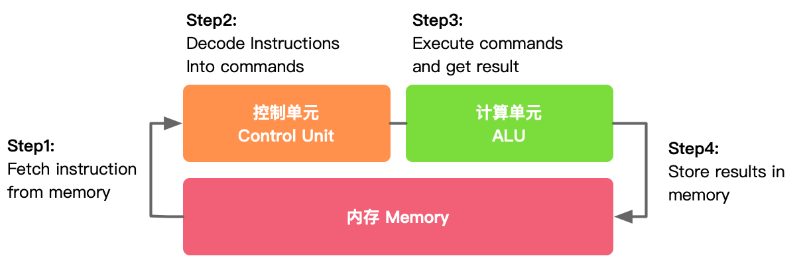

接下来我们就从编程的视角去理解 CPU 的工作流。平时我们变成使用 C++、Java、Python 等编程语言编译好的程序文件（机器码），保存在硬盘等存储介质上，当操作系统运行这些程序的时候，首先会将它们加载到系统内存中。

程序文件实际就是一系列的指令，CPU 从内存中检索并读取程序指令，然后通过控制单元对程序指令进行译码操作，使其转化为 CPU 能够“读懂”的指令格式。

接下来控制单元向算术逻辑单元 ALU 发送信号，ALU 即依据指令读取操作数并进行相应计算，其计算结果经由 CPU 内的存储单元返回内存中。

在以上过程中，CPU 执行了四个重要步骤：1）从内存提取指令；2）解码；3）执行；4）写回。这四个步骤是完整执行一条指令的过程，称之为指令周期（Instruction Cycle）。

这一过程循环往复地进行，直到程序结束。说起来简单，实际过程却很复杂。单以取指令这一步骤来说，它本身就又由多个微操作组成：　

1. 程序计数器初始化指针指向内存地址；
2. 内存地址被装载到 CPU 的地址寄存器中；
3. CPU 接下来检索该内存地址中的数据，并将其载入数据寄存器中；
4. 如果数据包中包含的是指令，将其装载到指令寄存器中；
5. 程序计数器递增加 1，指向下一个内存地址；
6. 指令寄存器中的指令被传入 CPU 的控制单元中；
7. 以上步骤循环往复地进行。

接下来的译码、执行等阶段，也都有着各自复杂的操作，感兴趣的伙伴可以详细学习计算机组成原理（计算机必修课）。

回到 CPU 的的架构，我们需要了解的是 CPU 三大组成的各自分工，控制器和寄存器负责的工作最多、要存的数据最多的两部分。

下图是 CPU 的一个简要架构图，从下往上是 DRAM（Dynamic Random Access Memory，动态随机存取存储器）以及 Cache 这些其实都可以当作是内存，然后有控制器，真正的执行单元就是 ALU，我们可以看到真正执行单元的 ALU 占的面积是非常的小的，图中假设有 4 个 ALU 或者计算盒，而在整体电路里面占了绝大部分面积的是内存还有控制器，而并非计算，所以说 CPU 是非常适合擅长处理逻辑控制，而并非计算。

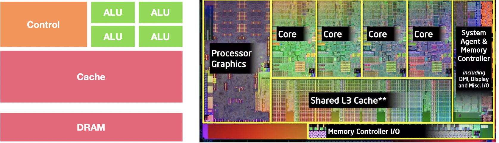

# CPU 指令集架构 

## ISA 指令集架构

通常用来区分 CPU 的标准是指令集架构（Instruction Set Architecture，ISA），简称 ISA。下面将会通过例子介绍 ISA 如何运作，ISA 的作用以及 ISA 的分类和生命周期。

### 什么是 ISA

ISA 是处理器支持的所有指令的语义，包括指令本身及其操作数的语义，以及与外围设备的接口。就像任何语言都有有限的单词一样，处理器可以支持的基本指令/基本命令的数量也必须是有限的，这组指令通常称为指令集（Instruction Set），基本指令的一些示例是加法、减法、乘法、逻辑或和逻辑非。

开发人员基于指令集架构（ISA），使用不同的处理器硬件实现方案，来设计不同性能的处理器，因此 ISA 又被视作 CPU 的灵魂。

指令集架构是软件感知硬件的方式，我们可以将其视为硬件输出到外部世界的基本功能列表。Intel 和 AMD CPU 使用 x86 指令集，IBM 处理器使用 PowerPC R 指令集，HP 处理器使用 PA-RISC 指令集，ARM 处理器使用 ARMR 指令集（或其变体，如 Thumb-1 和 Thumb-2）。

因此，不可能在基于 ARM 的系统上运行为 Intel 系统编译的二进制文件，因为指令集不兼容，但在大多数情况下，可以重用 C/C++程序。要在特定架构上运行 C/C++程序，我们需要为该特定架构购买一个编译器，然后适当地编译 C/C++程序。

现在从更宏观的视角来看看指令集架构，可以将指令集架构理解为一个抽象层，它是处理器底层硬件与运行在硬件上的软件之间桥梁和接口，如下层所示上面是软件部分，下面是硬件部分。

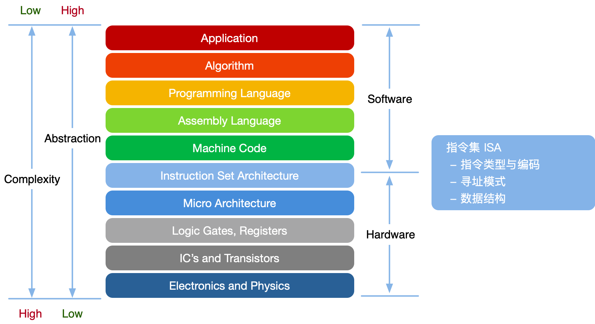

计算机可以通过指令集，判断这一段二进制码是什么意思，然后通过 CPU 转换成控制硬件执行的信号，从而完成整个操作，这样一来，指令集其实就是硬件和软件之间的接口（interface），我们不再需要直接和硬件进行交互，而是和具有更高的抽象程度的 ISA 进行交互，集中注意在指令的编写逻辑，提高工作效率。

对于 CPU 设计工程师来说，只需要设计一些基本的加法电路、减法电路、各种与门、或门、非门，就可以支持这些基本的加减乘除、与或非等逻辑运算。

CPU 在硬件电路上支持的这些指令的集合就是指令集。指令集是一个标准，定义了指令的种类、格式，需要的配套的寄存器等。CPU 在设计之前，就需要先设计一套指令集，或者说使用现成的指令集(如 ARM、X86 指令集)，在硬件电路上实现这些指令。

CPU 设计好后，还需要配套的编译器，编译器也需要参考这个指令集标准，将我们编写的 C 程序、C++程序编译成 CPU 硬件电路支持的加减乘除、与或非等指令，程序才能在 CPU 上运行。

指令集也可以说是一个标准，这个标准并不是一成不变的，会随着需求不断添加新的指令。比如随着多媒体技术的发展，需要对各种音频、视频等大量的数据做计算。一个简单的数组加法 $a[100]+b[100]$，就需要做 100 次运算，自从指令集添加了 SIMD 指令，一次运算就可以搞定了。

指令集添加了新的指令，CPU 工程师在设计 CPU 上，也要在硬件电路上增加对应的电路模块来支持新增加的指令，配套的编译器也会随着升级，将 $a[100]+b[100]$ 翻译成对应的 SIMD 运算，来提升效率。当然，编译器不升级也可以，还是将数组的每个元素分别运算，计算 100 次，CPU 也能运行，但是效率就慢了 100 倍。但是，如果一个 CPU 不支持 SIMD 指令，也就是说这个 CPU 电路没有可以运行 SIMD 指令的电路模块，此时如果你使用新的编译器编译生成的 SIMD 指令是不能在老的 CPU 上运行的。

由此可以看出，指令集架构的重要性，对于不同厂家的 CPU 而言，都会有自己独特的运算指令来做一些特殊的操作，指令编写的好坏直接影响着 CPU 的计算性能。指令集的强弱也是芯片的重要指标，指令集是提高处理器效率的最有效工具之一。采用相同架构的处理器，性能基本上已经锁定在一定的范围之内，不会有本质的区别。

### 指令例子解析

接下来我们把 ISA 其中的一个指令拿出来详细看看指令的组成，如下图所示是一个 MIPS 指令，这是一种采取精简指令集（RISC）的处理器架构。

> 精简指令集（RISC）的处理器架构：1981 年出现，由 MIPS 科技公司开发并授权，广泛被使用在许多电子产品、网络设备、个人娱乐设备与商业设备上。最早的 MIPS 架构是 32 位，最新的版本已经变成 64 位，RISC 指令集架构将在后面内容详细说明。

MIPS32 的指令字长是 32 位的定长格式，也就是由 32 个 0 或者 1 组成。采用的是寄存器与立即数方式相结合的寻址方式，在指令中给出寄存器编号或者立即数。

整个 MIPS32 指令集由三类指令构成：R 型（寄存器型）指令、I 型（立即数）型指令和 J 型（转移型）指令。

1. **R 类型**：R 型指令使用三个寄存器作为操作数，它们是 MIPS32 中最常用的指令类型。R 型指令的格式包括操作码（OP）、寄存器地址码（rs、rt、rd）以及移位量（shamt）和功能辅助说明（func）字段。R 型指令的例子包括算术逻辑指令（如 add、sub、and、or 等）、分支指令（如 beq、bne 等）、以及一些特殊的系统控制指令。

2. **I 类型**：具体操作由 op 指定，指令的低 16 位是立即数，运算时要将其扩展至 32 位，然后作为其中一个源操作数参与运算。I 型指令的例子包括加法指令 addi、减法指令 subi、分支指令（如 beqz、bnez 等）以及加载和存储指令（如 lw、sw 等）

3. **J 类型**：具体操作由 op 指定，一般是跳转指令，低 26 位是字地址，用于产生跳转的目标地址。J 型指令的例子包括无条件跳转 j、条件跳转 jal（跳转并链接）等。

接下来我们详细解释一条 MIPS32 指令，来加深读者对于指令的理解。如下图所示的是一条 addi 指令，那为什么是 addi 指令呢？决定这条指令功能的是前 6 位，也就是 op code，也可以理解为运算符，不同的 op code 对应了不同的操作，图中是以“加法”为例。

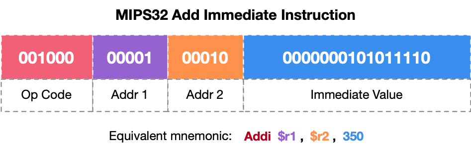

右边三个部分对应着的是操作对象，其中一共有三个参数分别是：目的操作数 Addr1、原操作数 Addr2 以及立即数 imediate Value。其中目的操作数 Addr1、原操作数 Addr2 都是 5 位所代表的是我们寄存器的地址，Addr1 用于存储计算后的结果，Addr2 地址中存储着要进行加法计算的数值。imediate Value 是一个立即数共 16 位，它是一个有符号的常量值，用于与 Addr2 寄存器中的值相加。

图中的立即数转化为十进制就是 350，这条指令会将寄存器 Addr2 中的值与立即数 355 相加，并将结果存储在 Addr1 寄存器中。

细心的读者应该是已经发现 addi 是 I 型（Immediate）指令，因为我们可以很明显的看到指令的后 16 位包含一个立即数操作数，立即数的大小通常限制在 16 位，这意味着它可以直接编码在指令中。在 MIPS32 中，立即数的范围通常是-32768 到 32767。addi 指令在执行时可能会发生溢出，但 MIPS 架构使用有符号数，因此溢出会导致符号位的扩展。

> 与 add 指令相比，addi 指令执行的是寄存器与立即数的加法，而不是两个寄存器之间的加法。因此 add 是一种 R 类型指令，当然感兴趣的读者也可以自行关注相关内容。

### ISA 基本分类

一般来说，指令都是从数据池里面取出数据，然后对数据处理，最后再将数据放回，这三部曲是指令的基本内容。寻址方式提供了从数据池读取或写入数据的地址，算是解决了这三部曲的关键问题。在计算机体系结构中，CPU 的运算指令、控制指令和数据移动指令是构成指令集的基本元素。

1. 运算指令：在 ALU 中执行的计算操作

2. 数据移动指令：读写存储操作（包括寄存器读写）

3. 控制指令：更改指令执行顺序，进行程序跳转，实现 if/else，循环等

CPU 的运算指令、控制指令和数据移动指令通常在底层编程语言和汇编语言中直接使用。这些指令是计算机硬件能够直接理解和执行的指令，因此在更高级的编程语言中，它们通常被隐藏或封装在更高层次的抽象中。

对于汇编语言是一种非常底层的编程语言，它允许程序员直接使用 CPU 的指令集。在汇编语言中，你可以直接编写像 MOV, ADD, JMP 这样的指令来控制 CPU 的行为。每一个汇编指令通常都对应一个或多个机器指令。

虽然 C 和 C++是高级语言，但它们提供了足够低的抽象级别，使得程序员可以访问底层功能，包括直接操作内存和数据。在 C/C++中，你可以使用指针来直接访问和操作内存中的数据。此外，通过内联汇编或特定的编译器扩展，你还可以在 C/C++代码中嵌入汇编指令。

除了汇编和 C/C++之外，还有一些其他编程语言，如 Rust、Go 等，它们也提供了对底层硬件的直接访问能力，尽管这种访问可能没有 C/C++那么直接。

像 Python、Java、JavaScript 等高级语言通常隐藏了底层的细节，如 CPU 指令和数据移动。这些语言提供了更高级别的抽象，使得程序员可以更专注于解决问题，而不是管理内存或处理低级指令。在这些语言中，CPU 指令和数据移动通常由运行时环境或虚拟机来管理。

总的来说，CPU 的运算指令、控制指令和数据移动指令主要在汇编语言和低级编程语言中使用。在高级编程语言中，这些底层细节通常被抽象化，使得程序员可以更加专注于应用逻辑的实现。

### ISA 生命周期

接下来我们简单介绍一下 ISA 的生命周期，生命周期所描述的是如何执行一条指令。主要分为如下所示的 6 个阶段，虽然不是所有指令都会循环所有阶段，但基本上大原则都不会变。

1. FETCH：在这个阶段，CPU 的取指单元根据程序计数器（PC）的值，从内存中读取指令。程序计数器是一个寄存器，它存储了下一条要执行的指令的地址。取到指令后，该指令被加载到指令寄存器中，以便后续阶段使用。取指完成后，PC 通常会更新为下一条指令的地址，除非遇到跳转或分支指令。

2. DECODE：译码阶段是理解指令含义的关键步骤。控制单元会检查指令寄存器中的指令，并确定其操作码（Opcode）和操作数（Operands）。操作码决定了要执行的操作类型，如加法、减法、分支等。操作数则指定了操作的对象，可以是寄存器、内存地址或立即数。译码后，控制单元会生成一系列的控制信号，这些信号将驱动后续阶段的操作。

3. EVALUATE ADDRESS：对于访问内存的指令，如加载（Load）和存储（Store），在取数之前需要计算出内存地址。这通常涉及到基址寄存器和偏移量的组合，或者是一个间接寻址操作。计算出的地址用于访问内存，获取或存储数据。

4. FETCH OPERANDS：在取数阶段，CPU 从指定的源（寄存器、内存或立即数）获取操作数。如果操作数在寄存器中，那么直接从寄存器文件中读取；如果操作数在内存中，则需要通过内存总线进行访问。取数阶段可能会涉及多个操作数，如双操作数指令，两数相加等情况。

5. EXECUTE：执行阶段是指令周期的核心，所有的计算和逻辑操作都在此阶段完成。ALU 根据控制信号执行译码阶段确定的操作，如算术运算、逻辑运算或比较操作。执行阶段还可能涉及其他功能单元，如浮点单元（FPU）。

6. STORE RESULT：执行完成后，结果需要被存储起来。如果操作涉及寄存器，结果将写回相应的寄存器。如果是存储指令，结果将通过内存总线写入内存。对于分支指令，执行阶段的结果可能会影响程序计数器的值，从而改变程序的执行流程。

这个周期是顺序执行指令的模型，但在现代处理器中，为了提高性能，会采用流水线技术、乱序执行、分支预测等技术来优化指令的执行。这些技术允许处理器在不违反数据依赖性的情况下，同时执行多条指令的不同阶段，感兴趣的读者可以自行查阅相关知识。

## CISC vs RISC 

目前看来，按照指令系统复杂程度的不同，CPU 的 ISA 可分为 CISC 和 RISC 两大阵营。CISC 是指复杂指令系统计算机（Complex Instruction Set Computer）；RISC 是指精简指令系统计算机（Reduced Instruction Set Computer），如下图所示也是很好区分 RISC 和 CISC。

 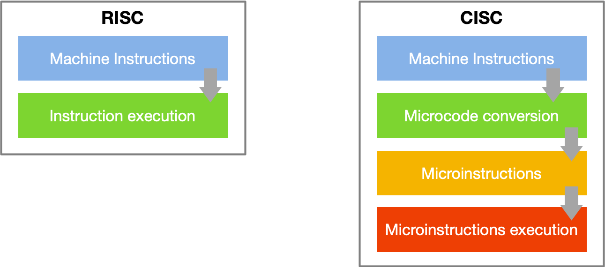

CISC 和 RISC 并不是具体的指令集，而是两种不同的指令体系，相当于指令集中的门派，是指令的设计思想。

### CISC 架构

CISC 代表“复杂指令集计算机”，这是一种计算机体系结构的设计哲学。与简单指令集计算机（RISC）相对，CISC 架构旨在通过提供大量的指令来减少程序的指令总数，从而减少执行特定任务所需的指令数量。

CISC 的设计原则主要强调通过复杂的指令集和多样的寻址模式来简化编程，减少程序指令数量，从而提高编程效率和代码密度。利用微代码控制来实现复杂指令则是为了在简化硬件设计的同时，确保复杂指令的执行。向后兼容性的设计思想则保证了新旧处理器之间的软件兼容性，使得 CISC 架构能够在长时间内维持其市场地位和应用广泛性。

CISC 处理器的主要特点包括复杂的指令集、多样的寻址模式、不定长的指令、微代码控制以及复杂的解码逻辑。复杂指令集允许每条指令执行多个操作，从而减少程序中的指令数量，提高代码密度。多样的寻址模式使得内存访问更加灵活，不定长的指令则提供了更大的编码灵活性。微代码控制器用于解释和执行复杂指令，简化了硬件设计的复杂性。由于指令复杂且长度不一，CISC 处理器需要更复杂的解码逻辑来正确解释和执行每条指令。

了解完 CISC 架构的基本内容，我们总结一下优缺点：

* CISC 架构优点：在于编程简便、代码密度高以及向后兼容性强。由于每条指令可以执行多个操作，程序员可以用较少的指令完成更多的任务，从而简化了编程过程。复杂指令减少了程序中的指令数量，提高了代码密度，节省了内存空间。此外，注重向后兼容性的新处理器可以运行旧的软件和操作系统，保护了现有的软件投资。

* CISC 架构缺点：由于指令复杂且不定长，解码和执行过程相对较慢，影响了整体性能。复杂的指令集和解码逻辑增加了硬件设计的复杂性和成本。相较于 RISC 处理器，CISC 处理器的能效较低，难以在高性能和低功耗之间取得平衡。

CISC 架构主要应用于需要高兼容性和多功能的领域，如桌面计算机和服务器。典型的 CISC 处理器包括 Intel x86 系列、IBM System/360 以及 Motorola 68000 系列。Intel x86 系列是最广泛使用的 CISC 处理器架构，广泛应用于个人计算机、服务器和工作站中。x86 处理器的兼容性和丰富的指令集使其成为 PC 市场的主导架构。IBM System/360 是早期的 CISC 处理器之一，应用于大型机系统，具有高度的兼容性和丰富的指令集。Motorola 68000 系列曾广泛应用于早期的 Apple Macintosh 计算机、Atari ST 和 Amiga 计算机中，具有复杂指令集和多种寻址模式。

尽管传统 CISC 处理器在某些方面存在缺点，但现代 CISC 架构通过融合 RISC 设计理念，显著提升了性能。例如，现代的 x86 处理器在内部采用了一些 RISC 的设计思想，如微操作（micro-ops）和流水线技术，以提高指令执行的并行度和效率。这种结合使得现代 CISC 处理器能够在保留复杂指令集的优势同时，提高执行速度和效率，满足现代计算需求。

### RISC 架构

RISC 架构起源于 20 世纪 70 年代末和 80 年代初，当时计算机科学家发现，复杂指令集计算机（CISC）中的大部分指令很少被使用，并且许多复杂指令的执行速度较慢。为了提高处理器性能和简化硬件设计，研究人员提出了 RISC 架构，专注于简化指令集和优化执行效率。关键的研究课程包括 IBM 801 课程、加州大学伯克利分校的 RISC 课程以及斯坦福大学的 MIPS 课程，这些课程为 RISC 架构的发展奠定了基础。

RISC 架构的设计原则是通过简化指令集和统一指令执行时间来提高处理器效率。RISC 处理器仅支持少量的、固定长度的简单指令，每条指令通常只执行一个操作，这使得指令解码和执行过程更高效。RISC 架构广泛采用流水线技术，允许多个指令在不同的阶段并行处理，从而提高指令执行的吞吐量。RISC 处理器通常具有大量的通用寄存器，减少了对内存的访问次数，提高了数据处理速度。RISC 架构还依赖编译器优化，通过编译器生成高效的机器代码，确保指令的高效执行。

RISC 处理器的主要特点包括简化的指令集、固定长度指令、加载-存储架构、大量寄存器和硬件流水线。简化的指令集使得每条指令执行一个操作，从而简化了指令解码和执行过程。固定长度的指令（例如 32 位）简化了指令取指和解码过程，提高了处理效率。加载-存储架构将内存访问限制在特定的加载（load）和存储（store）指令上，其他指令只在寄存器之间操作，大大简化了指令集。大量的通用寄存器减少了内存访问次数，提高了数据处理速度。硬件流水线技术允许多个指令在不同阶段并行处理，提高了指令执行的吞吐量和处理器的整体性能。

了解完 RISC 架构的基本内容，我们总结一下优缺点：

* RISC 架构优点：包括指令执行速度快、硬件设计简单和高效的能量使用。由于每条指令执行一个操作且指令长度固定，指令解码和执行过程非常高效，允许处理器以更高的时钟速度运行。简化的指令集和固定长度的指令使得硬件设计更为简单，降低了设计复杂性和成本。由于指令执行效率高，RISC 处理器通常具有更高的能效，适用于需要低功耗和高性能的应用场景。

* RISC 架构缺点：包括程序代码长度较长和对编译器优化的依赖。由于每条指令执行的操作较少，实现同样功能的程序可能需要更多的指令，从而增加了程序代码的长度。RISC 架构依赖编译器生成高效的机器代码，这要求编译器具备较高的优化能力，以充分发挥处理器的性能。

随着技术的进步，现代 RISC 架构不断发展，通过引入更多的优化技术和改进设计，提高处理器性能和能效。例如，现代 RISC 处理器广泛采用超标量（superscalar）和超线程（hyper-threading）技术，提高指令级并行度和处理器资源利用率。此外，RISC 架构还引入了更多高级的编译器优化技术，如指令调度和寄存器分配，以进一步提升指令执行效率。

### ISA 历史种类

对于 CPU 的历史在上一节中有着详细介绍，接下来我们简要介绍一下 ISA 的发展历史。因为 CPU 本质是一块集中了不同功能电路的芯片，要使用这些功能电路，CPU 需要调用对应的指令—也就是由 0、1 组成的二进制数。而用来规定指令格式的东西也就是指令集架构也有着不同的种类，不同的架构反映了设计者对同一功能的不同实现思路。CPU 于上世纪 60 年代问世，已发展几十年，有几十种不同的指令集架构相继诞生或消亡。

1940 年代末至 1950 年代初，随着 ENIAC、EDVAC 和 UNIVAC 等第一代电子计算机的出现，CPU 采用的是基于真空管的硬件设计，并使用二进制形式的机器指令。这些指令非常基础且功能有限，如加法、减法、移位和跳转等。由于当时计算机主要用于科学计算，所以指令集以执行数学运算为主，例如早期的 FORTRAN 语言就是为了解决科学计算问题而开发的。

随着冯·诺依曼体系结构的兴起，在 1946 年，约翰·冯·诺依曼提出的存储程序概念极大地推动了 CPU 指令集的发展。这一理念将程序和数据存储在同一块内存中，通过指令集控制 CPU 按照预设顺序读取和执行指令。这个时期出现了诸如 IBM 701、704 等早期计算机，它们的指令集开始具备了更丰富的算术逻辑单元（ALU）操作，如乘法、除法、比较等，并引入了分支指令用于控制流程。

到了 1980 年代，随着微处理器技术的进步，计算机应用领域逐渐扩展到了个人电脑和嵌入式设备，对 CPU 性能的要求越来越高。此时，出现了两种不同的 CPU 设计理念：精简指令集 RISC 和复杂指令集 CISC。RISC 架构强调简洁高效的指令集，减少指令种类以提高执行效率；而 CISC 架构则注重提供丰富多样的指令来简化编程。

RISC 架构代表性的 CPU 有 MIPS（Microprocessor without Interlocked Pipeline Stages）、ARM（Advanced RISC Machines），它们广泛应用于移动设备、网络路由器等领域。而 CISC 架构的代表如 Intel x86 系列，最初用于 IBM PC 上，后来成为个人计算机市场的主流架构。

随着 x86 架构的发展，英特尔和 AMD 不断推出新的 CPU 产品线，如 386、486、Pentium、Core i 系列等。为了适应更高的性能需求，x86 架构引入了许多新特性，如超标量处理、流水线技术、超线程等，使得单个核心就能并行执行多个指令，从而提升处理速度。同时，x86 指令集也变得更加庞大和复杂，包含了大量的多媒体指令和高级特性支持。

近年来，随着数据密集型计算的需求增加，x86-64 逐渐向 SIMD 扩展，CPU 厂商开始重视向单指令多数据（Single Instruction Multiple Data, SIMD）扩展。x86-64 架构引入了 MMX、SSE、AVX、AVX-512 等 SIMD 指令集，让 CPU 能够一次处理多个同类型的数据，极大提高了图像处理、音频编码等领域的性能。

接下来我们对这些常见的指令集架构简要介绍：

1. x86 架构：封闭架构，由英特尔和 AMD 牢牢掌握话语权，AMD 给 HG 授权 zen1 架构；VIA（台湾威盛）曾获得 x86 架构 Licence 授权，后来被 Z 芯收购；20 多年来没有第四家授权，其他芯片公司想用也用不了。

2. Arm 架构：开放架构，虽然由 Arm 公司所有，但授权开放，需要花钱购买。目前，华为和飞腾拥有 ARM v8 架构永久性授权；阿里平头哥、中兴等国内厂商购买了 ARM v9 架构 IP 授权。

3. MIPS 架构：开放架构，目前已开放了 MIPS 指令集的 R6 版本，以 Wave Computing 管理，但也难挽颓势，最后宣布终止开发，加入 RISC-V 基金会。LX 前期基于 MIPS 架构授权研发，后衍生出 LoongArch 自主架构。

4. Alpha 架构：开放架构，目前已经无实体主张该指令集的权利，但相关专利已被 HP、Intel 等瓜分。我国的申威前期基于 Alpha 架构，后衍生出 SW64 自主架构。

5. RISC-V 架构：开源架构，最特殊，不属于任何机构或国家，开源免费，想用就用，运营成本全靠基金会的兄弟们帮衬。由阿里平头哥主导，越来越多的创业公司加入 RISC-V 架构阵营。

对于国产芯片的指令集架构选择一直以来也备受关注，以芯片、服务器为代表的国产基础硬件类已进入“好用”阶段。目前，基于 ARM 指令集的鲲鹏、飞腾、麒麟，以及基于 X86 指令集的海光，以及自主 LoongArch 指令集的龙芯，这三大类芯片均拥有各自的生态，嵌入在各家国产服务器的产品中，应用于不同的场景。但是各个指令集架构的路线选择也要承担着相对应的风险：

1. x86 路线：依赖海外企业授权（Intel），自主可控风险高；

2. ARM 路线：Armv8 永久授权，但目前无 Armv9（性能提升 30%+）永久授权，存在长期隐患；

3. LoongArch 路线：23 年下半年完成流片的龙芯 3A6000 部分性能指标有望追上 Intel 第 12 代 Intel 酷睿 i7，意味着有 1 代或 3 年左右的性能差距，然而存在生态风险。

CPU 指令集从最初的二进制机器指令发展到如今包含丰富特性和多样化的 RISC 和 CISC 架构，其间经历了存储程序概念的确立、微处理器时代的兴起、不同架构的设计理念分化、以及针对高性能计算和大数据处理所需的 SIMD 扩展等多个重要阶段。未来，随着量子计算、AI 芯片等新型计算模式的出现，CPU 指令集将继续朝着更加智能、高效的方向演进。更多的指令集架构如图所示。

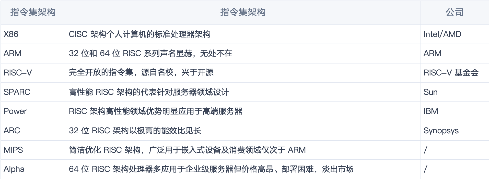

### 两者之间的异同

CISC 系列指令集的出现远早于 RISC，那时候设计指令集就是摸着石头过河，考虑比较局限，当时的程序员还都在使用汇编语言编写代码，总期望着一个指令可以多干一些事情，把工作转移给硬件电路，简化程序员的工作，但是这样做的结果就是指令越来越复杂，长短不一，参数繁多。

CPU 硬件电路的制造工艺虽然不断进步但其电路的设计始终被 CISC 的指令集限制，最终成为 CPU 性难以能提升、尺寸难以缩小的瓶颈。此时诞生了 RISC。其实最开始并没有 CISC 这个名字，只是后面出现了 RISC 为了作区分就将 RISC 之前的指令集统称 CISC。

CISC 中的指令集就是大杂烩，长短不一、使用频率不一、没有规则限定，而 RISC 相当于对 CISC 的一次重构，借鉴了 CISC 的经验，取其精华，弃其糟柏。在 RISC 中采用定长指令，大大提升译码效率；将复杂指令拆分成多个简单指令，减少了硬件电路的复杂性，给予 CPU 微架构设计更多的发挥空间（苹果的 M 系列芯片就是最典型的例子）；限制每个指令最多一个内存寻址操作数，推崇寄存器到寄存器的操作，保证每个指令都能在单个时钟周期内完成. RISC 旨在提高每个指令的执行时间，以此来提升 CPU 工作流水线整体性能。

无论是 CISC 还是 RISC 都是采用操作码 + 操作数的设计思路，指令集中的操作数可以是寄存器、立即数、内存地址三种，也对应了 CPU 寻址的三大类：

1. 寄存器寻址：寄存器寻址就是操作数是某一个寄存器，CPU 执行指令时需要从寄存器中获取或写入”数据“。如：mov ax, bx，将 bx 寄存器中的值写入 ax 寄存器。

2. 内存寻址：寄存器寻址就是操作数是一个内存地址，CPU 执行指令时需要从内存中获取或写入”数据“。内存寻址又分为直接寻址、基址寻址、变址寻址、基址变址寻址。我们这里只用最容易理解直接寻址，就是将直接在操作数中给出的数字作为内存地址，告诉 CPU 取此地址中的”数据“作为操作数。如：mov ax, [0x3000]，将 0x3000 地址中的”数据“写入 ax 寄存器。

3. 立即数寻址：立即数寻址就是操作数是一个常数。只所以叫立即数就是凸显这个”数据“CPU 拿来立即可以使用，在执行指令时无需去内存或寄存器中寻址。如：mov ax,  0x18，将数据 0x18 写入 ax 寄存器。

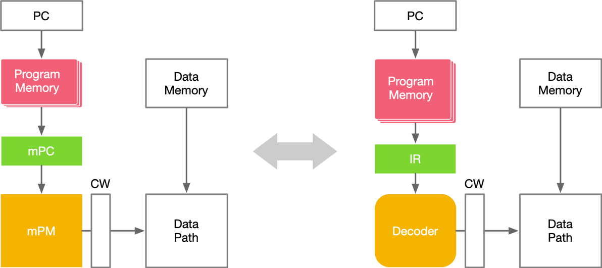

总结一下，CISC（复杂指令集计算机）和 RISC（精简指令集计算机）代表了两种不同的计算机指令集架构设计思想。CISC 架构通过丰富而复杂的指令集，旨在简化编程、提高代码密度和兼容性，但其复杂的指令解码和执行过程可能影响性能和增加硬件设计复杂性。

典型的 CISC 处理器如 Intel x86 在桌面计算机和服务器领域广泛应用。相对而言，RISC 架构强调简化指令集和统一指令执行时间，通过固定长度的简单指令和流水线技术来提高处理器效率和减少硬件复杂性，具有高效、低功耗的优势。RISC 处理器如 ARM 和 RISC-V 在移动设备、嵌入式系统和物联网中广泛应用。两种架构各有优缺点，适用于不同的应用场景。

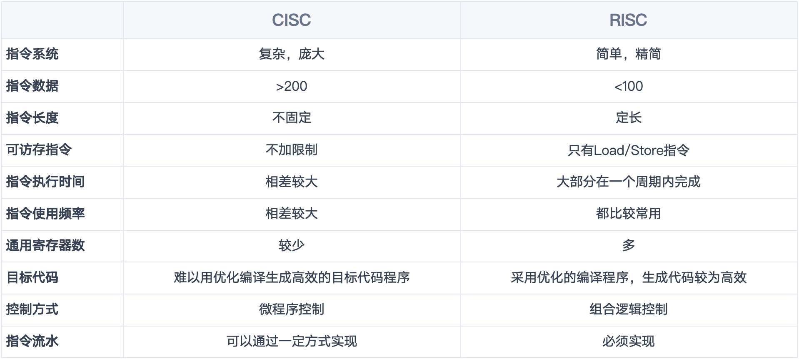

## CPU 并行处理架构

1966 年，MichealFlynn 根据指令和数据流的概念对计算机的体系结构进行了分类，这就是所谓的 Flynn 分类法。Flynn 将计算机划分为四种基本类型，如下所示：

1. 单指令流单数流（SISD）系统

2. 单指令流多数据流（SIMD）系统

3. 多指令流单数据流（MISD）系统

4. 多指令流多数据流（MIMD）系统

### 单指令流单数流（SISD）

顾名思义只有一个处理器和一个存储器，每个指令部件每次仅译码一条指令，而且在执行时仅为操作部件提供一份数据，串行计算，硬件不支持并行计算；在时钟周期内，CPU 只能处理一个数据流，为了提高速度：

1. 采用流水线方式；

2. 设置多个功能部件，即为超标量处理机；

3. 多模块交叉方式组织存储器（内存的低位交叉编址）。

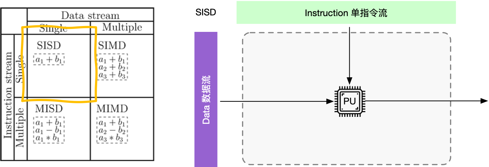

### 单指令流多数据流（SIMD）

单指令流多数据流（SIMD）系统采用一个控制器控制多个处理器，同时对一组数据中每一个分别执行相同操作，SIMD 主要执行向量、矩阵等数组运算，处理单元数目固定，适用于科学计算。特点是处理单元数量很多，但处理单元速度受计算机通信带宽传递速率的限制。一个指令流同时对多个数据流进行处理，同时称为数据级并行技术。各指令序列只能并发，不能并行。一个指令控制部件、多个处理单元。每个执行单元有各自的寄存器组、局部存储器、地址寄存器。

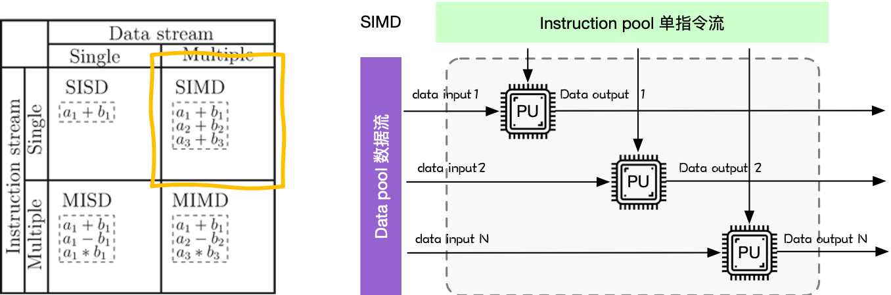

### 多指令流单数据流（MISD）

多指令流单数据流机器，采用多个指令流来处理单个数据流，这种方式没什么必要，所以仅作为理论模型出现，没有投入到实际应用之中。

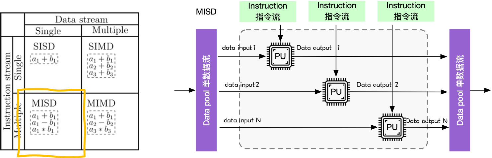

### 多指令流多数据流（MIMD）

多指令流多数据流（MIMD）系统是在多个数据集上执行多个指令的多处理器机器，共享内存 MIMD 和分布式内存。特性是各处理器之间，可以通过 LOAD/STORE 指令，访问同一个主存储器，可通过主存相互传送数据。硬件组成为：一台计算机内，包含多个处理器加一个主存储器。多个处理器共享单一的物理地址空间。

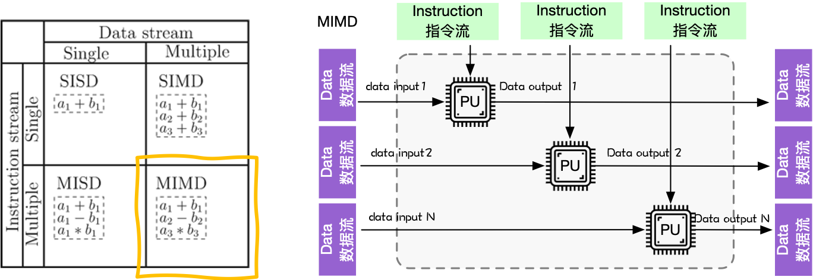

MIMD 系统可以分为共享内存系统和分布式内存系统。共享内存系统中的处理器通过互连网络与内存连接，处理器之间隐式通信，共享内存。分布式内存系统中的每个处理器有自己私有的内存空间，通过互连网络通信（显式通信），如下图所示：


### 单指令多线程（SIMT）

SIMT 中文译为单指令多线程，英文全称为 Single Instruction Multiple Threads，其主要应用于 GPU。从硬件层面看，GPU 本质上与前面提到的 SIMD 相同，都是少量的指令部件带一大堆运算部件。

但是英伟达希望能够解决 SIMD 的这两个痛点。首先，在指令集的设计上，指令仍然像 SISD 一样，几个操作数就是几元运算，只不过在执行时，调度器会给这条指令分配很多套计算元件和寄存器。

这样做的第一个好处就是，这样的可执行代码可以通过一个类似高级语言多线程的编程模式编译而来，这个模式就是 CUDA，从而解决了第一个痛点。在用户看来，上述的“一套运算部件和寄存器”就像一个线程一样，因此这种模式被称为 SIMT。

此外，英伟达还为这些指令提供了很多修饰符，比如一个 Bit Mask 可以指定哪些线程干活，哪些空转，这样 SIMT 就可以很好地支持分支语句了，从而解决了第二个痛点。

因此，总的来说，英伟达提出 SIMT 的初衷是希望硬件像 SIMD 一样高效，编程起来又像多核多线程一样轻松。

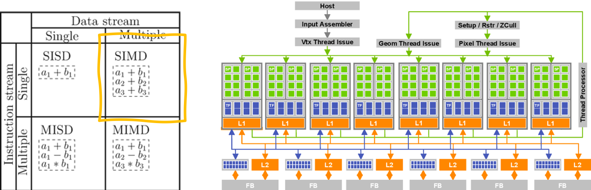

## CPU 应用场景

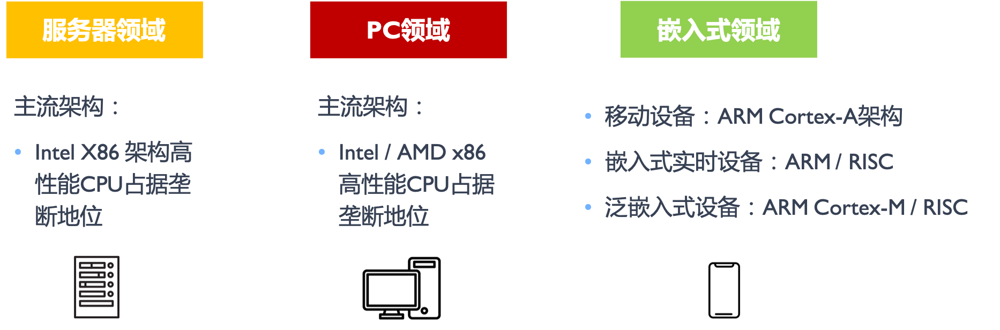

### 服务器领域

在服务器领域，x86 架构一直占据主导地位，尤其是在工业、金融业、科研、医疗等各大数据中心和企业级应用中。Intel 和 AMD 是主要供应商，提供高性能、高兼容性的处理器。x86 架构服务器广泛用于云计算、高性能计算（HPC）、大数据分析等应用场景。ARM 架构在服务器市场的渗透率较低，但近年来有所增长，主要得益于其低功耗、高效率的优势。像 AWS 的 Graviton 处理器和 Ampere 的 Altra 处理器，基于 ARM 架构，已在一些数据中心和边缘计算应用中得到采用。

对于在服务器中使用 X86 以及 ARM 的优缺点，在市场中是有着充分论证的。x86 架构的主要优点是高性能和成熟的生态系统，兼容性强，适合高计算需求的任务。缺点包括功耗较高和成本较高。ARM 架构的优点是低功耗和高扩展性，适合节能计算任务，且成本相对较低。缺点是软件生态较弱和单线程性能通常低于 x86。

从长远来看，x86 架构在高性能计算和企业级应用中将继续占据重要地位，但面临来自 ARM 架构的竞争。ARM 架构将在云计算、边缘计算等领域逐步增加市场份额，尤其在高效能和低功耗应用中。但由于这两种架构的授权等问题是持续存在的，国产化路线的选择也是近些年各大厂商一直在探索的问题。

### PC 领域

x86 架构在个人电脑领域是主流，Intel 和 AMD 的处理器在台式机和笔记本市场占据主要份额，如 Intel Core 系列、AMD Ryzen 系列主导着桌面电脑、笔记本电脑和工作站市场，不断迭代优化以提高单核性能、增加多核心数量和集成显卡性能，并支持新的接口和技术，Windows 和大部分主流软件对 x86 架构有良好支持。近年来，Apple 推出基于 ARM 架构的 M 系列芯片（如 M1、M2），在 MacBook 和 iMac 中取得显著成功，在轻薄、长续航、性能提升和 AI 加速器集成等方面持续发展，推动了 ARM 架构在个人电脑中的应用。

x86 架构的优点包括高性能和广泛的软件兼容性，适合各种复杂应用和游戏。缺点是功耗高和散热需求高。ARM 架构的优点是低功耗和高集成度，特别适合移动设备，续航时间长。缺点包括软件兼容性差和在某些高性能需求场景下表现不如 x86。

对于未来发展，x86 架构将在高性能和专业应用市场继续占据重要位置，但 ARM 架构在轻薄笔记本和高效办公领域的份额有望增加，特别是随着 Apple 的成功和其他厂商的跟进。

### 嵌入式领域

在嵌入式领域，除了手机之外，还涵盖了工业控制、物联网（IoT）设备、汽车电子、家电和医疗设备等多个重要应用领域。在这些领域中，不同指令集架构各有应用现状、优缺点及未来趋势。

手机市场几乎完全由 ARM 架构主导，所有主流智能手机处理器（如 Apple A 系列、Qualcomm Snapdragon、Samsung Exynos 等）都基于 ARM 架构。在其他嵌入式领域，ARM（例如 Cortex-M 系列、Cortex-R 系列和 Cortex-A 系列）同样占据主导地位。ARM 处理器广泛用于物联网设备、智能家居、可穿戴设备、工业控制器、车载信息娱乐系统、仪表盘、智能家电、便携式医疗设备等。其低功耗、高集成度的特性使其在这些应用中非常受欢迎。此外，RISC-V 架构的开源特性、定制化优势和适应新兴应用的灵活性，使其在物联网、智能家居和传感器网络等领域受到越来越多的关注和应用。相比之下，x86 架构在嵌入式领域的应用相对较少，主要出现在一些需要高性能计算和复杂数据处理的场景，如高端工业控制系统、高性能网关、某些车载信息娱乐系统和高级医疗设备等。

ARM 架构的主要优点在于低功耗和高集成度，适合电池供电的便携设备和需要高效能的应用。此外，ARM 处理器成本较低，适合大规模生产和应用。其缺点包括在某些高性能需求场景下性能较低，软件兼容性较弱。x86 架构的优点则是高性能和成熟的生态系统，适合复杂计算和数据处理。其缺点是高功耗和成本较高，在资源受限的嵌入式设备中不具竞争力。

ARM 架构在嵌入式领域的普及将进一步扩大，特别是在物联网、智能家居、汽车电子和便携式医疗设备中。随着技术的发展，ARM 处理器的性能和能效将继续提升，进一步增强其市场竞争力。x86 架构则将在需要高性能计算和复杂数据处理的高端嵌入式系统中继续发挥作用，特别是在高性能边缘计算设备和高级工业控制系统中。总的来说，ARM 架构将凭借其灵活性和高效能在更多领域中占据主导地位，而 x86 架构将在特定高性能应用中继续保持重要地位，而例如 RISC-V 等架构则是只会出现在特定产品中，缺少相应生态的支持。

# CPU 计算时延

## 内存、带宽与时延关系

**内存和带宽的关系**：内存的速度和系统带宽共同决定了数据在 CPU 和内存之间的传输效率。更高的内存带宽允许更多的数据在单位时间内传输，从而减少内存的访问时延。

**带宽和时延的关系**：高带宽通常能够减少数据传输所需的时间，因此可以间接降低时延。然而，增加带宽并不总是能线性减少时延，因为时延还受到其他因素的影响（如数据处理的复杂度和传输距离）。在低带宽环境下，时延会显著增加，因为数据需要更长时间才能传输到目的地，尤其在需要传输大数据量时更为明显。

**内存和时延的关系**：内存的速度和延迟直接影响 CPU 的访问时间。低延迟的内存允许更快的数据传输和指令处理，从而减少了 CPU 的等待时间和总体计算时延。内存的类型和架构（如 DDR 与 SRAM，单通道与双通道）也会影响访问延迟。优化内存配置可以显著降低时延，提高系统性能。

## CPU 计算时延

### CPU 计算时延组成

CPU 计算时延主要由以下几个部分组成：

**指令提取时延（Instruction Fetch Time）**：指令提取时延是指从内存中读取指令到将其放入指令寄存器的时间。这个时延受内存速度和缓存命中率的影响。内存的速度决定了从内存中读取指令的时间。更高速度的内存能够减少提取指令的时间。缓存层次结构（L1, L2, L3 缓存）会极大地影响提取时间。如果指令在缓存中命中，则可以快速获取，否则必须从较慢的主存储器中读取。

**指令解码时延（Instruction Decode Time）**：指令解码时延是指将从内存中读取的指令翻译成 CPU 能够理解的操作的时间。这个时延受指令集架构和解码逻辑复杂性影响。复杂指令集架构（CISC）通常有更长的解码时延，因为指令更复杂；相比之下，精简指令集架构（RISC）由于指令简洁，解码时延较短。解码单元的设计和复杂性也影响解码时延。更复杂的解码逻辑可能处理更多指令类型，但会增加时延。

**执行时延（Execution Time）**：执行时延是指 CPU 实际执行指令所需的时间。这个时延取决于指令的类型和 CPU 的架构，指令类型中不同的指令需要不同的执行时间。例如，简单的算术运算可能只需一个时钟周期，而复杂的浮点运算可能需要多个周期。而 CPU 架构中流水线深度、并行处理能力和指令重排序等技术都会影响指令的执行时延。

**存储器访问时延（Memory Access Time）**： 存储器访问时延是指 CPU 访问主存储器或缓存所需的时间。这个时延受缓存层次结构（L1, L2, L3 缓存）和内存带宽的影响。多级缓存（L1, L2, L3）可以减少访问主存储器的次数，从而降低访问时延。较高的缓存命中率会显著减少时延。内存带宽中高内存带宽支持更快的数据传输，减少访问时延。

**写回时延（Write-back Time）**：写回时延是指执行完指令后将结果写回寄存器或存储器的时间。这一过程也受缓存的影响。CPU 使用写回策略时，数据在更高级别的缓存中更新，而不是立即写入主存储器，从而减少写回时延，而且在多处理器系统中，缓存一致性协议确保各处理器的缓存一致性，这也会影响写回操作的时延。

### 影响计算时延因素

**CPU 时钟频率（Clock Frequency）**：时钟频率越高，CPU 处理指令的速度越快，从而减少计算时延。然而，增加时钟频率会增加功耗和发热，需要有效的散热机制。

**流水线技术（Pipelining）**：流水线技术将指令执行分为多个阶段，每个阶段可以并行处理不同的指令，从而提高指令吞吐量，降低时延。但流水线的深度和效率对时延有直接影响。

**并行处理（Parallel Processing）**：多核处理器和超线程技术允许多个指令同时执行，显著降低计算时延。并行处理的效率依赖于任务的可并行性。

**缓存命中率（Cache Hit Rate）**： 高缓存命中率可以显著减少存储器访问时延，提高整体性能。缓存失效（Cache Miss）会导致较高的存储器访问时延。

**内存带宽（Memory Bandwidth）**：高内存带宽可以减少数据传输瓶颈，降低存储器访问时延，提升计算性能。

### 优化计算时延方法

优化 CPU 计算时延是一个复杂的过程，需要综合考虑指令提取、解码、执行、存储器访问和写回等多个方面的因素。通过提高时钟频率、优化流水线设计、增加缓存容量、采用高效的并行算法和提升内存子系统性能，可以显著降低 CPU 计算时延，提升计算机系统的整体性能。

**提高时钟频率**：在不超出散热和功耗限制的情况下，通过提高 CPU 的时钟频率可以直接减少计算时延。

**优化流水线深度**：适当增加流水线深度，提高指令并行处理能力，但需要平衡流水线的复杂性和效率。

**增加缓存容量**：增加 L1、L2、L3 缓存的容量和优化缓存管理策略，可以提高缓存命中率，减少存储器访问时延。

**使用高效的并行算法**：开发和采用适合并行处理的算法，提高多核处理器的利用率，降低计算时延。

**提升内存子系统性能**：采用高速内存技术和更高带宽的内存接口，减少数据传输时延，提高整体系统性能。

## CPU 时延计算

- 图中展示了一个简单的 C 代码示例，用于计算 `y[i] = alpha * x[i] + y[i]`：

```C++
void demo(double alpha, double *x, double *y)
{
    int n = 2000;
    for (int i = 0; i < n; ++i)
    {
        y[i] = alpha * x[i] + y[i];
    }
}
```

### 例子解析

CPU 指令执行过程如下图所示， 图片中的横轴（Times）表示时间的推进。纵轴则展示了不同操作（如加载、计算、写入）的时延。

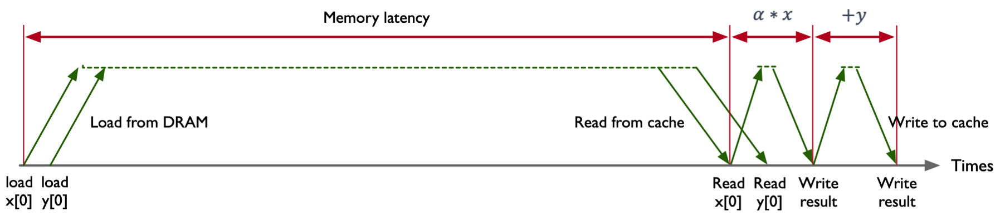

1. 数据加载

Load from DRAM：图片中 Load from DRAM 表示从主存储器（DRAM）加载数据到缓存中，这是开始时的重要步骤。此处的数据包括 x[0] 和 y[0]。由于主存储器与 CPU 之间的速度差异较大，加载数据的时间主要受到较高的内存时延（Memory Latency）的影响。在图中，加载过程展示为从 load x[0]和 load y[0]开始，显示了较长的时间跨度，因为从 DRAM 加载数据到缓存（Cache）的时延相对较长。

2. 缓存读取

Read from cache：图片中的 Read from cache 表示缓存的读取，一旦数据被加载到缓存中，随后的操作大部分是从缓存中读取。这显著减少了时延，因为缓存的访问速度远远快于主存储器。在图中，这一过程表示为读取数据 x[0] 和 y[0]，标注了较短的时间跨度，体现了缓存读取的高效性。

3. 计算过程

Read x[0] 和 Read y[0]：在计算开始之前，CPU 需要从缓存中读取要操作的数值 x[0] 和 y[0]。这一阶段也显示了缓存读取的快速性。然后进行乘法运算，计算 α * x。这是 CPU 的执行阶段之一，乘法操作通常被快速执行。接着进行加法运算，将前一步的乘法结果与 y[0] 相加。这一步完成了指令中的加法操作，

4. 写回结果

Write result：将将计算结果写回到缓存中。此步骤展示了计算完结果后的写入操作。写回缓存的过程较为快速，但依然涉及一定的时延。如果有必要，计算结果可能需要从缓存写回到主存储器。也就是 Write to cache。

### 时延分析

**Memory latency**：图中用红色标注的长箭头表示内存时延，即从开始加载数据到数据被缓存所需的总时间。这是影响计算速度的重要因素。

**计算时延**：乘法和加法操作各自有独立的时延，分别用红色小箭头标注。

**缓存操作时延**：读取和写入缓存的时延相对较短，用绿色箭头表示。


### 时延产生

CPU 时延的产生可以归因于多种因素，包括硬件设计、内存访问和系统资源竞争等。我们将结合这张图和进一步的解释来深入探讨。

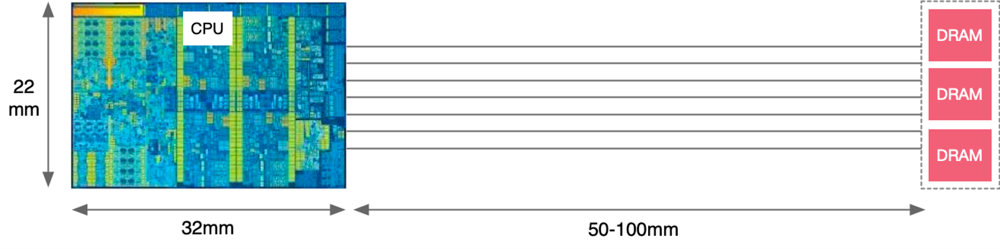

图中显示了 CPU 和 DRAM 之间存在一定的物理距离。在实际硬件中，数据需要在这个距离上通过内存总线进行传输。虽然电信号在这种短距离上的传播速度非常快（接近光速），但仍然会产生可测量的延迟。这个延迟是内存访问时延的一部分。

假设计算机时钟频率为 3,000,000,000 赫兹（3 GHz），意味着每个时钟周期大约为 1 / 3,000,000,000 秒 ≈ 0.333 纳秒，电信号在导体中的传播速度约为 60,000,000 米/秒，根据上图可知，从芯片到 DRAM 的信号传输距离大约为 50-100 毫米，

**电信号在 50 毫米的距离上传播的延迟**：

电信号在 50 毫米的距离上传播的延迟约为 0.833 纳秒，这相当于 0.833 纳秒 / 0.333 纳秒 ≈ 2.5 个时钟周期。

**电信号在 100 毫米的距离上传播的延迟**：

电信号在 100 毫米的距离上传播的延迟约为 1.667 纳秒，这相当于 1.667 纳秒 / 0.333 纳秒 ≈ 5 个时钟周期。

这些传播延迟就是 CPU 的时钟周期，也是 CPU 计算的时延。

### 计算速度因素

计算速度由多个因素决定，包括内存时延、缓存命中率、计算操作效率和数据写回速度。在图中，决定性因素是内存时延（Memory Latency）。内存时延是指从主存储器（DRAM）读取数据到缓存的固有延迟。由于主存储器的速度远低于缓存和 CPU 寄存器，这一过程通常是最耗时的部分

1. 内存时延的影响

图中显示的数据加载操作（Load from DRAM）占用了很长的时间，突出展示了内存时延的影响。在 load x[0]和 load y[0]阶段，CPU 必须等待数据从主存储器加载到缓存。直到数据加载完成，CPU 无法进行后续的计算操作。

2. 计算过程的阻滞

高内存时延显著延缓了整个计算过程的启动。虽然后续的计算（乘法和加法）以及缓存的读取和写入操作时间较短，但由于内存时延过长，整体计算速度被显著拖慢。CPU 在等待数据加载的过程中，资源被浪费，无法高效地执行计算任务。


