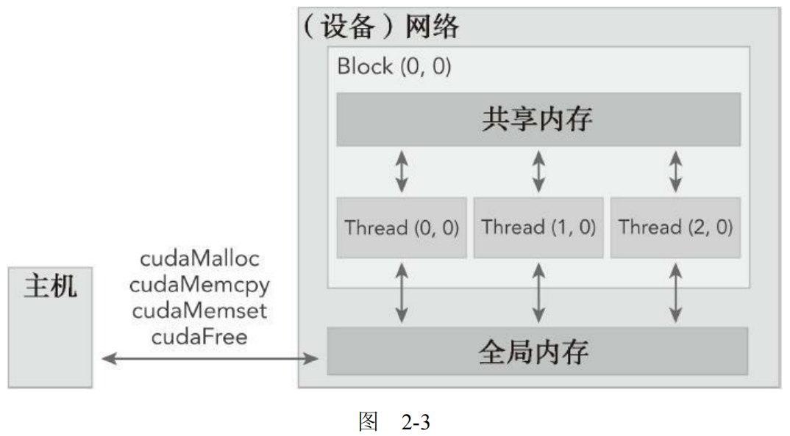

 

# CUDA 编程

## 计算机架构

有多种不同的方法可以对计算机架构进行分类。一个广泛使用的分类方法是弗林分类法（Flynn’s Taxonomy），它根据指令和数据进入CPU的方式，将计算机架构分为4种不同的类型（如图1-6所示）。

- SISD指的是传统计算机：一种串行架构。在这种计算机上只有一个核心。在任何时间点上只有一个指令流在处理一个数据流。

- SIMD是一种并行架构类型。在这种计算机上有多个核心。在任何时间点上所有的核心只有一个指令流处理不同的数据流。向量机是一种典型的SIMD类型的计算机，现在大多数计算机都采用了SIMD架构。SIMD最大的优势或许就是，在CPU上编写代码时，程序员可以继续按串行逻辑思考但对并行数据操作实现并行加速，而其他细节则由编译器来负责。

- MISD类架构比较少见，在这种架构中，每个核心通过使用多个指令流处理同一个数据流。

- MIMD是一种并行架构，在这种架构中，多个核心使用多个指令流来异步处理多个数据流，从而实现空间上的并行性。许多MIMD架构还包括SIMD执行的子组件。

GPU代表了一种众核架构，几乎包括了前文描述的所有并行结构：多线程、MIMD（多指令多数据）、SIMD（单指令多数据），以及指令级并行。NVIDIA公司称这种架构为SIMT（单指令多线程）。

#### GPU核心和CPU核心

尽管可以使用多核和众核来区分CPU和GPU的架构，但这两种核心是完全不同的。

CPU核心比较重，用来处理非常复杂的控制逻辑，以优化串行程序执行。

GPU核心较轻，用于优化具有简单控制逻辑的数据并行任务，注重并行程序的吞吐量。

## cuda 编程模型

### 异构架构

一个典型的异构计算节点包括两个多核CPU插槽和两个或更多个的众核GPU。GPU不是一个独立运行的平台而是CPU的协处理器。因此，GPU必须通过PCIe总线与基于CPU的主机相连来进行操作，如图1-9所示。这就是为什么CPU所在的位置被称作主机端而GPU 所在的位置被称作设备端。

上图中的ALU指算术逻辑单元，它是CPU的一个重要组成部分。ALU负责执行各种算术和逻辑操作，包括加法、减法、乘法、除法、位运算等。

### 内存层次结构

在GPU内存层次结构中，最主要的两种内存是全局内存和共享内存。全局类似于CPU的系统内存，而共享内存类似于CPU的缓存。然而GPU的共享内存可以由CUDA C的内核直接控制

### 线程管理

当核函数在主机端启动时，它的执行会移动到设备上，此时设备中会产生大量的线程并且每个线程都执行由核函数指定的语句。了解如何组织线程是CUDA编程的一个关键部分。CUDA明确了线程层次抽象的概念以便于你组织线程。这是一个两层的线程层次结构，由线程块和线程块网格构成，如图2-5所示。

由一个内核启动所产生的所有线程统称为一个网格。同一网格中的所有线程共享相同的全局内存空间。一个网格由多个线程块构成，一个线程块包含一组线程，同一线程块内的线程可以通过共享内存的方式来协作。不同块内的线程不能协作。

线程依靠以下两个坐标变量来区分彼此。

- blockIdx（线程块在线程格内的索引）
- threadIdx（块内的线程索引）

### 函数类型限定符

函数类型限定符指定一个函数在主机上执行还是在设备上执行，以及可被主机调用还是被设备调用

#### CUDA核函数的限制

以下限制适用于所有核函数：

- 只能访问设备内存
- 必须具有void返回类型
- 不支持可变数量的参数
- 不支持静态变量
- 显示异步行为

## cuda 执行模型

## 流和并发
