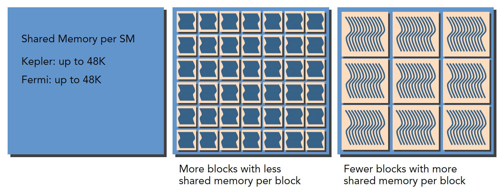
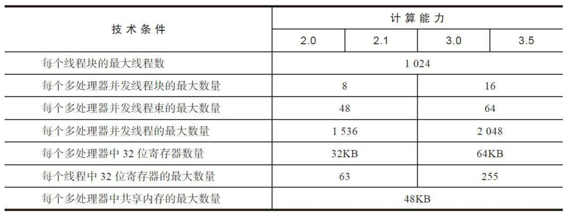

 

# CUDA 编程

## 计算机架构

有多种不同的方法可以对计算机架构进行分类。一个广泛使用的分类方法是弗林分类法（Flynn’s Taxonomy），它根据指令和数据进入CPU的方式，将计算机架构分为4种不同的类型（如图1-6所示）。


- SISD指的是传统计算机：一种串行架构。在这种计算机上只有一个核心。在任何时间点上只有一个指令流在处理一个数据流。

- SIMD是一种并行架构类型。在这种计算机上有多个核心。在任何时间点上所有的核心只有一个指令流处理不同的数据流。向量机是一种典型的SIMD类型的计算机，现在大多数计算机都采用了SIMD架构。SIMD最大的优势或许就是，在CPU上编写代码时，程序员可以继续按串行逻辑思考但对并行数据操作实现并行加速，而其他细节则由编译器来负责。

- MISD类架构比较少见，在这种架构中，每个核心通过使用多个指令流处理同一个数据流。

- MIMD是一种并行架构，在这种架构中，多个核心使用多个指令流来异步处理多个数据流，从而实现空间上的并行性。许多MIMD架构还包括SIMD执行的子组件。

GPU代表了一种众核架构，几乎包括了前文描述的所有并行结构：多线程、MIMD（多指令多数据）、SIMD（单指令多数据），以及指令级并行。NVIDIA公司称这种架构为SIMT（单指令多线程）。

#### GPU核心和CPU核心

尽管可以使用多核和众核来区分CPU和GPU的架构，但这两种核心是完全不同的。

CPU核心比较重，用来处理非常复杂的控制逻辑，以优化串行程序执行。

GPU核心较轻，用于优化具有简单控制逻辑的数据并行任务，注重并行程序的吞吐量。

## cuda 编程模型

### 异构架构


一个典型的异构计算节点包括两个多核CPU插槽和两个或更多个的众核GPU。GPU不是一个独立运行的平台而是CPU的协处理器。因此，GPU必须通过PCIe总线与基于CPU的主机相连来进行操作，如图1-9所示。这就是为什么CPU所在的位置被称作主机端而GPU 所在的位置被称作设备端。

上图中的ALU指算术逻辑单元，它是CPU的一个重要组成部分。ALU负责执行各种算术和逻辑操作，包括加法、减法、乘法、除法、位运算等。

### 内存层次结构

在GPU内存层次结构中，最主要的两种内存是全局内存和共享内存。全局类似于CPU的系统内存，而共享内存类似于CPU的缓存。然而GPU的共享内存可以由CUDA C的内核直接控制


### 线程管理

当核函数在主机端启动时，它的执行会移动到设备上，此时设备中会产生大量的线程并且每个线程都执行由核函数指定的语句。了解如何组织线程是CUDA编程的一个关键部分。CUDA明确了线程层次抽象的概念以便于你组织线程。


这是一个两层的线程层次结构，由线程块和线程块网格构成，如上图所示，对应代码如下：参考代码[hello.cu](./1.helloWorld/hello.cu)

```c++
dim3 grid(3, 2);  // x 方向 3 个元素，y 方向 2 个元素，即 2 行 3 列
dim3 block(5, 3); // x 方向 5 个元素，y 方向 3 个元素，即 3 行 5 列
kernel_fun<<< grid, block >>>(prams...);
```

由一个内核启动所产生的所有线程统称为一个网格。同一网格中的所有线程共享相同的全局内存空间。一个网格由多个线程块构成，一个线程块包含一组线程，同一线程块内的线程可以通过共享内存的方式来协作。不同块内的线程不能协作。

线程依靠以下两个坐标变量来区分彼此。

- blockIdx（线程块在线程格内的索引）
- threadIdx（块内的线程索引）

#### [CUDA为什么要分线程块和线程网格？](https://www.zhihu.com/question/35361192/answer/3271182561)

彻底回答这个问题需要先了解下GPU中硬件和软件之间的对应关系，看下面的图表：


|  软件层面   | 硬件层面                 |
| :---------: | ------------------------ |
| CUDA Thread | CUDA Core/SIMD code      |
| CUDA Block  | Streaming multiprocessor |
| Grid/kernel | GPU device               |

- Thread 

  CUDA的每一个线程都是工作在CUDA core上的，CUDA 线程与 CPU 线程 不同，CUDA 线程非常轻量级，可提供快速的上下文切换。其原因在于 GPU  中的寄存器容量大，并且有基于硬件的调度程序。在GPU线程上下文存在于寄存器中，而 CPU 的线程上下文存在于较低层次的存储结构中，  如高速缓存（L1，L2 ,L3 cache...）。因此，在GPU中当一个线程处于空闲/等待状态时，另一个准备就绪的 线程就可以开始执行，几乎没有延迟。每个 CUDA 线程必须执行相同的内核（相同的指令），并独立处理不同的数据（SIMT）。 

- BlockCUDA 

  Block是CUDA 线程组合成的一个逻辑实体。一个Block只能在单个 SM 上运行，也就是说，一 个Block内的所有线程只能在一个 SM 的内核上执行，而不能在其他 SM上执行。 每个 GPU 可能有一个或多个 SM，因此为了有效利用整个 GPU，用户  需要将并行计算划分为多个区块和线程。 

- Grid 

  CUDA GRID是CUDA 块组合成一个逻辑实体，最后是在设备上执行 CUDA GRID。 

增加这些逻辑结构也增加了编程难度，除了每次都要设置Block，Grid大小，全局索引也是个问题。这对新手来说真的不太友好。之所以这么设计还是因为**CUDA编程模型的限制**。

考虑到现实世界中的应用程序需要线程相互通信，并可能需要等待某些数据交换后才能继续运行。**这种操作需要线程进行通信，所以 CUDA 编程模型允许同一Block内的线程进行通信。属于不同Block的Thread无法在内核执行期间相互通信/同步。**这一限制允许调度程序独立调度 SM 上的Block。（因为每个Block之间都是没有关系的）这样做的好处是，如**果新硬件发布了更多的 SM，而且代码具有足够的并行性， 那么可以根据 GPU 的能力来扩展并行运行的Block数量。** 看下图（图的左边有条时间线，可以看到相同的Block，SM变多效率就变高）


### 函数类型限定符

函数类型限定符指定一个函数在主机上执行还是在设备上执行，以及可被主机调用还是被设备调用


#### CUDA核函数的限制

以下限制适用于所有核函数：

- 只能访问设备内存
- 必须具有void返回类型
- 不支持可变数量的参数
- 不支持静态变量
- 显示异步行为

## cuda 执行模型

### GPU架构概述

GPU架构是围绕一个流式多处理器（SM）的扩展阵列搭建的。通过复制这种结构来实现GPU的硬件并行。


上图包括关键组件：

- 线程束调度器(Warp Schedule)
- 寄存器文件
- CUDA 核心
- 加载/存储单元（LD/ST）
- 特殊功能单元 (SFU)
- 共享内存/一级缓存

#### SM （流多处理器）

GPU中每个SM都能支持数百个线程并发执行，每个GPU通常有多个SM，所以在一个GPU上并发执行数千个线程是有可能的。

当启动一个内核网格时，它的线程块被分布在了可用的SM上来执行。线程块一旦被调度到一个SM上，其中的线程只会在那个指定的SM上并发执行。多个线程块可能会被分配到同一个SM上，而且是根据SM资源的可用性进行调度的。

同一线程中的指令利用指令级并行性进行流水线化。

#### 线程束

CUDA  采用单指令多线程SIMT架构管理执行线程，不同设备有不同的线程束大小，但是到目前为止基本所有设备都是维持在32，也就是说每个SM上有多个block，一个block有多个线程（可以是几百个，但不会超过某个最大值），但是从机器的角度，在某时刻T，SM上只执行一个线程束，也就是32个线程在同时同步执行，线程束中的每个线程执行同一条指令，包括有分支的部分。

32是个神奇数字，他的产生是硬件系统设计的结果，也就是集成电路工程师搞出来的，所以软件工程师只能接受。
从概念上讲，32是SM以SIMD方式同时处理的工作粒度，这句话这么理解，可能学过后面的会更深刻的明白，一个SM上在某一个时刻，有32个线程在执行同一条指令，这32个线程可以选择性执行，虽然有些可以不执行，但是他也不能执行别的指令，需要另外需要执行这条指令的线程执行完，然后再继续下一条，就像老师给小朋友们分水果：
第一次分苹果，分给所有32个人，你可以不吃，但是不吃也没别的，你就只能在那看别人吃，等别人吃完了，老师会把没吃的苹果回收，防止浪费。
第二次分橘子，你很爱吃，可是有别的小朋友不爱吃，当然这时候他也不能干别的，只能看你吃完。吃完后老师继续回收刚才没吃的橘子。
第三次分桃子，你们都很爱吃，大家一起吃，吃完了老师发现没有剩下的，继续发别的水果，一直发到所有种类的水果都发完了。今天就可以放学了。

简单的类比，但过程就是这样。

#### SIMD vs SIMT

单指令多数据的执行属于向量机，比如我们有四个数字要加上四个数字，那么我们可以用这种单指令多数据的指令来一次完成本来要做四次的运算。这种机制的问题就是过于死板，不允许每个分支有不同的操作，所有分支必须同时执行相同的指令，必须执行没有例外。

相比之下单指令多线程SIMT就更加灵活了，虽然两者都是将相同指令广播给多个执行单元，但是SIMT的某些线程可以选择不执行，也就是说同一时刻所有线程被分配给相同的指令，SIMD规定所有人必须执行，而SIMT则规定有些人可以根据需要不执行，这样SIMT就保证了线程级别的并行，而SIMD更像是指令级别的并行。
SIMT包括以下SIMD不具有的关键特性：

1. 每个线程都有自己的指令地址计数器
2. 每个线程都有自己的寄存器状态
3. 每个线程可以有一个独立的执行路径

而上面这三个特性在编程模型可用的方式就是给每个线程一个唯一的标号（blckIdx,threadIdx），并且这三个特性保证了各线程之间的独立。

### CUDA编程的组件与逻辑

下图从逻辑角度和硬件角度描述了 CUDA 编程模型对应的组件。


SM中共享内存，和寄存器是关键的资源，线程块中线程通过共享内存和寄存器相互通信协调。寄存器和共享内存的分配可以严重影响性能！

**SM有限，虽然我们的编程模型层面看所有线程都是并行执行的（逻辑上的），但是在微观上看，所有线程块也是分批次的在物理层面的机器上执行，线程块里不同的线程可能进度都不一样，但是同一个线程束内的线程拥有相同的进度。**

并行就会引起竞争，多线程以未定义的顺序访问同一个数据，就导致了不可预测的行为，CUDA只提供了一种块内同步的方式，块之间没办法同步。

尽管线程块里的线程束可以任意顺序调度，但活跃的线程束的数量还是会由SM的资源所限制。当线程束由于任何理由闲置的时候（如等待从设备内存中读取数值），SM可以从同一SM上的常驻线程块中调度其他可用的线程束。在并发的线程束间切换并没有开

销，因为硬件资源已经被分配到了SM上的所有线程和块中，所以最新被调度的线程束的状态已经存储在SM上。

### 通过 Fermi 架构理解线程执行

Fermi架构是第一个完整的GPU架构，所以了解这个架构是非常有必要的，就像几十年过去了，我们的微机原理学的还是386一样，祖宗的基因代代相传，学好了祖宗后面的孙子辈都好掌握。


Fermi架构逻辑图如上，具体数据如下:

1. 512个加速核心，CUDA核
2. 每个CUDA核心都有一个全流水线的整数算数逻辑单元ALU，和一个浮点数运算单元FPU
3. CUDA核被组织到16个SM上
4. 6个384-bits的GDDR5 的内存接口
5. 支持6G的全局机栽内存
6. GigaThread疫情，分配线程块到SM线程束调度器上
7. 768KB的二级缓存，被所有SM共享

而SM则包括下面这些资源：

- 执行单元（CUDA核）
- 调度线程束的调度器和调度单元
- 共享内存，寄存器文件和一级缓存

每个多处理器SM有16个加载/存储单元，所以每个时钟周期内有16个线程（半个线程束）计算源地址和目的地址。

特殊功能单元SFU执行固有指令，如正弦，余弦，平方根和插值，SFU在每个时钟周期内的每个线程上执行一个固有指令。

每个SM有两个线程束调度器，和两个指令调度单元，当一个线程块被指定给一个SM时，线程块内的所有线程被分成线程束，两个线程束调度器选择其中两个线程束，在用指令调度器存储两个线程束要执行的指令。
像[章节GPU架构概述](#GPU架构概述)第一张图上的显示一样，每16个CUDA核心为一个组，还有16个加载/存储单元或4个特殊功能单元【对照[GPU架构概述](#GPU架构概述)理解】。当某个线程块被分配到一个SM上的时候，会被分成多个线程束，线程束在SM上交替执行：


每个线程束在同一时间执行同一指令，同一个块内的线程束互相切换是没有时间消耗的。

Fermi上支持同时并发执行内核。并发执行内核允许执行一些小的内核程序来充分利用GPU，如下图：


### 线程束执行的本质

对于硬件来说，CUDA执行的实质是线程束的执行，因为硬件根本不知道每个线程块谁是谁，也不知道先后顺序，硬件(SM)只知道按照机器码跑。
从外表来看，CUDA执行所有的线程，是并行的，没有先后次序的，但实际上硬件资源是有限的，不可能同时执行百万个线程，所以从硬件角度来看，物理层面上执行的也只是线程的一部分，而每次执行的这一部分，就是我们前面提到的线程束。

#### 线程束和线程块

线程束是SM中基本的执行单元，当一个网格被启动（网格被启动，等价于一个内核被启动，每个内核对应于自己的网格），网格中包含线程块，线程块被分配到某一个SM上以后，将分为多个线程束，每个线程束一般是32个线程（目前的GPU都是32个线程，但不保证未来还是32个），在一个线程束中，所有线程按照单指令多线程SIMT的方式执行，每一步执行相同的指令，但是处理的数据为私有的数据，下图展示了线程块的逻辑视图和硬件视图之间的关系。


线程块是个逻辑产物，因为在计算机里，内存总是一维线性存在的，所以执行起来也是一维的访问线程块中的线程，但是我们在写程序的时候却可以以二维三维的方式进行，原因是方便我们写程序，比如处理图像或者三维的数据，三维块就会变得很直接，很方便。

在块中，每个线程有唯一的编号（可能是个三维的编号），threadIdx。

网格中，每个线程块也有唯一的编号(可能是个三维的编号)，blockIdx。

那么每个线程就有在网格中的唯一编号。

当一个线程块中有128个线程的时候，其分配到SM上执行时，会分成4个块：

```apl
warp0: thread  0,........thread31
warp1: thread 32,........thread63
warp2: thread 64,........thread95
warp3: thread 96,........thread127
```

当编号使用三维编号时，x位于最内层，y位于中层，z位于最外层，想象下c语言的数组，如果把上面这句话写成 C 语言，假设三维数组 t 保存了所有的线程，那么(threadIdx.x,threadIdx.y,threadIdx.z)表示为 ```t[z][y][x]```。

计算出三维对应的线性地址（偏移量）是：

```c++
tid = threadIdx.x + threadIdx.y * blockDim.x + threadIdx.z * blockDim.x * blockDim.y
```

一个线程块包含的线程束数量：

```c
WarpsPerBlock = ceil(线程块中的线程大小 / 线程束大小)   # ceil 是向正取整的函数
```

线程束和线程块，一个是硬件层面的线程集合，一个是逻辑层面的线程集合，我们编程时为了程序正确，必须从逻辑层面计算清楚，但是为了得到更快的程序，硬件层面是我们应该注意的。

图3-11是一个在x轴中有40个线程、在y轴中有2个线程的二维线程块。从应用程序的角度来看，在一个二维网格中共有80个线程。

硬件为这个线程块配置了3个线程束，使总共96个硬件线程去支持80个软件线程。注意，最后半个线程束是不活跃的。即使这些线程未被使用，它们仍然消耗SM的资源，如寄存器。


从逻辑角度来看，线程块是线程的集合，它们可以被组织为一维、二维或三维布局。

从硬件角度来看，线程块是一维线程束的集合。在线程块中线程被组织成一维布局，每32个连续线程组成一个线程束。

#### 线程束分化

线程束被执行的时候会被分配给相同的指令，处理各自私有的数据。

在CUDA中支持C语言的控制流，比如if…else, for ,while  等，CUDA中同样支持，但是如果一个线程束中的不同线程包含不同的控制条件，那么当我们执行到这个控制条件时就会面临不同的选择。

对于 CPU 来说，当我们的程序包含大量的分支判断时，从程序角度来说，程序的逻辑是很复杂的，因为一个分支就会有两条路可以走，如果有10个分支，那么一共有1024条路走，CPU采用流水线话作业，如果每次等到分支执行完再执行下面的指令会造成很大的延迟，所以现在处理器都采用分支预测技术，而CPU的这项技术相对于 GPU 来说高级了不止一点点，而这也是GPU与CPU的不同，设计初衷就是为了解决不同的问题。CPU适合逻辑复杂计算量不大的程序，比如操作系统，控制系统，GPU适合大量计算简单逻辑的任务，所以被用来算数。

如下一段代码：

```C++
if (con)
{
    //do something
}
else
{
    //do something
}
```

假设这段代码是核函数的一部分，那么当一个线程束的32个线程执行这段代码的时候，如果其中16个执行if中的代码段，而另外16个执行else中的代码块，同一个线程束中的线程，执行不同的指令，这叫做线程束的分化。
我们知道在每个指令周期，线程束中的所有线程执行相同的指令，但是线程束又是分化的，所以这似乎是相悖的，但是事实上这两个可以不矛盾。
解决矛盾的办法就是每个线程都执行所有的if和else部分，当一部分con成立的时候，执行if块内的代码，有一部分线程con不成立，那么他们怎么办？继续执行else？不可能的，因为分配命令的调度器就一个，所以这些con不成立的线程等待，就像分水果，你不爱吃，那你就只能看着别人吃，等大家都吃完了，再进行下一轮（也就是下一个指令）线程束分化会产生严重的性能下降。条件分支越多，并行性削弱越严重。

注意线程束分化研究的是一个线程束中的线程，不同线程束中的分支互不影响。行过程如下：当线程 1,2 执行 if 语句时，线程 3,4 只能停止执行，等待 1,2 执行结束后，再下个时间线再执行 then 语句，此时线程 1,2 停止执行。


线程束分化导致的性能下降就应该用线程束的方法解决，根本思路是避免同一个线程束内的线程分化，而让我们能控制线程束内线程行为的原因是线程块中线程分配到线程束是有规律的而不是随机的。这就使得我们根据线程编号来设计分支是可以的，补充说明下，当一个线程束中所有的线程都执行if或者，都执行else时，不存在性能下降；只有当线程束内有分歧产生分支的时候，性能才会急剧下降。

线程束内的线程是可以被我们控制的，那么我们就把都执行if的线程塞到一个线程束中，或者让一个线程束中的线程都执行if，另外线程都执行else的这种方式可以将效率提高很多。

下面这个kernel可以产生一个比较低效的分支：

```c++
__global__ void mathKernel1(float *c)
{
	int tid = blockIdx.x* blockDim.x + threadIdx.x;

	float a = 0.0;
	float b = 0.0;
	if (tid % 2 == 0)
	{
		a = 100.0f;
	}
	else
	{
		b = 200.0f;
	}
	c[tid] = a + b;
}
```

这种情况下我们假设只配置一个x=64的一维线程块，那么只有两个个线程束，线程束内奇数线程（threadIdx.x为奇数）会执行else，偶数线程执行if，分化很严重。

但是如果我们换一种方法，得到相同但是错乱的结果C，这个顺序其实是无所谓的，因为我们可以后期调整。那么下面代码就会很高效。

```c++
__global__ void mathKernel2(float *c)
{
	int tid = blockIdx.x* blockDim.x + threadIdx.x;
	float a = 0.0;
	float b = 0.0;
	if ((tid/warpSize) % 2 == 0)
	{
		a = 100.0f;
	}
	else
	{
		b = 200.0f;
	}
	c[tid] = a + b;
}
```

第一个线程束内的线程编号tid从0到31，tid/warpSize都等于0，那么就都执行if语句。
第二个线程束内的线程编号tid从32到63，tid/warpSize都等于1，执行else线程束内没有分支，效率较高。

kernel2 中，编译器已经帮忙优化了 tid/warpSize，但是如果采用另一种方式（Kernel3），编译器就不会优化了：

```C++
// kernel 3
__global__ void mathKernel3(float *c)
{
	int tid = blockIdx.x* blockDim.x + threadIdx.x;
	float a = 0.0;
	float b = 0.0;
	bool ipred = (tid % 2 == 0);
	if (ipred)
	{
		a = 100.0f;
	}
	else
	{
		b = 200.0f;
	}
	c[tid] = a + b;
}
```

在 GPU 的 **Streaming Multiprocessor (SM)** 中，**常驻线程块（Resident Thread Blocks）** 是指在 SM 上同时驻留并执行的线程块。这些线程块共享 SM 的资源（如寄存器、共享内存等），并且由 SM 的调度器负责管理它们的执行。

#### 资源分配对SM中线程束与线程块数量的影响

每个SM上执行的基本单位是线程束，也就是说，单指令通过指令调度器广播给某线程束的全部线程，这些线程同一时刻执行同一命令。但是有很多线程束没执行，那么这些没执行的线程束情况又如何呢？

我给他们分成了两类，注意是我分的，不一定官方是不是这么讲。我们离开线程束内的角度（线程束内是观察线程行为，离开线程束我们就能观察线程束的行为了），一类是已经激活的，也就是说这类线程束其实已经在SM上准备就绪了，只是没轮到他执行，这时候他的状态叫做阻塞，还有一类可能分配到SM了，但是还没上到片上，这类我称之为未激活线程束。

而每个SM上有多少个线程束处于激活状态，取决于以下资源：

- 程序计数器
- 寄存器
- 共享内存

线程束一旦被激活来到片上，那么他就不会再离开SM直到执行结束。

每个SM都有32位的寄存器组，每个架构寄存器的数量不一样，其存储于寄存器文件中，为每个线程进行分配，同时，固定数量的共享内存，在线程块之间分配。

一个SM上被分配多少个线程块和线程束取决于SM中可用的寄存器和共享内存，以及内核需要的寄存器和共享内存大小。

这是一个平衡问题，当kernel占用的资源较少，那么更多的线程（这是线程越多线程束也就越多）处于活跃状态，相反则线程越少。
关于寄存器资源的分配：当每个线程占用更少的寄存器，则SM中会有更多的线程束，反之，则有更少的线程束（但每个线程束占用寄存器多）


关于共享内存的分配：每个线程块占用更少的共享内存，则每个SM中具有更多的线程块，反之，则有更少的线程块（但每个线程块占用更多的共享内存）



上面讲的主要是线程束，如果从逻辑上来看线程块的话，可用资源的分配也会影响常[驻线程块](# 常驻线程块)的数量。

特别是当SM内的资源没办法处理一个完整的线程块，那么内核将无法启动。

以下是资源列表：



当寄存器和共享内存分配给了线程块，这个线程块处于活跃状态，所包含的线程束称为活跃线程束。
活跃的线程束又分为三类：

- 选定的线程束
- 阻塞的线程束
- 符合条件的线程束

当SM要执行某个线程束的时候，执行的这个线程束叫做选定的线程束，准备要执行的叫符合条件的线程束，如果线程束不符合条件还没准备好就是阻塞的线程束。
满足下面的要求，线程束才算是符合条件的：

- 32个CUDA核心可以用于执行
- 执行所需要的资源全部就位

#### 常驻线程块

- 当一个线程块被分配到 SM 上时，它会在该 SM 上驻留，直到所有线程完成执行。
- 一个 SM 可以同时驻留多个线程块，具体数量取决于以下因素：
  - SM 的硬件资源（如寄存器数量、共享内存大小）。
  - 线程块的资源需求（如每个线程块使用的寄存器数量、共享内存大小）。
  - GPU 架构的限制（如每个 SM 支持的最大线程块数）。

## 内存布局


|      修饰符      |    变量名称    | 存储器 | 作用域 | 生命周期 |
| :--------------: | :------------: | :----: | :----: | :------: |
|                  |   float var    | 寄存器 |  线程  |   线程   |
|                  | float var[100] |  本地  |  线程  |   线程   |
|  \_\_share\_\_   |   float var*   |  共享  |   块   |    块    |
|  \_\_device\_\_  |   float var*   |  全局  |  全局  | 应用程序 |
| \_\_constant\_\_ |   float var*   |  常量  |  全局  | 应用程序 |

设备存储器的重要特征：

| 存储器 | 片上/片外 |   缓存    | 存取 |     范围      | 生命周期 |
| :----: | :-------: | :-------: | :--: | :-----------: | :------: |
| 寄存器 |   片上    |    n/a    | R/W  |   一个线程    |   线程   |
|  本地  |   片外    | 1.0以上有 | R/W  |   一个线程    |   线程   |
|  共享  |   片上    |    n/a    | R/W  | 块内所有线程  |    块    |
|  全局  |   片外    | 1.0以上有 | R/W  | 所有线程+主机 | 主机配置 |
|  常量  |   片外    |    Yes    |  R   | 所有线程+主机 | 主机配置 |
|  纹理  |   片外    |    Yes    |  R   | 所有线程+主机 | 主机配置 |

### 寄存器（Registers）

在 CUDA 编程中，局部变量默认存储在寄存器中（如果寄存器足够）。例如：

```cpp
__global__ void kernel(int *data) {
    int tid = threadIdx.x;  // tid 存储在寄存器中
    int temp = data[tid];   // temp 存储在寄存器中
    temp = temp * 2;        // 使用寄存器中的数据进行计算
    data[tid] = temp;       // 将结果写回全局内存
}
```

在上面的代码中：

- `tid` 和 `temp` 是局部变量，默认存储在寄存器中。
- 如果寄存器不足，编译器会将部分变量存储在本地内存

寄存器是 GPU 内存布局中最快、最接近计算核心的内存类型，用于存储线程的临时变量和中间计算结果。寄存器的访问速度极快，但容量有限。

寄存器是SM中的稀缺资源，Fermi架构中每个线程最多63个寄存器。Kepler结构扩展到255个寄存器，一个线程如果使用更少的寄存器，那么就会有更多的常驻线程块，SM上并发的线程块越多，效率越高，性能和使用率也就越高。合理利用寄存器可以显著提高 GPU 程序的性能，而寄存器溢出（变量被存储在本地内存中）会导致性能下降。

寄存器溢出（**寄存器不足时的处理**）：如果线程使用的寄存器数量超过了硬件限制，编译器会将部分变量存储在 **本地内存（Local Memory）** 中。本地内存实际上是全局内存的一部分，访问速度比寄存器慢得多。

####  寄存器的容量

在 NVIDIA GPU 中，每个线程可以使用的寄存器数量是有限的，具体数量取决于 GPU 架构和编译器的配置。例如：

- **NVIDIA Tesla V100**（Volta 架构）：每个线程最多可以使用 **255 个寄存器**。
- **NVIDIA A100**（Ampere 架构）：每个线程最多可以使用 **255 个寄存器**。
- 较旧的架构（如 Kepler、Maxwell）可能支持更少的寄存器。

#### **寄存器的大小**

在 GPU 和大多数现代计算机体系结构中，**一个寄存器通常是 4 字节（32 位）**，这是由硬件设计、历史演变和应用需求共同决定的。以下是原因：

- **数据对齐和效率**
  - **4 字节对齐**：现代计算机体系结构通常以 4 字节为单位进行数据对齐，这样可以提高内存访问效率。
  
  - **硬件优化**：32 位寄存器的设计可以高效地处理整数、浮点数和其他常见数据类型，同时简化硬件电路的设计。
  
- **指令集架构**

  - **32 位指令集**：许多现代处理器（如 x86、ARM、NVIDIA GPU）使用 32 位指令集，寄存器的大小与指令集匹配，可以简化指令解码和执行。

  - **通用性**：32 位寄存器可以处理 8 位（char）、16 位（short）、32 位（int）和 64 位（long long）数据类型，具有较好的通用性

### 本地内存（Local Memory）

本地内存是存储在每个线程本地的内存，通常由编译器自动分配。当寄存器不足时，一些变量可能被存储在本地内存中。

“本地内存”这一名词是有歧义的：溢出到本地内存中的变量本质上与全局内存在同一块存储区域，因此本地内存访问的特点是高延迟和低带宽。

### 共享内存（Shared Memory）

共享内存是GPU中一种比全局内存访问速度更快的内存类型。它位于GPU的多个处理单元之间共享，主要用于加速线程之间的通信和协作。在CUDA中，程序员可以使用`__shared__`关键字定义共享内存。

每个SM都有一定数量的由线程块分配的共享内存，共享内存是片上内存，跟主存相比，速度要快很多，也即是延迟低，带宽高。其类似于一级缓存，但是可以被编程。

使用共享内存的时候一定要注意，不要因为过度使用共享内存，而导致SM上活跃的线程束减少，也就是说，一个线程块使用的共享内存过多，导致更过的线程块没办法被SM启动，这样影响活跃的线程束数量。

共享内存在核函数内声明，生命周期和线程块一致，线程块运行开始，此块的共享内存被分配，当此块结束，则共享内存被释放。
因为共享内存是块内线程可见的，所以就有竞争问题的存在，也可以通过共享内存进行通信，当然，为了避免内存竞争，可以使用同步语句：

```c++
void __syncthreads();
```

此语句相当于在线程块执行时各个线程的一个障碍点，当块内所有线程都执行到本障碍点的时候才能进行下一步的计算，这样可以设计出避免内存竞争的共享内存使用程序，注意，__syncthreads();频繁使用会影响内核执行效率。

### 常量内存（Constant Memory）

常量内存用于存储在GPU上不变的数据，例如常量参数或只读数据。常量内存通常有更高的缓存效果，但写入操作是禁止的。在CUDA中，可以使用`__constant__`关键字定义常量内存。

常量内存，被主机端初始化后不能被核函数修改，初始化函数如下：

```cpp
cudaError_t cudaMemcpyToSymbol(const void* symbol,const void *src,size_t count);
```

同 cudaMemcpy的参数列表相似，从src（主机）复制count个字节的内存到symbol（设备）里面。多数情况下此函数是同步的，也就是会马上被执行。

当线程束中所有线程都从相同的地址取数据时，常量内存表现较好，比如执行某一个多项式计算，系数都存在常量内存里效率会非常高，但是如果不同的线程取不同地址的数据，常量内存就不那么好了，因为常量内存的读取机制是：一次读取会广播给所有线程束内的线程。

### 纹理内存Texture Memory）

纹理内存驻留在设备内存中，并在每个SM的只读缓存中缓存。纹理内存是一种通过指定的只读缓存访问的全局内存。只读缓存包括硬件滤波的支持，它可以将浮点插入作为读过程的一部分来执行。纹理内存是对二维空间局部性的优化，所以线程束里使用纹理内存访问二维数据的线程可以达到最优性能。对于一些应用程序来说，这是理想的内存，并由于缓存和滤波硬件的支持所以有较好的性能优势。然而对于另一些应用程序来说，与全局内存相比，使用纹理内存更慢。

纹理内存用于存储2D图像数据，通常用于图形处理和一些科学计算应用。纹理内存支持一些特殊的访问模式，以提高图像处理的效率。

### 全局内存（Global Memory）

全局内存是GPU上最大的内存池，用于存储持久性数据。它通常位于设备内存中，与主机内存相对应。全局内存在设备之间共享，但访问速度相对较慢。在CUDA编程中，全局内存通过`cudaMalloc`和`cudaMemcpy`等函数进行分配和传输。

## GPU缓存

跟CPU缓存一样，GPU缓存是不可编程的内存。在GPU上有4种缓存：

- 一级缓存

- 二级缓存

- 只读常量缓存

- 只读纹理缓存

每个SM都有一个一级缓存，所有的SM共享一个二级缓存。一级和二级缓存都被用来在存储本地内存和全局内存中的数据，也包括寄存器溢出的部分。对Fermi GPU和KeplerK40或其后发布的GPU来说，CUDA允许我们配置读操作的数据是使用一级和二级缓存，还是只使用二级缓存。

在CPU上，内存的加载和存储都可以被缓存。但是，在GPU上只有内存加载操作可以被缓存，内存存储操作不能被缓存。

每个SM也有一个只读常量缓存和只读纹理缓存，它们用于在设备内存中提高来自于各自内存空间内的读取性能。

## 流和并发
