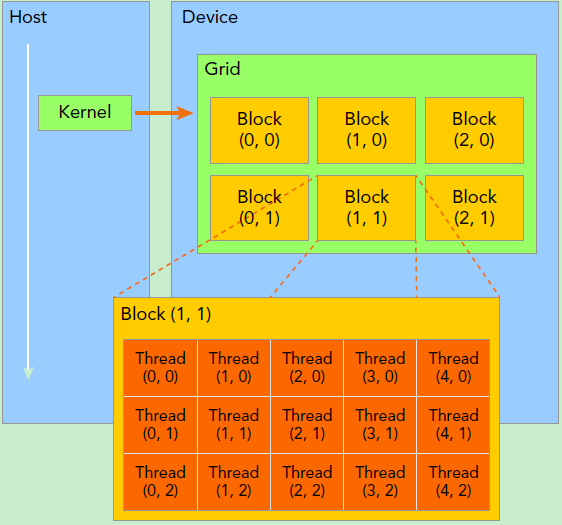
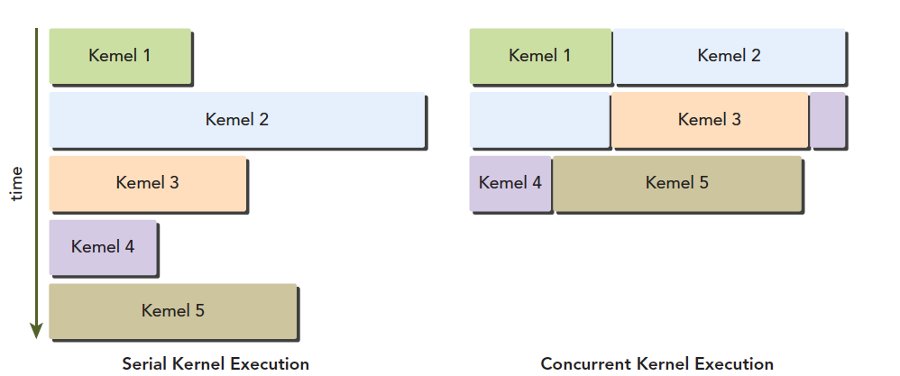

 

# CUDA 编程

## 1.CUDA中的异构并行计算

有多种不同的方法可以对计算机架构进行分类。一个广泛使用的分类方法是弗林分类法（Flynn’s Taxonomy），它根据指令和数据进入CPU的方式，将计算机架构分为4种不同的类型（如图1-6所示）。


- SISD指的是传统计算机：一种串行架构。在这种计算机上只有一个核心。在任何时间点上只有一个指令流在处理一个数据流。

- SIMD是一种并行架构类型。在这种计算机上有多个核心。在任何时间点上所有的核心只有一个指令流处理不同的数据流。向量机是一种典型的SIMD类型的计算机，现在大多数计算机都采用了SIMD架构。SIMD最大的优势或许就是，在CPU上编写代码时，程序员可以继续按串行逻辑思考但对并行数据操作实现并行加速，而其他细节则由编译器来负责。

- MISD类架构比较少见，在这种架构中，每个核心通过使用多个指令流处理同一个数据流。

- MIMD是一种并行架构，在这种架构中，多个核心使用多个指令流来异步处理多个数据流，从而实现空间上的并行性。许多MIMD架构还包括SIMD执行的子组件。

GPU代表了一种众核架构，几乎包括了前文描述的所有并行结构：多线程、MIMD（多指令多数据）、SIMD（单指令多数据），以及指令级并行。NVIDIA公司称这种架构为SIMT（单指令多线程）。

### GPU核心和CPU核心

尽管可以使用多核和众核来区分CPU和GPU的架构，但这两种核心是完全不同的。

CPU核心比较重，用来处理非常复杂的控制逻辑，以优化串行程序执行。

GPU核心较轻，用于优化具有简单控制逻辑的数据并行任务，注重并行程序的吞吐量。

### CUDA中的修饰符

DeepSeek 总结

####  `__global__`

- **执行位置**: 在GPU上执行。

- **调用方式**: 由CPU调用（主机代码），但可以在GPU上启动多个线程并行执行。

- **返回值**: 必须返回 `void`。

  ```cpp
  __global__ void kernelFunction(int *array) {
      int idx = threadIdx.x;
      array[idx] = idx;
  }
  ```

#### `__device__`

- **执行位置**: 在GPU上执行。

- **调用方式**: 只能由其他 `__device__` 或 `__global__` 函数调用。

- **返回值**: 可以有返回值。

  ```cpp
  __device__ int deviceFunction(int a, int b) {
      return a + b;
  }
  ```

#### `__host__`

- **执行位置**: 在CPU上执行。

- **调用方式**: 由CPU调用。

- **返回值**: 可以有返回值。

  ```cpp
  __host__ int hostFunction(int a, int b) {
      return a + b;
  }
  ```

#### `__host__ __device__`

- **执行位置**: 可以在CPU或GPU上执行。

- **调用方式**: 可以由CPU或GPU调用。

- **返回值**: 可以有返回值。

  ```cpp
  __host__ __device__ int hostDeviceFunction(int a, int b) {
      return a + b;
  }
  ```

#### `__noinline__`

- **作用**: 强制编译器不要内联该函数。

  ```cpp
  __device__ __noinline__ int noInlineFunction(int a, int b) {
      return a + b;
  }
  ```

#### `__forceinline__`

- **作用**: 强制编译器内联该函数。

  ```cpp
  __device__ __forceinline__ int forceInlineFunction(int a, int b) {
      return a + b;
  }
  ```

#### `__constant__`

- **作用**: 用于修饰常量内存中的变量。

  ```cpp
  __constant__ int constantArray[10];
  ```

#### `__shared__`

- **作用**: 用于修饰共享内存中的变量。

  ```cpp
  __shared__ int sharedArray[10];
  ```

#### `__managed__`

- **作用**: 用于修饰托管内存中的变量，可以在CPU和GPU之间共享。（参考[统一内存UM](#统一内存（UM）)）

  ```cpp
  __managed__ int managedArray[10];
  ```

#### `__restrict__`

- **作用**: 消除指针别名分析：编译器可以假设指针不重叠，从而进行更好的优化。提高内存访问性能：可以更积极地使用缓存和寄存器

```cpp
// 没有 __restrict__ - 编译器必须考虑指针可能重叠
__global__ void add(float* a, float* b, float* c, int n) {
    int idx = blockIdx.x * blockDim.x + threadIdx.x;
    if (idx < n) {
        c[idx] = a[idx] + b[idx];  // 编译器可能生成更保守的代码
    }
}

// 使用 __restrict__ - 编译器可以优化
__global__ void add_optimized(float* __restrict__ a, 
                              float* __restrict__ b, 
                              float* __restrict__ c, 
                              int n) {
    int idx = blockIdx.x * blockDim.x + threadIdx.x;
    if (idx < n) {
        c[idx] = a[idx] + b[idx];  // 编译器可以生成更激进的优化代码
    }
}
```

总结

- `__global__`: GPU函数，由CPU调用。
- `__device__`: GPU函数，由GPU调用。
- `__host__`: CPU函数，由CPU调用。(**默认修饰符，这种行为与标准的 C/C++ 一致**)
- `__host__ __device__`: 可在CPU或GPU上执行。
- `__noinline__` 和 `__forceinline__`: 控制函数内联。
- `__constant__`, `__shared__`, `__managed__`: 修饰特定内存空间。
- `__restrict__`: 告诉编译器指针不重叠，允许更激进的优化。

## 3.CUDA 编程模型

### 异构架构


一个典型的异构计算节点包括两个多核CPU插槽和两个或更多个的众核GPU。GPU不是一个独立运行的平台而是CPU的协处理器。因此，GPU必须通过PCIe总线与基于CPU的主机相连来进行操作，如图1-9所示。这就是为什么CPU所在的位置被称作主机端而GPU 所在的位置被称作设备端。

上图中的ALU指算术逻辑单元，它是CPU的一个重要组成部分。ALU负责执行各种算术和逻辑操作，包括加法、减法、乘法、除法、位运算等。

### 内存层次结构

在GPU内存层次结构中，最主要的两种内存是全局内存和共享内存。全局类似于CPU的系统内存，而共享内存类似于CPU的缓存。然而GPU的共享内存可以由CUDA C的内核直接控制


### 线程管理

当核函数在主机端启动时，它的执行会移动到设备上，此时设备中会产生大量的线程并且每个线程都执行由核函数指定的语句。了解如何组织线程是CUDA编程的一个关键部分。CUDA明确了线程层次抽象的概念以便于你组织线程。



这是一个两层的线程层次结构，由线程块和线程块网格构成，如上图所示，对应代码如下：参考代码[hello.cu](./1.helloWorld/hello.cu)

```c++
dim3 grid(3, 2);  // x 方向 3 个元素，y 方向 2 个元素，即 2 行 3 列
dim3 block(5, 3); // x 方向 5 个元素，y 方向 3 个元素，即 3 行 5 列
kernel_fun<<< grid, block >>>(prams...);
```

由一个内核启动所产生的所有线程统称为一个网格。同一网格中的所有线程共享相同的全局内存空间。一个网格由多个线程块构成，一个线程块包含一组线程，同一线程块内的线程可以通过共享内存的方式来协作。不同块内的线程不能协作。

线程依靠以下两个坐标变量来区分彼此。

- blockIdx（线程块在线程格内的索引）
- threadIdx（块内的线程索引）

#### [CUDA为什么要分线程块和线程网格？](https://www.zhihu.com/question/35361192/answer/3271182561)

彻底回答这个问题需要先了解下GPU中硬件和软件之间的对应关系，看下面的图表：


|  软件层面   | 硬件层面                 |
| :---------: | ------------------------ |
| CUDA Thread | CUDA Core/SIMD code      |
| CUDA Block  | Streaming multiprocessor |
| Grid/kernel | GPU device               |

- Thread 

  CUDA的每一个线程都是工作在CUDA core上的，CUDA 线程与 CPU 线程 不同，CUDA 线程非常轻量级，可提供快速的上下文切换。其原因在于 GPU  中的寄存器容量大，并且有基于硬件的调度程序。在GPU线程上下文存在于寄存器中，而 CPU 的线程上下文存在于较低层次的存储结构中，  如高速缓存（L1，L2 ,L3 cache...）。因此，在GPU中当一个线程处于空闲/等待状态时，另一个准备就绪的 线程就可以开始执行，几乎没有延迟。每个 CUDA 线程必须执行相同的内核（相同的指令），并独立处理不同的数据（SIMT）。 

- BlockCUDA 

  Block是CUDA 线程组合成的一个逻辑实体。一个Block只能在单个 SM 上运行，也就是说，一 个Block内的所有线程只能在一个 SM 的内核上执行，而不能在其他 SM上执行。 每个 GPU 可能有一个或多个 SM，因此为了有效利用整个 GPU，用户需要将并行计算划分为多个区块和线程。 

- Grid 

  CUDA GRID是CUDA 块组合成一个逻辑实体，最后是在设备上执行 CUDA GRID。 

增加这些逻辑结构也增加了编程难度，除了每次都要设置Block，Grid大小，全局索引也是个问题。这对新手来说真的不太友好。之所以这么设计还是因为**CUDA编程模型的限制**。

考虑到现实世界中的应用程序需要线程相互通信，并可能需要等待某些数据交换后才能继续运行。**这种操作需要线程进行通信，所以 CUDA 编程模型允许同一Block内的线程进行通信。属于不同Block的Thread无法在内核执行期间相互通信/同步。**这一限制允许调度程序独立调度 SM 上的Block。（因为每个Block之间都是没有关系的）这样做的好处是，如**果新硬件发布了更多的 SM，而且代码具有足够的并行性， 那么可以根据 GPU 的能力来扩展并行运行的Block数量。** 看下图（图的左边有条时间线，可以看到相同的Block，SM变多效率就变高）


### 函数类型限定符

函数类型限定符指定一个函数在主机上执行还是在设备上执行，以及可被主机调用还是被设备调用


#### CUDA核函数的限制

以下限制适用于所有核函数：

- 只能访问设备内存
- 必须具有void返回类型
- 不支持可变数量的参数
- 不支持静态变量
- 显示异步行为

## 2.CUDA 执行模型

### GPU架构概述

GPU架构是围绕一个流式多处理器（SM）的扩展阵列搭建的。通过复制这种结构来实现GPU的硬件并行。


上图包括关键组件：

- 线程束调度器(Warp Schedule)
- 寄存器文件
- CUDA 核心
- 加载/存储单元（LD/ST）
- 特殊功能单元 (SFU)
- 共享内存/一级缓存

#### SM （流多处理器）

GPU中每个SM都能支持数百个线程并发执行，每个GPU通常有多个SM，所以在一个GPU上并发执行数千个线程是有可能的。

当启动一个内核网格时，它的线程块被分布在了可用的SM上来执行。线程块一旦被调度到一个SM上，其中的线程只会在那个指定的SM上并发执行。多个线程块可能会被分配到同一个SM上，而且是根据SM资源的可用性进行调度的。

同一线程中的指令利用指令级并行性进行流水线化。

#### Block 是分配到 SM 的最小单位

 一个 Block 必须完整地驻留在单个 SM 上，其包含的所有线程（Thread）和线程束（Warp）均由该 SM 管理和调度。

##### Block 无法跨 SM 拆分的原因

- **线程协作与数据共享需求**：
   Block 内的线程通过共享内存（Shared Memory）和同步机制（如 `__syncthreads()`）协作。若 Block 被拆分到多个 SM，共享内存将无法跨 SM 访问，导致数据一致性问题。
- **CUDA 架构设计原则**：
   CUDA 的线程模型要求 Block 在逻辑上独立，其执行不依赖其他 Block。这种设计简化了调度逻辑并保证并行效率。

若 Block 消耗的资源过多，则Block 无法加载。

若 Block 所需资源超过 SM 的容量（例如 Block 的共享内存需求超过 SM 的可用共享内存），该 Block 将无法被任何 SM 执行，导致内核启动失败。

#### 线程束

CUDA  采用单指令多线程SIMT架构管理执行线程，不同设备有不同的线程束大小，但是到目前为止基本所有设备都是维持在32，也就是说每个SM上有多个block，一个block有多个线程（可以是几百个，但不会超过某个最大值），但是从机器的角度，在某时刻T，SM上只执行一个线程束，也就是32个线程在同时同步执行，线程束中的每个线程执行同一条指令，包括有分支的部分。

> 问：一个SM上，在摸一个时刻，只会有一个线程束被执行吗？
>
> **现代 GPU 的 SM 支持多线程束并发执行**。例如：
>
> - **Fermi 架构**：每个 SM 包含 2 个 Warp Scheduler（线程束调度器），可同时发射指令到 2 个不同的线程束[5](https://blog.csdn.net/GH234505/article/details/51115994)[11](https://www.zhihu.com/topic/20035965/newest)。
> - **Pascal 及之后架构**：SM 被划分为多个子块（如 4 个子块），每个子块可独立调度一个线程束，实现多个线程束并行执行[11](https://www.zhihu.com/topic/20035965/newest)[12](https://blog.csdn.net/u010420283/article/details/135363082)。
>
> **SP（流处理器）数量与线程束关系**：每个线程束包含 32 个线程，但 SP 数量通常远大于 32（如 128 个 SP 的 SM），通过多线程束调度充分利用计算资源

32是个神奇数字，他的产生是硬件系统设计的结果，也就是集成电路工程师搞出来的，所以软件工程师只能接受。

从概念上讲，32是SM以SIMD方式同时处理的工作粒度，这句话这么理解，可能学过后面的会更深刻的明白，一个SM上在某一个时刻，有32个线程在执行同一条指令，这32个线程可以选择性执行，虽然有些可以不执行，但是他也不能执行别的指令，需要另外需要执行这条指令的线程执行完，然后再继续下一条，就像老师给小朋友们分水果：

第一次分苹果，分给所有32个人，你可以不吃，但是不吃也没别的，你就只能在那看别人吃，等别人吃完了，老师会把没吃的苹果回收，防止浪费。
第二次分橘子，你很爱吃，可是有别的小朋友不爱吃，当然这时候他也不能干别的，只能看你吃完。吃完后老师继续回收刚才没吃的橘子。
第三次分桃子，你们都很爱吃，大家一起吃，吃完了老师发现没有剩下的，继续发别的水果，一直发到所有种类的水果都发完了。今天就可以放学了。

简单的类比，但过程就是这样。

#### SIMD vs SIMT

单指令多数据的执行属于向量机，比如我们有四个数字要加上四个数字，那么我们可以用这种单指令多数据的指令来一次完成本来要做四次的运算。这种机制的问题就是过于死板，不允许每个分支有不同的操作，所有分支必须同时执行相同的指令，必须执行没有例外。

相比之下单指令多线程SIMT就更加灵活了，虽然两者都是将相同指令广播给多个执行单元，但是SIMT的某些线程可以选择不执行，也就是说同一时刻所有线程被分配给相同的指令，SIMD规定所有人必须执行，而SIMT则规定有些人可以根据需要不执行，这样SIMT就保证了线程级别的并行，而SIMD更像是指令级别的并行。
SIMT包括以下SIMD不具有的关键特性：

1. 每个线程都有自己的指令地址计数器
2. 每个线程都有自己的寄存器状态
3. 每个线程可以有一个独立的执行路径

而上面这三个特性在编程模型可用的方式就是给每个线程一个唯一的标号（blckIdx,threadIdx），并且这三个特性保证了各线程之间的独立。

### CUDA编程的组件与逻辑

下图从逻辑角度和硬件角度描述了 CUDA 编程模型对应的组件。


SM中共享内存，和寄存器是关键的资源，线程块中线程通过共享内存和寄存器相互通信协调。寄存器和共享内存的分配可以严重影响性能！

**SM有限，虽然我们的编程模型层面看所有线程都是并行执行的（逻辑上的），但是在微观上看，所有线程块也是分批次的在物理层面的机器上执行，线程块里不同的线程可能进度都不一样，但是同一个线程束内的线程拥有相同的进度。**

并行就会引起竞争，多线程以未定义的顺序访问同一个数据，就导致了不可预测的行为，CUDA只提供了一种块内同步的方式，块之间没办法同步。

尽管线程块里的线程束可以任意顺序调度，但活跃的线程束的数量还是会由SM的资源所限制。当线程束由于任何理由闲置的时候（如等待从设备内存中读取数值），SM可以从同一SM上的常驻线程块中调度其他可用的线程束。在并发的线程束间切换并没有开销，因为硬件资源已经被分配到了SM上的所有线程和块中，所以最新被调度的线程束的状态已经存储在SM上。

### 通过 Fermi 架构理解线程执行

Fermi架构是第一个完整的GPU架构，所以了解这个架构是非常有必要的，就像几十年过去了，我们的微机原理学的还是386一样，祖宗的基因代代相传，学好了祖宗后面的孙子辈都好掌握。


Fermi架构逻辑图如上，具体数据如下:

1. 512个加速核心，CUDA核
2. 每个CUDA核心都有一个全流水线的整数算数逻辑单元ALU，和一个浮点数运算单元FPU
3. CUDA核被组织到16个SM上
4. 6个384-bits的GDDR5 的内存接口
5. 支持6G的全局机栽内存
6. `GigaThread` 引擎，分配线程块到SM线程束调度器上。
7. 768KB的二级缓存，被所有SM共享

而SM则包括下面这些资源：

- 执行单元（CUDA核）
- 调度线程束的调度器和调度单元
- 共享内存，寄存器文件和一级缓存

每个多处理器SM有16个加载/存储单元，所以每个时钟周期内有16个线程（半个线程束）计算源地址和目的地址。

特殊功能单元SFU执行固有指令，如正弦，余弦，平方根和插值，SFU在每个时钟周期内的每个线程上执行一个固有指令。

每个SM有两个线程束调度器，和两个指令调度单元，当一个线程块被指定给一个SM时，线程块内的所有线程被分成线程束，两个线程束调度器选择其中两个线程束，在用指令调度器存储两个线程束要执行的指令。
像[章节GPU架构概述](#GPU架构概述)第一张图上的显示一样，每16个CUDA核心为一个组，还有16个加载/存储单元或4个特殊功能单元【对照[GPU架构概述](#GPU架构概述)理解】。当某个线程块被分配到一个SM上的时候，会被分成多个线程束，线程束在SM上交替执行：


每个线程束在同一时间执行同一指令，同一个块内的线程束互相切换是没有时间消耗的。

Fermi上支持同时并发执行内核。并发执行内核允许执行一些小的内核程序来充分利用GPU，如下图：



### 线程束执行的本质

对于硬件来说，CUDA执行的实质是线程束的执行，因为硬件根本不知道每个线程块谁是谁，也不知道先后顺序，硬件(SM)只知道按照机器码跑。
从外表来看，CUDA执行所有的线程，是并行的，没有先后次序的，但实际上硬件资源是有限的，不可能同时执行百万个线程，所以从硬件角度来看，物理层面上执行的也只是线程的一部分，而每次执行的这一部分，就是我们前面提到的线程束。

#### 线程束和线程块

线程束是SM中基本的执行单元，当一个网格被启动（网格被启动，等价于一个内核被启动，每个内核对应于自己的网格），网格中包含线程块，线程块被分配到某一个SM上以后，将分为多个线程束，每个线程束一般是32个线程（目前的GPU都是32个线程，但不保证未来还是32个），在一个线程束中，所有线程按照单指令多线程SIMT的方式执行，每一步执行相同的指令，但是处理的数据为私有的数据，下图展示了线程块的逻辑视图和硬件视图之间的关系。


线程块是个逻辑产物，因为在计算机里，内存总是一维线性存在的，所以执行起来也是一维的访问线程块中的线程，但是我们在写程序的时候却可以以二维三维的方式进行，原因是方便我们写程序，比如处理图像或者三维的数据，三维块就会变得很直接，很方便。

在块中，每个线程有唯一的编号（可能是个三维的编号），threadIdx。

网格中，每个线程块也有唯一的编号(可能是个三维的编号)，blockIdx。

那么每个线程就有在网格中的唯一编号。

当一个线程块中有128个线程的时候，其分配到SM上执行时，会分成4个块：

```apl
warp0: thread  0,........thread31
warp1: thread 32,........thread63
warp2: thread 64,........thread95
warp3: thread 96,........thread127
```

当编号使用三维编号时，x位于最内层，y位于中层，z位于最外层，想象下c语言的数组，如果把上面这句话写成 C 语言，假设三维数组 t 保存了所有的线程，那么(threadIdx.x,threadIdx.y,threadIdx.z)表示为 ```t[z][y][x]```。

计算出三维对应的线性地址（偏移量）是：

```c++
tid = threadIdx.x + threadIdx.y * blockDim.x + threadIdx.z * blockDim.x * blockDim.y
```

一个线程块包含的线程束数量：

```c
WarpsPerBlock = ceil(线程块中的线程大小 / 线程束大小)   # ceil 是向正取整的函数
```

线程束和线程块，一个是硬件层面的线程集合，一个是逻辑层面的线程集合，我们编程时为了程序正确，必须从逻辑层面计算清楚，但是为了得到更快的程序，硬件层面是我们应该注意的。

图3-11是一个在x轴中有40个线程、在y轴中有2个线程的二维线程块。从应用程序的角度来看，在一个二维网格中共有80个线程。

硬件为这个线程块配置了3个线程束，使总共96个硬件线程去支持80个软件线程。注意，最后半个线程束是不活跃的。即使这些线程未被使用，它们仍然消耗SM的资源，如寄存器。


从逻辑角度来看，线程块是线程的集合，它们可以被组织为一维、二维或三维布局。

从硬件角度来看，线程块是一维线程束的集合。在线程块中线程被组织成一维布局，每32个连续线程组成一个线程束。

#### 线程束分化

线程束被执行的时候会被分配给相同的指令，处理各自私有的数据。

在CUDA中支持C语言的控制流，比如if…else, for ,while  等，CUDA中同样支持，但是如果一个线程束中的不同线程包含不同的控制条件，那么当我们执行到这个控制条件时就会面临不同的选择。

对于 CPU 来说，当我们的程序包含大量的分支判断时，从程序角度来说，程序的逻辑是很复杂的，因为一个分支就会有两条路可以走，如果有10个分支，那么一共有1024条路走，CPU采用流水线话作业，如果每次等到分支执行完再执行下面的指令会造成很大的延迟，所以现在处理器都采用分支预测技术，而CPU的这项技术相对于 GPU 来说高级了不止一点点，而这也是GPU与CPU的不同，设计初衷就是为了解决不同的问题。CPU适合逻辑复杂计算量不大的程序，比如操作系统，控制系统，GPU适合大量计算简单逻辑的任务，所以被用来算数。

如下一段代码：

```C++
if (con)
{
    //do something
}
else
{
    //do something
}
```

假设这段代码是核函数的一部分，那么当一个线程束的32个线程执行这段代码的时候，如果其中16个执行if中的代码段，而另外16个执行else中的代码块，同一个线程束中的线程，执行不同的指令，这叫做线程束的分化。
我们知道在每个指令周期，线程束中的所有线程执行相同的指令，但是线程束又是分化的，所以这似乎是相悖的，但是事实上这两个可以不矛盾。
解决矛盾的办法就是每个线程都执行所有的if和else部分，当一部分con成立的时候，执行if块内的代码，有一部分线程con不成立，那么他们怎么办？继续执行else？不可能的，因为分配命令的调度器就一个，所以这些con不成立的线程等待，就像分水果，你不爱吃，那你就只能看着别人吃，等大家都吃完了，再进行下一轮（也就是下一个指令）线程束分化会产生严重的性能下降。条件分支越多，并行性削弱越严重。

注意线程束分化研究的是一个线程束中的线程，不同线程束中的分支互不影响。行过程如下：当线程 1,2 执行 if 语句时，线程 3,4 只能停止执行，等待 1,2 执行结束后，再下个时间线再执行 then 语句，此时线程 1,2 停止执行。


线程束分化导致的性能下降就应该用线程束的方法解决，根本思路是避免同一个线程束内的线程分化，而让我们能控制线程束内线程行为的原因是线程块中线程分配到线程束是有规律的而不是随机的。这就使得我们根据线程编号来设计分支是可以的，补充说明下，当一个线程束中所有的线程都执行if或者，都执行else时，不存在性能下降；只有当线程束内有分歧产生分支的时候，性能才会急剧下降。

线程束内的线程是可以被我们控制的，那么我们就把都执行if的线程塞到一个线程束中，或者让一个线程束中的线程都执行if，另外线程都执行else的这种方式可以将效率提高很多。

下面这个kernel可以产生一个比较低效的分支：

```c++
__global__ void mathKernel1(float *c)
{
	int tid = blockIdx.x* blockDim.x + threadIdx.x;

	float a = 0.0;
	float b = 0.0;
	if (tid % 2 == 0)
	{
		a = 100.0f;
	}
	else
	{
		b = 200.0f;
	}
	c[tid] = a + b;
}
```

这种情况下我们假设只配置一个x=64的一维线程块，那么只有两个个线程束，线程束内奇数线程（threadIdx.x为奇数）会执行else，偶数线程执行if，分化很严重。

但是如果我们换一种方法，得到相同但是错乱的结果C，这个顺序其实是无所谓的，因为我们可以后期调整。那么下面代码就会很高效。

```c++
__global__ void mathKernel2(float *c)
{
	int tid = blockIdx.x* blockDim.x + threadIdx.x;
	float a = 0.0;
	float b = 0.0;
	if ((tid/warpSize) % 2 == 0)
	{
		a = 100.0f;
	}
	else
	{
		b = 200.0f;
	}
	c[tid] = a + b;
}
```

第一个线程束内的线程编号tid从0到31，tid/warpSize都等于0，那么就都执行if语句。
第二个线程束内的线程编号tid从32到63，tid/warpSize都等于1，执行else线程束内没有分支，效率较高。

kernel2 中，编译器已经帮忙优化了 tid/warpSize，但是如果采用另一种方式（Kernel3），编译器就不会优化了：

```C++
// kernel 3
__global__ void mathKernel3(float *c)
{
	int tid = blockIdx.x* blockDim.x + threadIdx.x;
	float a = 0.0;
	float b = 0.0;
	bool ipred = (tid % 2 == 0);
	if (ipred)
	{
		a = 100.0f;
	}
	else
	{
		b = 200.0f;
	}
	c[tid] = a + b;
}
```

在 GPU 的 **Streaming Multiprocessor (SM)** 中，**常驻线程块（Resident Thread Blocks）** 是指在 SM 上同时驻留并执行的线程块。这些线程块共享 SM 的资源（如寄存器、共享内存等），并且由 SM 的调度器负责管理它们的执行。

#### 资源分配对SM中线程束与线程块数量的影响

每个SM上执行的基本单位是线程束，也就是说，单指令通过指令调度器广播给某线程束的全部线程，这些线程同一时刻执行同一命令。但是有很多线程束没执行，那么这些没执行的线程束情况又如何呢？

我给他们分成了两类，注意是我分的，官方不一定是这么讲。我们离开线程束内的角度（线程束内是观察线程行为，离开线程束我们就能观察线程束的行为了），一类是已经激活的，也就是说这类线程束其实已经在SM上准备就绪了，只是没轮到他执行，这时候他的状态叫做阻塞，还有一类可能分配到SM了，但是还没上到片上，这类我称之为未激活线程束。

而每个SM上有多少个线程束处于激活状态，取决于以下资源：

- 程序计数器
- 寄存器
- 共享内存

线程束一旦被激活来到片上，那么他就不会再离开SM直到执行结束。

每个SM都有32位的寄存器组，每个架构寄存器的数量不一样，其存储于寄存器文件中，为每个线程进行分配，同时，固定数量的共享内存，在线程块之间分配。

一个SM上被分配多少个线程块和线程束取决于SM中可用的寄存器和共享内存，以及内核需要的寄存器和共享内存大小。

这是一个平衡问题，当kernel占用的资源较少，那么更多的线程（这是线程越多线程束也就越多）处于活跃状态，相反则线程越少。
关于寄存器资源的分配：当每个线程占用更少的寄存器，则SM中会有更多的线程束，反之，则有更少的线程束（但每个线程束占用寄存器多）


关于共享内存的分配：每个线程块占用更少的共享内存，则每个SM中具有更多的线程块，反之，则有更少的线程块（但每个线程块占用更多的共享内存）


上面讲的主要是线程束，如果从逻辑上来看线程块的话，可用资源的分配也会影响常[驻线程块](# 常驻线程块)的数量。

特别是当SM内的资源没办法处理一个完整的线程块，那么内核将无法启动。

以下是资源列表：


当寄存器和共享内存分配给了线程块，这个线程块处于活跃状态，所包含的线程束称为活跃线程束。
活跃的线程束又分为三类：

- 选定的线程束
- 阻塞的线程束
- 符合条件的线程束

当SM要执行某个线程束的时候，执行的这个线程束叫做选定的线程束，准备要执行的叫符合条件的线程束，如果线程束不符合条件还没准备好就是阻塞的线程束。
满足下面的要求，线程束才算是符合条件的：

- 32个CUDA核心可以用于执行
- 执行所需要的资源全部就位

#### 常驻线程块

- 当一个线程块被分配到 SM 上时，它会在该 SM 上驻留，直到所有线程完成执行。
- 一个 SM 可以同时驻留多个线程块，具体数量取决于以下因素：
  - SM 的硬件资源（如寄存器数量、共享内存大小）。
  - 线程块的资源需求（如每个线程块使用的寄存器数量、共享内存大小）。
  - GPU 架构的限制（如每个 SM 支持的最大线程块数）。

## 4.内存布局

### 内存模型


|      修饰符      |    变量名称    | 存储器 | 作用域 | 生命周期 |
| :--------------: | :------------: | :----: | :----: | :------: |
|                  |   float var    | 寄存器 |  线程  |   线程   |
|                  | float var[100] |  本地  |  线程  |   线程   |
|  \_\_share\_\_   |   float var*   |  共享  |   块   |    块    |
|  \_\_device\_\_  |   float var*   |  全局  |  全局  | 应用程序 |
| \_\_constant\_\_ |   float var*   |  常量  |  全局  | 应用程序 |

设备存储器的重要特征：

| 存储器 | 片上/片外 |   缓存    | 存取 |     范围      | 生命周期 |
| :----: | :-------: | :-------: | :--: | :-----------: | :------: |
| 寄存器 |   片上    |    n/a    | R/W  |   一个线程    |   线程   |
|  本地  |   片外    | 1.0以上有 | R/W  |   一个线程    |   线程   |
|  共享  |   片上    |    n/a    | R/W  | 块内所有线程  |    块    |
|  全局  |   片外    | 1.0以上有 | R/W  | 所有线程+主机 | 主机配置 |
|  常量  |   片外    |    Yes    |  R   | 所有线程+主机 | 主机配置 |
|  纹理  |   片外    |    Yes    |  R   | 所有线程+主机 | 主机配置 |

#### 寄存器（Registers）

在 CUDA 编程中，局部变量默认存储在寄存器中（如果寄存器足够）。例如：

```cpp
__global__ void kernel(int *data) {
    int tid = threadIdx.x;  // tid 存储在寄存器中
    int temp = data[tid];   // temp 存储在寄存器中
    temp = temp * 2;        // 使用寄存器中的数据进行计算
    data[tid] = temp;       // 将结果写回全局内存
}
```

在上面的代码中：

- `tid` 和 `temp` 是局部变量，默认存储在寄存器中。
- 如果寄存器不足，编译器会将部分变量存储在本地内存

寄存器是 GPU 内存布局中最快、最接近计算核心的内存类型，用于存储线程的临时变量和中间计算结果。寄存器的访问速度极快，但容量有限。

寄存器是SM中的稀缺资源，Fermi架构中每个线程最多63个寄存器。Kepler结构扩展到255个寄存器，一个线程如果使用更少的寄存器，那么就会有更多的常驻线程块，SM上并发的线程块越多，效率越高，性能和使用率也就越高。合理利用寄存器可以显著提高 GPU 程序的性能，而寄存器溢出（变量被存储在本地内存中）会导致性能下降。

寄存器溢出（**寄存器不足时的处理**）：如果线程使用的寄存器数量超过了硬件限制，编译器会将部分变量存储在 **本地内存（Local Memory）** 中。本地内存实际上是全局内存的一部分，访问速度比寄存器慢得多。

#####  寄存器的容量

在 NVIDIA GPU 中，每个线程可以使用的寄存器数量是有限的，具体数量取决于 GPU 架构和编译器的配置。例如：

- **NVIDIA Tesla V100**（Volta 架构）：每个线程最多可以使用 **255 个寄存器**。
- **NVIDIA A100**（Ampere 架构）：每个线程最多可以使用 **255 个寄存器**。
- 较旧的架构（如 Kepler、Maxwell）可能支持更少的寄存器。

##### **寄存器的大小**

在 GPU 和大多数现代计算机体系结构中，**一个寄存器通常是 4 字节（32 位）**，这是由硬件设计、历史演变和应用需求共同决定的。以下是原因：

- **数据对齐和效率**
  - **4 字节对齐**：现代计算机体系结构通常以 4 字节为单位进行数据对齐，这样可以提高内存访问效率。
  
  - **硬件优化**：32 位寄存器的设计可以高效地处理整数、浮点数和其他常见数据类型，同时简化硬件电路的设计。
  
- **指令集架构**

  - **32 位指令集**：许多现代处理器（如 x86、ARM、NVIDIA GPU）使用 32 位指令集，寄存器的大小与指令集匹配，可以简化指令解码和执行。

  - **通用性**：32 位寄存器可以处理 8 位（char）、16 位（short）、32 位（int）和 64 位（long long）数据类型，具有较好的通用性

#### 本地内存（Local Memory）

本地内存是存储在每个线程本地的内存，通常由编译器自动分配。当寄存器不足时，一些变量可能被存储在本地内存中。

“本地内存”这一名词是有歧义的：**溢出到本地内存中的变量本质上与全局内存在同一块存储区域，因此本地内存访问的特点是高延迟和低带宽。**

#### 共享内存（Shared Memory）

共享内存是GPU中一种比全局内存访问速度更快的内存类型。它位于GPU的多个处理单元之间共享，主要用于加速线程之间的通信和协作。在CUDA中，程序员可以使用`__shared__`关键字定义共享内存。

每个SM都有一定数量的由线程块分配的共享内存，共享内存是片上内存，跟主存相比，速度要快很多，也即是延迟低，带宽高。其类似于一级缓存，但是可以被编程。

使用共享内存的时候一定要注意，不要因为过度使用共享内存，而导致SM上活跃的线程束减少，也就是说，一个线程块使用的共享内存过多，导致更过的线程块没办法被SM启动，这样影响活跃的线程束数量。

共享内存在核函数内声明，生命周期和线程块一致，线程块运行开始，此块的共享内存被分配，当此块结束，则共享内存被释放。
因为共享内存是块内线程可见的，所以就有竞争问题的存在，也可以通过共享内存进行通信，当然，为了避免内存竞争，可以使用同步语句：

```c++
void __syncthreads();
```

此语句相当于在线程块执行时各个线程的一个障碍点，当块内所有线程都执行到本障碍点的时候才能进行下一步的计算，这样可以设计出避免内存竞争的共享内存使用程序，注意，__syncthreads();频繁使用会影响内核执行效率。

#### 常量内存（Constant Memory）

常量内存用于存储在GPU上不变的数据，例如常量参数或只读数据。常量内存通常有更高的缓存效果，但写入操作是禁止的。在CUDA中，可以使用`__constant__`关键字定义常量内存。

常量内存，被主机端初始化后不能被核函数修改，初始化函数如下：

```cpp
cudaError_t cudaMemcpyToSymbol(const void* symbol,const void *src,size_t count);
```

同 cudaMemcpy的参数列表相似，从src（主机）复制count个字节的内存到symbol（设备）里面。多数情况下此函数是同步的，也就是会马上被执行。

当线程束中所有线程都从相同的地址取数据时，常量内存表现较好，比如执行某一个多项式计算，系数都存在常量内存里效率会非常高，但是如果不同的线程取不同地址的数据，常量内存就不那么好了，因为常量内存的读取机制是：一次读取会广播给所有线程束内的线程。

#### 纹理内存（Texture Memory）

纹理内存驻留在设备内存中，并在每个SM的只读缓存中缓存。纹理内存是一种通过指定的只读缓存访问的全局内存。只读缓存包括硬件滤波的支持，它可以将浮点插入作为读过程的一部分来执行。纹理内存是对二维空间局部性的优化，所以线程束里使用纹理内存访问二维数据的线程可以达到最优性能。对于一些应用程序来说，这是理想的内存，并由于缓存和滤波硬件的支持所以有较好的性能优势。然而对于另一些应用程序来说，与全局内存相比，使用纹理内存更慢。

纹理内存用于存储2D图像数据，通常用于图形处理和一些科学计算应用。纹理内存支持一些特殊的访问模式，以提高图像处理的效率。

#### 全局内存（Global Memory）

全局内存是GPU上最大的内存池，用于存储持久性数据。它通常位于设备内存中，与主机内存相对应。全局内存在设备之间共享，但访问速度相对较慢。在CUDA编程中，全局内存通过`cudaMalloc`和`cudaMemcpy`等函数进行分配和传输。

### GPU缓存

**跟CPU缓存一样，GPU缓存是不可编程的内存**。在GPU上有4种缓存：

- 一级缓存

- 二级缓存

- 只读常量缓存

- 只读纹理缓存

**每个SM都有一个一级缓存，所有的SM共享一个二级缓存**。一级和二级缓存都被用来在存储本地内存和全局内存中的数据，也包括寄存器溢出的部分。对Fermi GPU和KeplerK40或其后发布的GPU来说，CUDA允许我们配置读操作的数据是使用一级和二级缓存，还是只使用二级缓存。

在CPU上，内存的加载和存储都可以被缓存。但是，在GPU上只有内存加载操作可以被缓存，内存存储操作不能被缓存。

每个SM也有一个只读常量缓存和只读纹理缓存，它们用于在设备内存中提高来自于各自内存空间内的读取性能。

### 静态全局内存

CPU内存有动态分配和静态分配两种类型，从内存位置来说，动态分配在堆上进行，静态分配在站上进行，在代码上的表现是一个需要new，malloc等类似的函数动态分配空间，并用delete和free来释放。在CUDA中也有类似的动态静态之分，我们前面用的都是要cudaMalloc的，所以对比来说就是动态分配，我们今天来个静态分配的，不过与动态分配相同是，也需要显式的将内存copy到设备端，代码如下:

```cpp
// 4.1.2.9globalVariable.cu
#include <cuda_runtime.h>
#include <stdio.h>
__device__ float devData;
__global__ void checkGlobalVariable()
{
    printf("Device: The value of the global variable is %f\n",devData);
    devData+=2.0;
}
int main()
{
    float value=3.14f;
    cudaMemcpyToSymbol(devData,&value,sizeof(float));
    printf("Host: copy %f to the global variable\n",value);                 // 3.14
    checkGlobalVariable<<<1,1>>>();
    cudaMemcpyFromSymbol(&value,devData,sizeof(float));
    printf("Host: the value changed by the kernel to %f \n",value);   // 5.14
    cudaDeviceReset();
    return EXIT_SUCCESS;
}
```

需要注意：

1. 在主机端，devData只是一个标识符，不是设备全局内存的变量地址

2. 在核函数中，devData就是一个全局内存中的变量。

   主机代码不能直接访问设备变量，设备也不能访问主机变量，这就是CUDA编程与CPU多核最大的不同之处.。

`cudaMemcpy(&value,devData,sizeof(float));`是不可以的！这个函数是无效的！不能用动态copy的方法给静态变量赋值。如果你死活都要用cudaMemcpy，只能用下面的方式：

```cpp
float *dptr=NULL;
cudaGetSymbolAddress((void**)&dptr,devData);       // 获取 devData 对应的 dptr
cudaMemcpy(dptr,&value,sizeof(float),cudaMemcpyHostToDevice);
```

### 固定内存

主机内存采用分页式管理，通俗的说法就是操作系统把物理内存分成一些“页”，然后给一个应用程序一大块内存，但是这一大块内存可能在一些不连续的页上，应用只能看到虚拟的内存地址，而操作系统可能随时更换物理地址的页（从原始地址复制到另一个地址）但是应用是不会察觉到，但是从主机传输到设备上的时候，如果此时发生了页面移动，对于传输操作来说是致命的，所以在数据传输之前，CUDA驱动会锁定页面，或者直接分配固定的主机内存，将主机源数据复制到固定内存上，然后从固定内存传输数据到设备上：(参考代码4.2.3pinMemTransfer.cu)


上图左边是正常分配内存，传输过程是：锁页-复制到固定内存-复制到设备

右边是分配时就是固定内存，直接传输到设备上。

下面函数用来分配固定内存：

```cpp
cudaError_t cudaMallocHost(void ** devPtr,size_t count)
```

分配**主机端（CPU）的锁页内存**，可以直接传输到设备的（翻译的原文写的是：设备可访问的，英文原文是：Since the  pinned memory can be accessed directly by the  device。应该是翻译问题）这样就是的传输带宽变得高很多。

固定的主机内存释放使用：

```cpp
cudaError_t cudaFreeHost(void *ptr)
```

固定内存的释放和分配成本比可分页内存要高很多，但是传输速度更快，所以对于大规模数据，固定内存效率更高。

主要区别总结（deepseek 总结）：

|     特性     | `cudaMallocHost`                     | `cudaMalloc`                               |
| :----------: | ------------------------------------ | ------------------------------------------ |
| **内存位置** | 主机端（CPU）                        | 设备端（GPU）                              |
| **内存类型** | 页锁定内存（Pinned Memory）          | 设备内存（Device Memory）                  |
|   **用途**   | 用于主机与设备之间的高效数据传输     | 用于在 GPU 上存储和处理数据                |
| **访问方式** | 主机代码可以直接访问                 | 只能通过 CUDA 内核函数或 `cudaMemcpy` 访问 |
|   **性能**   | 数据传输速度快，但分配和释放开销较大 | 分配和释放开销较小，但显存容量有限         |
| **释放函数** | `cudaFreeHost`                       | `cudaFree`                                 |

### 零拷贝内存

零拷贝内存是固定内存的一种特殊形式，通过 `cudaHostAlloc` 分配时设置 `cudaHostAllocMapped` 标志，**主机内存直接映射到设备地址空间**，允许设备直接访问主机内存，避免显式数据传输。适用于设备需频繁访问少量主机数据，或主机与设备共享数据的场景。

GPU线程可以直接访问零拷贝内存，这部分内存在主机内存里面，CUDA核函数使用零拷贝内存有以下几种情况：

- 当设备内存不足的时候可以利用主机内存
- 避免主机和设备之间的显式内存传输
- 提高PCIe传输率

零拷贝内存是固定内存，不可分页。可以通过以下函数创建零拷贝内存：

```cpp
cudaError_t cudaHostAlloc(void **ptr, size_t size, unsigned int flags);
```

**用途**：分配主机端的页锁定内存，并提供更多的控制选项。

**特点**：除了分配页锁定内存外，还可以通过 `flags` 参数指定内存的属性，例如：

- `cudaHostAllocDefault`：默认行为，与 `cudaMallocHost` 相同。即 `cudaMallocHost` 是 `cudaHostAlloc` 中的一个默认的行为（固定内存）。
- `cudaHostAllocPortable`：分配的内存可以被所有 CUDA 上下文使用。
- `cudaHostAllocMapped`：分配的内存可以映射到设备地址空间，从而可以直接从 GPU 访问（零拷贝内存）。
- `cudaHostAllocWriteCombined`：分配写合并内存，适合主机写、设备读的场景。

- 提供了更灵活的内存分配方式，适合需要特殊内存属性的场景。

注意，零拷贝内存虽然不需要显式的传递到设备上，但是设备还不能通过pHost直接访问对应的内存地址，设备需要访问主机上的零拷贝内存，需要先获得一个地址，这个地址帮助设备访问到主机对应的内存，函数是：

```cpp
cudaError_t cudaHostGetDevicePointer(void ** pDevice,void * pHost,unsigned flags);
```

pDevice就是设备上访问主机零拷贝内存的指针了。此处flag必须设置为0，具体内容后面有介绍。

零拷贝内存可以当做比设备主存储器更慢的一个设备。频繁的读写，零拷贝内存效率极低，因为每次都要经过PCIe。

### 统一虚拟寻址（UVA）

设备架构2.0以后(即Fermi 架构之后)，Nvida搞了一套称为统一虚拟寻址方式（`UVA，Unified Virtual Addressing`）的内存机制，这样，设备内存和主机内存被映射到同一虚拟内存地址中。如下图


UVA之前，我们要管理所有的设备和主机内存，尤其是他们的指针，零拷贝内存尤其麻烦。通过UVA，`cudaHostAlloc` 函数分配的固定主机内存具有相同的主机和设备地址，可以直接将返回的地址传递给核函数。
关于零拷贝内存，可以知道以下几个方面：

- 分配映射的固定主机内存
- 使用CUDA运行时函数获取映射到固定内存的设备侧指针
- 将设备指针传递给核函数

有了UVA，可以不用上面的获得设备上访问零拷贝内存的函数了：

```cpp
cudaError_t cudaHostGetDevicePointer(void ** pDevice,void * pHost,unsigned flags);
```

UVA 的例子，此例子没有调用 cudaHostGetDevicePointer，核函数直接使用host侧零拷贝内存指针：

```cpp
  float *a_host,*b_host,*res_d;
  CHECK(cudaHostAlloc((float**)&a_host,nByte,cudaHostAllocMapped));
  CHECK(cudaHostAlloc((float**)&b_host,nByte,cudaHostAllocMapped));
  CHECK(cudaMalloc((float**)&res_d,nByte));
  res_from_gpu_h=(float*)malloc(nByte);

  initialData(a_host,nElem);
  initialData(b_host,nElem);

  dim3 block(1024);
  dim3 grid(nElem/block.x);
  // 没有调用 cudaHostGetDevicePointer，核函数直接使用host侧零拷贝内存指针
  sumArraysGPU<<<grid,block>>>(a_host,b_host,res_d); 
```

UVA代码主要就是差个获取指针，UVA可以直接使用主机端的地址。

### 统一内存（UM）

CUDA6.0 （**Kepler** 架构）的时候又来了个统一内存（UM，Unified Memory），注意不是统一虚拟寻址，提出的目的也是为了简化内存管理。

***统一内存中创建一个托管内存池（CPU上有，GPU上也有），内存池中已分配的空间可以通过相同的指针直接被CPU和GPU访问，底层系统在统一的内存空间中自动的进行设备和主机间的传输**。*数据传输对应用是不感知的，大大简化了代码。

就是搞个内存池，这部分内存用一个指针同时表示主机和设备内存地址，依赖于UVA但是与UVA是完全不同的技术。

统一内存提供了一个“指针到数据”的编程模型，概念上类似于零拷贝，但是零拷贝内存的分配是在主机上完成的，而且需要互相传输，但是统一寻址不同。

托管内存是指底层系统自动分配的统一内存，未托管内存就是我们自己分配的内存，这时候对于核函数，可以传递给他两种类型的内存，已托管和未托管内存，可以同时传递。
托管内存可以是静态的，也可以是动态的，添加 **managed** 关键字修饰托管内存变量。静态声明的托管内存作用域是文件，这一点可以注意一下。
托管内存分配方式：

```cpp
cudaError_t cudaMallocManaged(void ** devPtr,size_t size,unsigned int flags=0)
```

这个函数和前面函数结构一致，注意函数名就好了，参数就不解释了，很明显了已经。
CUDA6.0中设备代码不能调用`cudaMallocManaged`，只能主机调用，所有托管内存必须在主机代码上动态声明，或者全局静态声明

参考代码：

- [未使用UM托管的例子4.5sumMatrixGPUManaged.cu](4.5sumMatrixGPUManaged.cu)
- [使用UM托管的例子4.5sumMatrixGPUManual.cu](4.5sumMatrixGPUManual.cu)

#### UM 与 UVA 的区别

**统一内存寻址（Unified Memory, UM）** 和 **统一虚拟地址（Unified Virtual Addressing, UVA）** 是 CUDA 编程中两个相关但不同的概念。它们都旨在简化主机（CPU）和设备（GPU）之间的内存管理，但实现方式和用途有所不同。以下是它们的详细区别（deepseek 整理）：

|     特性     |                  统一内存（Unified Memory）                  |          统一虚拟寻址（Unified Virtual Addressing）          |
| :----------: | :----------------------------------------------------------: | :----------------------------------------------------------: |
|   **描述**   | 统一内存是一种内存管理模型，允许主机和设备共享同一个虚拟地址空间。 | UVA 是一种地址空间管理技术，它将主机内存和设备内存映射到同一个虚拟地址空间中。 |
| **内存管理** |               自动管理主机和设备之间的数据迁移               |                     需要显式管理数据拷贝                     |
| **地址空间** |                单一虚拟地址空间，数据按需迁移                |                 单一虚拟地址空间，但内存分离                 |
| **数据拷贝** |                隐式（由 CUDA 运行时自动处理）                |                 显式（需使用 `cudaMemcpy`）                  |
| **适用场景** |                 适合数据访问模式不固定的场景                 |                适合需要显式控制数据拷贝的场景                |
| **支持版本** |   CUDA 6.0 及以上（计算能力 3.0 及以上，**Kepler** 架构）    |   CUDA 4.0 及以上（计算能力 2.0 及以上， **Fermi** 架构）    |

### 内存访问模式

#### 对齐与合并访问

## 5.共享内存与常量内存

## 6.流和并发

### 流和事件概述

**一个流中的不同操作有着严格的顺序。但是不同流之间是没有任何限制的。多个流同时启动多个内核，就形成了网格级别的并行**。
CUDA流中排队的操作和主机都是异步的，所以排队的过程中并不耽误主机运行其他指令，所以这就隐藏了执行这些操作的开销。

一般的生产情况下，内核执行的时间要长于数据传输。当重叠核函数执行和数据传输操作，可以屏蔽数据移动造成的时间消耗，当然正在执行的内核的数据需要提前复制到设备上的，这里说的数据传输和内核执行是同时操作的是指当前传输的数据是接下来流中的内核需要的。这样总的执行时间就被缩减了。

**流在CUDA的API调用可以实现流水线和双缓冲技术。**

CUDA的API分为同步和异步的两种：

- 同步行为的函数会阻塞主机端线程直到其完成
- 异步行为的函数在调用后会立刻把控制权返还给主机。

**异步行为和流是构建网格级并行的支柱。**
虽然我们从软件模型上提出了流，网格级并行的概念，但是说来说去我们能用的就那么一个设备，如果设备空闲当然可以同时执行多个核，但是如果设备已经跑满了，那么我们认为并行的指令也必须排队等待——PCIe总线和SM数量是有限的，当他们被完全占用，流是没办法做什么的，除了等待。

### CUDA流

所有CUDA操作都是在流中进行的（第六章前的例子虽然没有显示的写 stream），只是这种操作是隐式的，所以肯定还有显式的，所以，流分为：

- 隐式声明的流，我们叫做空流
- 显式声明的流，我们叫做非空流

如果我们没有特别声明一个流，那么我们的所有操作是在默认的空流中完成的，我们前面的所有例子都是在默认的空流中进行的。
空流是没办法管理的，因为他连个名字都没有，似乎也没有默认名，所以当我们想控制流，非空流是非常必要的。
基于流的异步内核启动和数据传输支持以下类型的粗粒度并发

- 重叠主机和设备计算
- 重叠主机计算和主机设备数据传输
- 重叠主机设备数据传输和设备计算
- 并发设备计算（多个设备）

前面用的cudaMemcpy就是个同步操作，我们还提到过隐式同步——从设备复制结果数据回主机，要等设备执行完。当然数据传输有异步版本：

```cpp
cudaError_t cudaMemcpyAsync(void* dst, const void* src, size_t count,cudaMemcpyKind kind, cudaStream_t stream = 0);
```

值得注意的就是最后一个参数，stream表示流，一般情况设置为默认流，这个函数和主机是异步的，执行后控制权立刻归还主机，当然我们需要声明一个非空流：

```cpp
cudaError_t cudaStreamCreate(cudaStream_t* pStream);
```

这样我们就有一个可以被管理的流了，这段代码是创建了一个流，有C++经验的人能看出来，这个是为一个流分配必要资源的函数，给流命名声明流的操作应该是：

```cpp
cudaStream_t a;
```

定义了一个叫a的流，但是这个流没法用，相当于只有了名字，资源还是要用cudaStreamCreate分配的。

**接下来必须要特别注意：执行异步数据传输时，主机端的内存必须是固定的，非分页的。**

讲内存模型的时候说过，分配方式：

```cpp
cudaError_t cudaMallocHost(void **ptr, size_t size);
cudaError_t cudaHostAlloc(void **pHost, size_t size, unsigned int flags);
```

主机虚拟内存中分配的数据在物理内存中是随时可能被移动的，必须确保其在整个生存周期中位置不变，这样在异步操作中才能准确的转移数据，否则如果操作系统移动了数据的物理地址，那么我们的设备可能还是回到之前的物理地址取数据，这就会出现未定义的错误。

在非空流中执行内核需要在启动核函数的时候加入一个附加的启动配置：

```cpp
kernel_name<<<grid, block, sharedMemSize, stream>>>(argument list);
```

pStream参数就是附加的参数，使用目标流的名字作为参数，比如想把核函数加入到a流中，那么这个stream就变成a。
前面我们为一个流分配资源，当然后面就要回收资源，回收方式：

```cpp
cudaError_t cudaStreamDestroy(cudaStream_t stream);
```

这个回收函数很有意思，由于流和主机端是异步的，在使用上面指令回收流的资源的时候，很有可能流还在执行，这时候，这条指令会正常执行，但是不会立刻停止流，而是等待流执行完成后，立刻回收该流中的资源。这样做是合理的也是安全的。
当然，我们可以查询流执行的怎么样了，下面两个函数就是帮我们查查我们的流到哪了：

```cpp
cudaError_t cudaStreamSynchronize(cudaStream_t stream);
cudaError_t cudaStreamQuery(cudaStream_t stream);
```

这两条执行的行为非常不同，cudaStreamSynchronize会阻塞主机，直到流完成。cudaStreamQuery则是立即返回，如果查询的流执行完了，那么返回cudaSuccess否则返回cudaErrorNotReady。

下面这段示例代码就是典型多个流中调度CUDA操作的常见模式：

```cpp
for (int i = 0; i < nStreams; i++) {
    int offset = i * bytesPerStream;
    cudaMemcpyAsync(&d_a[offset], &a[offset], bytePerStream, streams[i]);
    kernel<<grid, block, 0, streams[i]>>(&d_a[offset]);
    cudaMemcpyAsync(&a[offset], &d_a[offset], bytesPerStream, streams[i]);
}
for (int i = 0; i < nStreams; i++) {
    cudaStreamSynchronize(streams[i]);
}
```

第一个for中循环执行了nStreams个流，每个流中都是“复制数据，执行核函数，最后将结果复制回主机”这一系列操作。
下面的图就是一个简单的时间轴示意图，假设nStreams=3，所有传输和核启动都是并发的：


H2D是主机到设备的内存传输，D2H是设备到主机的内存传输。显然这些操作没有并发执行，而是错开的，原因是在每个stream的H2D阶段，PCIe总线是共享的，当第一个流占据了主线，后来的就一定要等待，等待主线空闲。编程模型和硬件的实际执行时有差距了。
上面同时从主机到设备涉及硬件竞争要等待，如果是从主机到设备和从设备到主机同时发生，这时候不会产生等待，而是同时进行。
内核并发最大数量也是有极限的，不同计算能力的设备不同，Fermi设备支持16路并发，Kepler支持32路并发。设备上的所有资源都是限制并发数量的原因，比如共享内存，寄存器，本地内存，这些资源都会限制最大并发数。

### 流调度

从编程模型看，所有流可以同时执行，但是硬件毕竟有限，不可能像理想情况下的所有流都有硬件可以使用，所以硬件上如何调度这些流是我们理解流并发的关键

#### 虚假的依赖关系

在Fermi架构上16路流并发执行但是所有流最终都是在单一硬件上执行的，Fermi只有一个硬件工作队列，所以他们虽然在编程模型上式并行的，但是在硬件执行过程中是在一个队列中（像串行一样）。当要执行某个网格的时候CUDA会检测任务依赖关系，如果其依赖于其他结果，那么要等结果出来后才能继续执行。单一流水线可能会导致虚假依赖关系：


这个图就是虚假依赖的最准确的描述，我们有三个流，流中的操作相互依赖，比如B要等待A的结果，Z要等待Y的结果，当我们把三个流塞到一个队列中，那么我们就会得到紫色箭头的样子，这个硬件队列中的任务可以并行执行，但是要考虑依赖关系，所以，我们按照顺序会这样执行：

1. 执行A，同时检查B是否有依赖关系，当然此时B依赖于A而A没执行完，所以整个队列阻塞
2. A执行完成后执行B，同时检查C，发现依赖，等待
3. B执行完后，执行C同时检查，发现P没有依赖，如果此时硬件有多于资源P开始执行
4. P执行时检查Q，发现Q依赖P，所以等待

这种一个队列的模式，会产生一种P依赖B的感觉，虽然P不依赖B，但是B不执行完，P没办法执行。

**虚假依赖通常出现在只有在比较古老的Fermi架构上出现，原因是其只有一个硬件工作队列。**

参考代码  6.2.1simpleHyperqDepth.cu 与 6.2.2simpleHyperqBreadth.cu


#### Hyper-Q技术

解决上面虚假依赖的最好办法就是多个工作队列，这样就从根本上解决了虚假依赖关系，Hyper-Q就是这种技术，32个硬件工作队列同时执行多个流，这就可以实现所有流的并发，最小化虚假依赖：


### 流的优先级

3.5以上的设备可以给流优先级，也就是优先级高的（数字上更小的，类似于C++运算符优先级）

优先级只影响核函数，不影响数据传输，高优先级的流可以占用低优先级的工作。

下面函数创建一个有指定优先级的流

```cpp
cudaError_t cudaStreamCreateWithPriority(cudaStream_t* pStream, unsigned int flags,int priority);
```

不同的设备有不同的优先级等级，下面函数可以查询当前设备的优先级分布情况：

```cpp
cudaError_t cudaDeviceGetStreamPriorityRange(int *leastPriority, int *greatestPriority);
```

leastPriority表示最低优先级（整数，远离0），greatestPriority表示最高优先级（整数，数字较接近0），如果设备不支持优先级返回0。

### CUDA事件

CUDA事件不同于我们前面介绍的内存事务，事件也是软件层面上的概念。事件的本质就是一个标记，它与其所在的流内的特定点相关联。可以使用时间来执行以下两个基本任务：

- 同步流执行

- 监控设备的进展

  流中的任意点都可以通过API插入事件以及查询事件完成的函数，只有事件所在流中其之前的操作都完成后才能触发事件完成。默认流中设置事件，那么其前面的所有操作都完成时，事件才出发完成。

  事件就像一个个路标，其本身不执行什么功能，就像我们最原始测试c语言程序的时候插入的无数多个printf一样。

#### 事件创建和销毁

事件的声明如下：

```cpp
cudaEvent_t event;
```

同样声明完后要分配资源：

```cpp
cudaError_t cudaEventCreate(cudaEvent_t* event);
```

回收事件的资源

```cpp
cudaError_t cudaEventDestroy(cudaEvent_t event);
```

如果回收指令执行的时候事件还没有完成，那么回收指令立即完成，当事件完成后，资源马上被回收。

#### 记录事件和计算运行时间

事件的一个主要用途就是记录事件之间的时间间隔。事件通过下面指令添加到CUDA流：

```cpp
cudaError_t cudaEventRecord(cudaEvent_t event, cudaStream_t stream = 0);
```

在流中的事件主要左右就是等待前面的操作完成，或者测试指定流中操作完成情况，下面和流类似的事件测试指令（是否出发完成）会阻塞主机线程知道事件被完成。

```cpp
cudaError_t cudaEventSynchronize(cudaEvent_t event);
```

异步版本：

```cpp
cudaError_t cudaEventQuery(cudaEvent_t event);
```

这个不会阻塞主机线程，而是直接返回结果和stream版本的类似。
另一个函数用在事件上的是记录两个事件之间的时间间隔：

```cpp
cudaError_t cudaEventElapsedTime(float* ms, cudaEvent_t start, cudaEvent_t stop);
```

这个函数记录两个事件start和stop之间的时间间隔，单位毫秒，两个事件不一定是同一个流中。这个时间间隔可能会比实际大一些，因为cudaEventRecord这个函数是异步的，所以加入时间完全不可控，不能保证两个事件之间的间隔刚好是两个事件之间的。
一段简单的记录事件时间间隔的代码

```cpp
// create two events
cudaEvent_t start, stop;
cudaEventCreate(&start);
cudaEventCreate(&stop);
// record start event on the default stream
cudaEventRecord(start);
// execute kernel
kernel<<<grid, block>>>(arguments);
// record stop event on the default stream
cudaEventRecord(stop);
// wait until the stop event completes
cudaEventSynchronize(stop);
// calculate the elapsed time between two events
float time;
cudaEventElapsedTime(&time, start, stop);
// clean up the two events
cudaEventDestroy(start);
cudaEventDestroy(stop);
```

这段代码显示，我们的事件被插入到空流中，设置两个事件作为标记，然后记录他们之间的时间间隔。
**`cudaEventRecord` 是异步的，所以间隔不准，这是特别要注意的**。

### 流同步

流分成阻塞流和非阻塞流，在非空流中所有操作都是非阻塞的，所以流启动以后，主机还要完成自己的任务，有时候就可能需要同步主机和流之间的进度，或者同步流和流之间的进度。

从主机的角度，CUDA操作可以分为两类：

- 内存相关操作
- 内核启动

内核启动总是异步的，虽然某些内存是同步的，但是他们也有异步版本。
前面我们提到了流的两种类型：

- 异步流（非空流）
- 同步流（空流/默认流）

没有显式声明的流式默认同步流，程序员声明的流都是异步流，异步流通常不会阻塞主机，同步流中部分操作会造成阻塞，主机等待，什么都不做，直到某操作完成。
非空流并不都是非阻塞的，其也可以分为两种类型：

- 阻塞流
- 非阻塞流

虽然正常来讲，非空流都是异步操作，不存在阻塞主机的情况，但是有时候可能被空流中的操作阻塞。如果一个非空流被声明为非阻塞的，那么没人能阻塞他，如果声明为阻塞流，则会被空流阻塞。
有点晕，就是非空流有时候可能需要在运行到一半和主机通信，这时候我们更希望他能被阻塞，而不是不受控制，这样我们就可以自己设定这个流到底受不受控制，也就是是否能被阻塞，下面我们研究如何使用这两种流。

#### 阻塞流和非阻塞流

cudaStreamCreate创建的是阻塞流，意味着里面有些操作会被阻塞，直到空流中的操作完成。空流不需要显式声明，而是隐式的，他是阻塞的，跟所有阻塞流同步。
下面这个过程很重要：
当操作A发布到空流中，A执行之前，CUDA会等待A之前的全部操作都发布到阻塞流中，所有发布到阻塞流中的操作都会挂起，等待，直到在此操作指令之前的操作都完成，才开始执行。
有点复杂，因为这涉及到代码编写的过程和执行的过程，两个过程混在一起说，肯定有点乱，我们来个例子压压惊就好了：

```cpp
kernel_1<<<1, 1, 0, stream_1>>>();
kernel_2<<<1, 1>>>();
kernel_3<<<1, 1, 0, stream_2>>>();
```

上面这段代码，有三个流，两个有名字的，一个空流，我们认为stream_1和stream_2是阻塞流，空流是阻塞的，这三个核函数都在阻塞流上执行，具体过程是，kernel_1被启动，控制权返回主机，然后启动kernel_2，但是此时kernel_2 不会并不会马山执行，他会等到kernel_1执行完毕，同理启动完kernel_2  控制权立刻返回给主机，主机继续启动kernel_3,这时候kernel_3  也要等待，直到kernel_2执行完，但是从主机的角度，这三个核都是异步的，启动后控制权马上还给主机。

（**如果去掉kernel2的启动代码**，kernel3必须等到kernel1执行完成之后才能执行吗？在设备计算资源足够的情况下，设备不支持Hyper-Q时要等，支持Hyper-Q时kernel1与kernel3可以并发执行）参考 https://zhuanlan.zhihu.com/p/419929137。

然后我们就想创建一个非阻塞流，因为我们默认创建的是阻塞版本：

```cpp
cudaError_t cudaStreamCreateWithFlags(cudaStream_t* pStream, unsigned int flags);
```

第二个参数就是选择阻塞还是非阻塞版本：

```cpp
cudaStreamDefault;// 默认阻塞流
cudaStreamNonBlocking: //非阻塞流，对空流的阻塞行为失效。
```

如果前面的stream_1和stream_2声明为非阻塞的，那么上面的调用方法的结果是三个核函数同时执行。

#### 隐式同步

前面几章核函数计时的时候，我们说过要同步，并且提到过cudaMemcpy 可以隐式同步，也介绍了

```cpp
cudaDeviceSynchronize;
cudaStreamSynchronize;
cudaEventSynchronize;
```

这几个也是同步指令，可以用来同步不同的对象，这些是显式的调用的；与上面的隐式不同。
隐式同步的指令其最原始的函数功能并不是同步，所以同步效果是隐式的，这个我们需要非常注意，忽略隐式同步会造成性能下降。所谓同步就是阻塞的意思，被忽视的隐式同步就是被忽略的阻塞，隐式操作常出现在内存操作上，比如：

- 锁页主机内存分布
- 设备内存分配
- 设备内存初始化
- 同一设备两地址之间的内存复制
- 一级缓存，共享内存配置修改

这些操作都要时刻小心，因为他们带来的阻塞非常不容易察觉

#### 显式同步

显式同步相比就更加光明磊落了，因为一条指令就一个作用，没啥副作用，常见的同步有：

- 同步设备
- 同步流
- 同步流中的事件
- 使用事件跨流同步

下面的函数就可以阻塞主机线程，直到设备完成所有操作：

```cpp
cudaError_t cudaDeviceSynchronize(void);
```

这个函数我们前面常用，但是尽量少用，会拖慢效率。然后是流版本的，同步流使用下面两个函数：

```cpp
cudaError_t cudaStreamSynchronize(cudaStream_t stream);
cudaError_t cudaStreamQuery(cudaStream_t stream);
```

这两个函数，第一个是同步流的，阻塞主机直到完成，第二个可以完成非阻塞流测试。也就是测试一下这个流是否完成。
我们提到事件，事件的作用就是在流中设定一些标记用来同步，和检查是否执行到关键点位（事件位置），也是用类似的函数

```cpp
cudaError_t cudaEventSynchronize(cudaEvent_t event);
cudaError_t cudaEventQuery(cudaEvent_t event);
```

这两个函数的性质和上面的非常类似。事件提供了一个流之间同步的方法：

```cpp
cudaError_t cudaStreamWaitEvent(cudaStream_t stream, cudaEvent_t event);
```

这条命令的含义是，指定的流要等待指定的事件，事件完成后流才能继续，这个事件可以在这个流中，也可以不在，当在不同的流的时候，这个就是实现了跨流同步。如下图:


#### 可配置事件

CDUA提供了一种控制事件行为和性能的函数：

```cpp
cudaError_t cudaEventCreateWithFlags(cudaEvent_t* event, unsigned int flags);

/*
其中参数是：
cudaEventDefault
cudaEventBlockingSync
cudaEventDisableTiming
cudaEventInterprocess
*/
```

- 其中 `cudaEventBlockingSync` 指定使用 `cudaEventSynchronize` 同步会造成阻塞调用线程。`cudaEventSynchronize` 默认是使用cpu周期不断重复查询事件状态，而当指定了事件是`cudaEventBlockingSync`的时候，会将查询放在另一个线程中，而原始线程继续执行，直到事件满足条件，才会通知原始线程，这样可以减少CPU的浪费，但是由于通讯的时间，会造成一定的延迟。

- `cudaEventDisableTiming` 表示事件不用于计时，可以减少系统不必要的开支也能提升 `cudaStreamWaitEvent` 和`cudaEventQuery` 的效率。
- `cudaEventInterprocess` 表明可能被用于进程之间的事件

### 重叠内核执行与数据传输

参考代码 6.3.1simpleMultiAddDepth.cu 与 6.3.2simpleMultiAddBreadth.cu

### 重叠GPU和CPU执行

参考代码 6.4asyncAPI.cu

### 流回调

流回调是另一种可以到CUDA流中排列等待的操作。一旦流回调之前所有的流操作全部完成，被流回调指定的主机端函数就会被CUDA运行时所调用。

流回调是一种特别的技术，有点像是事件的函数，这个回调函数被放入流中，当其前面的任务都完成了，就会调用这个函数，但是比较特殊的是，在回调函数中，需要遵守下面的规则

- 回调函数中不可以调用CUDA的API
- 不可以执行同步

流函数有特殊的参数规格，必须写成下面形式参数的函数;

```cpp
void CUDART_CB my_callback(cudaStream_t stream, cudaError_t status, void *data) {
    printf("callback from stream %d\n", *((int *)data));
}
```

然后使用：

```cpp
cudaError_t cudaStreamAddCallback(cudaStream_t stream,cudaStreamCallback_t callback, void *userData, unsigned int flags);
```

加入流中。

# Nsight性能分析


```shell
# 代码参考 ./99.nsightTutorial/nsightTutorial.cu
#编译
nvcc -o nsightTutorial nsightTutorial.cu

#导出为文件，直接在 Windows 上查看图形界面
nsys profile --trace=cuda,nvtx,osrt -o myNsightReport  ./nsightTutorial
```


**--trace=cuda,nvtx,osrt 中三个选项的含义：**

1. cuda - CUDA API 和 GPU 活动跟踪

- CUDA API 调用（如 cudaMalloc, cudaMemcpy, cudaLaunchKernel 等）

- GPU 核函数执行（kernel launches）

- GPU 内存操作

- CUDA 流（streams）和事件（events）

2. nvtx - NVTX (NVIDIA Tools Extension) 标记跟踪

- 代码中通过 NVTX 添加的标记（如 nvtxRangePushA, nvtxRangePop）

- 用户自定义的范围标记

3. osrt - OS Runtime 系统调用跟踪：

- 操作系统运行时库调用（如 malloc, free, pthread 等）

- 系统调用（syscalls）

- 线程创建和切换

## 无图形界面时的性能分析

### 查看默认的报告

```shell
nsys stats myNsightReport.nsys-rep
```

输出包含：

- `nvtx_sum`: NVTX 标记统计
- `osrt_sum`: OS Runtime 统计
- `cuda_api_sum`: CUDA API 调用统计
- `cuda_gpu_kern_sum`: **GPU 核函数统计**（最重要）等

```shell
# 查看所有默认报告（包括核函数摘要）
nsys stats myNsightReport.nsys-rep

# 下面为输出：
NOTICE: Existing SQLite export found: myNsightReport.sqlite
        It is assumed file was previously exported from: myNsightReport.nsys-rep
        Consider using --force-export=true if needed.

Processing [myNsightReport.sqlite] with [/usr/local/cuda-12.8/nsight-systems-2024.6.2/host-linux-x64/reports/nvtx_sum.py]... 

 ** NVTX Range Summary (nvtx_sum):

 Time (%)  Total Time (ns)  Instances    Avg (ns)      Med (ns)     Min (ns)    Max (ns)   StdDev (ns)   Style           Range         
 --------  ---------------  ---------  ------------  ------------  ----------  ----------  -----------  -------  ----------------------
     54.7      188,759,380         10  18,875,938.0  18,745,625.0  14,265,270  22,116,807  2,384,373.0  PushPop  :CPU: vectorSinCos    
     13.8       47,621,561         10   4,762,156.1   3,922,879.0   3,907,798  12,331,074  2,659,460.4  PushPop  :CPU: vectorAdd       
     11.4       39,167,178         10   3,916,717.8   3,912,998.5   3,908,684   3,937,445      9,460.6  PushPop  :CPU: vectorMultiply  
     10.2       35,204,093         10   3,520,409.3   3,520,360.0   3,511,691   3,528,096      5,135.5  PushPop  :CPU: vectorDotProduct
      9.9       34,030,438         10   3,403,043.8   3,404,347.5   3,392,209   3,410,797      5,873.7  PushPop  :CPU: vectorScale     

Processing [myNsightReport.sqlite] with [/usr/local/cuda-12.8/nsight-systems-2024.6.2/host-linux-x64/reports/osrt_sum.py]... 

 ** OS Runtime Summary (osrt_sum):

 Time (%)  Total Time (ns)  Num Calls    Avg (ns)       Med (ns)      Min (ns)     Max (ns)    StdDev (ns)            Name         
 --------  ---------------  ---------  -------------  -------------  -----------  -----------  ------------  ----------------------
     59.9      772,744,996         17   45,455,588.0   15,445,824.0        2,561  270,750,364  69,625,942.3  poll                  
     24.5      315,809,270          1  315,809,270.0  315,809,270.0  315,809,270  315,809,270           0.0  pthread_join          
     15.4      198,036,970        687      288,263.4       10,082.0        1,146   25,660,359   1,158,753.7  ioctl                 
      0.1        1,623,407         31       52,368.0        5,296.0        3,527    1,172,749     209,042.9  mmap64                
      0.0          452,009         10       45,200.9       44,406.0       32,446       83,872      15,024.0  sem_timedwait         
      0.0          247,242         58        4,262.8        3,833.0        1,694       10,844       1,716.6  open64                
      0.0          214,071         43        4,978.4        3,329.0        1,037       21,020       4,579.7  fopen                 
      0.0          151,237          3       50,412.3       49,429.0       39,675       62,133      11,261.2  pthread_create        
      0.0          133,919          1      133,919.0      133,919.0      133,919      133,919           0.0  pthread_cond_wait     
      0.0           99,506         13        7,654.3        2,317.0        1,182       51,060      13,394.4  mmap                  
      0.0           56,415         34        1,659.3        1,464.5        1,006        3,882         631.5  fclose                
      0.0           39,607          1       39,607.0       39,607.0       39,607       39,607           0.0  fgets                 
      0.0           26,414         15        1,760.9        1,492.0        1,020        4,069         855.2  read                  
      0.0           25,463          6        4,243.8        4,985.0        1,850        6,433       1,857.6  open                  
      0.0           21,244         11        1,931.3        1,861.0        1,097        3,141         610.8  write                 
      0.0           20,186          2       10,093.0       10,093.0        7,110       13,076       4,218.6  fread                 
      0.0           16,251          3        5,417.0        6,043.0        2,615        7,593       2,547.4  pipe2                 
      0.0           14,443          2        7,221.5        7,221.5        5,433        9,010       2,529.3  socket                
      0.0           12,773          3        4,257.7        4,107.0        3,283        5,383       1,058.1  munmap                
      0.0            9,942          2        4,971.0        4,971.0        3,897        6,045       1,518.9  pthread_cond_broadcast
      0.0            9,572          1        9,572.0        9,572.0        9,572        9,572           0.0  connect               
      0.0            4,488          2        2,244.0        2,244.0        1,666        2,822         817.4  fwrite                
      0.0            2,916          1        2,916.0        2,916.0        2,916        2,916           0.0  bind                  
      0.0            1,241          1        1,241.0        1,241.0        1,241        1,241           0.0  listen                

Processing [myNsightReport.sqlite] with [/usr/local/cuda-12.8/nsight-systems-2024.6.2/host-linux-x64/reports/cuda_api_sum.py]... 

 ** CUDA API Summary (cuda_api_sum):

 Time (%)  Total Time (ns)  Num Calls   Avg (ns)     Med (ns)    Min (ns)    Max (ns)   StdDev (ns)                Name               
 --------  ---------------  ---------  -----------  -----------  ---------  ----------  -----------  ---------------------------------
     89.2       31,157,683         50    623,153.7      3,443.5      3,219  30,929,087  4,373,375.6  cudaLaunchKernel                 
      4.5        1,587,478          1  1,587,478.0  1,587,478.0  1,587,478   1,587,478          0.0  cudaGetDeviceProperties_v2_v12000
      2.7          927,506          2    463,753.0    463,753.0    438,283     489,223     36,020.0  cudaMemcpy                       
      2.4          853,812          4    213,453.0    156,118.5    147,944     393,631    120,279.5  cudaFree                         
      1.1          376,273          4     94,068.3     71,267.5     63,114     170,624     51,184.0  cudaMalloc                       
      0.1           42,747          1     42,747.0     42,747.0     42,747      42,747          0.0  cudaDeviceSynchronize            
      0.0            1,118          1      1,118.0      1,118.0      1,118       1,118          0.0  cuModuleGetLoadingMode           

Processing [myNsightReport.sqlite] with [/usr/local/cuda-12.8/nsight-systems-2024.6.2/host-linux-x64/reports/cuda_gpu_kern_sum.py]... 

 ** CUDA GPU Kernel Summary (cuda_gpu_kern_sum):

 Time (%)  Total Time (ns)  Instances  Avg (ns)  Med (ns)  Min (ns)  Max (ns)  StdDev (ns)                        Name                      
 --------  ---------------  ---------  --------  --------  --------  --------  -----------  ------------------------------------------------
     33.4          220,354         10  22,035.4  22,032.5    21,792    22,209        125.6  vectorDotProduct(float *, float *, float *, int)
     19.6          129,312         10  12,931.2  12,912.0    12,832    13,088         77.6  vectorSinCos(float *, float *, int)             
     16.4          108,256         10  10,825.6  10,592.0    10,496    12,928        742.1  vectorAdd(float *, float *, float *, int)       
     15.7          103,682         10  10,368.2  10,304.0    10,272    10,880        186.6  vectorMultiply(float *, float *, float *, int)  
     15.0           98,912         10   9,891.2   9,888.0     9,792     9,984         53.2  vectorScale(float *, float, int)                

Processing [myNsightReport.sqlite] with [/usr/local/cuda-12.8/nsight-systems-2024.6.2/host-linux-x64/reports/cuda_gpu_mem_time_sum.py]... 

 ** CUDA GPU MemOps Summary (by Time) (cuda_gpu_mem_time_sum):

 Time (%)  Total Time (ns)  Count  Avg (ns)   Med (ns)   Min (ns)  Max (ns)  StdDev (ns)           Operation          
 --------  ---------------  -----  ---------  ---------  --------  --------  -----------  ----------------------------
    100.0          758,436      2  379,218.0  379,218.0   378,306   380,130      1,289.8  [CUDA memcpy Host-to-Device]

Processing [myNsightReport.sqlite] with [/usr/local/cuda-12.8/nsight-systems-2024.6.2/host-linux-x64/reports/cuda_gpu_mem_size_sum.py]... 

 ** CUDA GPU MemOps Summary (by Size) (cuda_gpu_mem_size_sum):

 Total (MB)  Count  Avg (MB)  Med (MB)  Min (MB)  Max (MB)  StdDev (MB)           Operation          
 ----------  -----  --------  --------  --------  --------  -----------  ----------------------------
      8.389      2     4.194     4.194     4.194     4.194        0.000  [CUDA memcpy Host-to-Device]
```

### 查看指定的报告

默认的报告显示的内容较多，可以查看指定的内容。

指定的内容可以是nvtx_sum、osrt_sum、cuda_api_sum、cuda_gpu_kern_sum（核函数统计摘要）、cuda_gpu_mem_time_sum、cuda_gpu_mem_size_sum、cuda_kern_exec_sum（核函数启动与执行时间对比） 等。参考后文的[报告类型](#报告类型)

```shell
# 只查看 GPU 核函数统计
nsys stats --report cuda_gpu_kern_sum myNsightReport.nsys-rep

# 打印：
** CUDA GPU Kernel Summary (cuda_gpu_kern_sum):

 Time (%)  Total Time (ns)  Instances  Avg (ns)  Med (ns)  Min (ns)  Max (ns)  StdDev (ns)                        Name                      
 --------  ---------------  ---------  --------  --------  --------  --------  -----------  ------------------------------------------------
     33.4          220,354         10  22,035.4  22,032.5    21,792    22,209        125.6  vectorDotProduct(float *, float *, float *, int)
     19.6          129,312         10  12,931.2  12,912.0    12,832    13,088         77.6  vectorSinCos(float *, float *, int)             
     16.4          108,256         10  10,825.6  10,592.0    10,496    12,928        742.1  vectorAdd(float *, float *, float *, int)       
     15.7          103,682         10  10,368.2  10,304.0    10,272    10,880        186.6  vectorMultiply(float *, float *, float *, int)  
     15.0           98,912         10   9,891.2   9,888.0     9,792     9,984         53.2  vectorScale(float *, float, int)  
```

**列说明：**

- **Time (%)**: 每个核函数占总 GPU 时间的百分比
- **Total Time (ns)**: 总执行时间（纳秒）
- **Instances**: 调用次数
- **Avg (ns)**: 平均执行时间
- **Med (ns)**: 中位数执行时间
- **Min (ns)**: 最短执行时间
- **Max (ns)**: 最长执行时间
- **StdDev (ns)**: 标准差
- **Name**: 核函数名称

```shell
# 查看 nvtx 报告
nsys stats --report nvtx_sum myNsightReport.nsys-rep

打印
 ** NVTX Range Summary (nvtx_sum):

 Time (%)  Total Time (ns)  Instances    Avg (ns)      Med (ns)     Min (ns)    Max (ns)   StdDev (ns)   Style           Range         
 --------  ---------------  ---------  ------------  ------------  ----------  ----------  -----------  -------  ----------------------
     54.7      188,759,380         10  18,875,938.0  18,745,625.0  14,265,270  22,116,807  2,384,373.0  PushPop  :CPU: vectorSinCos    
     13.8       47,621,561         10   4,762,156.1   3,922,879.0   3,907,798  12,331,074  2,659,460.4  PushPop  :CPU: vectorAdd       
     11.4       39,167,178         10   3,916,717.8   3,912,998.5   3,908,684   3,937,445      9,460.6  PushPop  :CPU: vectorMultiply  
     10.2       35,204,093         10   3,520,409.3   3,520,360.0   3,511,691   3,528,096      5,135.5  PushPop  :CPU: vectorDotProduct
      9.9       34,030,438         10   3,403,043.8   3,404,347.5   3,392,209   3,410,797      5,873.7  PushPop  :CPU: vectorScale   
```

### 报告类型

**CUDA 相关报告（核函数和内存）**

- cuda_api_trace - CUDA API 详细跟踪（按时间顺序）

- cuda_gpu_trace - GPU 核函数和内存操作的详细跟踪

- cuda_gpu_sum - GPU 总体摘要（核函数+内存操作）

- cuda_gpu_kern_gb_sum - 核函数按 Grid/Block 分组的摘要

- cuda_api_gpu_sum - CUDA API/核函数/内存操作的综合摘要

- cuda_kern_exec_sum - 核函数启动与执行时间摘要

- cuda_kern_exec_trace - 核函数启动与执行时间详细跟踪

**NVTX 相关报告**

- nvtx_pushpop_sum - NVTX Push/Pop 范围摘要

- nvtx_pushpop_trace - NVTX Push/Pop 范围详细跟踪

- nvtx_startend_sum - NVTX Start/End 范围摘要

- nvtx_kern_sum - NVTX 范围内的核函数摘要

- nvtx_gpu_proj_sum - NVTX GPU 投影摘要

- nvtx_gpu_proj_trace - NVTX GPU 投影详细跟踪

**其他报告**

- syscall_sum - 系统调用摘要

- um_sum - 统一内存分析摘要

- um_total_sum - 统一内存总计摘要

- um_cpu_page_faults_sum - 统一内存 CPU 页错误摘要

**其他 API 报告（如果使用了相关库）**

- mpi_event_sum, mpi_event_trace - MPI 事件

- openmp_sum - OpenMP

- openacc_sum - OpenACC

- opengl_khr_range_sum, opengl_khr_gpu_range_sum - OpenGL

- vulkan_api_sum, vulkan_api_trace, vulkan_marker_sum, vulkan_gpu_marker_sum - Vulkan

- nvvideo_api_sum - NvVideo

- dx11_pix_sum, dx12_pix_sum, dx12_gpu_marker_sum - DirectX（Windows）

### 查看某个报告的详细信息

```shell
nsys stats --help-reports cuda_gpu_kern_sum
```


# 其它

## GPU中的内存架构是什么？

问题：

GPU中的内存架构是什么？SP共享Register File，SM独享L1和SM内共享内存，所有SM共享L2和全局内存。这是对的吗？解释一下

DeepSeek：

你的描述基本正确，但需结合现代GPU架构（以NVIDIA为例）进一步细化和修正。以下是分层解析：

### **1. SP（流处理器）与寄存器文件（Register File）**

- **寄存器文件（Register File）\**是\**每个SM（流式多处理器）内部**的硬件资源，由该SM内的所有SP（流处理器/CUDA核心）共享。
- **分配方式**：寄存器以**线程私有**形式分配，每个线程独占一组寄存器。若线程数过多或寄存器需求过大，会导致资源竞争，限制SM的并行线程数量。
- **特性**：访问速度最快（1周期延迟），容量有限（每个SM约256KB~512KB，具体因架构而异）。

### **2. SM（流式多处理器）独享资源**

#### **(1) L1缓存**

- **定位**：每个SM独享一个L1缓存，用于缓存全局内存和本地内存的访问数据。
- **功能**：优化对全局内存的访问延迟，与共享内存共用物理存储空间（如NVIDIA Fermi架构后，L1和共享内存可动态分配比例）。

#### **(2) 共享内存（Shared Memory）**

- **定位**：SM内部线程块的共享存储空间，由程序员显式管理。
- **特性**：低延迟（接近寄存器）、高带宽，容量较小（通常每SM 64KB~192KB）。
- **用途**：常用于线程块内的数据协作（如矩阵分块计算、归约操作）。

### **3. 全局共享资源**

#### **(1) L2缓存**

- **定位**：所有SM共享的二级缓存，用于缓存全局内存数据。
- **功能**：减少对显存（全局内存）的直接访问，提升数据复用率。
- **容量**：较大（如NVIDIA A100为40MB），但延迟高于L1和共享内存。

#### **(2) 全局内存（Global Memory）**

- **定位**：GPU显存，所有SM共享，通过PCIe总线与CPU内存交互。
- **特性**：容量最大（GB级别），但延迟最高（数百周期），需通过合并访问优化带宽利用率。

### **4. 其他内存类型补充**

- **常量内存（Constant Memory）**：所有SM共享，适合存储只读数据（如光线追踪中的场景参数）。
- **纹理内存（Texture Memory）**：专为空间局部性访问优化，支持硬件插值和缓存。
- **本地内存（Local Memory）**：实际存储在全局内存中，用于线程私有变量的溢出（当寄存器不足时）。

### **层级关系示意图**

```
SP → Register File（线程私有，SM内共享）
↓ 
SM → L1缓存 + 共享内存（SM独享）
↓ 
GPU芯片 → L2缓存（所有SM共享）
↓ 
显存 → 全局内存（所有SM共享）
```

### **总结与修正**

- 你的描述整体框架正确，但需注意：
  1. **寄存器文件**是SM内共享的资源池，但分配为线程私有；
  2. **L1缓存和共享内存**在物理上可能共用存储空间（如NVIDIA架构）；
  3. **全局内存**和L2缓存的“共享”是逻辑上的，实际访问需通过显存控制器和缓存一致性协议。
- **典型应用场景**：优化GPU程序时，需优先利用寄存器与共享内存，减少对全局内存的依赖。

