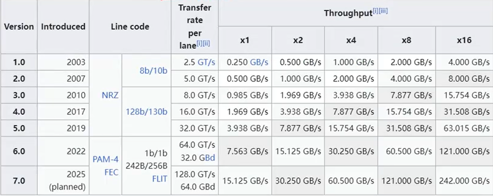
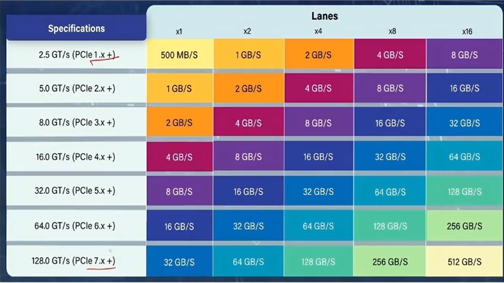
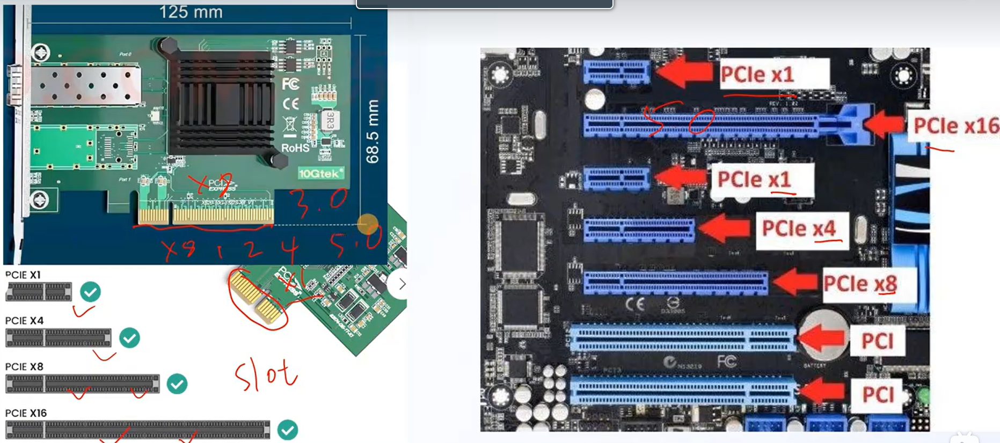

### CPU 访问 PCIe 设备的过程

PCIe 设备的内存或寄存器通常会被映射到 CPU 的地址空间中（称为 **MMIO，Memory-Mapped I/O**）。当 CPU 通过指针访问这些地址（PCIe 设备的 MMIO 区域）时，会发出 Load/Store 指令，这些指令通过北桥路由到 PCIe 总线，最终由 PCIe 设备处理。这种机制使得 CPU 可以像访问内存一样访问 PCIe 设备的资源，简化了编程模型（CPU 可以高效地与 PCIe 设备进行数据交互，而无需额外的复杂协议）。

其中：

**Load/Store 指令**：`Load` 指令用于从内存中读取数据。`Store` 指令用于向内存中写入数据。当 CPU 执行这些指令时，如果目标地址是 PCIe 设备的 MMIO 区域，CPU 会生成相应的总线事务。

北桥（Northbridge）的作用：北桥（或类似的芯片组组件）负责连接 CPU、内存和高速外设（如 PCIe 设备）。CPU 发出的 Load/Store 指令会通过北桥路由到正确的目标设备。

**PCIe 总线传输**：北桥将 CPU 的请求转换为 PCIe 事务，并通过 PCIe 总线发送到目标设备。如果是 `Load` 指令（CPU 从 PCIe 设备加载数据），PCIe 设备会返回数据；如果是 `Store` 指令（CPU 向 PCIe 设备存储数据），PCIe 设备会接收数据。

一下是示例：

**读取数据（Load 指令）**

```c
int value = *p;  // CPU 执行 Load 指令
```

1. CPU 解析指针 `p`，发现地址 `0xMMIO_ADDR` 属于 PCIe 设备的 MMIO 区域。
2. CPU 生成一个 PCIe 读请求，通过北桥发送到 PCIe 总线。
3. PCIe 设备接收到读请求，从指定的寄存器或内存中读取数据。
4. PCIe 设备将数据通过 PCIe 总线返回给北桥，最终传递给 CPU。
5. CPU 将数据存入 `value` 变量。

**写入数据（Store 指令）**

```c
*p = 0x1234;  // CPU 执行 Store 指令
```

1. CPU 解析指针 `p`，发现地址 `0xMMIO_ADDR` 属于 PCIe 设备的 MMIO 区域。
2. CPU 生成一个 PCIe 写请求，包含数据 `0x1234`，通过北桥发送到 PCIe 总线。
3. PCIe 设备接收到写请求，将数据 `0x1234` 写入指定的寄存器或内存。

### PCIe 带宽

**下表是单向带宽，一般指的是这个数据：**



**下表是双向带宽**

PCIe（Peripheral Component Interconnect Express）带宽的计算涉及多个因素，包括链路宽度、传输速率和编码方式。以下是详细的计算方法：

- **链路宽度（Lane Width）**：PCIe链路由多个Lane组成，常见的宽度有x1、x4、x8、x16等。
- **传输速率（Transfer Rate）**：PCIe有不同的版本，每个版本的传输速率不同：
  - PCIe 1.0: 2.5 GT/s（Giga Transfers per second）
  - PCIe 2.0: 5 GT/s
  - PCIe 3.0: 8 GT/s
  - PCIe 4.0: 16 GT/s
  - PCIe 5.0: 32 GT/s
  - PCIe 6.0: 64 GT/s
- **编码方式（Encoding Scheme）**：PCIe使用8b/10b编码（PCIe 1.0和2.0）或128b/130b编码（PCIe 3.0及以上），这意味着每传输10位或130位数据中，只有8位或128位是有效数据。

- 带宽（Bandwidth）可以通过以下公式计算：

  - 对于PCIe 1.0和2.0（8b/10b编码）：

    带宽=传输速率×链路宽度×8/10 / 8

  - 对于PCIe 3.0及以上（128b/130b编码）：

    带宽=传输速率×链路宽度×128/130 / 8

**示例计算**：假设我们有一个PCIe 3.0 x16的设备：

- 传输速率：8 GT/s
- 链路宽度：16 Lane
- 编码方式：128b/130b

带宽=8 GT/s×16×128 / 130 / 8 ≈ 15.75GB/s

**双向带宽**：PCIe是全双工的，因此总带宽是单向带宽的两倍。

### PCIe 卡槽



## 参考

- [PCIe 的饱和式学习](https://www.bilibili.com/video/BV12mpSeeEJx?spm_id_from=333.788.videopod.sections&vd_source=2d2ac911095577ab30d116171d315a7c)
