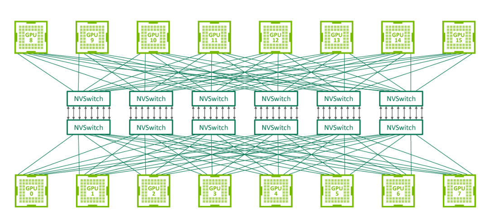

### NVLink

在 GPUDirect P2P 技术中，多个 GPU 通过 PCIe 直接与 CPU 相连，而 PCIe3.0*16 的双向带宽不足  32GB/s，当训练数据不断增长时，PCIe 的带宽满足不了需求，会逐渐成为系统瓶颈。为提升多 GPU 之间的通信性能，充分发挥 GPU  的计算性能，NVIDIA 于 2016 年发布了全新架构的 NVLink。NVLink 是一种高速、高带宽的互连技术

，用于连接多个 GPU 之间或连接 GPU 与其他设备（如CPU、内存等）之间的通信。NVLink 提供了直接的点对点连接，具有比传统的 PCIe 总线更高的传输速度和更低的延迟。

- 高带宽和低延迟：NVLink 提供了高达 300 GB/s 的双向带宽

，将近 PCle 3.0 带宽的 10 倍。点对点连接超低延迟，可实现快速、高效的数据传输和通信。

GPU 间通信：NVLink 允许多个 GPU 之间直接进行点对点的通信，无需通过主机内存或 CPU 进行数据传输。

内存共享

：NVLink 还支持 GPU 之间的内存共享，使得多个 GPU 可以直接访问彼此的内存空间。

弹性连接：NVLink 支持多种连接配置，包括 2、4、6 或 8 个通道，可以根据需要进行灵活的配置和扩展。这使得 NVLink 适用于不同规模和需求的系统配置

**NVSwitch**

NVLink 技术无法使单服务器中 8 个 GPU 达到全连接，为解决该问题，NVIDIA 在 2018 年发布了 NVSwitch，实现了 NVLink 的全连接。NVIDIA NVSwitch 是首款节点交换架构

，可支持单个服务器节点

中 16 个全互联的 GPU，并可使全部 8 个 GPU 对分别达到 300GB/s 的速度同时进行通信。

NVSwitch 全连接拓扑如下图所示：

