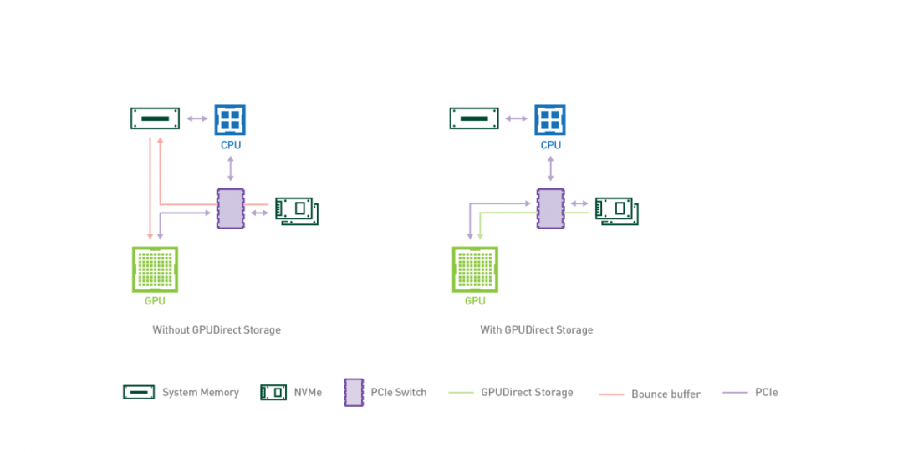
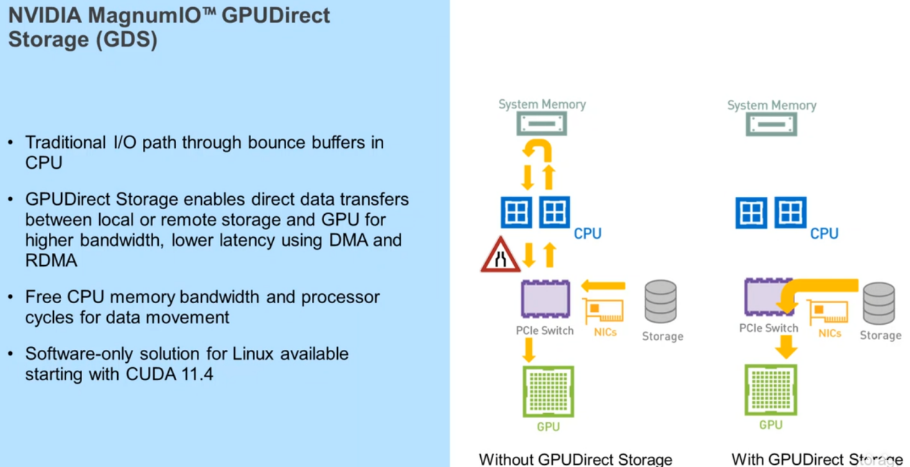
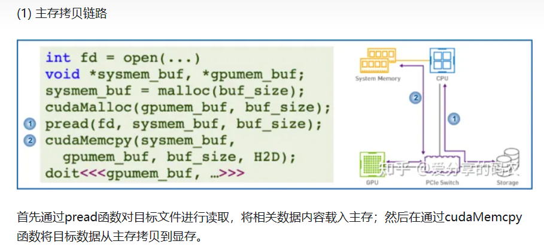
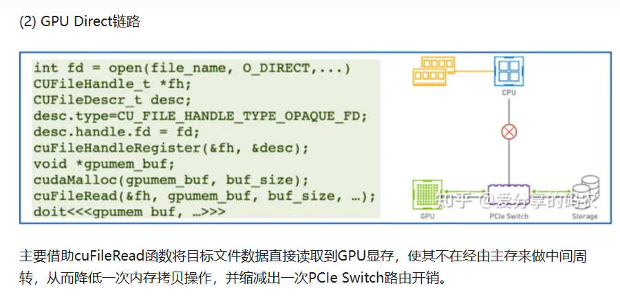
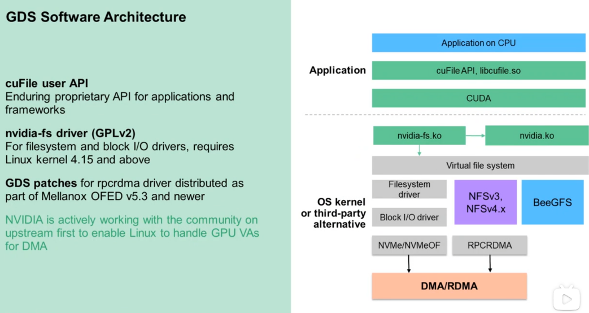
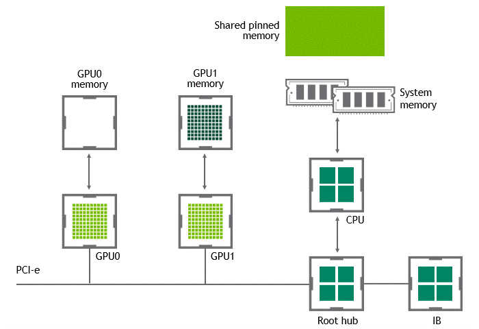
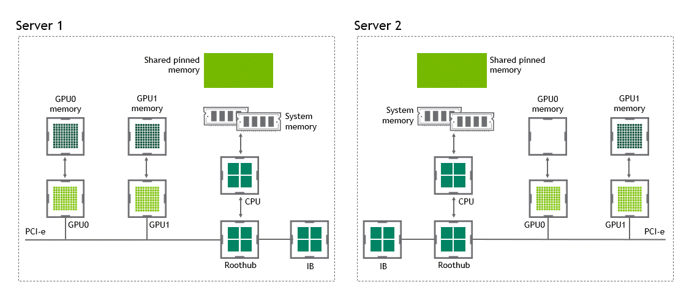
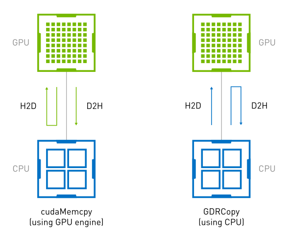
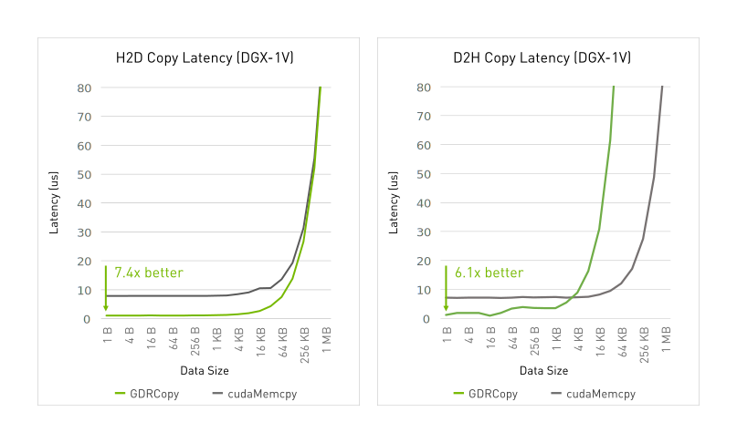

## GPUDirect

GPU Direct 是 NVIDIA 开发的一项技术，可实现 GPU 与其他设备（例如IB 网卡 (NIC) 和存储设备）之间的直接通信和数据传输，而不涉及 CPU。

传统上，当数据需要在 GPU 和另一个设备之间传输时，数据必须通过 CPU，从而导致潜在的瓶颈并增加延迟。使用 GPUDirect，网络适配器和存储驱动器可以直接读写 GPU 内存，减少不必要的内存消耗，减少 CPU 开销并降低延迟，从而显著提高性能。GPU Direct 技术包括 GPUDirect  Storage、GPUDirect RDMA、GPUDirect P2P。

### **GDS（GPUDirect Storage）**

DeepSpeed框架 ZeRo-infinity级优化支持将模型存储在NVME中，解决超大模型训练时显存不足的问题。

GPUDirect Storage 允许存储设备和 GPU 之间进行直接数据传输，绕过 CPU，减少数据传输的延迟和 CPU 开销。

通过 GPUDirect Storage，GPU 可以直接从存储设备（如固态硬盘（SSD）或非易失性内存扩展（NVMe）驱动器）访问数据，而无需将数据先复制到 CPU 的内存中。这种直接访问能够实现更快的数据传输速度，并更高效地利用 GPU 资源。

GPUDirect Storage 的主要特点和优势包括：

- 减少 CPU 参与：通过绕过 CPU，实现 GPU 和存储设备之间的直接通信，GPUDirect Storage 减少了 CPU 开销，并释放 CPU 资源用于其他任务，从而改善系统的整体性能。
- 低延迟数据访问：GPUDirect Storage 消除了数据通过 CPU 的传输路径，从而最小化了数据传输的延迟。

提高存储性能：通过允许 GPU 直接访问存储设备，GPUDirect Storage 实现了高速数据传输，可以显著提高存储性能，加速数据密集型工作负载的处理速度。

增强的可扩展性：GPUDirect Storage 支持多 GPU 配置，允许多个 GPU 同时访问存储设备。这种可扩展性对于需要大规模并行处理和数据分析的应用至关重要。

### **GPUDirect P2P**

某些工作负载需要位于同一服务器中的两个或多个 GPU 之间进行数据交换，在没有 GPUDirect P2P 技术的情况下，来自 GPU 的数据将首先通过 CPU 和 PCIe 总线复制到主机固定的共享内存。然后，数据将通过 CPU 和 PCIe 总线从主机固定的共享内存复制到目标 GPU，数据在到达目的地之前需要被复制两次、

有了 GPUDirect P2P 通信技术后，将数据从源 GPU 复制到同一节点中的另一个 GPU 不再需要将数据临时暂存到主机内存

中。如果两个 GPU 连接到同一 PCIe 总线，GPUDirect P2P 允许访问其相应的内存，而无需 CPU 参与。前者将执行相同任务所需的复制操作数量减半。

### GDR（GPUDirect RDMA）

GPUDirect RDMA 它允许 GPU 直接访问 RDMA 网络设备中的数据，无需通过主机内存或 CPU 。

无 GPUDirect RDMA 的数据传输情况如下：

启用 GPUDirect RDMA 的数据传输情况如下：

GPUDirect RDMA 通过绕过主机内存和 CPU，直接在 GPU 和 RDMA 网络设备之间进行数据传输，显著降低传输延迟，加快数据交换速度，并可以减轻  CPU 负载，释放 CPU 的计算能力。另外，GPUDirect RDMA 技术允许 GPU 直接访问 RDMA  网络设备中的数据，避免了数据在主机内存中的复制，提高了数据传输的带宽利用率。

## GDRCopy

GDRCopy 是一个基于 GPUDirect RDMA 技术的低延迟 GPU 内存拷贝库，它允许 CPU 直接映射和访问 GPU  内存。GDRCopy 还提供了优化的拷贝 API，并被广泛应用于高性能通信运行时环境中，如 UCX、OpenMPI、MVAPICH 和  NVSHMEM。

`cudaMemcpy` 利用 GPU 的 DMA 引擎在 CPU 和 GPU 内存之间传输数据，这会触发 DMA  引擎的操作，导致在小数据量时产生延迟开销和性能下降。而 GDRCopy 则允许 CPU 通过 BAR（Base Address  Register）映射直接访问 GPU 内存，从而实现了 GPU 和 CPU 内存之间的低延迟拷贝。

## 参考

- [Machine Learning Frameworks Interoperability, Part 2: Data Loading and Data Transfer Bottlenecks](https://developer.nvidia.com/blog/machine-learning-frameworks-interoperability-part-2-data-loading-and-data-transfer-bottlenecks/)
- [Enable faster memory transfers between CPU and GPU with GDRCopy](https://developer.nvidia.com/gdrcopy)

