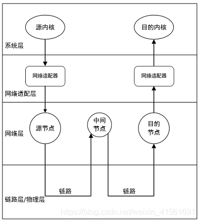
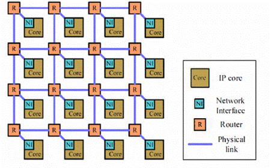
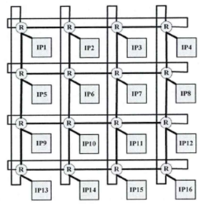
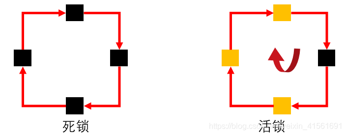
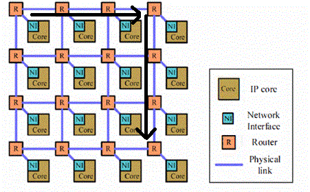

## NoC 结构与性能

NoC技术是在SoC（System on Chip）基础上发展演变来的。SoC通常是指在单一芯片上实现的数字计算机系统，通过总线完成其中各模块之间的交互，但随着半导体工艺和需求的快速发展，总线的宽度已经成为SoC发展的瓶颈，大大限制了SoC内部通信的速度。上世纪90年代NoC技术被提出来解决SoC的架构问题，并一直发展到现在。

## NoC 层次

NoC技术和网络通信中的OSI（Open System Interconnection）技术有很多相似之处，NoC技术的提出也是因为借鉴了并行计算机的互联网络和以太网络的分层思想，二者的相同点有：支持包交换、路由协议、任务调度、可扩展等。NoC更关注交换电路和缓存器的面积占用，在设计时主要考量的方面也是这些。

NoC的基本组成为：IP核、路由器、网络适配器以及网络链路，IP核和路由器位于系统层，网络适配器位于网络适配层。针对NoC的这四个基本组成，也衍生出了许多的研究方向和优化途径。有效的IP核映射及拓扑结构，能够缩短路由跳数，减少通信量，避免数据拥塞。合理的缓冲分配、可靠的交换技术、高效的路由算法以及合理的功耗管理策略可以提高通信效率，降低整体功耗。

**片内系统的通信不会走 PCIe，因为 PCIe 是一种用于片间通信的高速串行总线协议，而片内通信通常使用芯片内部的专用通信机制**，如片上总线、片上网络（NoC）或共享内存。片内通信的特点是低延迟、高带宽和低功耗，适合芯片内部组件之间的高效通信。

## NoC常见的拓扑结构

NoC常见的拓扑结构包括规则拓扑和不规则拓扑两种。规则拓扑主要包括2D Mesh、2D Torus、3D Mesh、Octagon、Cluster Mesh、Spidergon、超立方、蜂窝式、树形和蝶形等拓扑结构。不规则拓扑包括专用网络、分层网络、网络总线混合拓扑以及由规则拓扑组合而成的拓扑结构。

### 2D Mesh

2D Mesh结构为二维网格架构，路由器节点按二维网格的方式排列，每个节点上再连接网络适配器和IP核。下图所示为一个4×4的2D Mesh结构。

在 *N×N* 的2D Mesh中，每个节点与相邻的节点连接（边界节点除外）。该结构具有结构简单，易于实现，可扩展性好等优点，较为广泛使用

### 2D Torus

将2D Mesh结构的每行首尾节点连接起来，每列的首位节点也连接起来，便是2D Torus结构，该结构每个节点在几何上都是等价的，缩短了节点间的平均距离，减小了网络直径，同时该结构可能因为过长的环形链路而产生额外的延迟。

其它的拓扑结构参考 [链接](https://blog.csdn.net/weixin_41561691/article/details/104649688)

## [路由算法](https://blog.csdn.net/weixin_41561691/article/details/104663758)

在NoC的交换信息时，需要确定从源节点到目标节点所经过的路径，这时就需要路由算法来确定该路径。路由算法分为静态路由算法和动态路由算法两种。

- 静态路由算法对于两节点之间的路径是固定的，结构简单，便于硬件实现，也便于保持传输数据的顺序，所以在NoC系统中被广泛的使用。但是静态路由算法在路径发生拥塞时，无法进行调整传输路径，降低数据传输效率。
- 动态调度算法又被称为自适应路由算法，可以根据网络流量和链路负载的变化调整路径，动态选择路径进行通信，避免了高数据传输密度下的网络拥塞。但这种算法结构复杂，不便于实现，同时在低拥塞时电路开销大，而且会出现死锁（循环等待）问题。

图中，黑色方块表示缓存被占据，黄色方框表示缓存未被占据

### 确定性XY路由算法

确定性XY路由算法是最简单的路由算法，该算法的路径取决于源节点和目标节点的地址，是一种静态的路由算法。以2D Mesh结构为例，数据首先在X方向传输，当数据到达目的节点的同一列时，沿Y方向传输，最后到达目的节点。

## 参考

- [NoC (Network on chip) 基础 (1) : 片上网络的简介](https://blog.csdn.net/yang1573/article/details/128434151)