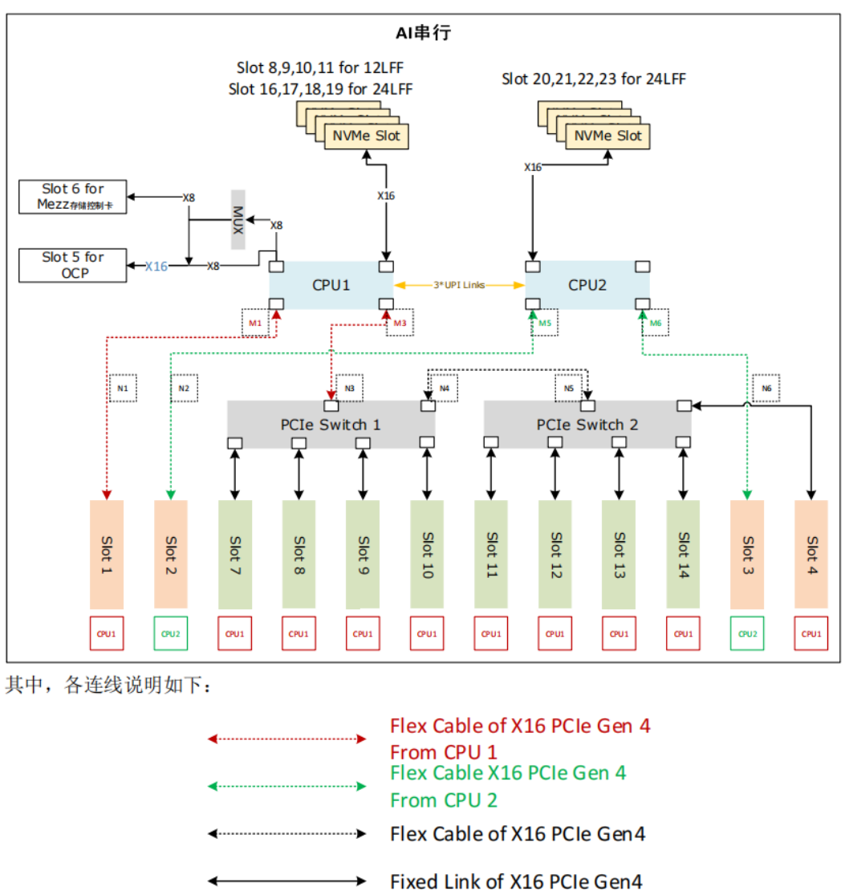

## NVLlink 与 NVSwitch 发展

NVLink 和 NVSwitch 是英伟达推出的两项革命性技术，它们正在重新定义 CPU 与 GPU 以及 GPU 与 GPU 之间的协同工作和高效通信的方式。

- **NVLink 是一种先进的总线及其通信协议。NVLink 采用点对点结构、串列传输，用于中央处理器（CPU）与图形处理器（GPU）之间的连接，也可用于多个图形处理器（GPU）之间的相互连接。**

- **NVSwitch 是一种高速互连技术，同时作为一块独立的 NVLink 芯片，其提供了高达 18 路 NVLink 的接口，可以在多个 GPU 之间实现高速数据传输。**

这两项技术的引入，为 GPU 集群和深度学习系统等应用场景带来了更高的通信带宽和更低的延迟，从而提升了系统的整体性能和效率。

### [NVLink 发展](https://www.nvidia.com/en-us/data-center/nvlink/)

如上图所示，从 Pascal 架构到 Hoppe 架构，NVLink 已经经过了四代的发展演进。在 2024 年的 GTC 大会上，英伟达发布了 Blackwell 架构，其中 NVLink 再次更新，发布了第五代 NVLink，其中互联带宽达到了 1800GB/s。每一层 NVLink 的更新，其每个 GPU 的互联带宽都是在不断的提升，其中 NVLink 之间能够互联的 GPU 数，也从第一代的 4 路到第四代的 18 路。最新的 Blackwell 架构其最大互联 GPU 数，仍是 18 路并未增加。

在 P100 中每一个 NVLink 只有 40GB/s，而从第二代 V100 到 H100 每一个 NVLink 链路都有 50GB/s，通过增加了链路的数量使得整体带宽增加。

### NVSwitch 发展

NVLink 技术无法使单服务器中 8 个 GPU 达到全连接，为解决该问题，NVIDIA 在 2018 年发布了 NVSwitch，实现了 NVLink 的全连接。NVIDIA NVSwitch 是首款节点交换架构，可支持单个服务器节点中 16 个全互联的 GPU。

16 GPU 使用第一代 NVSwitch 全连接拓扑如下图所示：

如上图所示，NVSwitch 技术从 Volta 架构到 Hopper 架构，经历了三代的演进与发展。在每一代中，直接连接的 GPU 数量保持不变，都为 8 个，这意味着互联的基本结构保持了稳定性和一致性。随着 NVLink 架构的升级，GPU 到 GPU 之间的带宽却实现了显著的增长，因为 NVSwitch 就是 NVLink 具体承载的芯片模组，从 Volta 架构的 300GB/s 增加到了 Hopper 架构的 900GB/s。

下面我们来看下 NVLink 与 NVSwitch 在服务器中的关系。

上图展示的是 DGX 服务器 GPU 芯片互联的架构图，如图所示，在 DGX-1 P100 中有 8 张 GPU 卡，每张 GPU 卡支持 4 条 NVLink 链路，这些链路允许 GPU 之间进行高速通信。在 DGX-1 P100 中，GPU 卡被组织成两个 cube mesh，每个 cube 包含 4 个 GPU（GPU 0~3 和 GPU 4~7）。在每个 cube 内部，GPU 之间可以直接通过 NVLink 或通过 PCIe Switch 进行通信。然而，跨 cube 的通信（例如 GPU 0 和 GPU 4）需要通过其他 GPU 间接进行。

DGX-2 引入了英伟达的第一代 NVSwitch 技术，这是一个重要的进步，因为它允许更高效的 GPU 间通信。在 Volta 架构中，每张 GPU 卡支持 6 条 NVLink 链路（每张GPU可以通过 6 条 NVLink 线接入到 6 个 不同的 NVSwitch），而不再是 4 条。此外，通过引入 6 个 NVSwitch，NVSwitch 能够将服务器中的所有 GPU 卡全部互联起来，并且支持 8 对 GPU 同时通信，不再需要任何中间 GPU 跳数，实现直接高速通信，这大大提高了数据传输的效率和整体计算性能。

DGX-A100 使用的是第二代 NVSwitch 技术。相比于第一代，第二代 NVSwitch 提供了更高的通信带宽和更低的通信延迟。在 A100 架构中，每张 GPU 卡支持 12 条 NVLink（第三代）链路，并通过 6 个 NVSwitch 实现了全连接的网络拓扑（**注意，每个GPU通过两根 NVLInk 线与 NVSwitch 连接，第二代的NVSwitch 最多连接 8 个 GPU，但有 18 个 NVLink 接口**）。虽然标准的 DGX A100 配置仅包含 8 块 GPU 卡，但该系统可以扩展，支持更多的 A100 GPU 卡和 NVSwitch，以构建更大规模的超级计算机。

DGX-H100 使用的是第三代 NVSwitch 和第四代 NVLink 技术（**每个 NVSwitch 同时支持 64 个 NVLInk4 连接**），其中每一个 GPU 卡支持 18 条 NVLink 链路。在 H100 架构中，通过引入了 4 个 NV Switch，采用了分层拓扑的方式，每张卡向第一个 NV Switch 接入 5 条链路，第二个 NV Switch 接入 4 条链路，第三个 NV Switch 接入 4 条链路，第四个 NV Switch 接入 5 条链路，总共 72（= 18 链路 * 4 个 NVSwitch） 个 NVLink 提供 3.6 TB/s 全双工 NVLink 网络带宽，比上一代提高 1.5 倍。

## GPU 互联内部结构

如上图所示，在 GPU 内部，工作任务被划分并分配给每个图形处理簇（GPC）和流多处理器（SM）核心。这种工作分配机制确保了 GPU 的计算资源得到充分利用，每个核心都在执行计算任务，从而实现了高效的并行处理。为了支持这种高速计算，GPU 通常配备有高带宽内存（HBM），它为 GPC/SM 核心提供了快速访问大量数据的能力，从而保证了数据密集型任务的高效执行。

HBM（High Bandwidth Memory）是一种堆叠式内存技术，它通过宽接口和高传输速率显著提升了内存带宽。这对于处理大规模数据集和复杂计算尤为重要，因为它确保了数据能够迅速地供给到每个 GPC/SM 核心进行处理。此外，GPC/SM 核心之间能够共享 HBM 中的数据，这一特性使得数据交换更为高效，进一步提升了整体的计算性能。

从下图可以看出，GPU 之间的通信和数据交换通常涉及以下几个方面（没有 NVLink）：

1. PCIe 通信：当多个 GPU 在没有专用高速互连技术（如 NVLink）的系统中协同工作时，它们之间的通信通常是通过 PCI Express（PCIe）总线进行的。PCIe 是一种高速串行计算机扩展总线标准，用于连接主板上的硬件设备。但是，由于 PCIe 的带宽有限，它可能成为 GPU 之间高速数据传输的瓶颈。

2. 对 HBM 的访问：如果一个 GPU 需要直接访问另一个 GPU 的 HBM 内存，数据必须通过 PCIe 总线传输，这会受到 PCIe 带宽的限制。这种通信方式比 GPU 内部访问 HBM 的速度慢得多，因为 PCIe 的带宽远低于 HBM 的内存带宽。

3. 通过 CPU 的调度：在没有直接 GPU 对 GPU 通信能力的系统中，CPU 充当数据交换的中介。CPU 负责在多个 GPU 之间分配和调度计算任务，以及管理数据在 GPU 和系统内存之间的传输。

这就使得 PCIe 的带宽限制成为多 GPU 系统中的一个限制因素。特别是当工作负载需要频繁的 GPU 间通信时，在数据传输密集型的应用中，这种限制可能导致性能下降。

如上图所示，NVLink 的出现为 GPU 间的互联提供了一种革命性的方式，使得不同 GPU 之间的通信和数据共享变得更加高效和直接。

通过 NVLink，GPU 的图形处理簇（GPCs）可以直接访问连接在同一系统中其他 GPU 上的高带宽内存（HBM）数据。这种直接的内存访问机制显著降低了数据交换的延迟，并提高了数据处理的速度。**同时，NVLink 支持多条链路同时操作，这意味着可以通过多条 NVLink 同时对其他 GPU 内的 HBM 数据进行访问，极大地增加了带宽和通信速度。每条 NVLink 链路都提供了远高于 PCIe 的数据传输速率，多条链路的组合使得整体带宽得到了成倍增加。**

此外，**NVLink 不仅仅是一种点对点的通信协议，它还可以通过连接到 GPU 内部的交换机（XBARs）来实现更复杂的连接拓扑**。这种能力使得多 GPU 系统中的每个 GPU 都能以极高的效率访问其他 GPU 的资源，包括内存和计算单元。而且，NVLink 并不是要取代 PCIe，而是作为一种补充和增强。在某些情况下，系统中可能同时使用 NVLink 和 PCIe，其中 NVLink 用于高速 GPU 间通信，而 PCIe 则用于 GPU 与其他系统组件（如 CPU、存储设备）之间的通信。这种设计允许系统根据不同的通信需求灵活选择最合适的技术，从而最大化整体性能和效率。

如上图所示，NVLink 技术的引入不仅仅是为了加速 GPU 间的通信，它还极大地扩展了多 GPU 系统的潜力。

1. 多 GPU 互联能力的提升：NVLink 极大地提高了多 GPU 之间的互联能力，使得更多的 GPU 可以高效地连接在一起。这种增强的互联能力不仅提升了数据传输的速度和效率，而且还使得构建大规模 GPU 集群成为可能。在深度学习、科学模拟等领域，这意味着可以处理更复杂的问题，实现更高的计算性能。
2. 单一 GPU 驱动进程的全局控制：通过 NVLink，单个 GPU 驱动进程可以控制所有 GPU 的计算任务，实现任务的高效分配和管理。这种集中式控制机制简化了多 GPU 系统的编程和使用，使得开发者能够更容易地利用系统中所有 GPU 的计算能力，从而加速复杂计算任务的处理。
3. 无干扰的 HBM 内存访问：NVLink 还允许 GPU 在不受其他进程干扰的情况下直接访问其他 GPU 的 HBM 内存。通过使用 LD/ST 指令和远程直接内存访问（RDMA）技术，数据可以在 GPU 之间高效地传输，极大地提高了内存访问的速度和效率。这种无干扰的访问机制对于需要大量数据交换的应用至关重要，因为它减少了数据传输的延迟，提高了整体的计算性能。
4. XBAR 的独立演进与带宽提升：GPU 内部的交换机（XBAR）作为桥接器，可以独立于 GPU 核心演进发展，提供更高的带宽和更灵活的连接拓扑。这种设计使得 NVLink 不仅能够支持当前的高性能计算需求，而且还具备了未来进一步扩展和提升性能的潜力。随着 XBAR 技术的发展，我们可以期待 NVLink 将会支持更加复杂和高效的多 GPU 连接方案，进一步推动高性能计算的极限。

## NVLink 技术细节

### 初代 NVLink 结构

第一代 NVLink 技术采用了一种精巧的设计，每条 NVLink 是由一对双工双路信道组成，通过巧妙地将 32 条配线组合起来，形成了 8 对不同的配对。这种独特的结构使得每个方向上能够实现高效的数据传输，具体来说，就是通过 2 位双向传输（2bi）乘以 8 对配对（8pair）再乘以 2 条线（2wire），最终形成了 32 条线（32wire）的配置。

如上图所示，在 P100 GPU 上，英伟达搭载了 4 条这样的 NVLink 通道，每条通道能够提供双向总共 40GB/s 的带宽。这意味着，整个 P100 芯片能够达到惊人的 160GB/s 的总带宽，为数据密集型的应用提供了强大的数据处理能力。

通过这种技术，不仅解决了传统 PCIe 通信带宽瓶颈的问题，而且还为 GPU 之间以及 GPU 与 CPU 之间的通信提供了一条更快、更高效的数据传输路径。为处理更加复杂的计算任务，构建更加强大的计算系统铺平了道路。

### 八块 P100 GPU 互联拓扑

为了实现 GPU 间的高效链接和协作计算，就需要基于 NVLink 系统配置和性能成本要求，来合理的配置 GPU 之间的 NVLink 通道的物理布局和连接方式。

初代 DGX-1 通常采用了一种类似于上图的互联形式。不过，IBM 在基于 Power8+微架构的 Power 处理器上引入了 NVLink 1.0 技术，这使得英伟达的 P100 GPU 可以直接通过 NVLink 与 CPU 相连，而无需经过 PCIe 总线。这一举措实现了 GPU 与 CPU 之间的高速、低延迟的直接通信，为深度学习和高性能计算提供了更强大的性能和效率。

通过与最近的 Power8+ CPU 相连，每个节点的 4 个 GPU 可以配置成一种全连接的 mesh 结构。这种结构使得 GPU 之间可以直接交换数据，并在深度学习和计算密集型任务中实现更高效的数据传输和协作计算。

如上图所示，DGX-1 集成了八块 P100 GPU 和两块志强 E5 2698v4 处理器。然而，由于每块 GPU 只有 4 条 NVLink 通道，因此 GPU 形成了一种混合的 cube-mesh 网络拓扑结构。在这种结构中，GPU 被分成两组，每组四块 GPU，并且在组内形成了一个 mesh 结构，在组间形成了一个 cube 结构。

此外，由于 GPU 所需的 PCIe 通道数量超过了芯片组所能提供的数量，因此每一对 GPU 将连接到一组 PCIe 交换机上，然后再与志强处理器相连，如上图所示。随后，两块 Intel 处理器通过 QPI 总线相连。

这种配置确保了每个 GPU 都能获得足够的 PCIe 带宽，以便在深度学习和高性能计算任务中能够高效地进行数据传输和处理。同时，通过 QPI 总线连接的两块 Intel 处理器也为系统提供了高速的 CPU 之间通信通道，进一步提升了整个系统的性能和效率。

## NVSwitch 技术细节

### 初代 NVSwitch 结构

NVSwitch 的设计引入为英伟达创建一个完全无阻塞的全互联 GPU 系统，这对于需要大规模并行处理的应用至关重要。

第一代 NVSwitch 支持 18 路接口，NVSwitch 能够支持多达 16 个 GPU 的全互联，实现高效的数据共享和通信。

如上图所示，在 V100 架构中，每块 GPU 拥有 6 条 NVLink 通道，这些通道可以连接到 NVSwitch 上，从而形成一个高带宽的通信网络。在 DGX-2 系统中，8 个 V100 GPU 通过这些 NVLink 通道与 6 个 NVSwitch 相连，构建了一个强大的基板。

第一代的 NVSwitch 支持的 NVLink 2.0 技术，每个接口能够提供双通道，高达 50GB/s 的带宽。这意味着通过 NVSwitch，整个系统能够实现总计 900GB/s 的惊人带宽，极大地提升了数据传输速率和计算效率。

其次，NVSwitch 基于台积电的 12nm FinFET FFN 工艺制造，这种先进的工艺技术使得 NVSwitch 能够在 100W 的功率下运行，同时集成了高达 2 亿个晶体管。

在电路 IO 和封装方面，NVSwitch 封装在一个大型的 BGA 芯片中，具有 1940 个引脚，其中 576 个专门用于支持 18 路 NVLink。其余的引脚用于电源和各种 I/O 接口，包括 x4 PCIe 管理端口、I2C、GPIO 等，为系统提供灵活的管理和扩展能力。具体的参数如下表所示：

从上表我看可看到，每个 NVLink 双向带宽高达 50GB/s，实际利用率最高能达到 80%。

### 初代 NVSwitch Block

如上图所示，在左侧为 GPU XBAR，它是一个高度专业化的桥接设备，专门设计用于 NVLink 互连环境中，可以使得数据包能够在多个 GPU 之间流动和交换，同时对外呈现为单个 GPU。通过 GPU XBAR，客户端应用程序能够感知并利用多个 GPU 的集合性能，减少了客户端进行 GPU 间通信管理的复杂性。

此外，GPU XBAR 利用基于静态随机存取存储器（SRAM）的缓冲技术，实现非阻塞的数据传输。这种缓冲机制保证了数据传输的连续性和效率，即使在高负载情况下也能保持高性能。

从 V100 GPU 开始，英伟达重新使用了 NVLink 的 IP 块和 XBAR 设计，这不仅保证了不同代产品之间的兼容性，也使得 NVLink 技术能够不断迭代和优化，同时减少了开发成本和时间。

如上图所示，我们结合整个 GPU 来看下 NVSwitch 和 GPU 之间是如何进行数据传输和分发的。

我们都知道在编程中，开发者通常处理的是虚拟地址。这些虚拟地址是由操作系统管理和抽象的，它们为不同的程序提供了独立的地址空间。然而，在物理内存中，数据实际上是以物理地址存储的。物理地址直接指向内存中的具体位置，这是实现数据访问的基础。而虚拟地址到物理地址的转换通常由 GPU 的图形处理单元（GPU 核心）或者固定功能单元（如内存管理单元）来完成。

而在通过 NVLink 传输数据时，如上图所示，其使用的是物理地址而非虚拟地址。这是因为物理地址能够直接指向数据的实际存储位置，从而加快了数据的索引和访问速度。

NVSwitch 作为 NVLink 的桥接设备，它不仅提供了高带宽的通信路径，还负责维护复杂的路由和缓冲机制，确保数据包能够按照正确的物理地址快速且准确地传输到目的地。通过使用物理地址进行 NVLink 通信，可以减少在目标 GPU 上进行地址转换的需要，从而降低延迟，提高数据传输速率。这对于需要快速处理大量数据的高性能计算和 AI 应用来说是至关重要的。

### NVSwitch 简化原理与特性

1. 无 NVSwitch 的直接 GPU 间连接

如上图所示，在没有 NVSwitch 的配置中，GPU 之间的连接通常是通过将 NVLinks 聚合成多个组（Gang）来实现的。这意味着多个 GPU 通过共享的 NVLink 链路进行通信。然而，这种方法的一个限制是任意两个 GPU 之间的最大带宽受限于它们所在 Gang 的 NVLink 数量和带宽。

> **个人理解**：
>
> V100 有 6 条 NVLink 连接，无 NVSwitch 的情况下，3 个 GPU 实现两两互联，只能每个 GPU 之间通过 3 个 NVLInk 线连接，这样带宽就打了半折。
>
> 而初代 NVSwitch 有 18 个 NVLink 接口，每个 V100 通过 6 个 NVLink 与初代 NVSwitch 连接，恰好利用了 6 * 3 = 18 个接口，且 GPU 数量不超过 8 个，这样可以实现 3 个 GPU 间的数据无损传输。

2. 引入 NVSwitch 后的改进

英伟达的 NVSwitch 技术为 GPU 间的通信带来了革命性的改进。NVSwitch 作为一个高速交换机，允许所有链路上的数据进行交互。

在 NVSwitch 架构中，任意一对 GPU 都可以直接互联，且只要不超过六个 NVLink 的总带宽，单个 GPU 的流量就可以实现非阻塞传输。这也就意味着，NVSwitch 支持的全互联架构意味着系统可以轻松扩展，以支持更多的 GPU，而不会牺牲性能。每个 GPU 都能利用 NVLink 提供的高带宽，实现快速的数据交换。

NVSwitch 在解决多 GPU 间的互联有以下优势和特性：

1. 扩展性与可伸缩性：

NVSwitch 的引入为 GPU 集群的扩展性提供了强大的支持。通过简单地添加更多的 NVSwitch，系统可以轻松地支持更多的 GPU，从而扩展计算能力。

2. 高效的系统构建：

例如，八个 GPU 可以通过三个 NVSwitch 构建成一个高效的互连网络。这种设计允许数据在所有 GPU 链路之间自由交互，最大化了数据流通的灵活性和效率。

3. 全双向带宽利用：

在这种配置下，任意一对 GPU 都能够利用完整的 300 GBps 双向带宽进行通信。这意味着每个 GPU 对都能实现高速、低延迟的数据传输，极大地提升了计算任务的处理速度。

4. 无阻塞通信：

NVSwitch 中的交叉开关（XBAR）为数据传输提供了从点 A 到点 B 的唯一路径。这种设计确保了通信过程中的无阻塞和无干扰，进一步提升了数据传输的可靠性和系统的整体性能。

5. 优化的网络拓扑：

NVSwitch 支持的网络拓扑结构为构建大型 GPU 集群提供了优化的解决方案。它允许系统设计者根据具体的计算需求，灵活地配置 GPU 之间的连接方式。

### 第三代 NVSwitch

从上图可以看出，第三代 NVSwitch 采用了 TSMC 的 4N 工艺制造，即使在拥有大量晶体管和高带宽的情况下，也能保持较低的功耗。它提供了 64 个 NVLink 4 链路端口，允许构建包含大量 GPU 的复杂网络，同时保持每个 GPU 之间的高速通信。同时支持 3.2TB/s 的全双工带宽，显著提升了数据传输速率，使得大规模数据集的并行处理更加高效。

在信号技术方面，采用了 50 Gbaud PAM4 信号技术，每个差分对提供 100 Gbps 的带宽，保持了信号的高速传输和低延迟特性。

NVSwitch 集成了英伟达 SHARP 技术，包括 all_gather、reduce_scatter 和 broadcast atomics 等操作，为集群通信提供了硬件加速，进一步提升了性能。NVSwitch 3.0 的物理电气接口与 400 Gbps 以太网和 InfiniBand 兼容，提供了与现有网络技术的互操作性。

英伟达的第三代 NVSwitch 引入了多项创新特性，其中新 SHARP 模块和新 NVLink 模块的加入，为 GPU 间的高效通信和数据处理提供了显著的性能提升，如上图所示。

- 新 SHARP 模块

新引入的 SHARP 模块拥有强大的数据处理能力，支持多种运算符，从逻辑运算到算术运算，同时兼容多种数据格式，如 FP16 和 BF16，为 AI 和机器学习工作负载提供了强有力的支持。SHARP 控制器的设计能够并行管理多达 128 个 SHARP 组，同时处理众多任务，大幅提升了数据并行处理的效率，顺利完成大规模的数据处理任务。

NVSwitch 中的交叉开关（XBAR），经过精心调整和优化，与 SHARP 模块的数据传输需求完美匹配。这一协同设计，确保了数据在 GPU 间传输时的高效率和低延迟，提升系统的整体性能。

- 新 NVLink 模块

新 NVLink 模块的集成，不仅为数据和芯片提供了额外的安全保护，防止未授权访问和潜在的数据泄露，更增强了系统的数据安全性。端口分区功能的引入将不同的端口隔离到单独的 NVLink 网络中，为系统提供了更高的灵活性，允许在不同的网络之间实现资源的逻辑分割，优化了多任务处理的能力。

控制器对下一代 Octal Small Formfactor Pluggable（OSFP）电缆的支持，提供了更高的数据传输速率和更低的信号衰减，适合长距离的高速通信，为未来的网络扩展提供了无限可能。

新 NVLink 模块还扩展了遥测功能，使得系统管理员能够更精确地监控和优化网络性能，确保系统的稳定运行。而集成的前向纠错（FEC）技术，增强了数据传输的可靠性，尤其是在面对信号衰减或干扰时，能够保证数据的完整性和准确性。

## 新华三类脑服务器PCIe拓扑结构说明

### AI串行配置

AI 场景下，更偏重于 GPU 和 GPU 之间的交互，Switch 串行配置的拓扑图如下，实际上，CPU 所在的主板叫做 Main Board，Switch 所在的单板叫做 Node Board，如下图也可以看到使用 Flex Cable连接的连接器一共有 10 个，使用 5 条 Cable 互联。

其中 M1，M3，M5，M6 位于 Main Board 上；N1-N6 位于 Node Board 上；

AI-Switch 串行配置的情况下五个 Flex Cable 的连接方式是：

M1-N1；M3-N3；M5-N2；M6-N6；N4-N5。

### AI并行配置

AI 场景，Switch 并行配置和上面的串行相比较大的一个区别是 2 个 Switch 分别通过 1 个 Flex Cable连接到 CPU1 上。

AI-Switch 并行配置的情况下五个 Flex Cable 的连接的方式是：

M1-N5；M3-N3；M5-N1；M6-N6；N2-N4。

### HPC配置

HPC 配置更加强调 CPU 和 GPU 共同参与运算，和 AI 配置较大的区别是 2 个 Switch 分别通过 1条 Flex

Cable 分别连接到 2 个 CPU 上。

HPC 配置的情况下五个 Flex Cable 的连接的方式是：

M1-N1；M3-N3；M5-N5；M6-N6；N2-N4。

### **三种拓扑对比选型**

- AI串行侧重于计算卡间通信，计算卡之间通信不需要通过CPU延时低带宽性能好，但是PCIe Switch2上的计算卡需要CPU2共同参与运算以及访问CPU2上的内存延时高带宽性能差

- HPC侧重于计算卡和CPU共同运算，计算卡和CPU间通信延时低带宽性能好，但是跨PCIe Switch的计算卡间通信需要通过2个CPU导致延时高且带宽性能差，通信带宽受限于CPU间UPI带宽

- **AI并行是AI串行和HPC配置的一个折中方案**，跨PCIe Switch的计算卡间通信需要经过1个CPU，**通信带宽不受限于CPU间UPI带宽**，且PCIe Switch2上的计算卡需要CPU2共同参与运算以及访问CPU2上的内存减少了访问PCIe Switch1的步骤

基于上述对比，选择AI并行是一个合适的选择。

## 海康类脑服务器PCIe拓扑结构说明

存在的问题：

- 跨PCIe Switch的计算卡间通信需要通过2个CPU导致延时高且带宽性能差，且CPU间采用QPI连接，通信带宽受限于CPU间QPI带宽
- 每个CPU下2个PCIe Switch，即使在同一个CPU下的计算卡间通信也有可能需要经过CPU，影响延时和带宽。

### QPI与UPI

**QPI，即Intel的QuickPath Interconnect，译为快速通道互联**。也即CSI（Common System Interface），用来实现芯片之间的直接互联，而不是在通过FSB连接到北桥，矛头直指AMD的HT总线。无论是速度、带宽、每个针脚的带宽、功耗等一切规格都要超越HT总线。FSB，将CPU中央处理器连接到北桥芯片的系统总线，它是CPU和外界交换数据的主要通道。

**UPI，即Intel的Ultra Path Interconnect，取代QPI的技术**。拥有更高的通信速率、效率、更低的功耗。

参考：https://blog.csdn.net/asd892776222/article/details/102783856

