## GPUDirect

GPU Direct 是 NVIDIA 开发的一项技术，可实现 GPU 与其他设备（例如IB 网卡 (NIC) 和存储设备）之间的直接通信和数据传输，而不涉及 CPU。

传统上，当数据需要在 GPU 和另一个设备之间传输时，数据必须通过 CPU，从而导致潜在的瓶颈并增加延迟。使用 GPUDirect，网络适配器和存储驱动器可以直接读写 GPU 内存，减少不必要的内存消耗，减少 CPU 开销并降低延迟，从而显著提高性能。GPU Direct 技术包括 GPUDirect  Storage、GPUDirect RDMA、GPUDirect P2P。

### **GDS（GPUDirect Storage）**

DeepSpeed框架 ZeRo-infinity级优化支持将模型存储在NVME中，解决超大模型训练时显存不足的问题。

GPUDirect Storage 允许存储设备和 GPU 之间进行直接数据传输，绕过 CPU，减少数据传输的延迟和 CPU 开销。

通过 GPUDirect Storage，GPU 可以直接从存储设备（如固态硬盘（SSD）或非易失性内存扩展（NVMe）驱动器）访问数据，而无需将数据先复制到 CPU 的内存中。这种直接访问能够实现更快的数据传输速度，并更高效地利用 GPU 资源。

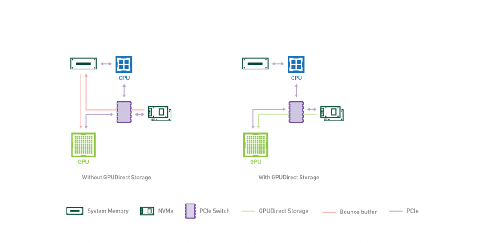

GPUDirect Storage 的主要特点和优势包括：

- 减少 CPU 参与：通过绕过 CPU，实现 GPU 和存储设备之间的直接通信，GPUDirect Storage 减少了 CPU 开销，并释放 CPU 资源用于其他任务，从而改善系统的整体性能。
- 低延迟数据访问：GPUDirect Storage 消除了数据通过 CPU 的传输路径，从而最小化了数据传输的延迟。

提高存储性能：通过允许 GPU 直接访问存储设备，GPUDirect Storage 实现了高速数据传输，可以显著提高存储性能，加速数据密集型工作负载的处理速度。

增强的可扩展性：GPUDirect Storage 支持多 GPU 配置，允许多个 GPU 同时访问存储设备。这种可扩展性对于需要大规模并行处理和数据分析的应用至关重要。

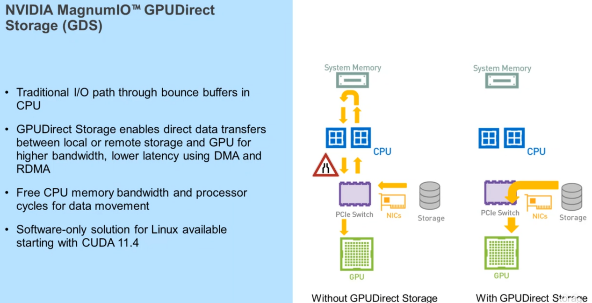

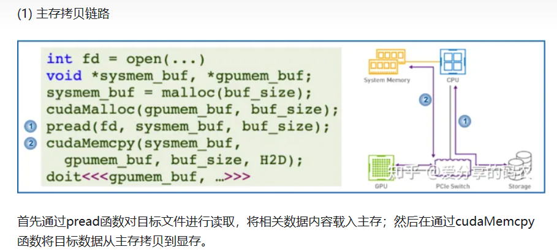

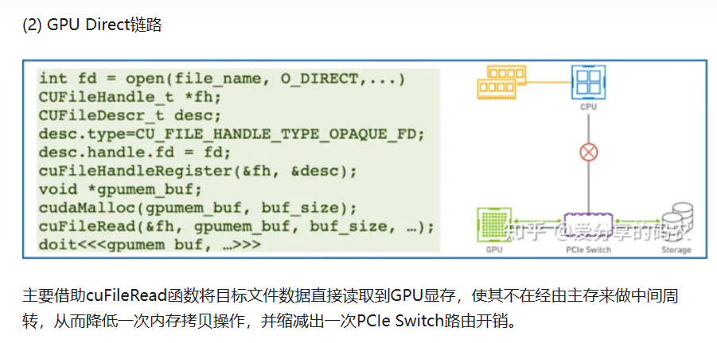

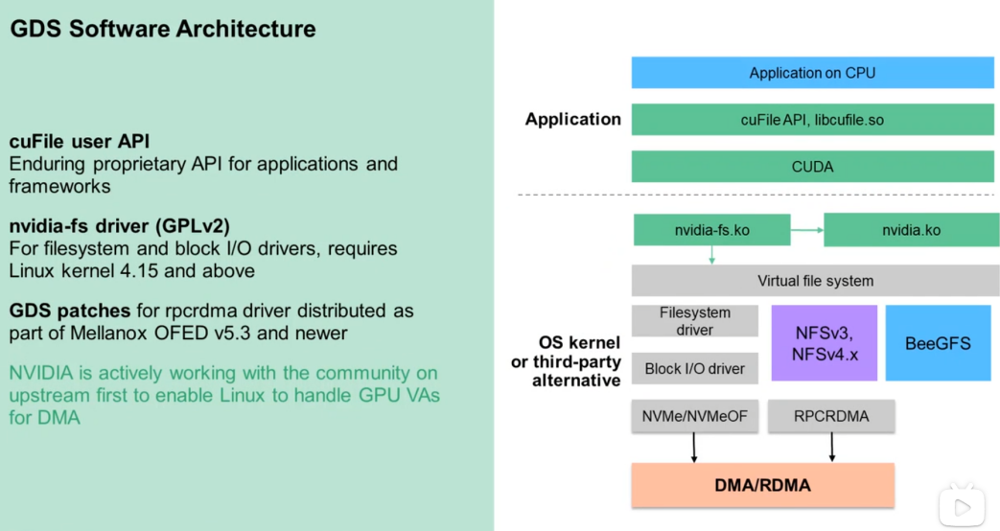

### **GPUDirect P2P**

某些工作负载需要位于同一服务器中的两个或多个 GPU 之间进行数据交换，在没有 GPUDirect P2P 技术的情况下，来自 GPU 的数据将首先通过 CPU 和 PCIe 总线复制到主机固定的共享内存。然后，数据将通过 CPU 和 PCIe 总线从主机固定的共享内存复制到目标 GPU，数据在到达目的地之前需要被复制两次、

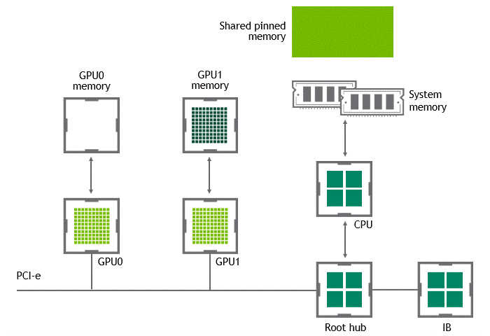

有了 GPUDirect P2P 通信技术后，将数据从源 GPU 复制到同一节点中的另一个 GPU 不再需要将数据临时暂存到主机内存中。如果两个 GPU 连接到同一 PCIe 总线，GPUDirect P2P 允许访问其相应的内存，而无需 CPU 参与。前者将执行相同任务所需的复制操作数量减半。


### GDR（GPUDirect RDMA）


GPUDirect RDMA 它允许 GPU 直接访问 RDMA 网络设备中的数据，无需通过主机内存或 CPU 。

无 GPUDirect RDMA 的数据传输情况如下：


启用 GPUDirect RDMA 的数据传输情况如下：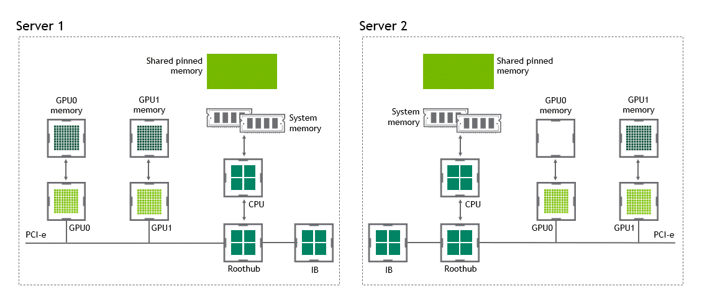

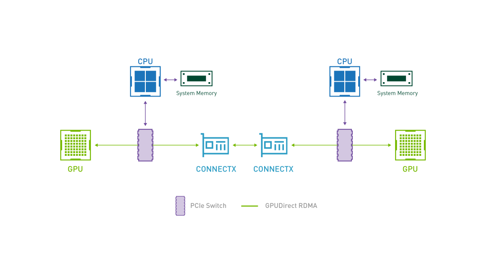GPUDirect RDMA 通过绕过主机内存和 CPU，直接在 GPU 和 RDMA 网络设备之间进行数据传输，显著降低传输延迟，加快数据交换速度，并可以减轻  CPU 负载，释放 CPU 的计算能力。另外，GPUDirect RDMA 技术允许 GPU 直接访问 RDMA  网络设备中的数据，避免了数据在主机内存中的复制，提高了数据传输的带宽利用率。

#### GPU上的RDMA操作

在使用了GPU Direct RDMA的GPU中，网卡是怎么和GPU配合，实现将GPU的HBM的数据发送到远端的呢？

**在引入InfiniBand GPUDirect Async(IBGDA)之前，是使用CPU上的代理线程来进行网络通信的。NCCL中也有类似的proxy thread和相应实现。**

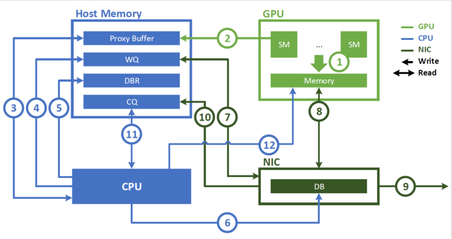

Proxy-initiated  communication（https://developer.nvidia.com/blog/improving-network-performance-of-hpc-systems-using-nvidia-magnum-io-nvshmem-and-gpudirect-async/）

此时流程是这样的：

1. 应用程序启动一个CUDA kernel，在GPU内存中产生数据。
2. kernel function通过往CPU memory中的proxy buffer写入数据的方式，通知CPU要进行网络操作。我们将这个通知称为work descriptor, 它包含源地址、目标地址、数据大小及其他必要的网络信息。
3. CPU上的proxy thread收到worker descriptor，并发起相应的网络操作。CPU会更新host memory中的doorbell record (DBR) buffer。（This buffer is used in the recovery path in case the NIC  drops the write to its doorbell.  就是用来记录doorbell的信息，万一硬件来不及及时响应doorbell并把它丢掉，你还能从DBR buffer中恢复doorbell）
4. CPU通过写入NIC的 doorbell (DB)通知NIC。DB是NIC硬件中的一个寄存器。
5. NIC从WQ中读取work descriptor。
6. NIC使用GPUDirect RDMA直接从GPU内存搬运数据。
7. NIC将数据传输到远程节点。
8. NIC通过向主机内存中的CQ写入事件来指示网络操作已完成。
9. CPU轮询CQ以检测网络操作的完成。
10. CPU通知GPU操作已完成。

可以发现，这个过程竟然需要GPU, CPU, NIC三方参与。CPU就像是一个中转站，那么显然它有一些缺点：

- proxy thread消耗了CPU cycles
- proxy thread成为瓶颈，导致在细粒度传输（小消息）时无法达到NIC的峰值吞吐。现代NIC每秒可以处理数亿个通信请求。GPU可以按照该速率生成请求，但CPU的处理速率低得多，造成了在细粒度通信时的瓶颈。

#### InfiniBand GPUDirect Async

IBGDA 是基于 GPUDirect RDMA 技术进一步发展而来的。GPUDirect RDMA 提供了让 GPU  内存能够被直接访问的机制，而 IBGDA 在此基础上，直接在 GPU 内存中生成网络工作描述符（Work  Queue, WQ），并通过 GPUDirect RDMA 通知 InfiniBand 网卡执行数据传输，无需 CPU  干预。其工作队列（WQ）和门铃寄存器（DBR）缓冲区从主机内存迁移到 GPU 内存，减少了 GPU 与 CPU  间的数据复制开销。

IBGDA 能够显著提升细粒度通信的吞吐量，尤其适用于处理每秒数亿级请求的现代 InfiniBand 网卡的场景，在分布式训练中的梯度同步等高频次、小数据量的节点间通信任务中表现出色。

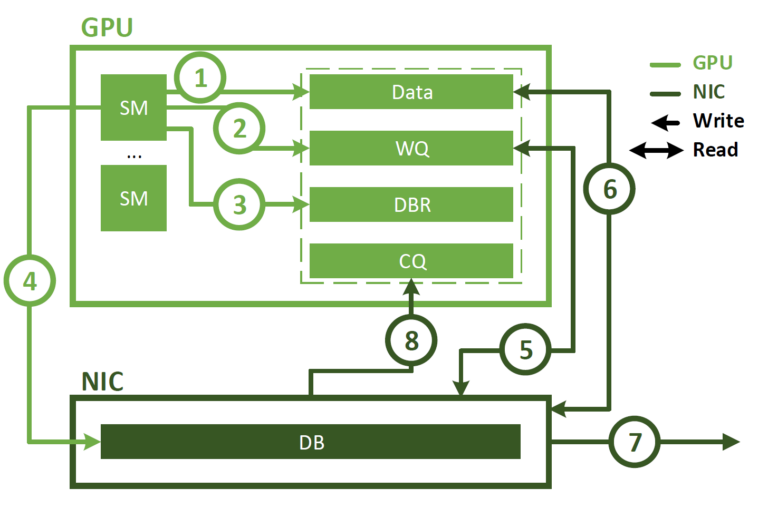

IBGDA  (https://developer.nvidia.com/blog/improving-network-performance-of-hpc-systems-using-nvidia-magnum-io-nvshmem-and-gpudirect-async)

1. CPU程序启动一个CUDA kernel function，在GPU内存中生成数据。
2. 使用SM创建一个NIC work descriptor，并将其直接写入WQ。与CPU proxy thread不同，该WQ区位于GPU内存中。
3. SM更新DBR buffer，它也位于GPU内存中。
4. SM通过写入NIC的DB寄存器通知NIC。
5. NIC使用GPUDirect RDMA从WQ读取工作描述符。
6. NIC使用GPUDirect RDMA读取GPU内存中的数据。
7. NIC将数据传输到远程节点。
8. NIC通过使用GPUDirect RDMA向CQ缓冲区写入事件，通知GPU网络操作已完成。

可见，IBGDA消除了CPU在通信控制路径中的作用。在使用IBGDA时，GPU和NIC直接交换进行通信所需的信息。WQ和DBR buffer也被移到GPU内存中，以提高SM访问效率。

那么如何能使用上述功能呢？实际上NVIDIA OpenSHMEM Library (NVSHMEM)早已把IBGDA的能力加入进它的库中，并且NVSHMEM 为所有参与计算的 GPU  提供了一个统一的、对称的全局地址空间，方便用户的开发。DeepSeek开源的DeepEP也使用了NVSHMEM。

参考：

- [Improving Network Performance of HPC Systems Using NVIDIA Magnum IO NVSHMEM and GPUDirect Async](https://developer.nvidia.com/blog/improving-network-performance-of-hpc-systems-using-nvidia-magnum-io-nvshmem-and-gpudirect-async/)
- [浅析DeepSeek中提到的IBGDA](https://zhuanlan.zhihu.com/p/26082845081)

## 设备侧ARM发起RDMA通信

方案是将verbs编译到arm上，由arm发起rdma通信

### 通信资源由谁控制？

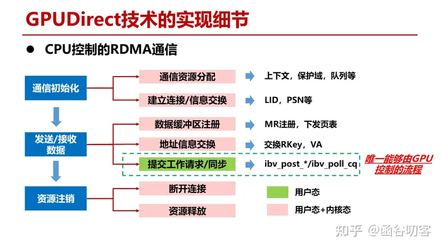

CPU在通信过程中，除了提交工作请求和同步，其它所有工作都在进行通信资源的创建和设置，而且都需要和内核进行交互。首先，GPU没有必要管理这些资源创建过程，其次，GPU上的代码也没有办法直接跟主机操作系统进行交互。因此，唯一能够且有必要由GPU控制的流程就是提交工作请求和同步过程。

资源储存在主机侧。

### 将host端内存映射到device侧，使设备侧可以访问主机侧内存

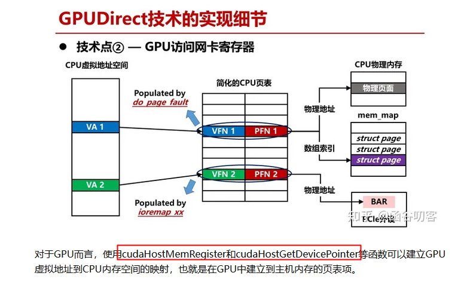

`cudaHostMemRegister`和`cudaHostGetDevicePointer`是CUDA库中的两个函数，用于在主机（CPU）和设备（GPU）之间共享内存。

**1. cudaHostMemRegister:**

`cudaHostMemRegister`函数用于将主机内存注册为可由设备访问的内存。通过注册主机内存，可以避免在主机和设备之间频繁地复制数据，从而提高内存访问性能。注册后的主机内存可以直接在设备上使用，而不需要显式地将数据从主机内存复制到设备内存。

注册内存的示例代码如下：

```cpp
cudaError_t cudaHostMemRegister(void* ptr, size_t size, unsigned int flags);
```

- `ptr`：要注册的主机内存指针。
- `size`：要注册的内存大小（以字节为单位）。
- `flags`：标志位，用于指定注册内存的属性。

常见的标志位有：

- `cudaHostRegisterDefault`：默认标志，表示对内存进行读写操作。
- `cudaHostRegisterPortable`：表示内存可以被多个设备共享。
- `cudaHostRegisterMapped`：表示内存可以在设备上进行直接访问。

**2. cudaHostGetDevicePointer:**

`cudaHostGetDevicePointer`函数用于获取已注册主机内存的设备指针。这个函数返回一个设备指针，该指针指向已注册的主机内存的设备副本。

获取设备指针的示例代码如下：

```cpp
cudaError_t cudaHostGetDevicePointer(void** pDevice, void* pHost, unsigned int flags);
```

- `pDevice`：用于存储设备指针的变量。
- `pHost`：已注册主机内存的指针。
- `flags`：标志位，与之前注册时使用的标志位相同。

通过这个函数，可以在设备上直接访问主机内存，并在设备上执行操作，而无需显式地将数据从主机内存复制到设备内存。

总结起来，`cudaHostMemRegister`用于将主机内存注册为可由设备访问的内存，而`cudaHostGetDevicePointer`用于获取已注册主机内存的设备指针。这两个函数配合使用，可以方便地在主机和设备之间共享内存。

### arm提交rdma网络请求

#### 发送与接收

```C
static inline int ibv_post_send(struct ibv_qp *qp, struct ibv_send_wr *wr,
				struct ibv_send_wr **bad_wr)
    
static inline int ibv_post_recv(struct ibv_qp *qp, struct ibv_recv_wr *wr,
				struct ibv_recv_wr **bad_wr)
```

qp指针在主机侧，且qp中包含网卡上下文指针，保护域指针、以及发送与接收的完成队列的指针，arm中如何访问？

wr与bad_wr是发送通信时临时由arm创建的，与主机无关。

qp的内容如下：

```c
struct ibv_qp {
	struct ibv_context     *context;
	void		       *qp_context;
	struct ibv_pd	       *pd;
	struct ibv_cq	       *send_cq;
	struct ibv_cq	       *recv_cq;
	struct ibv_srq	       *srq;
	uint32_t		handle;
	uint32_t		qp_num;
	enum ibv_qp_state       state;
	enum ibv_qp_type	qp_type;

	pthread_mutex_t		mutex;
	pthread_cond_t		cond;
	uint32_t		events_completed;
};
```

#### 轮询完成队列

```c
static inline int ibv_poll_cq(struct ibv_cq *cq, int num_entries, struct ibv_wc *wc)
```

cq指针在主机侧，且cq中包含了网卡上下文指针，arm 如何访问？

```c
struct ibv_cq {
	struct ibv_context     *context;
	struct ibv_comp_channel *channel;
	void		       *cq_context;
	uint32_t		handle;
	int			cqe;

	pthread_mutex_t		mutex;
	pthread_cond_t		cond;
	uint32_t		comp_events_completed;
	uint32_t		async_events_completed;
};
```

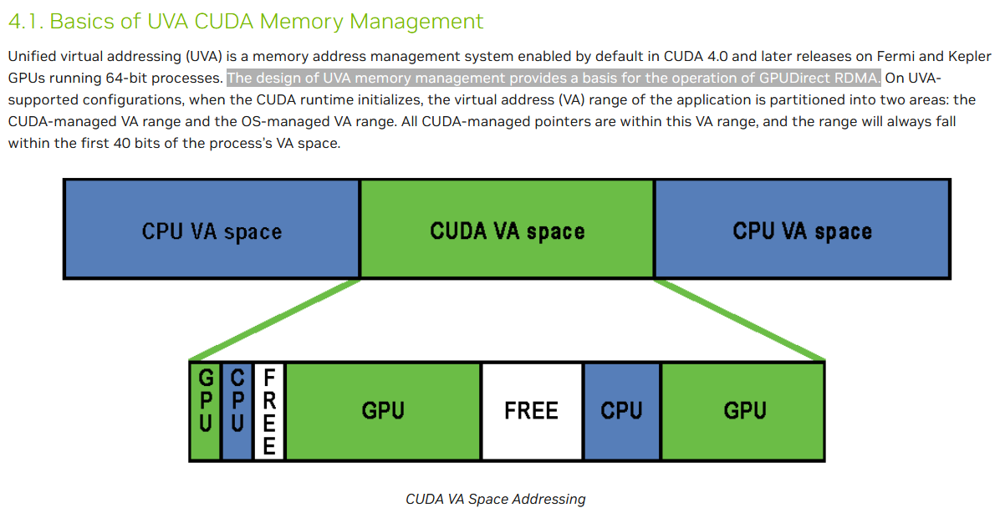

分析

- 如果使用统一内存（UVA，UM），设备端就能访问host创建的qp资源
- 如果将host端的进程空间映射到设备侧，根据host端进程的起始地址与映射到设备侧内存的起始地址计算出偏移值。此时也会知道qp里各个结构体指针在设备侧的地址。
- 需要提供设备侧发起的 d2d 内存拷贝。比如24个芯片，芯片0与23使用rdma对外发送数据，但芯片1与芯片3之间则使用设备侧发起的 d2d。

参考资料：

- [【研究综述】浅谈GPU通信和PCIe P2P DMA](https://zhuanlan.zhihu.com/p/430101220)

## GDRCopy

GDRCopy 是一个基于 GPUDirect RDMA 技术的低延迟 GPU 内存拷贝库，它允许 CPU 直接映射和访问 GPU  内存。GDRCopy 还提供了优化的拷贝 API，并被广泛应用于高性能通信运行时环境中，如 UCX、OpenMPI、MVAPICH 和  NVSHMEM。

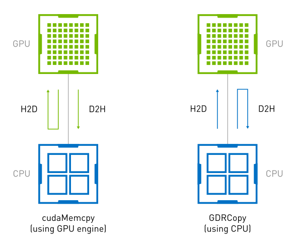

`cudaMemcpy` 利用 GPU 的 DMA 引擎在 CPU 和 GPU 内存之间传输数据，这会触发 DMA  引擎的操作，导致在小数据量时产生延迟开销和性能下降。而 GDRCopy 则允许 CPU 通过 BAR（Base Address  Register）映射直接访问 GPU 内存，从而实现了 GPU 和 CPU 内存之间的低延迟拷贝。

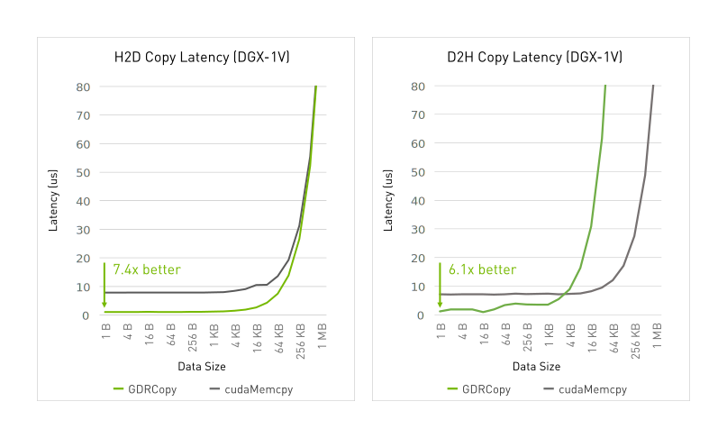

## NVSHMEM

- NVSHMEM是基于OpenSHMEM的并行编程接口，为NVIDIA GPU集群提供高效且可扩展的通信
- NVSHMEM为数据创建了一个全局地址空间，该空间跨越多个GPU内存，可以通过细粒度的GPU发起操作、CPU发起操作以及CUDA流上的操作进行访问
- 将整个GPU集群看成一个有统一编址的内存，将整个GPU集群里面所有的内存看成一个内存


特性：

- 将多个GPU的内存组合成一个分区的全局地址空间（PGAS模型Partitioned Global Address Space，分区全局地址空间），可通过NVSHMEM API访问
- 包含一个低开销的内核通信API，供GPU线程使用
- 包括基于流和CPU启动的通信API
- 支持x86和Arm处理器
- 可与MPI和其他OpenSHMEM实现互操作
- NVSHMEM通过PGAS模型和GPU直接通信的机制，为多GPU多节点应用提供了高效的编程接口，尤其适合需要频繁跨设备数据交换的高性能计算场景，尽管需开发者管理内存一致性，但其性能优势和编程便捷性使其成为替代传统MPI的重要选择

- NVSHMEM与CUDA同一级别

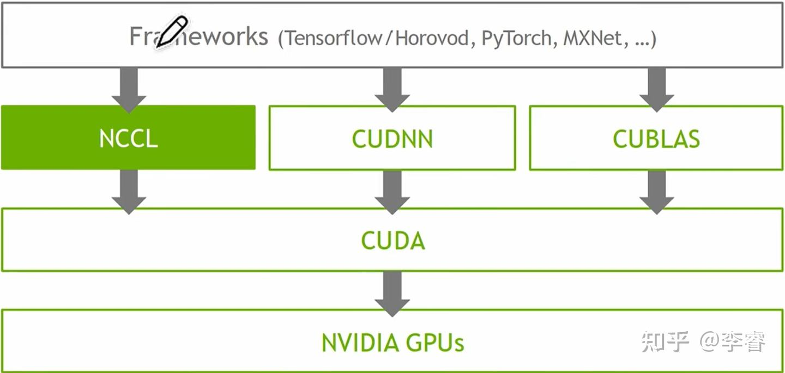

### NVSHMEM 和 NCCL

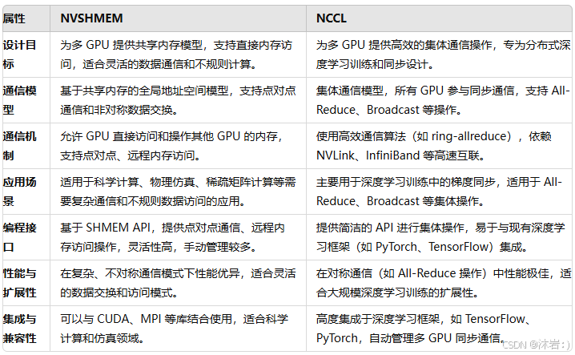
 **总体来说**，NVSHMEM较轻量级，适合小规模的不规则复杂通信；NCCL较重量级，适合大规模的规则通信。

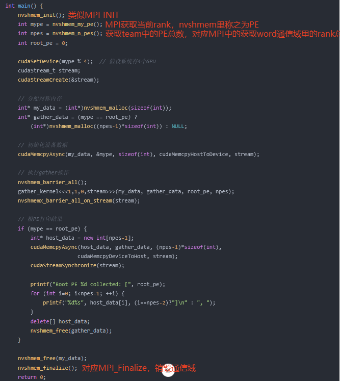

代码是DeepSeek写的使用 NVSHMEM API 实现的 gather sample。

从代码上看，感觉 NVSHMEM 像 GPU 版本的 MPI。

与NCCL的区别，也可参考 [github issue](https://github.com/NVIDIA/nccl/issues/679)

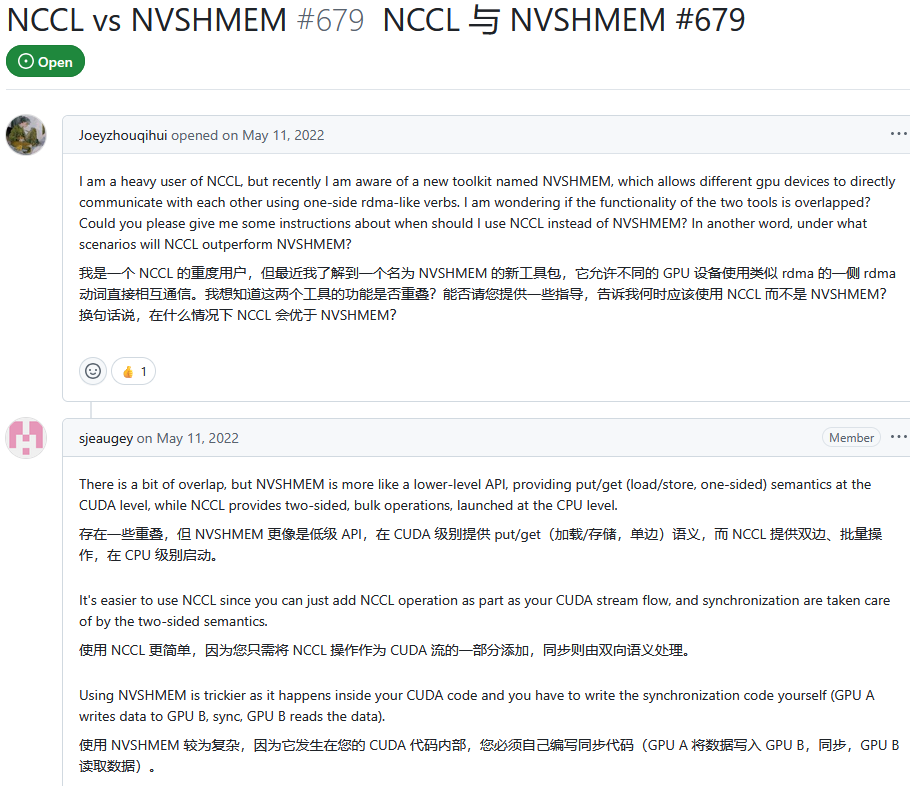

总结一下就是nccl和nvshmem功能存在一些重叠，但 NVSHMEM 更像是低级 API，在 CUDA 级别提供 put/get（加载/存储，单边）语义，而 NCCL 提供双边、批量的操作，是在 CPU 上调用的。nvshmem是单边的语义，意味着用户还要自己控制同步，更细力度的控制。

## 参考

- [Machine Learning Frameworks Interoperability, Part 2: Data Loading and Data Transfer Bottlenecks](https://developer.nvidia.com/blog/machine-learning-frameworks-interoperability-part-2-data-loading-and-data-transfer-bottlenecks/)
- [Enable faster memory transfers between CPU and GPU with GDRCopy](https://developer.nvidia.com/gdrcopy)


# 【研究综述】浅谈GPU通信和PCIe P2P DMA

这张图是开普勒GPU架构图。其中，HSHUB（High Speed  HUB）完成GPU与CPU之间的数据交换，所有的存储器件接入一个交叉开关。计算核心被划分为不同的SM（Stream  Multi-Processor）。每个SM包含数十至数百个计算核心，共享SM中的存储资源。其中，共享内存部分被用作scratchpad，这部分存储资源需要用户进行显式管理，RO Cache用于存放一些常量数据。与CPU不同的地方在于，L1 Cache和L2 Cache之间不维护一致性。

上文中的scratchpad，DeepSeek解释为：

> "Scratchpad" 在计算机体系结构中的标准翻译为**暂存存储器**（或直译为**便笺式存储器**）。在GPU架构语境下，scratchpad 特指一种由程序员直接管理的高速片上存储空间

## GPU内存管理

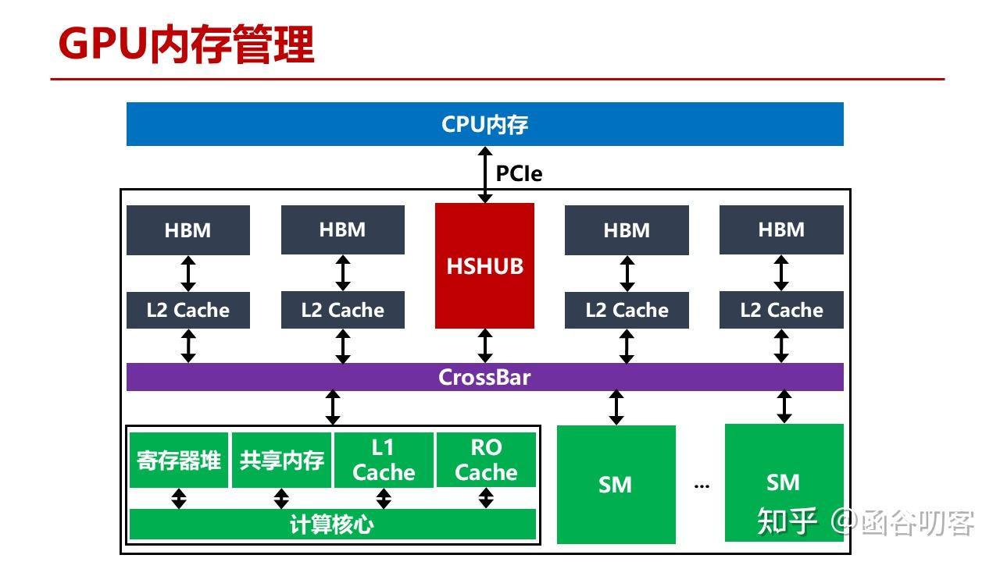

从用户编程角度而言，在使用存储资源时看到的就是CPU指针和GPU指针。对GPU内存的使用经历了三个阶段：

- 第一个阶段是分离内存管理，GPU上运行的Kernel代码不能直接访问CPU内存，在载入Kernel之前或Kernel执行结束之后必须进行显式的拷贝操作；
- 第二个阶段是半分离内存管理，Kernel代码能够直接用指针寻址到整个系统中的内存资源；
- 第三个阶段是统一内存管理，CPU还是GPU上的代码都可以使用指针直接访问到系统中的任意内存资源。

对于用户而言，第三个阶段看起来只是提供了一个语法糖，但在底层硬件实现上两者有着显著的差异。

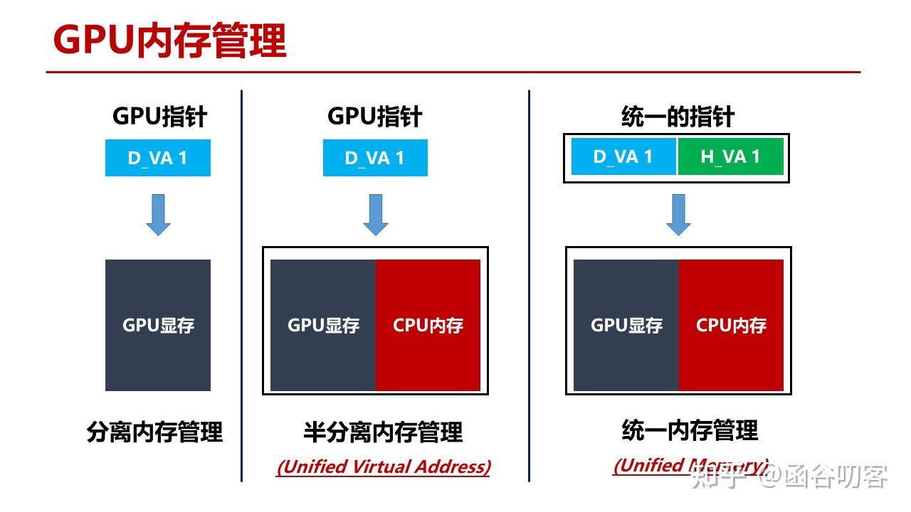

接下来我将分别详细介绍三种不同内存管理方式的区别以及部分实现细节。

### 分离内存管理

对于分离内存管理，其又可以分为两种，即锁页内存和零拷贝内存。在最原始的方式下，从主机内存拷贝数据到GPU，首先操作系统会分配一块用于数据中转的临时锁页内存，然后将用户缓冲区中的数据拷贝到锁页内存中，再通过PCIe DMA拷贝到GPU显存中。

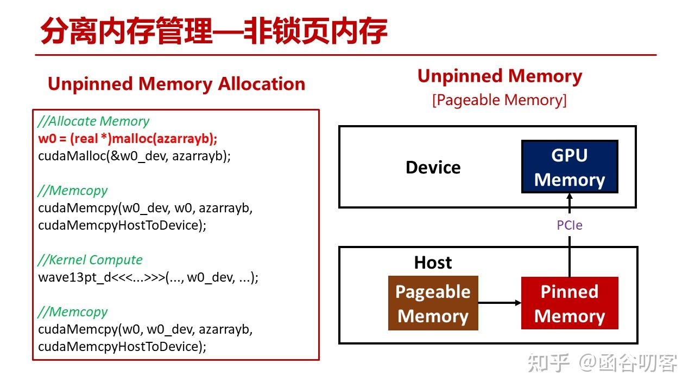

#### 锁页内存

而对于锁页内存，首先分配内存的API发生了变化，而且分配的区域将直接成为锁页内存区域，在向GPU显存进行拷贝时只需要进行一次PCIe DMA操作即可。

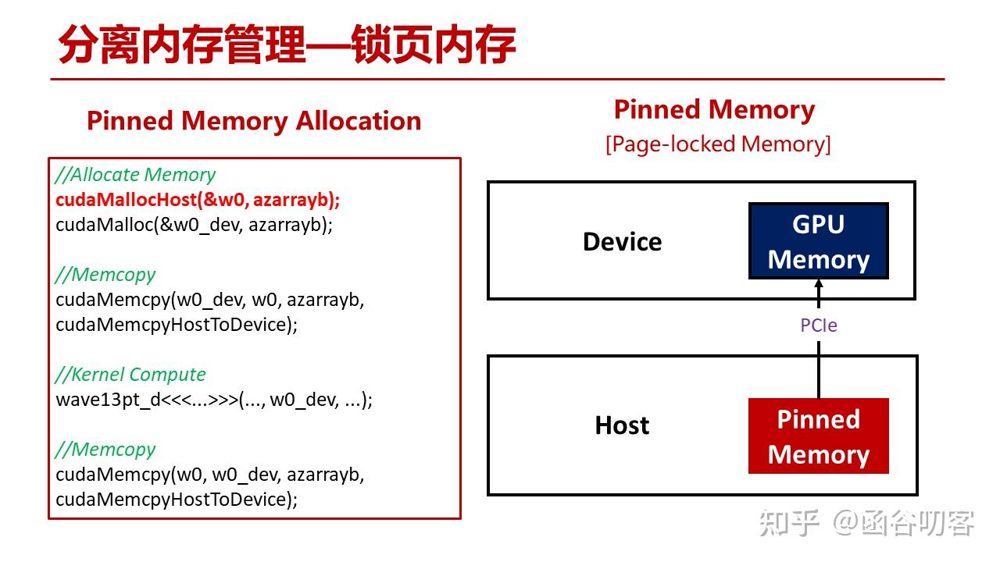

#### 零拷贝内存

进一步的，刚才看到GPU要使用CPU的数据是需要通过CudaMemcpy进行显式拷贝操作的，这种方式适合大批量的数据传递。**如果只是想更新某个标志位，可以使用零拷贝内存。所谓零拷贝，就是GPU寄存器堆直接与主机内存交互**。从代码里可以看到，将主机内存指针进行映射后，Kernel就可以直接使用指针来访问主机内存了，读取的数据会直接写入寄存器中。

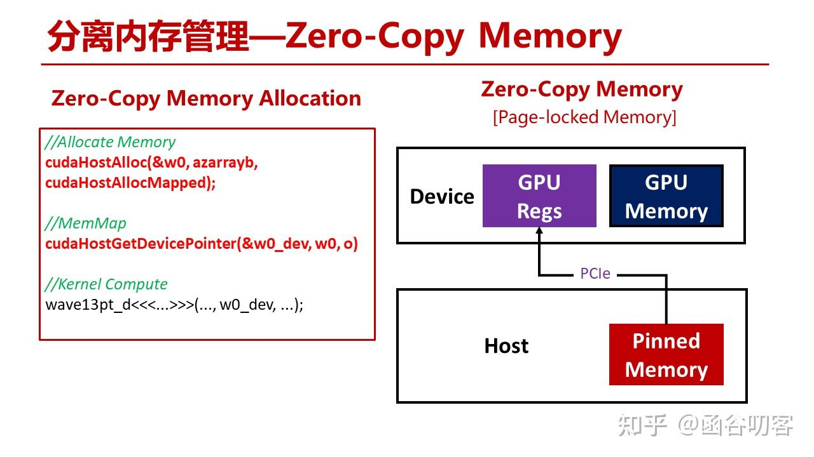

### 半分离内存管理——统一虚拟地址空间 UVA

在分离内存管理的基础上，Nvidia推出了半分离内存管理，也就是统一虚拟地址空间。

对于半分离内存管理，实际上也是语法糖，将原有的四个方向的拷贝函数合成了一个，用户调用统一的拷贝函数，由Cuda Runtime来判定数据源和目标所在的物理地址。

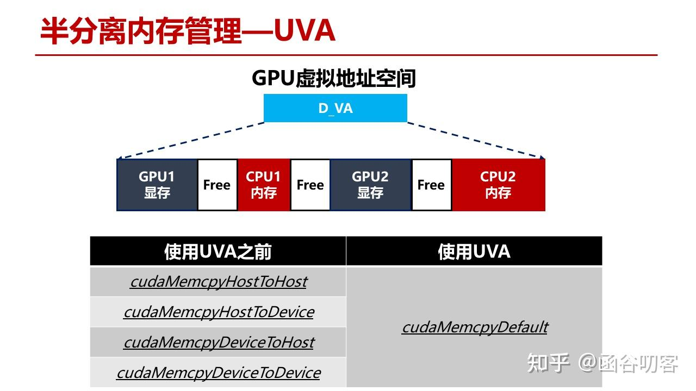


### 统一内存管理——UM

在UVA之后，Nvidia又创造性地提出了Unified Memory

统一内存管理机制。

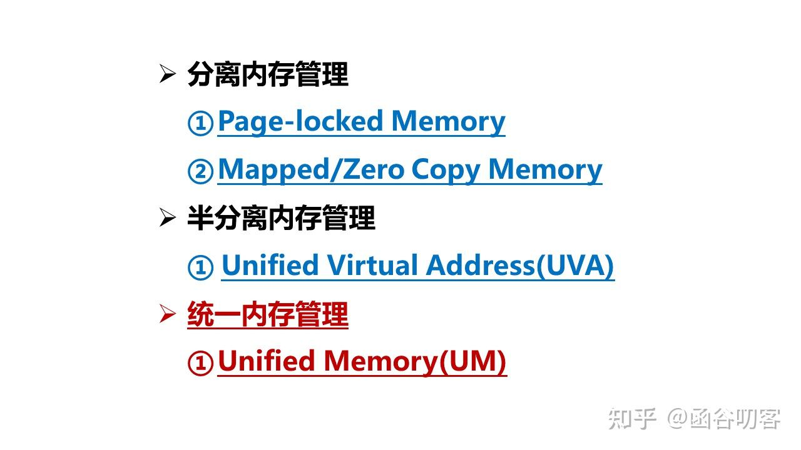

Unified Memory在Unified Virtual Address的基础上更进一步，将系统内的所有内存资源都整合到相同的虚拟地址空间中。不管是CPU还是GPU代码，不用再区分其指针指向的空间，这给用户编程提供了极大的便利性。

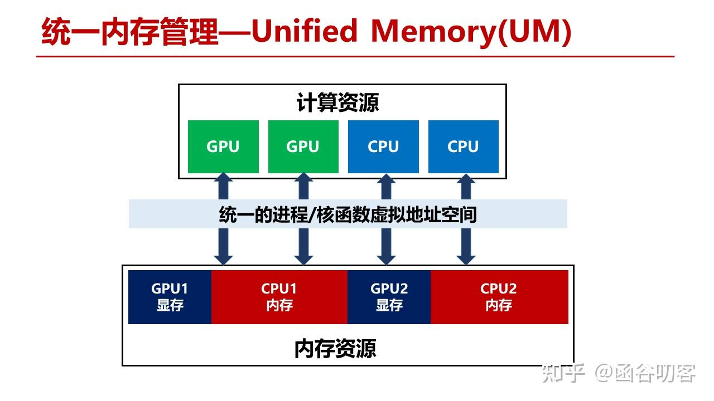

我们看两个例子，代码功能是在CPU上分配一段数据，CPU进行运算，将结果拷贝到GPU上运算，GPU运算结束再拷贝到CPU中，CPU再继续运算。如果使用Unified Memory，在分配完数据后，不需要进行显式数据拷贝，直接调用相关函数对其进行处理即可，在GPU处理完后需要执行一次同步。

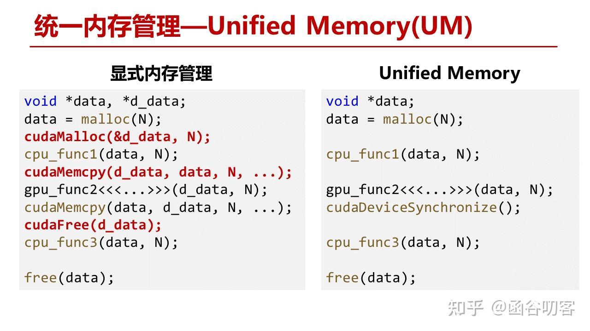

上面例子的优势还不明显，我们再看下一个例子。这是一个深拷贝操作，CPU分配一个二维数组，显式拷贝时，要对二维数组进行逐行拷贝。但使用Unified  Memory，Kernel就可以直接对数据进行操作。到这里我们看到了UM作为语法糖发挥的一些作用，看起来与UVA好像区别不大，都是GPU虚拟地址直接访问主机内存空间。但对于UVA，GPU访问主存是直接将数据搬到寄存器里的，不经过其显存，这也就意味着每次访问都至少要经过一次PCIe操作。UM在底层硬件实现上机制完全不同。

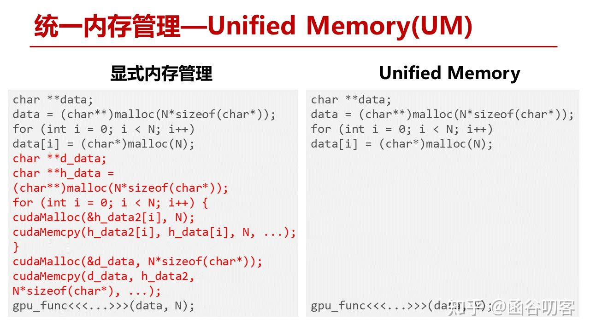

实际上，直到Pascal架构才算真正有了对UM的硬件上的支持。在Pascal架构之前，Kepler和Maxwell仅仅还是沿用了前面讲的CPU数据搬移到GPU寄存器中，只是在CUDA  Runtime中提供了对地址的判断。而在Pascal架构上，实现了对物理内存页的按需迁移，GPU和CPU的并发访问，内存超额配置等，以及在Volta架构上又进一步实现了访问计数器，GPU和CPU的Cache一致性等新特性。

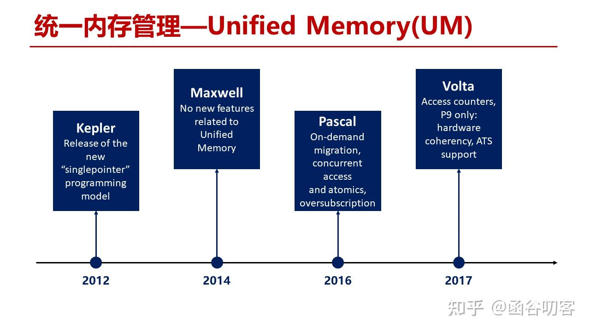

我们首先来看在Pascal架构之前UM的硬件工作方式。这段代码首先分配GPU显存，这时GPU的MMU会分配一段物理内存，然后构造页表项。

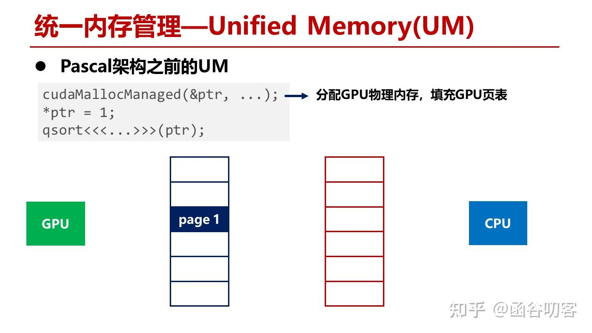

当CPU指针访问这段显存时，发生缺页异常，进行物理页迁移，将GPU的物理页迁移到CPU内存中，此时GPU的页表会进行释放。

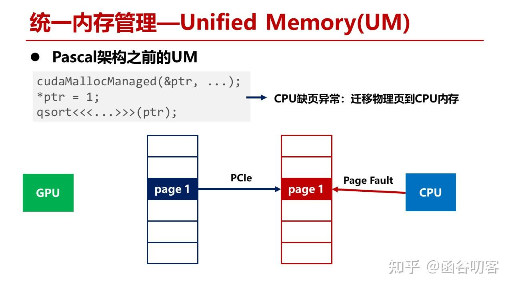

而当Kernel使用该地址时，会再次构造GPU页表项，将CPU内存页迁移到GPU上。

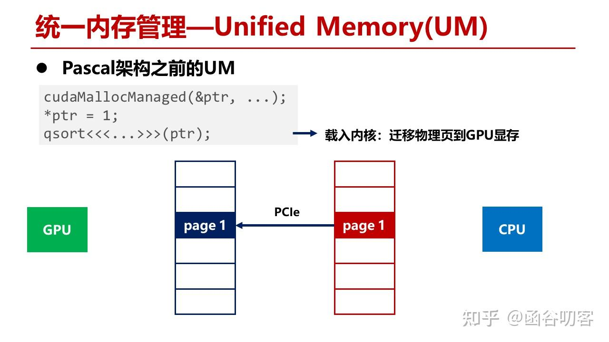

【Pascal之前的架构】在这种方式下，UM不能支持内存超额配置，也就是申请的内存数量不能超过GPU显存总量。同时也不支持按需页迁移，例如当GPU显存已经塞满时，如果要访问CPU内存，数据会直接进入GPU寄存器，而不会对显存进行置换，如果频繁访问CPU内存就会带来较大的开销。

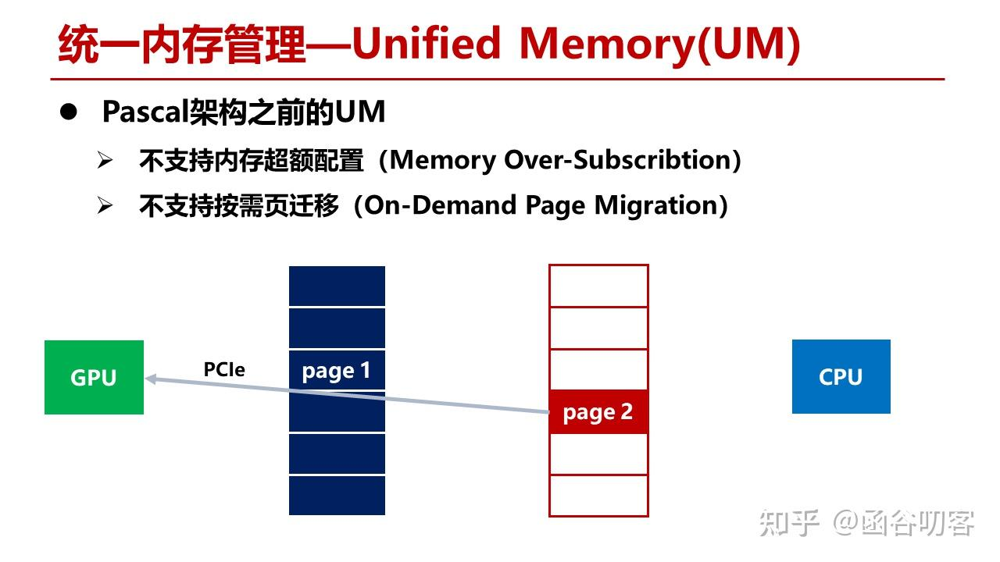

在Pascal之后的架构对GPU缺页异常提供了支持，在分配GPU内存时，只是分配了一个页表项，没有进行实际的显存分配。

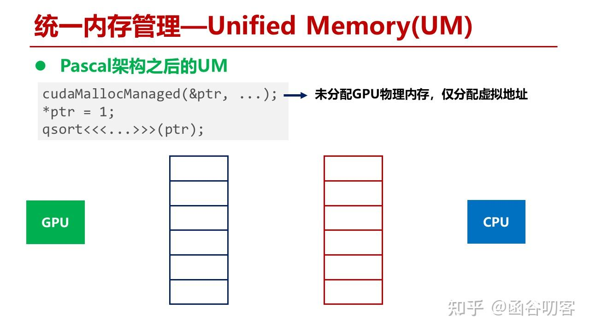

当CPU代码访问内存时，发生缺页异常，分配CPU物理内存页，创建CPU页表项。

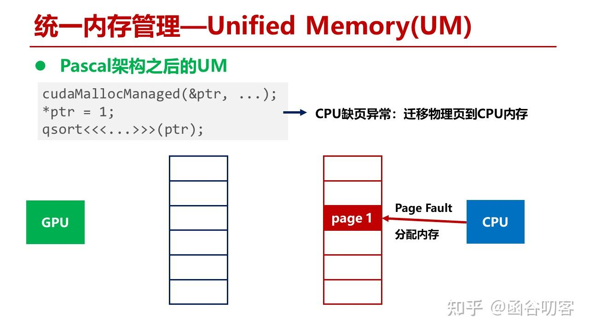

当GPU代码访问时，发生GPU缺页异常，CPU内存页通过PCIe被迁移到GPU显存中。

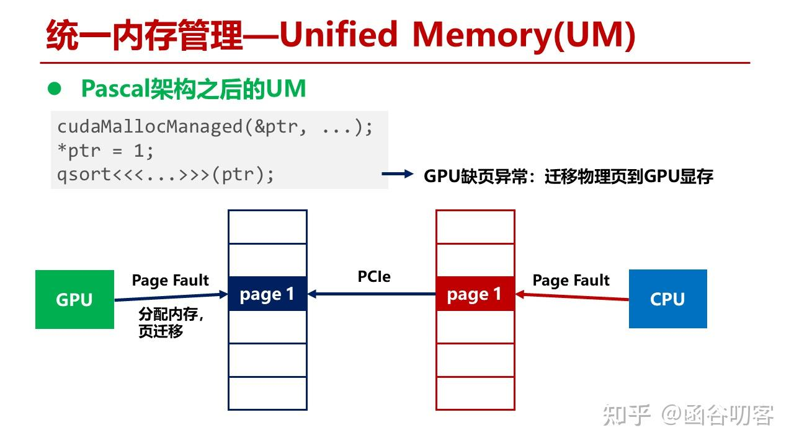

接下来我们看Pascal架构是怎么支持内存超额配置和按需页迁移的。在当前状态下，对于GPU和CPU虚拟地址空间，Page 1到Page 4指向了GPU显存，Page 5指向了CPU内存。当GPU访问Page 5时，发现GPU页表为空，出现缺页异常。

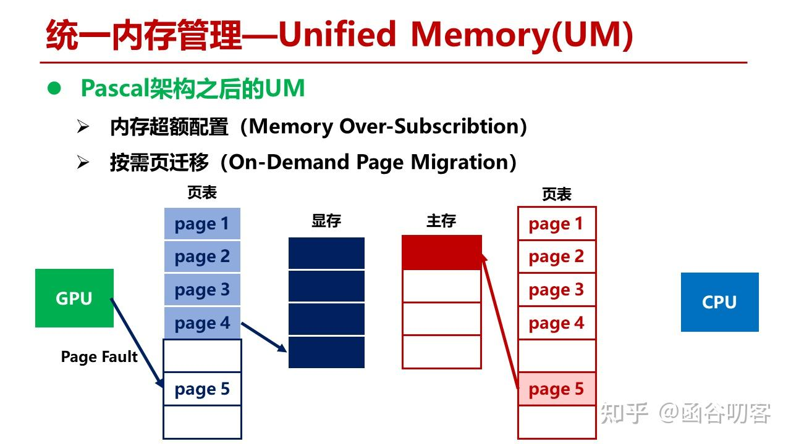

此时，GPU的MMU会在显存中选择一个物理页面迁移到CPU主存中，这里是Page 4，然后在CPU页表中建立Page 4到物理页面的映射。

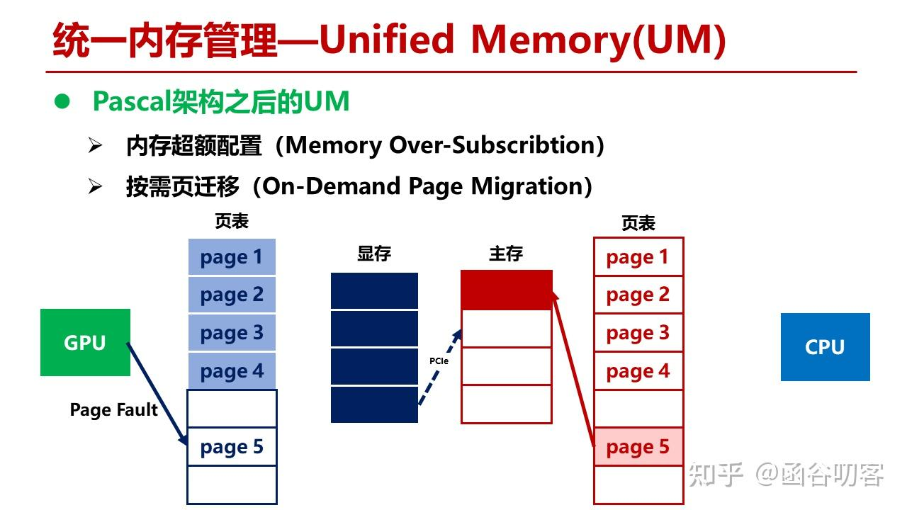

同时，CPU主存中的Page 5被迁移到GPU显存中，建立Page 5到物理页面的映射。

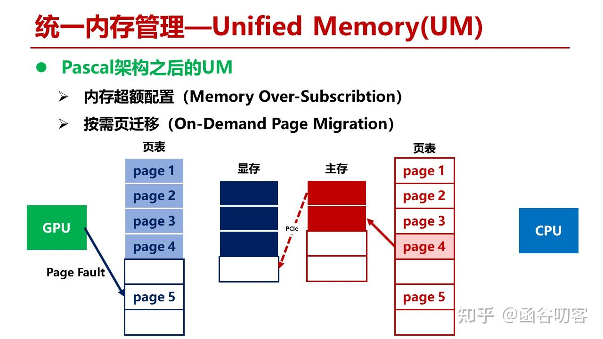

完成整个缺页异常的处理流程。

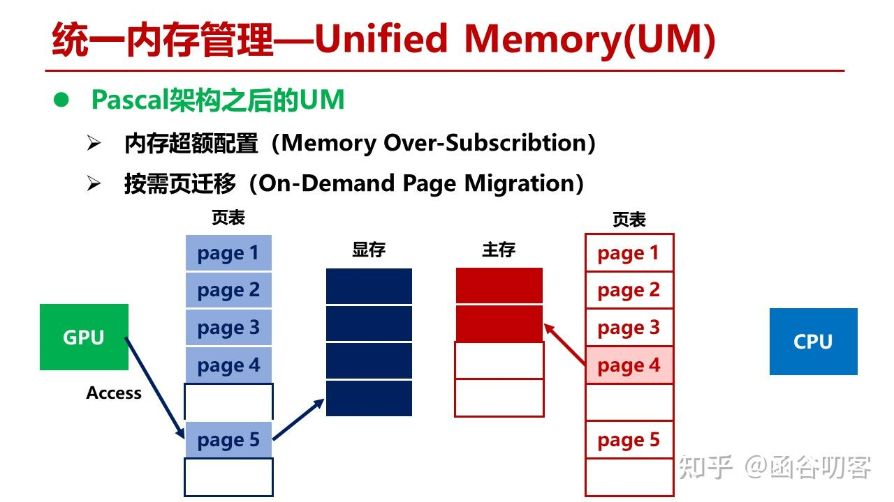

**上述示例只是给出了基本的按需页迁移的过程。UM还涉及到很多相关问题，比如Cache一致性问题，CPU和GPU对同一个数据的多次并发读写，导致页面来回迁移的问题等，以及冷热页面的替换算法问题等。**

Power系列对UM特性的支持更完备，一个主要原因是其支持GPU和Power 9直接通过NVLink进行互连，后面在Summit和SummitDev的评测中我们可以看到这种架构。

**需要注意的是，UM本质上还是一种语法糖，这些特性的支持也只是为了尽可能提升语法糖的性能**。由于这部分内容本身不是今天讨论的重点，所以点到为止。更详细的性能测评数据可以看相关参考文献。

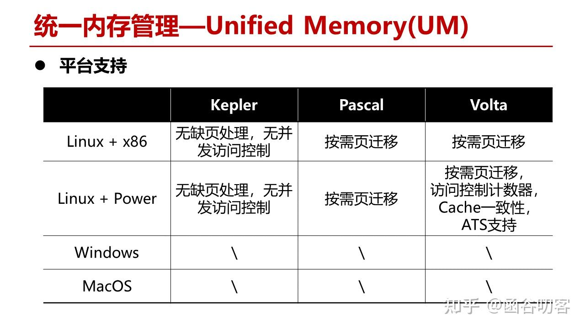

## GPUDirect 技术的演进

在2009年出现了GPUDirect  1.0技术，在1.0之前。GPU和CPU无法共享通信缓冲区，通信数据需要在内存中进行一次拷贝后，再发向网卡。**而1.0就是为了避免这种拷贝的，程序pin住一段内存后，既可以用作与GPU的数据交互， 又可以作为网卡的Memory Region使用。**

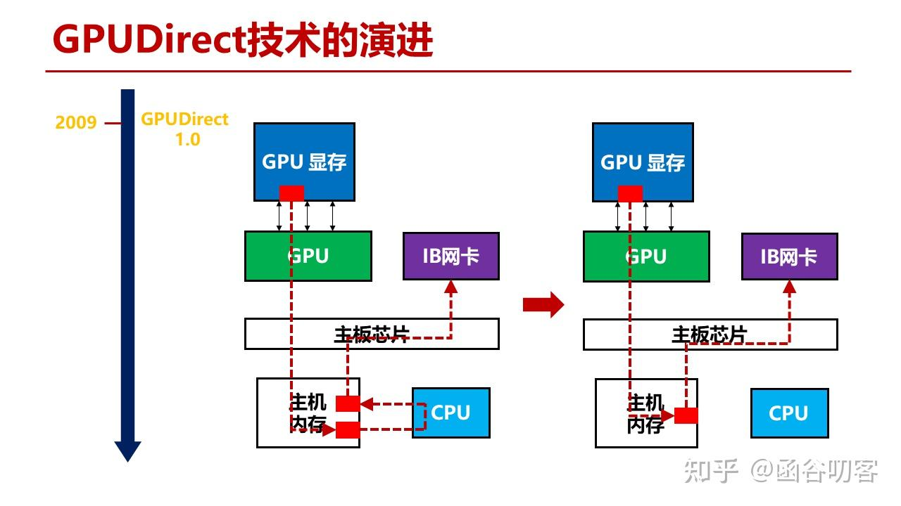

**第二代GPUDirect技术被称作GPUDirect P2P，重点解决的是节点内GPU通信问题**。两个GPU可以通过PCIe P2P直接进行数据搬移，避免了主机内存和CPU的参与。

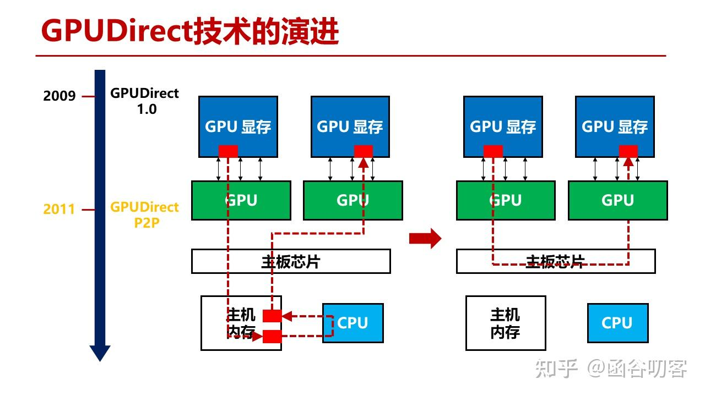

**而第三代GPUDirect技术就是我们所熟知的GPUDirect RDMA了，GPU和网卡可以直接通过PCIe进行数据交互，避免了跨节点通信过程中内存和CPU的参与。**

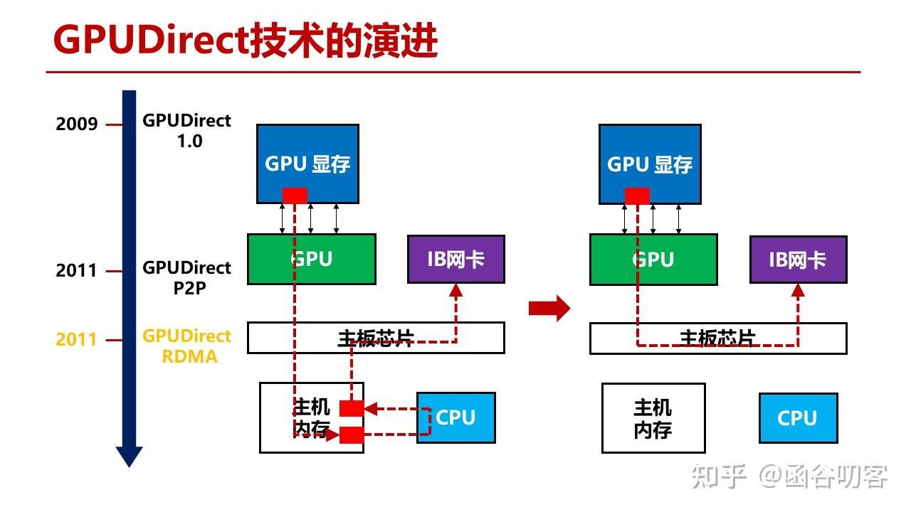

接下来我们将继续深入下去，探讨上述技术究竟如何落实。

## GPUDirect 技术的实现细节（三个关键问题）（核心章节）

在上述GPUDirect  RDMA的示意图中，我们只看到了GPU和网卡进行数据搬移，但是还有很多问题其实都被忽略掉了。那么，如果我们将上述通信过程细化，至少有三个关键问题需要解决：

**首先，为了实现CPU控制通信，数据进行P2P搬移，我们要解决网卡直接读写GPU显存的问题；其次，为了实现GPU直接控制通信，还有两个问题要解决。其一，GPU如何访问通信资源？其二，GPU如何提交通信请求并与网卡同步？**

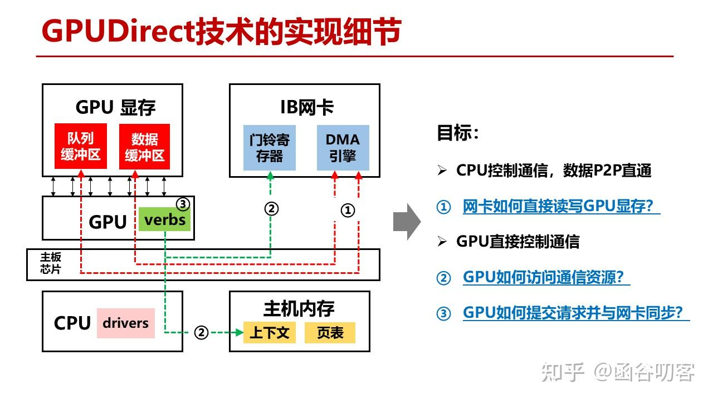

### 关键问题一：网卡如何直接读写GPU显存？(CPU控制通信)（原理一定要懂）

接下来我们将逐次解决上述问题。

首先，对于网卡读写GPU显存，我们不妨先回顾一下网卡是如何访问CPU内存的。对于用户进程而言， 其将一个虚拟地址传递给网卡驱动，通过注册内存区域获取物理页表项，然后将页表填入网卡的MTT表中。在这个过程中，内存中建立了页表项，同时，pin  memory的操作对每个物理内存页的元数据进行了修改，`对于网卡而言，其动作是进行虚拟地址到物理地址的转换，然后发起PCIe请求，至于物理地址映射到主机内存还是设备内存它并不关心。`因此，如果我们能够解决向网卡注册GPU虚拟地址的问题，就等价于解决了网卡读写GPU显存的问题。

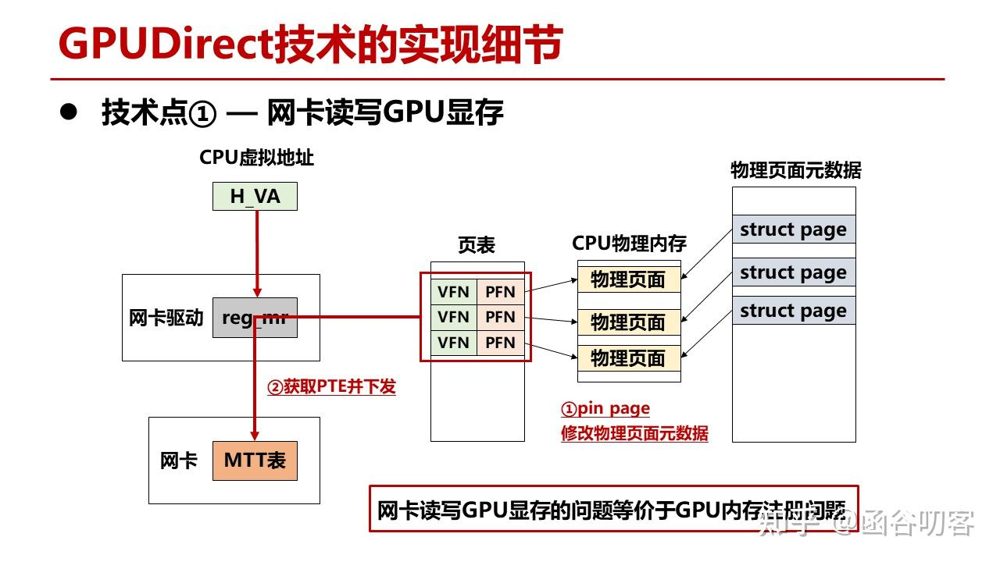

但是，当我们`直接使用一个GPU虚拟地址进行内存注册时，会得到一个Segmetation  Fault的错误。因为reg_mr注册时会陷入内核，通过调用get_user_pages获取物理页表，但对于GPU虚拟地址，CPU并不存在其对应的页表项`，自然会出现错误。为了实现GPU内存的注册，需要对驱动进行一定的修改。

DeepSeek补充上述名词的解释：

```shell
1.PFN（Page Frame Number，页帧号）
    定义：物理内存被划分为固定大小的页框（Frame），每个页框的唯一编号称为 PFN。
    作用：
        用于标识物理内存的存储单元，例如物理地址可表示为 PFN × 页大小 + 偏移量。
        操作系统通过 PFN 管理物理内存的分配和回收，如记录哪些页框空闲或被占用。
    关联技术：
        反向页表（Inverted Page Table）中直接通过 PFN 反向查找虚拟页号（VPN），减少页表空间占用。

2. VFN（Virtual Frame Number，虚拟帧号）
    定义：虚拟地址空间中逻辑页的编号，通常等同于 VPN（Virtual Page Number），表示进程视角的连续内存页。
    作用：
        在分页机制中，虚拟地址通过 VFN + 页内偏移 映射到物理地址。
        支持进程的独立地址空间，实现内存隔离与共享（如动态库的代码段）。
    特殊场景：
        在分段与分页结合的系统（如 x86）中，VFN 需通过分段机制转换为线性地址后再分页。

3. MTT 表（Memory Translation Table，内存转换表）
    定义：一种广义的地址映射表，可能指代以下具体结构之一：
        页表（Page Table）：存储 VFN → PFN 的映射关系，含访问权限、存在位等元数据。
        反向页表（Inverted Page Table）：以 PFN 为索引，存储对应 VFN 和进程 ID，节省空间但查找复杂。
        多级页表（Multi-Level Page Table）：如 x86-64 的四级页表，通过分层减少内存占用。
    关键功能：
        实现虚拟地址到物理地址的转换（MMU 硬件加速）。
        支持内存保护（如只读页）、页面置换（通过存在位）和内存共享。

三者的协作关系
    进程访问虚拟地址：虚拟地址分解为 VFN + 偏移量。
    查询 MTT 表：通过页表（MTT 的一种）查找 VFN 对应的 PFN。
    生成物理地址：物理地址 = PFN × 页大小 + 偏移量。
    硬件辅助：若页表缺失（Page Fault），触发异常由操作系统处理。

补充：其他相关概念
    TLB（Translation Lookaside Buffer）：缓存频繁访问的 VFN → PFN 映射，加速地址转换。
    页大小：通常为 4KB（x86）或 2MB/1GB（大页），影响 PFN/VFN 的计算方式。
    内存碎片：PFN 的非连续分配可能导致外部碎片，通过伙伴系统（Buddy System）优化。
```

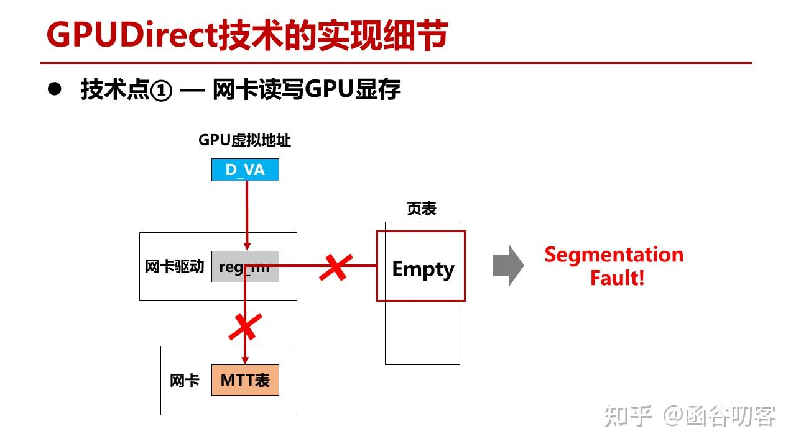

为了实现网卡对其它设备内存的注册，MLNX提供了一套标准的注册框架。所有的设备驱动需要向MLNX的设备管理模块进行注册，提供类似于操作系统get_user_pages的回调函数，当网卡驱动需要对一个地址进行注册时，会对地址进行判断，然后调用相应的函数获得设备指针，最终调用设备驱动中的物理页获取函数，得到设备内存的物理地址。

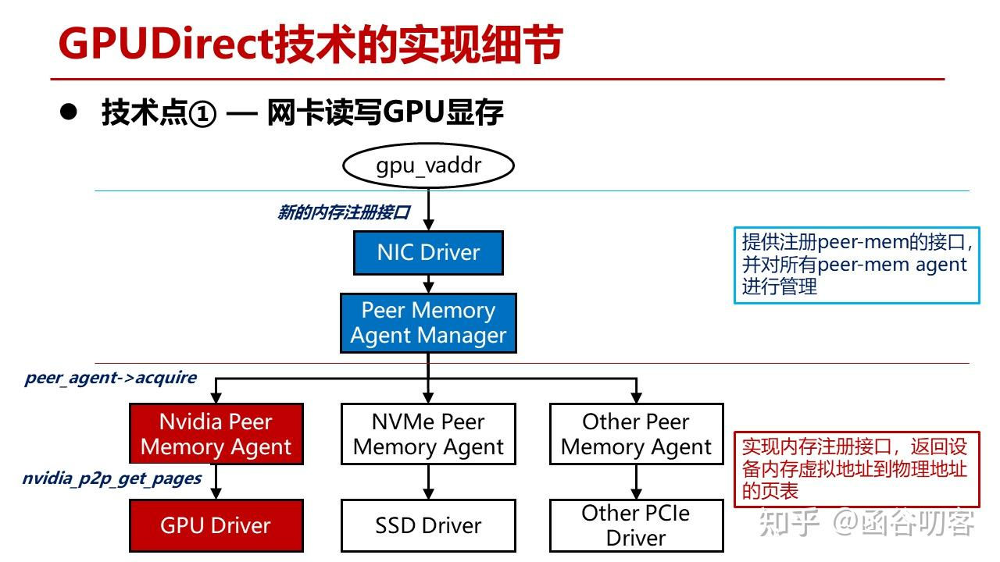

这张图是Nvidia提供的注册函数与MLNX驱动框架之间的对接，具体细节就不再详细阐述了。

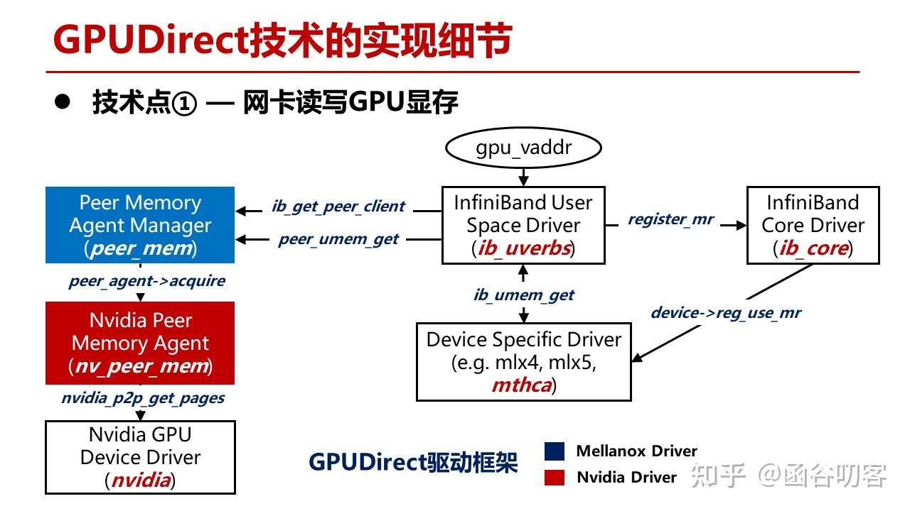

在新的注册框架下，通过内存注册，`GPU内存在BAR空间的地址被下发到网卡，当网卡使用这些地址读写GPU显存时，GPU内部的HSHUB再进行一次地址映射，将BAR空间地址映射为实际的显存页面`。这里有一个隐含的Trick，GPU的虚拟地址到物理地址也是分页寻址的。

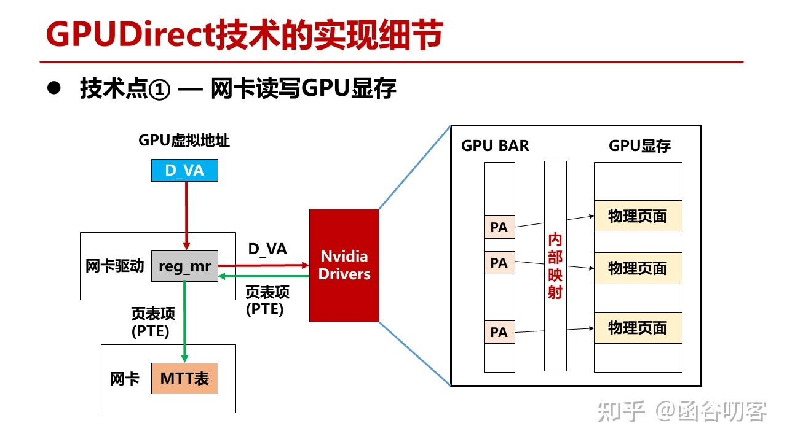

至此，网卡能够直接读写GPU显存了，这也就意味着我们已经实现了CPU控制的GPU通信，同时数据通过PCIe P2P进行传输。接下来我们重点考虑GPU直接控制的通信方式。

### 关键问题二：GPU如何访问通信资源（GPU 控制通信）

GPU控制通信其实就是GPU对通信资源进行相应的操作。为了解决这个问题，我们首先从一个比较宏观的角度来看CPU进行RDMA通信时包含哪些操作。从图中的分类可以看到，CPU在通信过程中，除了提交工作请求和同步，其它所有工作都在进行通信资源的创建和设置，而且都需要和内核进行交互。首先，GPU没有必要管理这些资源创建过程，其次，`GPU上的代码也没有办法直接跟主机操作系统进行交互。因此，唯一能够且有必要由GPU控制的流程就是提交工作请求和同步过程`。接下来我们重点考虑这一过程的实现。


#### 通信资源的划分

在提交工作请求中，涉及到的通信资源有哪些呢？

按照资源类型，可以分为上下文资源，队列资源和数据区域。

按照资源所处的位置，又可以分为位于设备内存和主机内存。

其中，部分资源是仅由网卡进行访问的，这部分资源可以留在主机内存中保持不变，例如队列基地址，通信序列号等。

另一部分资源是由CPU进行读写或临时创建的，因此需要详细考虑。

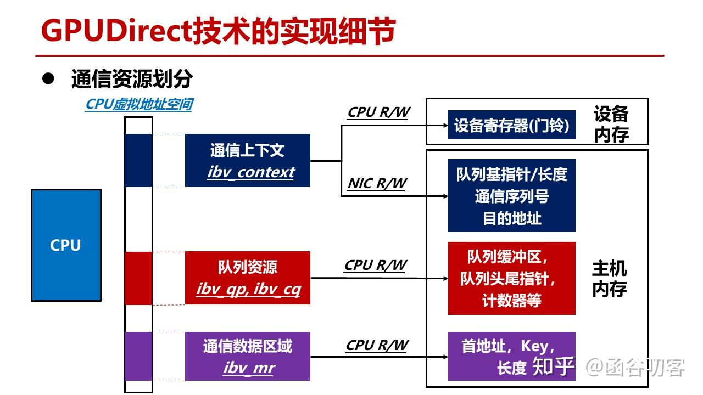

当我们迁移到GPU的场景下，我们发现，GPU要访问这些通信资源，至少要考虑两个问题：1.GPU如何访问网卡寄存器；2.GPU如何访问队列资源。

#### GPU如何访问网卡寄存器

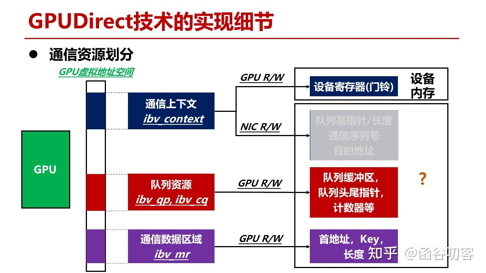

首先，门铃资源位于网卡，GPU要控制通信必然要涉及到写门铃，也就是GPU如何访问网卡寄存器的问题。

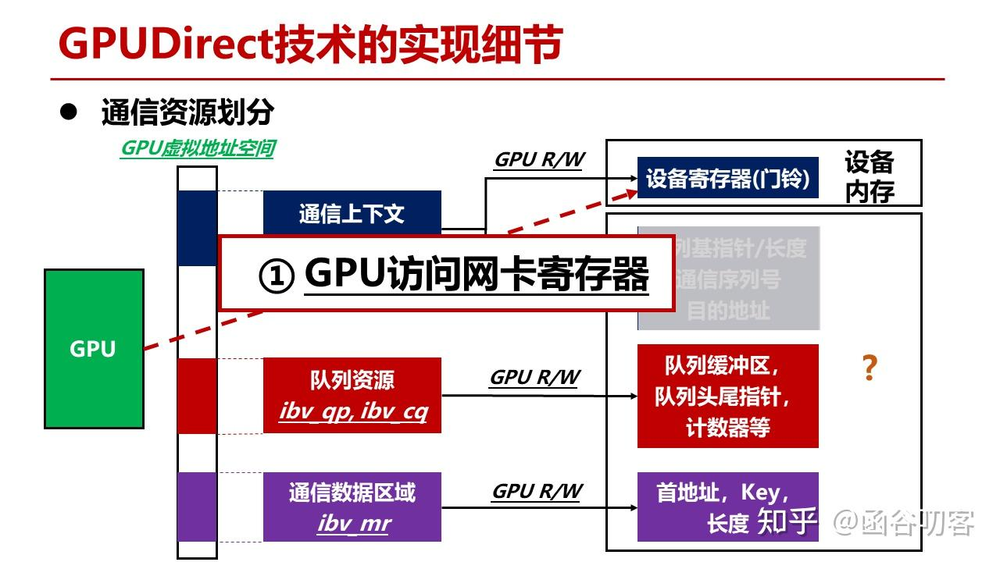

第二个问题在于，除了刚才提到的网卡要直接操作的资源，GPU控制的这些资源，可以放在主机内存，也可以放在显存中。

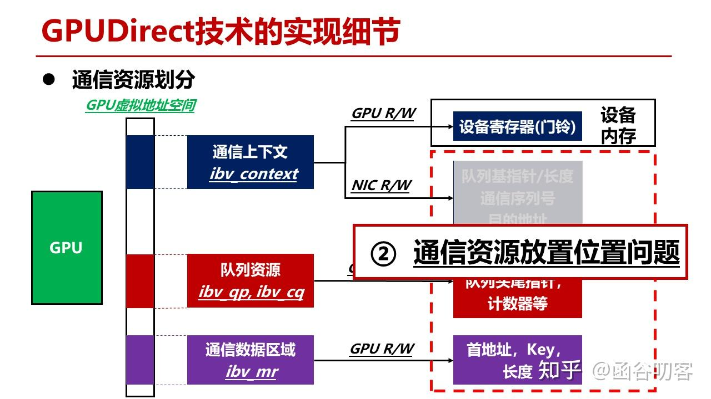

对于问题一，我们还是先参考CPU是如何访问网卡BAR空间的。`在CPU的页表中其实包含两种表项，一种表项指向实际的物理内存，表项的创建发生于出现缺页异常，另一种表项指向IO设备空间，由ioremap函数创建。通过ioremap，设备内存被映射到CPU的虚拟地址空间。`

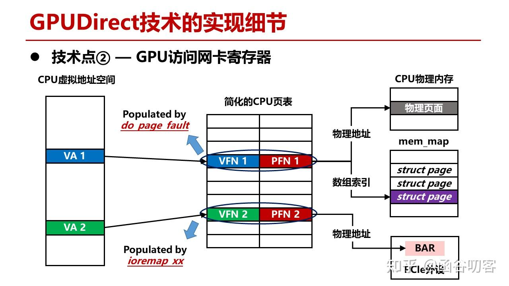

对于GPU而言，使用cudaHostMemRegister和cudaHostGetDevicePointer等函数可以建立GPU虚拟地址到CPU内存空间的映射，也就是在GPU中建立到主机内存的页表项。

> #### BAR 空间说明
>
> #### DeepSeek 解释
>
> BAR（Base Address Register，基址寄存器）是 **PCI/PCIe 设备** 与系统内存或 I/O 空间交互的核心机制，其定义的地址范围称为 **BAR 空间**。以下从功能、类型、配置与应用场景展开说明：
>
> **BAR 的核心作用**
>
> - 地址映射：PCI/PCIe 设备通过 BAR 向操作系统申请一段物理地址空间（内存或 I/O），用于 CPU 与设备的直接通信。
>
>   **示例**：显卡的显存（VRAM）通过 BAR 映射到系统物理内存，CPU 写入该区域的数据直接传输到显卡。
>
> - **资源隔离**：
>    每个设备的 BAR 空间独立分配，避免地址冲突，支持多设备协同工作。

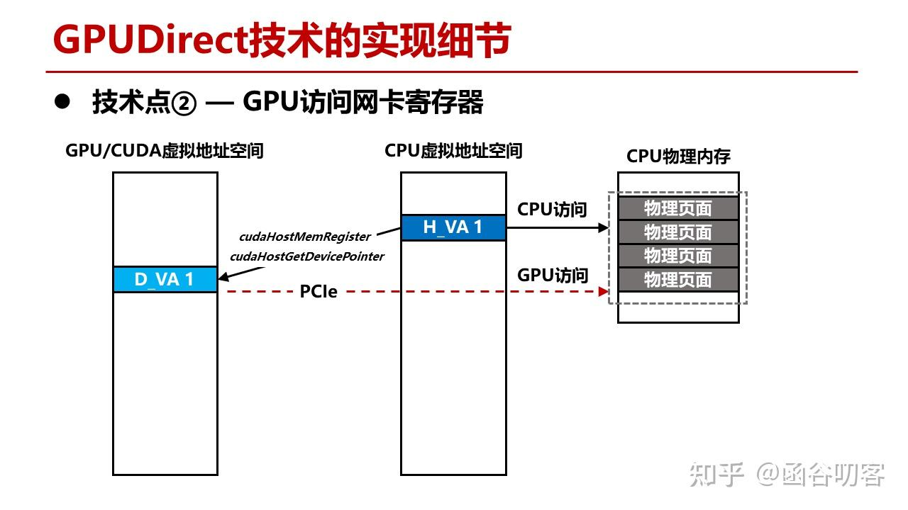

但在早期的CUDA版本中，如果使用ioremap映射后的地址进行注册，会引发段错误。

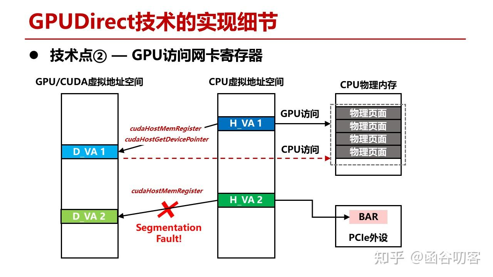

在CUDA 4.0之后该问题被修正，PCIe BAR空间能够直接映射到GPU虚拟地址空间。GPU访问门铃寄存器的问题得以解决。

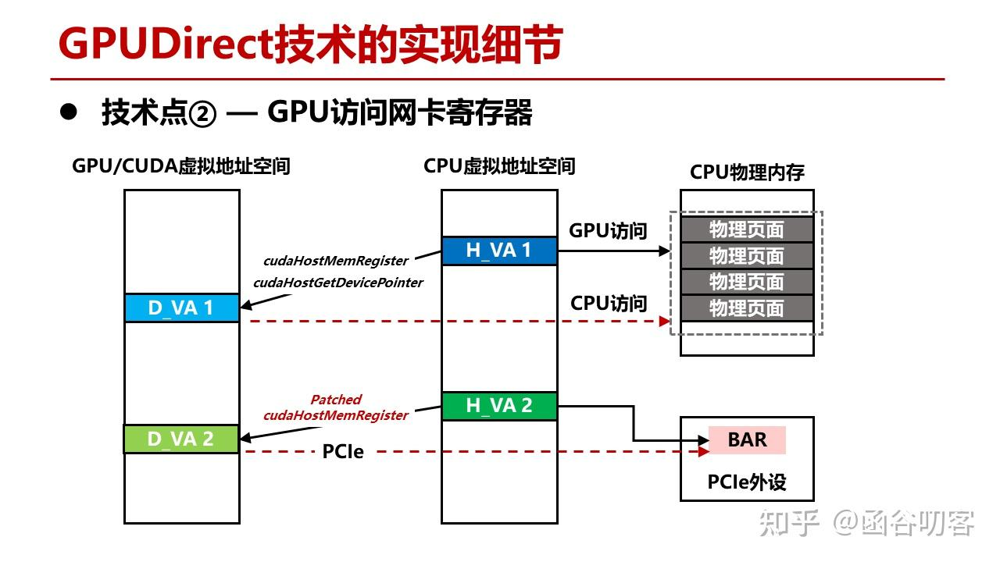

#### GPU如何访问队列资源

如何确保2在1之后完成？放在显存中显然可以加速对通信资源的访问，但如果通信连接较大，势必会消耗大量的显存资源，因此需要进行折衷考虑。

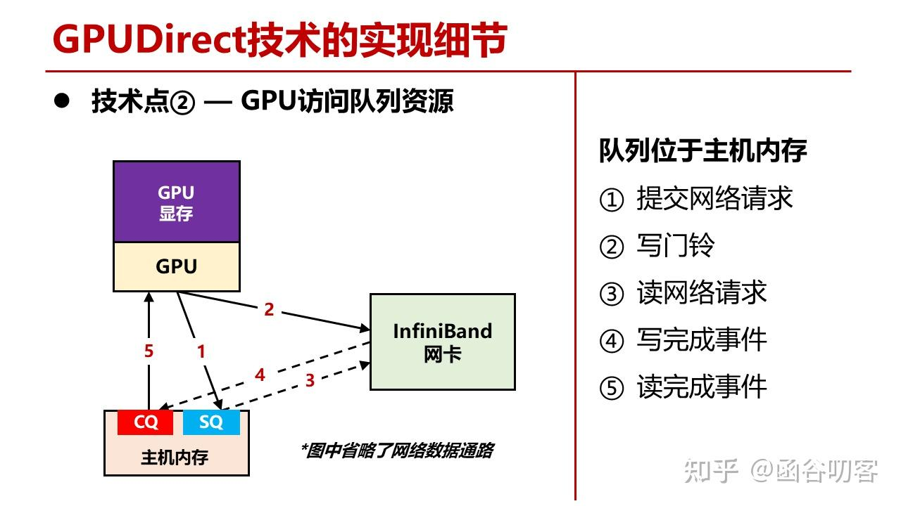

放在显存中显然可以加速对通信资源的访问，但如果通信连接较大，势必会消耗大量的显存资源，因此需要进行折衷考虑。后面的评测仅仅从通信性能上考量两种放置策略的差异。

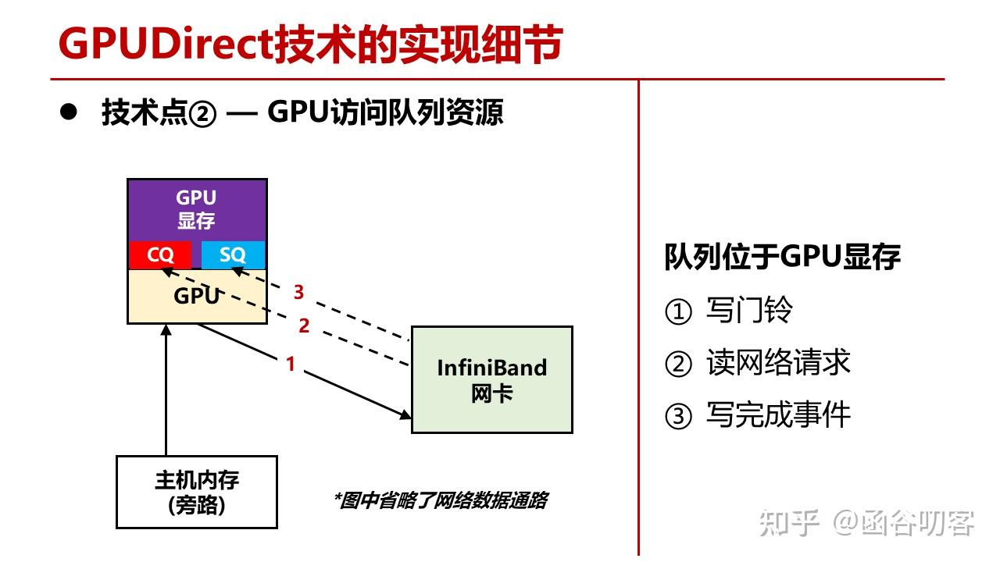

### 关键问题三：GPU如何提交通信请求并与网卡同步

最后一个问题就是GPU如何提交网络请求并与网卡进行同步。实际上有ibv_post_send，ibv_post_recv和ibv_poll_cq三个函数就可以了，因此，需要做的事情就是将libibverbs移植到GPU上执行。

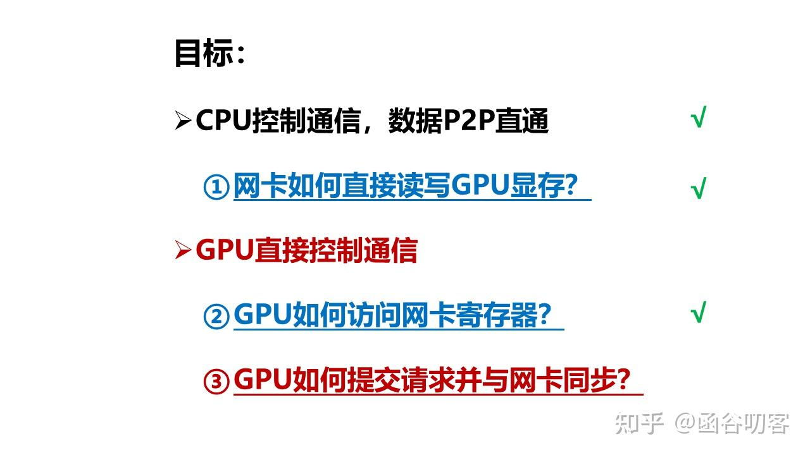

移植本身没有什么太大的难度，大部分libibverbs库的代码都可以直接在GPU上运行。至此，我们解决了全部GPU控制通信的问题。

## 总结 GPUDirect 技术的实现细节

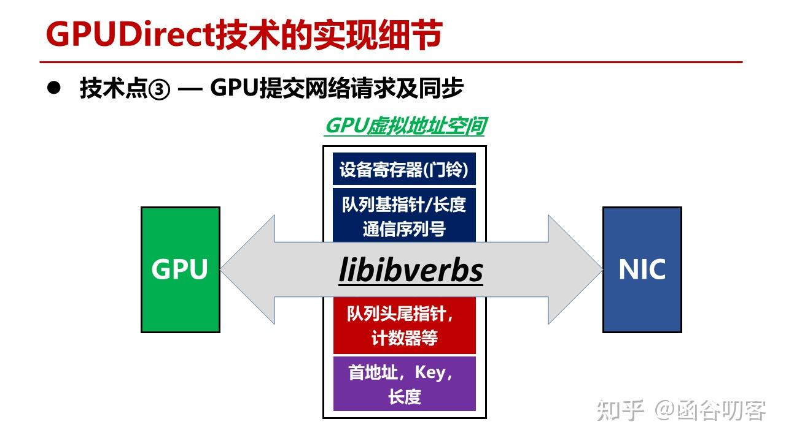


我们对整个过程做一个小结和回顾。首先，我们修改了Mellanox和Nvidia的内存注册部分，达到了网卡直接读写GPU显存的目的，实现了CPU控制的GPUDirect；接着，我们对通信资源进行划分，结合内存映射部分的修改，达到了GPU访问通信资源的目的，最后对libibverbs进行代码移植，最终实现了GPU控制的GPUDirect功能。在完成上述目标后，接下来要做的就是对GPUDirect进行优化，那么首先要对其进行详细的性能评测。

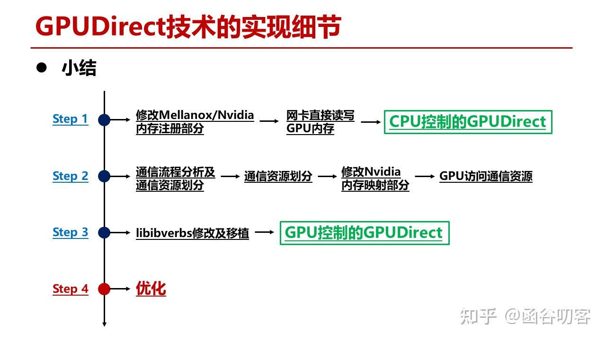

参考：https://zhuanlan.zhihu.com/p/430101220
