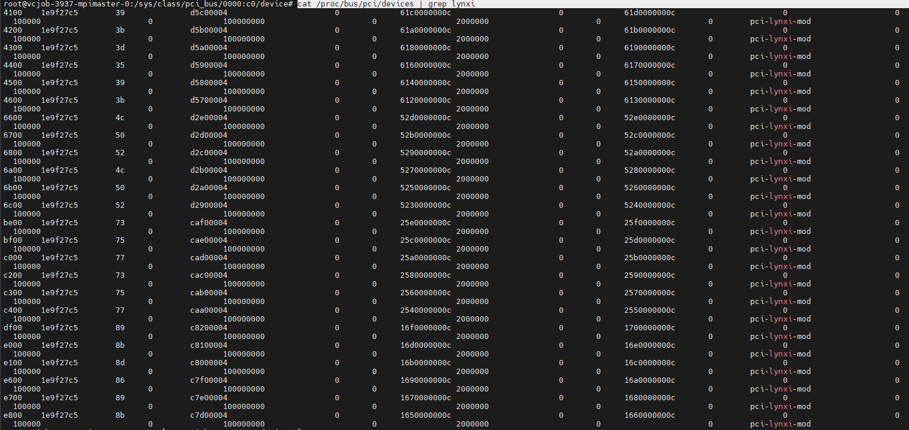

# RDMA 原理

## 基本概念

### 缩写

- Fabric：A local-area RDMA network is usually referred to as a fabric. 支持RDMA的局域网(LAN)

- CA：Channel Adapter。CA就是将系统连接到Fabric的硬件组件。**在IBTA阵营中，CA即HCA或TCA； 而在iWARP阵营中，CA就是RNIC**

- **NIC**：Network Interface Controller，网络接口控制器，也就是我们常说的**网卡**，插上网线并进行配置之后就可以接入网络了。

- HCA：Host Channel Adapte。它就是我们关注的重点，即支持RDMA技术的网卡。在Infiniband/RoCE规范中，将RDMA网卡称为HCA，全称为Host Channel Adapter，即主机通道适配器；而在iWARP协议族中，将RDMA网卡称为RNIC，全称为RDMA enabled Network Interface Controller，即支持RDMA的网络接口控制器。
- MR：Memory Registration/Region 内存注册/区域
- MW：Memory Window，内存窗口。属于MR的子集
- WQ(work queue) = RQ (receice queue)+ SQ（send queue）
- WR(work request) = RR(receive request) + SR（send request）
- CQ:完成队列，CQ中的单元叫CQE，传给上层的是WC(Work Completion)
- QPC：Queue Pair Context，用于存储QP相关属性
- CQC：Completion Queue Context

### 什么是 RDMA

#### 硬件结构


#### RDMA 特点

RDMA（Remote Direct Memory Access）指的是远程直接内存访问，这是一种通过网络在两个应用程序之间搬运缓冲区里的数据的方法。

- Remote：数据通过网络与远程机器间进行数据传输。
- Direct：没有内核的参与，有关发送传输的所有内容都卸载到网卡上。 
- Memory：在用户空间虚拟内存与网卡直接进行数据传输不涉及到系统内核，没有额外的数据移动和复制。
- Access：send、receive、read、write、atomic 等操作。

RDMA 与传统的网络接口不同，因为它绕过了操作系统内核。这使得实现了 RDMA 的程序具有如下特点：

- 绝对的最低时延
- 最高的吞吐量
- 最小的 CPU 足迹 （也就是说，需要 CPU 参与的地方被最小化）


如上图，在传统模式下，两台服务器上的应用之间传输数据，过程是这样的：

- 首先要把数据从应用缓存拷贝到Kernel中的TCP协议栈缓存；
- 然后再拷贝到驱动层；
- 最后拷贝到网卡缓存。

数据发送方需要将数据从用户空间 Buffer 复制到内核空间的 Socket Buffer；

数据发送方要在内核空间中添加数据包头，进行数据封装；

数据从内核空间的 Socket Buffer 复制到 NIC Buffer 进行网络传输；

数据接受方接收到从远程机器发送的数据包后，要将数据包从 NIC Buffer 中复制到内核空间的 Socket Buffer；

经过一系列的多层网络协议进行数据包的解析工作，解析后的数据从内核空间的 Socket Buffer 被复制到用户空间 Buffer；

这个时候再进行系统上下文切换，用户应用程序才被调用；


RDMA  将用户应用中的数据直接传入服务器的存储区，通过网络将数据从一个系统快速传输到远程系统的存储器中，消除了传输过程中多次数据复制和文本交换的操作，降低了 CPU  的负载。RDMA技术的原理及其与TCP/IP架构的对比如下图所示。

[](https://s3.51cto.com/oss/202103/07/3f700affd3a5452c14f19d45f86e83a3.jpg)


RDMA   技术实现了在网络传输过程中两个节点之间数据缓冲区数据的直接传递，在本节点可以直接将数据通过网络传送到远程节点的内存中，绕过操作系统内的多次内存拷贝，**相比于传统的网络传输，RDMA  无需操作系统和 TCP/IP 协议的介入，可以轻易的实现超低延时的数据处理、超高吞吐量传输，不需要远程节点 CPU   等资源的介入，不必因为数据的处理和迁移耗费过多的资源。**

### RDMA 技术优缺点

- CPU Offload：无需CPU干预，应用程序可以访问远程主机内存而不消耗远程主机中的任何CPU。远程主机内存能够被读取而不需要远程主机上的进程（或CPU)参与。远程主机的CPU的缓存(cache)不会被访问的内存内容所填充
- Kernel Bypass：RDMA 提供一个专有的 Verbs interface 而不是传统的TCP/IP Socket interface。应用程序可以直接在用户态执行数据传输，不需要在内核态与用户态之间做上下文切换
- Zero Copy：每个应用程序都能直接访问集群中的设备的虚拟内存，这意味着应用程序能够直接执行数据传输，在不涉及到网络软件栈的情况下，数据能够被直接发送到缓冲区或者能够直接从缓冲区里接收，而不需要被复制到网络层。
- 消息基于事务(Message based transactions) - 数据被处理为离散消息而不是流，消除了应用程序将流切割为不同消息/事务的需求。
- 支持分散/聚合条目(Scatter/gather entries support) - RDMA原生态支持分散/聚合。也就是说，读取多个内存缓冲区然后作为一个流发出去或者接收一个流然后写入到多个内存缓冲区里去。

缺点：

- rdma设计本身是为了高性能低延时，这个目标使得rdma对网络有苛刻的要求，就是网络不丢包，否则性能下降会很大，这对底层网络硬件提出更大的挑战，同时也限制了rdma的网络规模；相比而言，tcp对于网络丢包抖动的容忍度就大很多。可以认为，如果应用需要追求一定规模内的极限性能，则考虑rdma，如果应用追求的是更好的连接保证和丢包容忍，那tcp更合适。
- RDMA是通过硬件实现高带宽低时延，对CPU的负载很小。代价是硬件的使用和管理较为复杂，应用接口是全新的。不能说某个场景不适合使用，只能说收益可能没有那么大。

下面是 RDMA 整体框架架构图，从图中可以看出，RDMA 提供了一系列 Verbs 接口，可在应用程序用户空间，操作RDMA硬件。RDMA绕过内核直接从用户空间访问RDMA 网卡。RNIC(RDMA 网卡，RNIC（NIC=Network Interface Card ，网络接口卡、网卡，RNIC即 RDMA Network Interface Card）中包括 Cached Page Table Entry，用来将虚拟页面映射到相应的物理页面。


### 支持 RDMA 的网络协议 

RDMA 作为一种 host-offload，host-bypass 技术，使低延迟、高带宽的直接的内存到内存的数据通信成为了可能。目前支持 RDMA 的网络协议有： 

- InfiniBand（IB）：从一开始就支持 RDMA 的新一代网络协议。由于这是一种新的网络技术，因此需要支持该技术的网卡和交换机。 
- RDMA over Converged Ethernet（RoCE）：允许通过以太网执行 RDMA 的网络协议。这允许在标准以太网基础架构（交换机）上使用 RDMA，只不过网卡必须是支持 RoCE 的特殊的网卡【交换机可以是以太网，但网卡必须支持 RoCE】。  
- 互联网广域 RDMA 协议（iWARP）：即 Internet Wide Area RDMA Protocol，其实也就是 RDMA over  TCP，允许通过 TCP 执行 RDMA  的网络协议。这允许在标准以太网基础架构（交换机）上使用RDMA，只不过网卡要求是支持iWARP（如果使用 CPU offload  的话）的网卡。否则，所有 iWARP 栈都可以在软件中实现，但是失去了大部分的 RDMA 性能优势。

**需要注意的是，上述几种协议都需要专门的硬件（网卡）支持**

[详谈RDMA技术原理和三种实现方式](https://www.51cto.com/article/648715.html)


RoCE和iWARP，一个是基于无连接协议UDP，一个是基于面向连接的协议(如TCP)。RoCEv1只能局限在一个二层广播域内，而RoCEv2和iWARP都能够支持三层路由。相比RoCE，在大型组网的情况下，iWARP的大量TCP连接会占用大量的额内存资源，对系统规格要求更高。另外，RoCE支持组播，而iWARP还没有相关的标准定义。

#### RoCE适配器可以与其他适配器类型（例如iWARP）通信吗？

RoCE适配器只能与其他RoCE适配器通信，如果混合适配器类型配置的话，例如RoCE适配器与iWARP适配器组合，都可能会恢复为传统的TCP / IP连接。

[浅析RoCE网络技术](https://cloud.tencent.com/developer/article/1771431)

#### RoCE出现的背景

InfiniBand 架构获得了极好的性能，但是其不仅要求在服务器上安装专门的 InfiniBand 网卡，还需要专门的交换机硬件，成本十分昂贵。而在企业界大量部署的是以太网络，为了复用现有的以太网，同时获得 InfiniBand 强大的性能，IBTA 组织推出了 RoCE（RDMA over Converged Ethernet）。RoCE 支持在以太网上承载 IB 协议，实现 RDMA over Ethernet，这样一来，仅需要在服务器上安装支持 RoCE 的网卡，而在交换机和路由器仍然使用标准的以太网基础设施。

#### RoCE和IB网络层和链路层协议区别

RoCE协议存在RoCEv1 （RoCE）和RoCEv2 （RRoCE）两个版本，主要区别RoCEv1是基于以太网链路层（L2）实现的RDMA协议(交换机需要支持PFC等流控技术，在物理层保证可靠传输)，而RoCEv2是以太网TCP/IP协议中UDP层(L3)实现。

RoCEv1 在以太链路层之上用IB网络层代替了TCP/IP网络层，所以不支持IP路由功能。而v2使用了UDP+IP作为网络层，使得数据包也可以被路由。RoCEv1可以被认为是IB的“低成本解决方案”，将IB的报文封装成以太网包进行收发。由于RoCE v2可以使用以太网的交换设备，所以现在在企业中应用也比较多，但是相同场景下相比IB性能要有一些损失。


#### [RDMA 、InfiniBand、IBoE、RoCE、iWARP、IB卡、IB驱动的关系](https://blog.csdn.net/ljlfather/article/details/102930714)

1、RDMA 是一种技术（远程直接内存访问技术），如何实现这种技术呢？

2、实现这种技术你可以选择用 Infiniband 协议、也可以使用其他协议：roce、iwarp

支持Infiniband 协议 或 roce、iwarp 等RDMA协议的网卡，就叫RDMA网卡，当你在服务器上安装RDMA网卡之后，你还得安装RDMA驱动，才能使用RDMA网卡 。

在Infiniband/RoCE规范中，将RDMA网卡称为HCA，全称为Host Channel Adapter，即主机通道适配器；而在iWARP协议族中，将RDMA网卡称为RNIC，全称为RDMA enabled Network Interface Controller，即支持RDMA的网络接口控制器。

支持Infiniband 协议的网卡又称IB网卡，当你在服务器上安装了IB卡之后，你还得安装 IB驱动，才能使用 infiniband 。

3、如果使用 Infiniband 协议，这个协议作为一个新一代网络协议。它必须依靠专门的硬件才能实现。(专用INC（网卡）—— IB卡+专用交换机===>专用网络）。

**如果使用roce、iwarp，需要专用网卡，但不需要专用网络（RDMA会转成以太网协议，继续用以太网传输）**

### RoCEv1与RoCEv2性能的差异

DeepSeek：

1. **协议开销与带宽效率**

- RoCEv1（Layer 2）
  - 无IP/UDP头部，有效载荷占比更高。
  - 理论带宽损耗：仅以太网帧头（18字节），64B小包有效带宽利用率达 **89%**。
- RoCEv2（Layer 3）
  - 增加IPv4（20B）+ UDP（8B）头部，总开销46字节。
  - 64B小包有效带宽利用率降至 **72%**，但MTU=9000时差异可忽略。

2. 延迟敏感型场景表现

- 本地二层网络（无路由）
  - RoCEv1延迟 **1.1-1.3μs**，RoCEv2因协议栈处理增加至 **1.4-1.6μs**（NIC硬件Offload优化后差距缩小至0.2μs）。
- 跨子网路由（3跳）
  - RoCEv1无法支持，RoCEv2延迟约 **3.5μs**（依赖TSN交换机低抖动调度）

## [DPDK和RDMA的区别](https://zhuanlan.zhihu.com/p/617470551)

相同点：
1）两者均为kernel bypass技术，可以减少中断次数，消除内核态到用户态的内存拷贝；
相异点：
1）**DPDK是将协议栈上移到用户态，而RDMA是将协议栈下沉到网卡硬件**，DPDK仍然会消耗CPU资源；
2）DPDK的并发度取决于CPU核数，而RDMA的收包速率完全取决于网卡的硬件转发能力
3）**DPDK在低负荷场景下会造成CPU的无谓空转，RDMA不存在此问题**（没有中断，只有轮询）
4）DPDK用户可获得协议栈的控制权，可自主定制协议栈；RDMA则无法定制协议栈

DPDK是Intel主导，提供了基于用户态的数据链路层的功能，可以在上面构建出基于用户态的网络栈。实际使用中一个显然的缺点是只有poll功能，没有陷入中断来减少对CPU的消耗（空转问题）。

### 基于 OS 内核的数据传输的弊端

**1、中断处理。**当网络中大量数据包到来时，会产生频繁的硬件中断请求，这些硬件中断可以打断之前较低优先级的软中断或者系统调用的执行过程，如果这种打断频繁的话，将会产生较高的性能开销。

**2、内存拷贝。**正常情况下，一个网络数据包从网卡到应用程序需要经过如下的过程：数据从网卡通过 DMA 等方式传到内核开辟的缓冲区，然后从内核空间拷贝到用户态空间，在 Linux 内核协议栈中，这个耗时操作甚至占到了数据包整个处理流程的 57.1%。

**3、上下文切换。**频繁到达的硬件中断和软中断都可能随时抢占系统调用的运行，这会产生大量的上下文切换开销。另外，在基于多线程的服务器设计框架中，线程间的调度也会产生频繁的上下文切换开销，同样，锁竞争的耗能也是一个非常严重的问题。

**4、局部性失效。**如今主流的处理器都是多个核心的，这意味着一个数据包的处理可能跨多个 CPU 核心，比如一个数据包可能中断在 cpu0，内核态处理在 cpu1，用户态处理在 cpu2，这样跨多个核心，容易造成 CPU 缓存失效，造成局部性失效。如果是 [NUMA](https://zhida.zhihu.com/search?content_id=152855816&content_type=Article&match_order=1&q=NUMA&zhida_source=entity)

参考：https://zhuanlan.zhihu.com/p/291268086

### dpdk 相对传统基于 OS 内核的数据传输的改进

相对传统的基于内核的网络数据处理，dpdk 对从内核层到用户层的网络数据流程进行了重大突破，我们先看看传统的数据流程和 dpdk 中的网络流程有什么不同。

**传统 Linux 内核网络数据流程：**

Copy

```
硬件中断--->取包分发至内核线程--->软件中断--->内核线程在协议栈中处理包--->处理完毕通知用户层 用户层收包-->网络层--->逻辑层--->业务层 
```

**dpdk 网络数据流程：**

Copy

```
硬件中断--->放弃中断流程 用户层通过设备映射取包--->进入用户层协议栈--->逻辑层--->业务层 
```

下面就具体看看 dpdk 做了哪些突破？

**UIO （用户空间的 I/O 技术）的加持。**

dpdk 能够绕过内核协议栈，本质上是得益于 UIO 技术，通过 UIO 能够拦截中断，并重设中断回调行为，从而绕过内核协议栈后续的处理流程。

UIO 设备的实现机制其实是对用户空间暴露文件接口，比如当注册一个 UIO 设备 uioX，就会出现文件 /dev/uioX，对该文件的读写就是对设备内存的读写。除此之外，对设备的控制还可以通过 /sys/class/uio 下的各个文件的读写来完成。

**内存池技术**

dpdk 在用户空间实现了一套精巧的内存池技术，内核空间和用户空间的内存交互不进行拷贝，只做控制权转移。这样，当收发数据包时，就减少了内存拷贝的开销。

**大页内存管理**

dpdk 实现了一组大页内存分配、使用和释放的 API，上层应用可以很方便使用 API 申请使用大页内存，同时也兼容普通的内存申请。

**无锁环形队列**

dpdk 基于 Linux 内核的无锁环形缓冲 kfifo 实现了自己的一套无锁机制。支持单生产者入列/单消费者出列和多生产者入列/多消费者出列操作，在数据传输的时候，降低性能的同时还能保证数据的同步。

**poll-mode网卡驱动**

DPDK网卡驱动**完全抛弃中断模式，基于轮询方式收包，避免了中断开销**。

**NUMA **

dpdk 内存分配上通过 proc 提供的内存信息，使 CPU 核心尽量使用靠近其所在节点的内存，避免了跨 NUMA 节点远程访问内存的性能问题。

**CPU 亲和性**

dpdk 利用 CPU 的亲和性将一个线程或多个线程绑定到一个或多个 CPU 上，这样在线程执行过程中，就不会被随意调度，一方面减少了线程间的频繁切换带来的开销，另一方面避免了 CPU 缓存的局部失效性，增加了 CPU 缓存的命中率。

**多核调度框架**

dpdk 基于多核架构，一般会有主从核之分，主核负责完成各个模块的初始化，从核负责具体的业务处理。

参考：https://zhuanlan.zhihu.com/p/291268086

## [RDMA的编程模型更贴近硬件的实现](https://zhuanlan.zhihu.com/p/26082845081)


图中包含很多信息，我们一步步分析：

- RDMA中抽象出了Send Queue(SQ), Receive Queue(RQ), Complete Queue(CQ)来暴露给用户。用户想进行Send时，就往SQ中放一个叫做Send WQE(Work Queue Element)的元素；想进行Receive时，就往RQ中放一个叫做Recv WQE的元素。WQE中包含数据地址和长度等信息，网卡硬件收到后就可以进行数据收发。由于网络的传输是由硬件来做，此时CPU可以进行别的任务，因此整个过程是异步的。当网卡进行完收发操作后，就往Complete Queue(CQ)中放一个CQE元素，之后CPU通过查询CQ就能获取到完成信息。
- 其次，RDMA要和远端通信，那肯定也要像TCP一样建立连接，并维护和对端的连接信息（例如报文的序列号等）。这些信息都放到了QPC(Queue Pair Context)上了。**注意到QPC在RNIC上，说明硬件可以维护这些信息并组装包头，这就让硬件处理一部分软件协议栈的功能，实现了加速**。
- 之后，RDMA实现了零拷贝，即把用户态数据直接DMA到网卡的buffer并发送，避免了内核态的拷贝。这就需要用户先注册一部分用户的地址给网卡使用。但是用户态用的是虚拟地址，而网卡怎么通过虚拟地址对应到物理地址呢？**RNIC上维护了MTT(Memory Translation Table)，它类似于操作系统的页表，维护虚拟地址到物理地址的对应关系**。这样,RNIC就能找到对应的用户态地址并读取/写入了。具体把数据从内存到网卡的搬运，是使用了RNIC上的DMA Engine实现的。
- 最后，RNIC也需要维护收发报文相关的结构，例如Bacis NIC中的Receiving Buffer。上图中还有ORT, Reordering Buffer, Bitmap，这是因为这个图是论文中的图，而论文中这个RNIC可以在lossy network上工作，所以添加了一些用于保序和重传的数据结构。注意到这些结构是在RNIC上，而如果是内核协议栈的话，是放在内核中。所以这里也是硬件处理了一部分软件协议栈的功能。

## DoorBell

Doorbell是一种软件发起、硬件接收的通知机制。例如软件通过Doorbell告诉硬件：

- 开始做某事：例如软件准备好WQE时，通知硬件开始处理
- 已经做完某事：例如软件读取CQE后，通知硬件”我已经取走CQE“

Doorbell有两种实现机制：

- Doorbell寄存器。硬件提供的寄存器，来供软件读写。

- - 优点：实现简单，只需要软件读写寄存器地址
  - 缺点：读写寄存器行为会抢占总线；硬件需要立即响应，可能会打断硬件正在进行的工作（例如在DMA读取主机的内存），从而影响传输速率

- Doorbell record。使用主机的一段内存作为中介。软件和硬件都知道这段内存的地址。软件直接写这段内存，硬件在必要时读取该内存

- - 优点：软件通知时不需要抢总线
  - 缺点：实时性较差

可以把DB理解成软件通知硬件的方式。

## 拥塞控制

DCQCN

**RoCEv2**：

- 支持 **ECN（Explicit Congestion Notification）** 与 **DCQCN（Data Center Quantized Congestion Notification）**，可实现端到端拥塞感知。
- **扩展性优势**：通过IP路由支持数万节点互联，适合多云和跨数据中心场景

## SEND & RECV

**SEND & RECV 是双端操作，需要CPU的参与。**

WR全称为Work Request，意为工作请求；WC全称Work Completion，意为工作完成。这两者其实是WQE和CQE在用户层的“映射”。因为APP是通过调用协议栈接口来完成RDMA通信的，WQE和CQE本身并不对用户可见，是驱动中的概念。用户真正通过API下发的是WR，收到的是WC。

用户通过API把WR放到WQ上面就成了WQE，WQE被网卡执行完后生产WC。

WR/WC和WQE/CQE是相同的概念在不同层次的实体，他们都是“任务书”和“任务报告”。


**RDMA一共支持三种队列，发送队列(SQ)和接收队列(RQ)，完成队列(CQ)。其中，SQ和RQ通常成对创建，被称为Queue Pairs(QP)。**

RDMA是基于消息的传输协议，数据传输都是异步操作。 RDMA操作其实很简单，可以理解为：

- Host提交工作请求(WR)到工作队列(WQ): 工作队列包括发送队列(SQ)和接收队列(RQ)。工作队列的每一个元素叫做WQE, 也就是用户下发的WR。
- Host从完成队列(CQ）中获取工作(WQ)完成(WC，用户层面): 完成队列里的每一个叫做CQE, 也就是WC。
- 具有RDMA引擎的硬件(hardware)就是一个队列元素处理器。 RDMA硬件不断地从工作队列(WQ)中去取工作请求(WR)来执行，执行完了就给完成队列(CQ)中放置工作完成(WC)。

从生产者-消费者的角度理解就是：

- Host生产WR, 把WR放到WQ中去
- RDMA硬件消费WR
- RDMA硬件生产WC, 把WC放到CQ中去
- Host消费WC


接收端APP以WQE的形式下发一次接收任务。

- 接收端硬件从RQ中拿到任务书，准备接收数据（发送端并不知道发送的数据会放到哪里，每次发送数据，接收端都要提前准备好接收Buffer）。
- 发送端APP以WQE的形式下发一次SEND任务（步骤4）。
- 发送端硬件从SQ中拿到任务书，从内存中拿到待发送数据，组装数据包。（步骤5）
- 发送端网卡将数据包通过物理链路发送给接收端网卡（步骤6）。
- 接收端收到数据，进行校验后回复ACK报文给发送端（步骤7,8）。
- 接收端硬件将数据放到WQE中指定的位置，然后生成“任务报告”CQE，放置到CQ中。
- 接收端APP取得任务完成信息。
- 发送端网卡收到ACK后，生成CQE，放置到CQ中。
- 发送端APP取得任务完成信息。

至此，通过WQ和CQ这两种媒介，两端软硬件共同完成了一次收发过程。

通信的基本单元是QP，对于每一个Node，QP有唯一编号QPN。注意收发端的步骤未必是图中这个顺序，比如步骤 8->11->12 和 步骤 9->10的先后顺序就是不一定的。

更复杂一些的原理图如下：


## WRITE 和 READ

### WRITE

WRITE全称是RDMA WRITE操作，是本端主动写入远端内存的行为，**除了准备阶段，远端CPU不需要参与，也不感知何时有数据写入、数据在何时接收完毕**。所以这是一种单端操作。

本端在准备阶段通过数据交互，获取了对端某一片可用的内存的地址和“钥匙”，相当于获得了这片远端内存的读写权限。拿到权限之后，本端就可以像访问自己的内存一样直接对这一远端内存区域进行读写，这也是RDMA——远程直接地址访问的内涵所在。

WRITE/READ操作中的目的地址和钥匙是通过我们SEND-RECV操作来完成（拿到钥匙这个过程总归是要由远端内存的控制者CPU允许）。虽然准备工作比较复杂， 但是一旦完成准备工作，RDMA就可以发挥其优势，对大量数据进行读写。一旦远端的CPU把内存授权给本端使用，它便不再会参与数据收发的过程，这就解放了远端CPU，也降低了通信的时延。

【注意】本端是通过**虚拟地址**来读写远端内存的，上层应用可以非常方便的对其进行操作。实际的虚拟地址—物理地址的转换是由RDMA网卡完成的。

忽略准备阶段key和addr的获取过程，下面我们描述一次WRITE操作的流程，此后我们不再将本端称为“发送”和“接收”端，而是改为“请求”和“响应”端，这样对于描述WRITE和READ操作都更恰当一些，也不容易产生歧义。


- 请求端APP以WQE（WR）的形式下发一次WRITE任务。
- 请求端硬件从SQ中取出WQE，解析信息。
- 请求端网卡根据WQE中的虚拟地址，转换得到物理地址，然后从内存中拿到待发送数据，组装数据包。
- 请求端网卡将数据包通过物理链路发送给响应端网卡。
- 响应端收到数据包，解析目的虚拟地址，转换成本地物理地址，解析数据，将数据放置到指定内存区域。
- 响应端回复ACK报文给请求端。
- 请求端网卡收到ACK后，生成CQE，放置到CQ中。
- 请求端APP取得任务完成信息。

### READ

顾名思义，READ跟WRITE是相反的过程，是本端主动读取远端内存的行为。同WRITE一样，远端CPU不需要参与，也不感知数据在内存中被读取的过程。

获取key和虚拟地址的流程也跟WRITE没有区别，需要注意的是“读”这个动作所请求的数据，是在对端回复的报文中携带的。

下面描述一次READ操作的流程，注意跟WRITE只是方向和步骤顺序的差别。


- 请求端APP以WQE的形式下发一次READ任务。
- 请求端硬件从SQ中取出WQE，解析信息。
- 请求端网卡将READ请求包通过物理链路发送给响应端网卡。（相比于Write多了请求这一步，READ延迟比Write高一些）
- 响应端收到数据包，解析目的虚拟地址，转换成本地物理地址，解析数据，从指定内存区域取出数据。
- 响应端硬件将数据组装成回复数据包发送到物理链路。
- 请求端硬件收到数据包，解析提取出数据后放到READ WQE指定的内存区域中。
- 请求端网卡生成CQE，放置到CQ中。
- 请求端APP取得任务完成信息。

## 立即数的传输方式

1. **嵌入在 WQE 中**
    立即数（32 位值）会直接嵌入到工作队列条目（WQE）的 **立即数字段** 中。当发起 `RDMA_WRITE_WITH_IMM` 操作时，网卡（如 Mellanox ConnectX 系列）会从 WQE 中提取该值，并与真实数据一同发送至远端。
2. **与真实数据的关系**
   - **链路共用**：立即数和真实数据共用 **同一物理链路**（如 InfiniBand 或 RoCE 网络），但逻辑上属于不同的协议字段。
   - **分离处理**：真实数据通过 DMA 写入远端内存缓冲区，而立即数作为元数据由网卡单独解析，最终在远端完成队列（Completion Queue, CQ）中呈现。

实现细节与硬件行为

1. 发送端操作

   - 在调用 `ibv_post_send` 时，需设置 `opcode=IBV_WR_RDMA_WRITE_WITH_IMM`，并在 `imm_data` 字段填充 32 位立即数。

   - 示例代码片段：

     ```cpp
     struct ibv_send_wr wr = {
         .opcode = IBV_WR_RDMA_WRITE_WITH_IMM,
         .send_flags = IBV_SEND_SIGNALED,
         .imm_data = htonl(0x1234) // 填充立即数 
     };
     ```

2. 接收端处理

   - 远端需通过 **接收队列（Receive Queue, RQ）** 监听完成事件，立即数会附加在完成事件（`wc->imm_data`）中，而非写入数据缓冲区。
   - 接收端必须显式调用 `ibv_poll_cq` 获取完成事件，并通过 `wc->imm_data` 字段提取立即数。

与普通 RDMA Write 的差异

| **特性**       | **RDMA_WRITE_WITH_IMM**          | **普通 RDMA Write** |
| -------------- | -------------------------------- | ------------------- |
| **数据传输**   | 数据通过 DMA 写入远端内存缓冲区  | 同左                |
| **立即数传递** | 立即数嵌入 WQE，由完成事件传递   | 不支持              |
| **接收端要求** | 需监听完成队列并处理 `imm_data`  | 无需特殊处理        |
| **适用场景**   | 需携带元数据（如校验和、状态码） | 纯数据传输          |

底层链路交互

1. 协议层分离
   - 真实数据通过 **数据平面** 传输（如 DMA 写入远端内存）。
   - 立即数通过 **控制平面** 传递（嵌入在 WQE 描述符中）。
2. **硬件优化**
    网卡会在发送数据包时，将立即数附加到协议头部（如 InfiniBand 的 Base Transport Header），无需额外内存访问。

注意事项

1. 兼容性
   - 立即数功能依赖硬件支持（如 Mellanox ConnectX-5 及以上）。
   - iWARP 协议不支持 `RDMA_WRITE_WITH_IMM`，需改用 `RDMA Write + Send` 组合实现类似功能。
2. 性能影响
   - 立即数传输几乎无额外延迟，但需确保接收端及时处理完成队列，避免堆积。

通过以上机制，`RDMA_WRITE_WITH_IMM` 实现了数据与元数据的高效协同传输，适用于需要低延迟状态同步的场景（如分布式事务、流控制等）

## 连接

**IBA支持基于连接和数据报的服务**。对于基于连接的服务来说，每个QP都和另一个远端节点相关联。在这种情况下，QP Context中包含有远端节点的QP信息。在建立通信的过程中，两个节点会交换包括稍后用于通信的QP在内的对端信息。

QP Context（简称QPC）可以简单理解为是记录一个QP相关信息的表格。我们知道QP是两个队列，除了这两个队列之外，我们还需要把关于QP的信息记录到一张表里面，这些信息可能包括队列的深度，队列的编号等等。

### 连接阶段获取的对端信息

本端是无法直接获得对端基本信息的，所以需要通过某些方式，让两端建立通信交换基本信息。有两种方式：TCP/IP和RDMA CM


以socket交换方式为例，双方约定好消息格式，将需要传递的信息通过socket交换就好了。图中LID是本端RDMA适配器激活后分配的ID，在本端唯一，而PSN是本端发送到对端第一个数据包序号，可以随机指定。信息交换完毕后即可关闭上述socket连接。

至此，目的集合已经准备好，有raddr、rkey、rGID、rQPN，加r表示远端（对端）的意思。万事具备只欠东风。

### 基于连接


A、B和A、C节点的网卡在物理上是连接在一起的，A上面的QP2和B上面的QP7、A上面的QP4和B上面的QP2建立了逻辑上的连接，或者说“绑定到了一起”。在连接服务类型中的每个QP，都和唯一的另一个QP建立了连接，也就是说QP下发的每个WQE的目的地都是唯一的。拿上图来说，对于A的QP2下发的每个WQE，硬件都可以通过QPC得知其目的为B的QP7，就会把组装好的数据包发送给B，然后B会根据QP7下发的RQ WQE来存放数据；同理，对于A的QP4下发的每个WQE，A的硬件都知道应该把数据发给Node C的QP2。
**“连接”其实就是在QPC里面的一个记录而已。如果A的QP2想断开与B的QP7的“连接”然后与其他QP相“连接”，只需要修改QPC就可以了。**两个节点在建立连接的过程中，会交换稍后用于数据交互的QP Number，然后分别记录在QPC中。

### 基于数据报

与连接相反，发端和收端间不需要“建立管道”的步骤，只要发端到收端物理上是可以到达的，那么我就可能从任何路径发给任意的收端节点。

“对于数据报服务来说，QP不会跟一个唯一的远端节点绑定，而是通过WQE来指定目的节点。和连接类型的服务一样，建立通信的过程也需要两端交换对端信息，但是数据报服务对于每个目的节点都需要执行一次这个交换过程。”


在数据报类型的QP的Context中，不包含对端信息，即每个QP不跟另一个QP绑定。QP下发给硬件的每个WQE都可能指向不同的目的地。

比如节点A的QP2下发的第一个WQE，指示给节点C的QP2发数据；而下一个WQE，可以指示硬件发给节点B的QP7。

**与连接服务类型一样，本端QP可以和哪个对端QP发送数据，是在准备阶段提前通过某些方式相互告知的**。这也是上文“数据报服务对于每个目的节点都需要执行一次这个交换过程”的含义。

### 服务类型

上面介绍的两个维度两两组合就形成了IB的四种基本服务类型：


RC和UD是应用最多也是最基础的两种服务类型，我们可以将他们分别类比成TCP/IP协议栈传输层的TCP和UDP。

### 资源消耗

RC用于对数据完整性和可靠性要求较高的场景，更TCP一样，因为需要各种机制来保证可靠，所以开销自然会大一些。另外由于RC服务类型和每个节点间需要各自维护一个QP，假设有N个节点需要相互通信，那么需要N * (N - 1)个QP，而QP和QPC本身是需要占用网卡资源或者内存的，当节点数很多时，存储资源消耗将会非常大。


UD硬件开销小并且节省存储资源，比如N个节点需要相互通信，只需要创建**N**个QP就可以了，但是可靠性跟UDP一样没法保证。


## 内存注册

MR全称为Memory Region，指的是由RDMA软件层在内存中规划出的一片区域，用于存放收发的数据。只能通过RDMA api 申请。

A节点想要通过IB协议向B节点的内存中写入一段数据，上层应用给本节点的RDMA网卡下发了一个WQE，WQE中包含了源内存地址、目的内存地址、数据长度和秘钥等信息，然后硬件会从内存中取出数据，组包发送到对端网卡。B节点的网卡收到数据后，解析到其中的目的内存地址，把数据写入到本节点的内存中。

APP在WQE中提供的地址是虚拟地址（Virtual Address，VA），经过MMU(Memory Management Unit，内存管理单元)的转换才能得到真实的物理地址（Physical Address，PA），我们的RDMA网卡是如何得到PA从而去内存中拿到数据的呢？就算网卡知道上哪去取数据，如果用户恶意指定了一个非法的VA，那网卡岂不是有可能被“指使”去读写关键内存？

为了解决上面的问题，IB协议提出了MR的概念。

因为HCA访问的内存地址来自于用户，如果用户传入了一个非法的地址（比如系统内存或者其他进程使用的内存），HCA对其进行读写可能造成信息泄露或者内存覆盖。所以我们需要一种机制来确保HCA只能访问已被授权的、安全的内存地址。IB协议中，APP在为数据交互做准备的阶段，需要执行注册MR的动作。

而用户注册MR的动作会产生两个钥匙——L_KEY（Local Key）和R_KEY（Remote Key），说是钥匙，它们的实体其实就是一串序列而已。它们将分别用于保障对于本端和远端内存区域的访问权限。下面两张图分别是描述L_Key和R_Key的作用的示意图：


**总结设计MR的目的**：

- 进行虚拟地址到物理地址的转换：使用RDMA是为了可以在应用程序中通过虚拟地址 VA 直接读写远端的内存，而网卡自身是缺乏直接将VA转化为PA的能力的。

- 控制访问权限

- 避免换页（Pin页）

  物理内存是有限的，所以操作系统通过换页机制来暂时把某个进程不用的内存内容保存到硬盘中。当该进程需要使用时，再通过缺页中断把硬盘中的内容搬移回内存，这一过程几乎必然导致VA-PA的映射关系发生改变。

  由于HCA经常会绕过CPU对用户提供的VA所指向的物理内存区域进行读写，如果前后的VA-PA映射关系发生改变，那么我们在前文提到的VA->PA映射表将失去意义，HCA将无法找到正确的物理地址。

  为了防止换页所导致的VA-PA映射关系发生改变，注册MR时会"Pin"住这块内存（亦称“锁页”），即锁定VA-PA的映射关系。也就是说，MR这块内存区域会长期存在于物理内存中不被换页，直到完成通信之后，用户主动注销这片MR。

## Protection Domain

在RDMA中，PD像是一个容纳了各种资源（QP、MR等）的“容器”，将这些资源纳入自己的保护范围内，避免他们被未经授权的访问。一个节点中可以定义多个保护域，各个PD所容纳的资源彼此隔离，无法一起使用。

一个用户可能创建多个QP和多个MR，每个QP可能和不同的远端QP建立了连接，比如下图这样（灰色箭头表示QP间的连接关系），这是没有PD概念的RDMA资源。


由于MR和QP之间并没有绑定关系，这就意味着一旦某个远端的QP与本端的一个QP建立了连接，具备了通信的条件，那么理论上远端节点只要知道VA和R_key（甚至可以靠不断的猜测直到得到一对有效的值），就可以访问本端节点某个MR的内容。

其实一般情况下，MR的虚拟地址VA和秘钥R_Key是很难猜到的，已经可以保证一定的安全性了。但是为了更好的保护内存中的数据，把各种资源的权限做进一步的隔离和划分，我们在又在每个节点中定义了PD，如下图所示：


图中Node 0上有两个PD，将3个QP和2个MR分为了两组，此外Node 1和Node 2中各有一个PD包含了所有QP和MR。Node 0上的两个PD中的资源不可以一起使用，也就是说QP3和QP9不能访问MR1的数据，QP6也不可以访问MR0的数据。如果我们在数据收发时，指定硬件使用QP3和MR1，那么硬件校验他们不属于同一个PD后，会返回错误。

PD就像是一个容器，将一些RDMA资源（QP、MR、Address Handle，Memory Window）保护起来，彼此隔离，以提高安全性。

IB协议中规定：**每个节点都至少要有一个PD，每个QP都必须属于一个PD，每个MR也必须属于一个PD。**

一个**节点上划分多少个PD完全是由用户决定的**，**如果想提高安全性，那么对每个连接到远端节点的QP和供远端访问的MR都应该尽量通过划分PD做到隔离；如果不追求更高的安全性，那么创建一个PD，囊括所有的资源也是可以的**

【注意】**PD是本地概念，仅存在于节点内部**，对其他节点是不可见的；而MR是对本端和对端都可见的。

## Address Handle

在传统TCP-IP协议栈中，使用了家喻户晓的IP地址来标识网络层的每个节点。而IB协议中的这个标识被称为**GID（Global Identifier，全局ID）**，是一个128 bits的序列。

**AH全称为Address Handle**，直译为“地址句柄”。这里的地址，指的是**一组用于找到某个远端节点的信息的集合**，在IB协议中，地址指的是GID、端口号等等信息；而所谓句柄，我们可以理解为一个指向某个对象的指针。

对于UD来说，QP间没有连接关系，用户想发给谁，就在WQE中填好对端的地址信息就可以了。**用户不是直接把对端的地址信息填到WQE中的，而是提前准备了一个“地址薄”，每次通过一个索引来指定对端节点的地址信息，而这个索引就是AH**（对于每一个目的节点，本端都会创建一个对应的AH，而同一个AH可以被多个QP共同使用）。


每次进行UD服务类型的通信之前，用户都需要先通过IB框架提供的接口，来为每一个可能的对端节点创建一个AH，然后这些AH会被驱动放到一个“安全”的区域，并返回一个索引（指针/句柄）给用户。用户真正下发WR（Work Request）时，就把这个索引传递进来就可以了。

上述过程如下图所示，A节点收到用户的这样一个任务——使用本端的QP4与B节点（通过AH指定）的QP3进行数据交换。

## QPC

QPC全称是Queue Pair Context，用于存储QP相关属性。驱动程序里面是有储存QP的软件属性的，既然我们可以在软件里储存QP的属性，为什么还要用使用QPC呢？因为QPC主要是给硬件看的，也会用来在软硬件之间同步QP的信息。

QP在硬件上的实体只是一段存储空间而已，硬件除了知道这段空间的起始地址和大小之外，对其他信息一无所知，甚至连QP服务类型都不知道。还有很多其他的重要信息，比如某个QP中包含了若干个WQE，硬件怎么知道有多少个，当前应该处理第几个呢？

所有上述的这些信息，软件是可以设计一定的数据结构并为其申请内存空间的，但是软件看到的都是虚拟地址，这些内存空间在物理上是离散的，硬件并不知道这些数据存放到了哪里。所以就需要软件通过操作系统提前申请好一大片连续的空间，即QPC来承载这些信息给硬件看。网卡及其配套的驱动程序提前约定好了QPC中都有哪些内容，这些内容分别占据多少空间，按照什么顺序存放。这样驱动和硬件就可以通过通过QPC这段空间来读写QP的状态等等信息。


如上图所示，硬件其实只需要知道QPC的地址0x12350000就可以了，因为它可以解析QPC的内容，从而得知QP的位置，QP序号，QP大小等等信息。进而就能找到QP，知道应该取第几个WQE去处理。

## CQ & CQC

### CQC

同QP一样，CQ只是一段存放CQE的队列内存空间。硬件除了知道首地址以外，对于这片区域可以说是一无所知。所以需要提前跟软件约定好格式，然后驱动将申请内存，并按照格式把CQ的基本信息填写到这片内存中供硬件读取，这片内存就是CQC。CQC中包含了CQ的容量大小，当前处理的CQE的序号等等信息。所以把QPC的图稍微修改一下，就能表示出CQC和CQ的关系。


### CQ

### 可靠服务RC的CQE产生过程


**SEND**

SEND操作需要硬件从内存中获取数据，然后组装成数据包通过物理链路发送到对端。对SEND来说，Client端产生CQE表示**对端已准确无误的收到数据**，对端硬件收到数据并校验之后，会回复ACK包给发送方。发送方收到这ACK之后才会产生CQE，从而告诉用户这个任务成功执行了。如图所示，左侧Client端在红点的位置产生了本次任务的CQE。

**RECV**

 RECV操作需要硬件将收到的数据放到用户WQE中指定的内存区域，完成校验和数据存放动作后，硬件就会产生CQE。如上图右侧Server端所示。

**READ**

READ和RECV有点像，Client端发起READ操作后，对端会回复我们想读取的数据，然后本端校验没问题后，会把数据放到WQE中指定的位置。完成上述动作后，本端会产生CQE。**READ同样是RDMA操作，对端用户不感知，自然也没有CQE产生**。这种情况上图变成了这样：


**WRITE**

对于Client端来说，WRITE操作和SEND操作是一样的，硬件会从内存中取出数据，并等待对端回复ACK后，才会产生CQE。差别在于，因为WRITE是RDMA操作，对端CPU不感知，自然用户也不感知，如下图所示


### 不可靠服务UD的CQE产生过程

因为不可靠的服务类型没有重传和确认机制，所以产生CQE表示硬件**已经将对应WQE指定的数据发送出去了**。以前说过UD只支持SEND-RECV操作，不支持RDMA操作。所以对于UD服务的两端，CQE产生时机如下图所示。


### CQ的保序

**同一个WQ中的WQE，其对应的CQE间是保序的**

WQE1先放进去，就会先被完成产生CQE1


**不同WQ中的WQE，其对应的CQE间是不保序的**

有可能WQE1先被放到WQ1中，WQE2后被放到WQ2中，但CQE2先产生。这很正常，因为，WQ1与WQ2是不同的任务队列。

但是同一个任务队列里的CQE是保序的。如1,3,4和2,5,6。


## 用户态与内核态的交互

Verbs API分为用户态和内核态，分别以`ibv_`和`ib_`作为前缀。RDMA技术的最大的优势就在于用户态可以绕过内核，直接控制硬件收发数据，减少了系统调用和内存拷贝次数，所以大部分的RDMA应用都是用户态应用，即使用以ibv_为前缀的用户态Verbs API。


## MW（memory windows）

是一种由用户申请的，用于让远端节点访问本端内存区域的RDMA资源。每个MW都会绑定（称为bind）在一个已经注册的MR上，但是它相比于MR可以提供更灵活的权限控制。MW可以粗略理解为是MR的子集，一个MR上可以划分出很多MW，每个MW都可以设置自己的权限。MW和MR的关系如下图所示


### 为什么要有MW

**简而言之，设计MW的目的就是想更灵活的控制内存的远程访问权限，且比内存注册耗时低。**

注册MR需要从用户态陷入内核态，调用内核提供的函数pin住内存（防止换页），然后制作虚拟-物理地址映射表并下发给硬件。

**因为MR是由内核管理的，如果用户想修改一个已经存在的MR的信息，比如回收某个MR的远端写权限，只保留远端读权限；或者想要使一个之前已经授权给远端节点的R_Key失效，那么用户需要通过重注册MR（Reregister MR）接口来进行修改，该接口等价于先取消注册MR（Deregister MR），然后注册MR（Register MR）。上述流程需要陷入内核态来完成，而这个过程是耗时较长的。**

不同于需要通过控制路径修改权限的MR，MW在创建好之后，可以通过数据路径（即通过用户态直接下发WR到硬件的方式）动态的绑定到一个已经注册的MR上，并同时设置或者更改其访问权限，这个过程的速度远远超过重新注册MR的过程。

那么现在为了使一片内存能够被远端节点进行RDMA WRITE/READ操作，我们就拥有了注册MR以及注册MW然后绑定到一个已注册的MR两种方式，它们都会产生一个R_Key来提供给远端节点。前一种方式准备阶段的步骤简单，但是不够灵活，一旦注册之后修改起来会比较麻烦；后一种方式相比前一种多了注册MW和绑定MW到MR两种操作，但是可以方便迅速的控制远端访问权限。

### MW和MR权限的关系

**如果想要给MW配置远程写或者远程原子操作（Atomic）权限，那么它绑定到的MR必须有本地写权限，其他情况下两者权限互不干扰**：远端用户用MW，就要遵循MW的权限配置；远端用户用MR，就要遵循MR的权限配置。

## RDMA 性能优化

### 小数据优化延迟原理

#### 快速了解IB通信中的PCIe原理


IB卡（NIC）通常通过PCI Express（PCIe）插槽连接到服务器。PCIe I/O子系统的主要导体（conductor ）是根复合体（Root Complex, RC）。

RC将处理器和内存连接到PCIe结构。CPU和Memory和PCIe结构通过RC（Roo Complex, RC）将连接在一起。

PCIe结构可以包括一个设备的层次结构。连接到PCIe结构的外围设备称为PCIe端点（PCIe endpoints）。

PCIe协议由三层组成：事务层、数据链路层和物理层，对于IB通信来说，只需要了解最上层事务层即可。


两种类型的传输层数据包（**Transaction Layer Packet**，TLP）：Memory Write（MWr）和Memory Read（MRd）。与独立的MWr TLP不同，MRd TLP与来自目标PCIe端点的“带数据完成”（ Completion with Data, CplD）事务耦合在一起，该事务包含启动器请求的数据。

- **Memory Write (MWr) TLP**：MWr TLP是一种TLP类型，用于将数据写入目标设备的内存空间。这种操作是单向的，即发起设备（称为启动器）将数据发送到目标设备，而目标设备通常只需要发送一个完成信号（Completion）来确认接收，而不需要返回数据。

- **Memory Read (MRd) TLP**：MRd TLP是一种TLP类型，用于从目标设备的内存空间读取数据。与MWr TLP不同，MRd TLP是双向的，即发起设备发送读请求，目标设备需要返回数据给发起设备。

- **带数据完成（Completion with Data, CplD）**：在PCIe通信中，完成信号（Completion）用于确认一个请求已经完成。CplD是一种特殊的完成信号，它不仅确认请求完成，还包含启动器请求的数据。这种机制用于Memory Read操作，因为启动器需要从目标设备读取数据。

#### [通信机制](https://www.rohitzambre.com/blog/2019/4/27/how-are-messages-transmitted-on-infiniband)

`CPU`通知网卡（`NIC`）有消息要传输，`NIC`将做剩下的所有其他事情来传输数据，这样，`CPU`就可以更多做其他事情。然而，这种方法可能不利于小消息的通信性能。

从`CPU`程序员的角度来看，存在一个传输队列（`Queue Pair`，`QP`）和完成队列（`Completion Queue`，`CQ`）。用户将他们的消息描述符（`Message Descriptor`，`MD`）（对应`Verbs`里的`Work Queue Element/Entry`，`WQE`）以`Verbs`形式`post`到传输队列，然后在`CQ`上轮询以确认所发布消息的完成。用户也可以要求得到有关完成情况的中断通知，但是，轮询方法是面向延迟的（更适合于要求低延迟的通信），因为关键路径中没有上下文切换到内核。消息在网络上的实际传输通过处理器芯片和网卡之间的协调来实现，使用内存映射`I/O`（`MMIO`）和直接内存访问（`DMA`）读写。下图描述了这个过程：


步骤（0）：用户首先将`MD`（`Message Descriptor`，对应`Verbs`里的`WR`）排队到`TxQ`（对应`Verbs`里的`SQ`）中。然后，`CPU`（网络驱动程序）准备特定于设备的`MD`，其中包含`NIC`的标头和指向有效负载的指针。

步骤（1）：使用8字节的原子写入内存映射位置，`CPU`（网络驱动程序）按门铃（1）通知`NIC`消息已准备好要发送。`RC`使用`MWr`（`Memory Write`）`PCIe`事务执行响门铃。

步骤（2）：门铃响后，网卡通过`DMA`读取`MD`。`MRd` `PCIe`事务执行`DMA`读取。

步骤（3）：（从`MD`知道待传输的数据在哪里）`NIC`将使用另一个`DMA`读取（另一个`MRd TLP`）从注册的内存区域获取有效负载。请注意，在`NIC`可以执行`DMA`读取之前，必须将虚拟地址转换为物理地址。
（2-3：首先`MRd PCIe` `DMA`读取`MD`获取负载信息，然后`MRd TLP` `DMA`读取有效负载）

步骤（4）：一旦网卡接收到有效载荷，它就会通过网络传输读取到的数据。成功传输后，`NIC`从目标`NIC`接收确认（`ACK`）。

步骤（5）：接收到`ACK`后，`NIC`将通过`DMA`方式`write`（使用`MWr TLP`）一个完成队列条目（`CQE`，`Mellanox InfiniBand`中为64字节）到与`TxQ`关联的`CQ`。然后`CPU`将轮询此`CQE`进行判断和后续操作。

每个`post`的关键数据路径需要一次`MMIO`写入、两次`DMA`读取和一次`DMA`写入。其中：

- **一次`MMIO`写入**：按门铃对映射内存的写入
- **两次`DMA`读取**：第一次读取`MD`，第二次根据`MD`读取负载
- **一次`DMA`写入**：写入`WC`

### 小数据优化延迟方法

`Inlining`、`Postlist`、`Unsigned Completion`和`Programmed I/O`是`IB`（InfiniBand）的操作特性，有助于减少开销。考虑到`QP`（Queue Pair）的深度为`n`，将在下面描述它们。

#### 避免数据路径中出现控制面操作。

数据路径中不要出现控制面操作。控制面操作基本都很耗时。数据路径上最好只出现数据面操作 api（post api 和 poll cq 相关 api）

#### 一次 post 多个 WR：

`IB`允许应用程序通过调用`ibv_post_send`来发布`WQE`（Work Queue Element）的链接列表，而不是每次只发布一个`WQE`。它可以将门铃响的次数从`n`减少到`1`。

多个 WR 合并成一个链表通过一个 post 请求下发：

```C++
struct ibv_send_wr wr1, wr2, wr3;
struct ibv_send_wr *bad_wr;

wr1.wr_id = 1;
wr1.next = &wr2;
// 其他字段初始化...

wr2.wr_id = 2;
wr2.next = &wr3;
// 其他字段初始化...

wr3.wr_id = 3;
wr3.next = NULL;  // 链表结束
// 其他字段初始化...

int ret = ibv_post_send(qp, &wr1, &bad_wr);
```

同理，一次轮询多个 CQ，减少轮询次数也能优化延迟。

#### Inlining/内联（IBV_SEND_INLINE）：

`CPU`（网络驱动程序）将数据复制到`WQE`中。因此，通过对`WQE`的第一次`DMA`读取，`NIC`也获得了有效载荷，从而消除了针对有效载荷的第二次`DMA`读取。

网卡驱动注册了一块`MEM`内存，用户程序`post WQ`的时候往里面写入`WQE`。如果要发送的数据较大，数据放在用户空间的`buff`，那么`WQE`里面的指针指向`buff`。网卡从`MEM`里面读出`WQE`，然后根据`WQE`里面的指针，再去`buff`读取数据。如果要发送的数据较小，就直接把数据放到`WQE`的`payload`区域，一同放入`MEM`内存。这样网卡从`MEM`里面读出`WQE`，就不再需要再去`buff`读取数据。

**数据内联到 WQE**
 使用 `IBV_SEND_INLINE` 标志时，发送数据会直接嵌入到工作队列条目（WQE）的描述符中，而非通过指针指向外部内存缓冲区。CPU 直接将数据写入网卡缓冲区，避免了网卡通过 DMA 读取内存的延迟。

**绕过内存注册与 L_Key 检查**
 内联数据无需注册内存区域（Memory Region, MR），也无需验证 L_Key，简化了内存管理流程。

**硬件处理优化**
 网卡直接从 WQE 中提取内联数据并发送，省去了额外的内存访问步骤，适合小消息场景

##### 使用INLINE的陷阱

根据文档, `inline` 发送不需要等待 `wc` 就可以重用发送 `buffer`。不需要等待`wc`就可以继续发消息，但是如果不处理`wc`，那么就不会清理`sr`，连续不断的继续发送`INLINE`消息，而不去处理`wc`，`sr`得不到清理最终会撑爆`sq`，导致最后发不出消息。

所以使用INLINE的时候记得在`sq`撑爆之前去处理`wc`

参考：

- https://blog.csdn.net/bandaoyu/article/details/119207147

- https://www.ctyun.cn/zhishi/p-500510
- https://blog.csdn.net/weixin_42319496/article/details/121126234

##### [Unsigned Completions（IBV_SEND_SIGNALED）](https://blog.csdn.net/bandaoyu/article/details/119145598)：

`IB`默认是为每个`WQE`发送一个完成信号，但`IB`也允许应用程序关闭指定的`WQE`的完成信号。注意：每隔`post n`个关闭信号的`WQE`，就要`post`一个开启完成信号的`WQE`。因为只有产生`CQE`（Completion Queue Entry），程序去读取了`CQE`之后才会清理发送队列`SQ`（Send Queue）的`SQE`（Send Queue Element）。如果一直没有`CQE`产生，则读取不到`CQE`，也就不会清理发送队列`SQ`，很快发送队列`SQ`就会撑满。
关闭`Completion`可以减少`NIC`对`CQE`的`DMA writes`。此外，应用程序轮询更少的`CQE`，从而减少了开销。

#### 与 IB 网卡同 NUMA

RDMA 应用绑定的 CPU 核心，最好与 RDMA 网卡在同一个 NUMA 下

#### 其它未验证的

- 避免在一个 WR 中塞多个 sge，一个 wr 里一个 sge 效果最好。【不知道原因，尚未验证】

### 优化带宽的方法

#### MTU

一般来说，若应用以小消息居多，则设置小的 MTU，大消息居多，则设置大的 MTU。

设置成最大可能达不到最好的性能，因此需要自行测试出最佳 MTU 是多少。

较大的 MTU 可以提高吞吐量，但在某些场景下，它可能对性能产生负面影响：

- **延迟增加**：较大的 MTU 需要更多的数据填充，可能导致发送方等待数据的时间增加，从而增加延迟。
- **网络拥塞**：较大的 MTU 可能导致数据包在网络中传输时间变长，增加网络拥塞的风险。
- **硬件限制**：某些硬件可能对较大的 MTU 处理效率较低，或者需要额外的分片和重组操作。
- **应用特性**：如果应用主要发送小数据包，较大的 MTU 可能导致资源浪费，反而降低性能。

### 减少地址翻译的性能开销

RDMA的网卡（下文以RNIC指代）通过DMA来读写系统内存，由于DMA只能根据物理地址访问，**所以RNIC需要保存一份目标内存区域的虚拟内存到物理内存的映射表**，这个映射表被存储在RNIC的**Memory Translation Table（MTT）中**。同时，由于目前RDMA的访问大都基于Direct Cache Access，不支持page-fault，所以我们还需要保证**目标内存区域是被pagelock住以防止操作系统将这部分内存页换出**。

总结一下就是，当我们使用RDMA来访问一块内存的时候，这部分内存首先要被pagelock，接着我们还需要把这块内存虚拟地址到逻辑地址的映射表发送给RNIC用于后续的访问查找，这个过程就叫Memory Registeration，这块被注册的内存就是**Memory Region**。同时我们注册内存的时候需要指定这块内存的访问权限，RNIC将这个访问权限信息存储在Memory Protection Tables（MPT）中用于用户请求时的权限验证。

**MTT和MPT被存储在内存中，但是RNIC的SRAM中会进行缓存**。当RNIC接收到来自用户的READ/WRITE请求的时候，首先在`RNIC` `SRAM`的缓存中查找用户请求的目标地址对应的物理地址以及这块地址对应的访问权限，如果缓存命中了，就直接基于DMA进行操作，如果没有命中，就得通过PCIe发送请求，在内存的MTT和MPT中进行查找，**这带来了相当的额外开销，尤其是当你的应用场景需要大量的、细粒度的内存访问的时候，此时RNIC SRAM中的MTT/MPT命中缺失带来的影响可能是致命的。**


Memory Region的注册是一个耗时的操作，但大部分情况下，我们都只需要在最开始的时候做一次或者多次。现在也有不需要注册MR基于on-demand paging的方式来访问的，比如AWS的EFA协议。

前面我们提到，当待请求的数据地址在RNIC  SRAM中的MTT/MPT没有命中的时候，RNIC需要通过PCIe去在内存中的MTT和MPT进行查找，这是一个耗时的操作。尤其是当我们需要高扇出、细粒度(high fan-out、fine-grained)的数据访问时，这个开销会尤为的明显。现有针对这个问题的优化方式主要有两种：

1.  Large Page(指比传统 4KB 页更大的内存页(如 2MB 或 1GB))：无论是MTT亦或者操作系统的`Page Table`，虚拟地址到物理地址的映射表项是Page粒度的，即一个Page对应一个MTT的表项（Entry）或者Page  Table的Entry（PTE）。使用Large Page可以有效的减少MTT的Size，进而使得RNIC中的MTT Cache命中率更高。
2. 使用Contiguous Memory + PA-MR：新一代的CX网卡支持用户基于物理地址访问，为了避免维护一个繁重的Page Table，**我们可以通过Linux的CMA  API来申请一大块连续的物理内存。这样我们的MTT就只有一项，可以保证100%的Cache命中率**。但是这个本身有一些安全隐患，因为使用PA-MR会绕过访问权限验证，所以使用的时候要注意这点。

### 建立多个QP来加速数据处理

当我们创建了QP之后，系统是需要保存状态数据的，比如QP的metadata，拥塞控制状态等等，除去QP中的WQE、MTT、MPT，一个QP大约对应375B的状态数据。这在以前RNIC的SRAM比较小的时候会是一个比较重的存储负担，所以以前的RDMA工作会有QP Sharing的研究，就是不同的处理线程去共用QP来减少meta  data的存储压力，但是这会带来一定的性能的损失。现在新的RNIC的SRAM已经比较大了，Mellanox的CX4、CX5系列的网卡的SRAM大约2MB，所以现在新网卡上，大家还是比较少去关注QP带来的存储开销，除非你要创建几千个，几万个QP。

其次，RNIC是包含多个Processing Unit(PU)的，同时由于QP内的请求处理是具有顺序的，且为了`避免cross-PU的同步`（多个PU处理同一个QP，就需要跨PU同步来保证请求的顺序性），一般而言我们认为一个QP对应一个PU来处理。**所以，可以在一个线程内建立多个QP来加速数据处理，避免RDMA程序性能瓶颈卡在PU的处理上**。

一个QP对应一个PU，这是我们对RNIC执行方式的一个简单建模。这个模型下，我们需要通过多QP来充分发挥多PU并行处理的能力，同时也要关注我们的操作减少PU之间的同步，PU之间同步对于性能有着较大的伤害。

【建立多个QP来加速数据处理】参考论文[Design Guidelines for High Performance RDMA Systems](https://www.usenix.org/system/files/conference/atc16/atc16_paper-kalia.pdf)  441 页：

### 性能优化参考

- [Tips and trick to optimize your RDMA code 笔记【译文】](https://zhuanlan.zhihu.com/p/627396953)，[原文地址](https://www.rdmamojo.com/2013/06/08/tips-and-tricks-to-optimize-your-rdma-code/)
- https://zhuanlan.zhihu.com/p/522332998
- [Design Guidelines for High Performance RDMA Systems](https://www.usenix.org/system/files/conference/atc16/atc16_paper-kalia.pdf) 

## 带宽问题分析

### 服务器架构（拓扑结构）对性能的影响


上图场景如果要将左侧cpu的数据通过IB卡传输到对端，则需要先通过QPI到右侧cpu，右侧cpu与IB卡相连，此时就可以进行IB通信。QPI的瓶颈是50Gbps左右，IB卡为100Gbps左右，因此，会有一半的cpu内存通信只有半速。


同理，将加速卡1~4上的数据通过IB卡发送出去，既受到cpu间的QPI影响，也受加速卡与cpu间的pcie影响。pcie的瓶颈是25Gbps，因此左侧加速卡之间的通信最多为25Gbps。


这种架构，使本端的加速卡与对端的加速卡之间 互联，不经过QPI。


上图为类脑服务器架构。

### NUMA 非一致性内存访问

NUMA（Non-Uniform Memory Access，非一致性内存访问）是一种计算机体系结构设计，旨在提高多处理器系统的内存访问效率。它被广泛应用于大型服务器和高性能计算环境中。

在传统的对称多处理器（SMP）架构中，所有处理器共享同一物理内存，通过总线或交叉点进行访问。然而，在大规模系统中，随着处理器数量的增加，通过共享总线或交叉点的内存访问会成为一个瓶颈，导致延迟增加和性能下降。

相比之下，NUMA架构将物理内存划分为多个节点，并与特定的处理器紧密关联。每个节点包含处理器核心、本地内存和其他相关资源。通过将内存与处理器放置在相同的节点上，NUMA架构可以减少远程内存访问的延迟和带宽瓶颈。

在NUMA架构中，每个节点都有自己的本地内存，它由与其关联的处理器直接访问。处理器可以更快地访问本地节点的内存，而对于其他节点的内存访问则较慢。因此，NUMA架构可以提供更好的可扩展性和性能，同时也引入了更复杂的内存访问模式。

为了有效利用NUMA架构，软件和操作系统需要适应这种体系结构，以合理地分配任务和内存，并减少远程内存访问。这可能涉及使用特定的API和工具来管理NUMA节点、调度任务、分配本地内存等。

总结而言，NUMA架构是一种面向大型多处理器系统的设计，通过将处理器与本地内存紧密关联，提供更好的可扩展性和内存访问效率。它在服务器、高性能计算集群和大规模数据中心等领域得到广泛应用。

```shell
numactl --cpunodebind=3 --membind=3 ib_read_bw -F -d mlx5_0 -D 5 192.168.10.70
 65536      550314           0.00               11464.82		   0.183437
```

这个命令使用`numactl`工具来绑定CPU和内存节点，并在指定的InfiniBand设备上运行`ib_read_bw`进行带宽测试。

下面是对该命令中各个选项的解释：

- `--cpunodebind=3`：将进程绑定到NUMA节点3的CPU。这意味着进程将在NUMA节点3上运行，并使用该节点上的CPU资源。
- `--membind=3`：将进程的内存绑定到NUMA节点3。这确保了进程的内存分配在NUMA节点3上，以提高访问效率。
- `ib_read_bw`：用于执行InfiniBand带宽测试的工具。
- `-F`：设置为全双工模式。这将同时执行发送和接收操作，以测量双向通信的带宽。
- `-d mlx5_0`：指定要使用的InfiniBand设备，例如mlx5_0。这可能因系统配置而有所不同，您需要根据实际情况指定适当的设备名称。
- `-D 5`：指定进行带宽测试的持续时间，以秒为单位。在此示例中，测试将持续5秒。
- `192.168.10.70`：指定目标主机的IP地址，用于与其进行InfiniBand通信。

请注意，在运行此命令之前，确保系统上安装了`numactl`和`ib_read_bw`工具，并且有适当的权限来执行这些操作。

该命令的目的是在指定的NUMA节点上运行带宽测试，以测量通过InfiniBand设备之间的通信性能。根据实际情况，您可能需要根据系统配置和要测试的环境进行必要的更改和调整。

### 芯片间的拓扑结构

怎么理解NUMA节点上的本地内存与NUMA节点之间的本地内存

***在 NUMA 系统中，为了提高系统的性能和可扩展性，物理内存被划分为多个节点***。每个节点对应于一组 CPU 核心和与之直接连接的本地内存。这些节点可以通过互连网络或总线相互通信，并共享一部分远程内存。

从逻辑上看，每个节点就像是一个独立的计算单元，具有自己的 CPU 核心和本地内存。每个节点内的 CPU 核心可以访问自己节点中的本地内存，而访问其他节点的内存则需要通过跨节点的通信机制来实现。

理解"NUMA节点上的本地内存"和"NUMA节点之间的本地内存"可以参考以下解释：

1. NUMA节点上的本地内存：每个NUMA节点都有自己的本地内存，这些本地内存直接与该NUMA节点中的CPU核心关联。当一个CPU需要访问本地内存时，它可以通过较低延迟的内部总线或互连网络直接进行访问。本地内存通常具有更低的访问延迟，因为数据无需经过跨节点的通信机制。
2. NUMA节点之间的本地内存：不同NUMA节点之间存在远程内存。当一个CPU核心需要访问其他NUMA节点上的内存时，就会发生跨节点的访问。这种访问涉及使用更高延迟的通信机制（如远程内存访问）来传输数据。相对于本地内存访问，跨节点的内存访问通常具有较高的延迟和较低的带宽。
3. 节点内的一组CPU共享相同的本地内存，但不同节点之间的本地内存是不共享的。

综上所述，NUMA节点上的本地内存指的是每个NUMA节点中紧密关联的CPU核心可以直接访问的内存。而NUMA节点之间的本地内存指的是位于不同NUMA节点上的内存，需要通过跨节点通信机制进行访问。在设计和优化应用程序时，理解这两种内存访问模式非常重要，以避免频繁的跨节点访问并最大程度地利用本地内存

### 查看指定设备与cpu和NUMA 节点的亲和性

#### /proc/bus/pci/devices

第一种方法：

`/proc/bus/pci/devices`是一个特殊的文件，它包含了当前系统中PCI设备的信息。该文件的每一行都代表一个PCI设备，并且包含了设备的详细信息。

每行的格式如下：

```
domain bus slot function vendor:device class irq
```

解释每个字段的含义：

- `domain`：设备所属的PCI域。
- `bus`：设备所在的总线号。
- `slot`：设备的插槽号。
- `function`：设备的功能号。
- `vendor:device`：设备的供应商ID和设备ID。供应商ID用于唯一标识设备的制造商，设备ID用于唯一标识设备型号。
- `class`：设备的类别代码，用于表示设备所属的设备类别。
- `irq`：设备的中断请求号。

通过读取`/proc/bus/pci/devices`文件，可以获取系统中所有PCI设备的详细信息，例如设备的位置、供应商和设备ID、设备类别等。这对于系统管理员或开发人员来说，是了解系统硬件配置和进行驱动程序调试的有用工具。

```shell
cat /proc/bus/pci/devices | grep lynxi
```



共24行，代表24个芯片。以第一行和最后一行内容为例：

```
4100    1e9f27c5        39              d5c00004                       0             61c0000000c                       0             61d0000000c                       0                       0                  100000                       0               100000000                       0                 2000000                       0                       0        pci-lynxi-mod
......

e800    1e9f27c5        8b              c7d00004                       0             1650000000c                       0             1660000000c                       0                       0                  100000                       0               100000000                       0                 2000000                       0                       0        pci-lynxi-mod
```

芯片名称是pci-lynxi-mod，记住每一行的最前面一个16进制数字 41 和 e8，它代表了设备所属的 PCI 域。

```shell
root@vcjob-3937-mpimaster-0:/sys/class/pci_bus# ls
0000:00  0000:05  0000:27  0000:2c  0000:38  0000:3d  0000:42  0000:47  0000:5f  0000:64  0000:69  0000:6e  0000:86  0000:a7  0000:b4  0000:b9  0000:be  0000:c3  0000:db  0000:e0  0000:e5  0000:ea
0000:01  0000:06  0000:28  0000:2d  0000:39  0000:3e  0000:43  0000:48  0000:60  0000:65  0000:6a  0000:6f  0000:87  0000:a8  0000:b5  0000:ba  0000:bf  0000:c4  0000:dc  0000:e1  0000:e6  0000:eb
0000:02  0000:23  0000:29  0000:2e  0000:3a  0000:3f  0000:44  0000:49  0000:61  0000:66  0000:6b  0000:83  0000:88  0000:aa  0000:b6  0000:bb  0000:c0  0000:c5  0000:dd  0000:e2  0000:e7  0000:ec
0000:03  0000:24  0000:2a  0000:2f  0000:3b  0000:40  0000:45  0000:5d  0000:62  0000:67  0000:6c  0000:84  0000:89  0000:ab  0000:b7  0000:bc  0000:c1  0000:c6  0000:de  0000:e3  0000:e8
0000:04  0000:26  0000:2b  0000:37  0000:3c  0000:41  0000:46  0000:5e  0000:63  0000:68  0000:6d  0000:85  0000:a6  0000:ac  0000:b8  0000:bd  0000:c2  0000:da  0000:df  0000:e4  0000:e9
```

以设备41为例，进入该文件夹，使用如下命令，可查到当前设备与哪些 cpu 和 NUMA 节点亲和

```shell
root@vcjob-3937-mpimaster-0:/sys/class/pci_bus/0000:41/device# cat local_cpulist
32-47
root@vcjob-3937-mpimaster-0:/sys/class/pci_bus/0000:41/device# cat numa_node
2
```

#### lspci -v

第二种方法：保存  lspci -v 命令的内容，在其中搜索设备名，如 lynxi


再使用 lscpu 命令查看与 NUMA 2 亲和的 cpu，该 cpu 也与要查询的设备亲和。


#### lspci | grep 设备代号

第三种方法


其中每行的第一组字符串就是bdf（bus, device, function）

## ibv_send_flags

`enum ibv_send_flags` 是 RDMA（远程直接内存访问）中用于控制发送请求行为的关键标志集合，具体作用如下：

1. **IBV_SEND_FENCE**

- **作用**：确保操作顺序性。标记该请求后，需等待之前所有未完成的 RDMA 操作（如 Read/Atomic）完成后才会执行当前请求[6](https://blog.csdn.net/qq_38158479/article/details/130228679)[8](https://www.imspm.com/dev/301802.html)。
- **使用场景**：用于需要严格顺序的原子操作（如 Read-Modify-Write），避免数据竞争。

2. **IBV_SEND_SIGNALED**

- **作用**：控制是否生成完成事件（Work Completion, WC）。若设置，请求处理完成后会在完成队列（CQ）中生成 WC；若不设置，则无 WC（称为“静默完成”）[2](https://www.ctyun.cn/zhishi/p-500510)[5](https://blog.csdn.net/weixin_42319496/article/details/121125377)[11](https://blog.csdn.net/weixin_42319496/article/details/121126235)。
- **优化意义**：减少 WC 数量可降低 CPU 轮询开销，但需每隔 N 个请求设置一次 SIGNALED，避免发送队列阻塞[2](https://www.ctyun.cn/zhishi/p-500510)。

3. **IBV_SEND_SOLICITED**

- **作用**：通知接收端立即处理该请求。接收端会为带有此标志的请求生成即时完成事件，而非等待缓冲区填满。
- **适用场景**：用于关键小数据（如控制信号），减少延迟。

4. **IBV_SEND_INLINE**

- **作用**：将数据直接嵌入工作请求（WQE），而非通过 DMA 从用户缓冲区读取。CPU 直接将数据写入网卡缓冲区，无需内存注册（L_Key 检查被跳过）[2](https://www.ctyun.cn/zhishi/p-500510)[5](https://blog.csdn.net/weixin_42319496/article/details/121125377)[7](https://blog.csdn.net/qq_38158479/article/details/128975872)。

- 优势与限制

  ：

  - 优势：减少 DMA 操作，提升小数据性能；数据可立即重用。
  - 限制：仅支持 `IBV_WR_SEND` 和 `IBV_WR_RDMA_WRITE` 操作；数据大小受硬件限制（通常 ≤ 256B）。

5. **IBV_SEND_IP_CSUM**

- **作用**：指示网卡硬件计算 IP 数据包的校验和，卸载 CPU 计算负担。
- **适用场景**：需发送 IP 协议数据时（如 RoCE 网络），提升吞吐量。

综合应用示例

```c
struct ibv_send_wr wr = {
    .opcode = IBV_WR_SEND,
    .send_flags = IBV_SEND_INLINE | IBV_SEND_SIGNALED,  // 内联数据且需完成通知，避免创建 QP 时 qp_init_attr.sq_sig_all=0，导致收不到完成通知，发送队列变满。当然也可以设置每隔几次发送，设置一个带有 IBV_SEND_SIGNALED 标志位的 WR。
    .sg_list = &sge,
    .num_sge = 1
};
```

- **INLINE + SIGNALED**：适用于需快速发送小数据并确认送达的场景（如关键控制指令）
- **SIGNALED 与队列管理**：若长期禁用 SIGNALED，需定期发送带 SIGNALED 的请求以释放队列资源。
- **INLINE 与数据安全**：内联数据不验证内存权限（L_Key），需确保缓冲区合法性

## qp_init_attr.sq_sig_all的作用

`qp_init_attr.sq_sig_all`  是 RDMA 中创建 Queue Pair (QP) 时的重要参数，用于控制发送队列（SQ）的默认完成事件生成行为。其作用如下：

- **当 `sq_sig_all = 1`**
   所有提交到发送队列（SQ）的发送请求（Send Request, SR）**默认自动生成完成事件（Work Completion, WC）**，无需在每个请求中显式设置 `IBV_SEND_SIGNALED` 标志。
   示例：适用于需要逐个确认请求完成的关键场景（如事务型操作）。
- **当 `sq_sig_all = 0`**
   默认情况下发送请求不会生成 WC，需在特定请求中显式设置 `IBV_SEND_SIGNALED` 标志以触发完成事件。
   示例：适用于批量发送场景（如流式数据传输），通过选择性设置 `SIGNALED` 减少事件数量。

**性能影响**

- **`sq_sig_all = 1` 的代价**
   每个请求生成 WC 会增加 CPU 轮询完成队列（CQ）的开销，可能降低吞吐量。
- **`sq_sig_all = 0` 的优化**
   通过显式设置 `IBV_SEND_SIGNALED`（例如每隔 N 个请求设置一次），可减少 WC 数量，降低 CPU 负载（减少 poll CQ 的次数），但需注意队列资源管理。

**配置建议**

| 场景                       | 推荐设置                                 | 理由                   |
| -------------------------- | ---------------------------------------- | ---------------------- |
| 高可靠性要求（如事务操作） | `sq_sig_all = 1`                         | 确保每个操作均有确认   |
| 高吞吐量需求（如流式传输） | `sq_sig_all = 0`                         | 减少 WC 数量，提升性能 |
| 混合场景（批量+关键请求）  | `sq_sig_all = 0` + 选择性设置 `SIGNALED` | 平衡性能与可靠性       |

示例代码

```c
    // create the QP
    memset(&qp_init_attr, 0, sizeof(qp_init_attr));
    qp_init_attr.qp_type = IBV_QPT_RC;
    qp_init_attr.sq_sig_all = 1;
    qp_init_attr.send_cq = m_res->cqs[CQ_Data_Send];
    qp_init_attr.recv_cq = m_res->cqs[CQ_Data_Recv];
    qp_init_attr.cap.max_send_wr = QP_MAX_WR;
    qp_init_attr.cap.max_recv_wr = QP_MAX_WR;
    qp_init_attr.cap.max_send_sge = QP_MAX_DATA_SGE;
    qp_init_attr.cap.max_recv_sge = QP_MAX_DATA_SGE;

    m_res->qps[CH_Data] = ibv_create_qp(m_res->pd, &qp_init_attr);
```

# RDMA 环境

## RDMA 环境部署

### 安装 rdma 依赖包

```shell
# ubuntu系统
sudo apt install libibverbs-dev librdmacm-dev ibverbs-utils ibverbs-providers rdma-core opensm infiniband-diags -y
sudo apt install autoconf automake libtool libibumad-dev libpci-dev -y
sudo apt install perftest -y	#perftest

#rdma-core
sudo apt-get install build-essential cmake gcc libudev-dev libnl-3-dev libnl-route-3-dev ninja-build pkg-config valgrind python3-dev cython3 python3-docutils pandoc

# centos系统
sudo yum -y install libibverbs libibverbs-devel libibverbs-utils librdmacm librdmacm-devel librdmacm-utils elfutils-libelf-devel
sudo yum -y install cmake gcc libnl3-devel libudev-devel make pkgconfig valgrind-devel

#在 Ubuntu 中想安装一个软件包的一个特别指定的版本？你可以通过下面的方式来轻松地完成：
sudo apt install package_name=package_version
#你如何知道某个软件包有哪些可用的版本？可以使用这个命令：
apt list --all-versions package_name
dpkg -l package_name #建议使用这一个
```

或者直接安装 [NVIDIA MLNX_OFED](https://network.nvidia.com/products/infiniband-drivers/linux/mlnx_ofed/) 包

### 查看动态库属于哪一个包的工具

```shell
sudo apt-get install apt-file
apt update # 初次使用需要执行该命令记录索引
sudo apt-file search libibverbs.so #查找动态库属于哪一个包，打印的结果，左边是包名
# $ sudo apt-file search libibverbs.so
# libibverbs-dev: /usr/lib/x86_64-linux-gnu/libibverbs.so
# libibverbs1: /usr/lib/x86_64-linux-gnu/libibverbs.so.1
# libibverbs1: /usr/lib/x86_64-linux-gnu/libibverbs.so.1.1.17.1
```

## 常用命令

```shell
ibstat # 查看端口信息
ibstatus # 查看状态，带宽，类似 ibstat
ibv_devinfo
ibv_devices # 查看设备
sudo iblinkinfo # 查看IB交换模块的所有端口的连接状态。此命令会将集群内所有的IB交换模块都进行列举。
sudo ibswitches # 显示拓扑中的 IB 交换机节点
sudo ibnodes # 显示拓扑中的 IB 节点
```

### 性能测试

```shell
# 读端测试
ib_read_bw  -a -F -c RC -d mlx5_0 -i 1
ib_read_bw  -a -F -c RC -d mlx5_0 -i 1 192.168.49.81

# 写端测试
ib_write_bw  -a -F -c RC -d mlx5_0 -i 1			
ib_write_bw  -a -F -c RC -d mlx5_0 -i 1 服务端ip			


ib_read_bw  -a -F -c RC -d ibp59s0 -i 1
```

### 查看 ib 端口

```shell
[root@node2 ~]# ibv_devinfo
hca_id:	mlx4_0
	transport:			InfiniBand (0)
	fw_ver:				2.35.5100
	node_guid:			248a:0703:005d:07f0
	sys_image_guid:			248a:0703:005d:07f3
	vendor_id:			0x02c9
	vendor_part_id:			4099
	hw_ver:				0x1
	board_id:			MT_1090120019
	phys_port_cnt:			2
		port:	1
			state:			PORT_ACTIVE (4)
			max_mtu:		4096 (5)
			active_mtu:		4096 (5)
			sm_lid:			4
			port_lid:		4
			port_lmc:		0x00
			link_layer:		InfiniBand
 
		port:	2
			state:			PORT_ACTIVE (4)
			max_mtu:		4096 (5)
			active_mtu:		4096 (5)
			sm_lid:			8
			port_lid:		12
			port_lmc:		0x00
			link_layer:		InfiniBand
 
 ------------------------------
phys_port_cnt: 2 说明含有两个端口可用，分别是 port 1 和 port 2
```

### 用lspci查看ib的带宽等硬件信息

```shell
lspci -v | grep -i mella
sudo lspci -vvs b3:00.0
```


### 修改速率

```shell
ibportstate  1 1  disable
ibportstate  1 1 speed 2
mlxconfig -d /dev/mst/mt4119_pciconf0 set KEEP_IB_LINK_UP_P1=0
```

## 错误处理

### 常见错误码

```shell
IBV_WC_SUCCESS = 0,
IBV_WC_LOC_LEN_ERR, # 0x1
IBV_WC_LOC_QP_OP_ERR,
IBV_WC_LOC_EEC_OP_ERR,

IBV_WC_LOC_PROT_ERR,  # 0x4
#这种错误通常意味着用户对内存的操作权限不够，需要检测在ibv_post_recv和ibv_post_send时scatter/gather list 中传入的内存地址与长度是否正确，或者ibv_reg_mr操作是否成功。
# 还有一种情况是 Send 后 Poll 成功了，就把内存取消注册了，导致对端 Recv 这个内存区域时，无访问权限，也导致对端收到 0x1b 的错误。因此用户必须获取到CQE并确认其内容之后才能认为消息收发任务已经完成，单纯的确认CQE并不一定代表任务完成

IBV_WC_WR_FLUSH_ERR,  # 0x5
# 在flush的时候出现错误，通常是因为前一个操作出现了错误，接下来的一系列操作都会出现   

IBV_WC_MW_BIND_ERR,
IBV_WC_BAD_RESP_ERR,
IBV_WC_LOC_ACCESS_ERR,
IBV_WC_REM_INV_REQ_ERR, # 0x9
# 0x9 send/recv 不匹配可能导致该错误

IBV_WC_REM_ACCESS_ERR,    # 0xa = 10
# 无访问权限：远程内存访问越界或无效，远程权限问题

IBV_WC_REM_OP_ERR,  #  0xb = 11 
#远程操作错误:响应程序无法成功完成操作。可能的原因包括与响应方QP相关的错误导致响应方无法完成请求，或者接收队列中的WQE格式不正确。与RC QPs相关

IBV_WC_RETRY_EXC_ERR,   # 0xc = 12
# 一般地，对端清理了资源，而本端还在操作，就会导致 0xc 错误码
#机器翻译：超过传输重试计数器:尝试发送此邮件时，超过了本地传输超时重试计数器。这意味着远程端没有发送任何Ack或Nack。如果在发送第一条消息时发生这种情况，通常意味着连接属性是错误的，或者远程端不处于可以响应消息的状态。如果在发送第一条消息后出现这种情况，通常意味着远程QP不再可用。与RC QPs相关。

IBV_WC_RNR_RETRY_EXC_ERR, # 0xd = 13
# 这种错误一般是因为本地post数据过快。在infiniband传输数据过程中，接收端首选需要注册内存并ibv_post_recv将此内存放入receive queue中然后发送端才能发送数据，如果接受端来不及完成这些操作发送端就发送数据，就会出现上述错误。

IBV_WC_LOC_RDD_VIOL_ERR,
IBV_WC_REM_INV_RD_REQ_ERR,
IBV_WC_REM_ABORT_ERR,
IBV_WC_INV_EECN_ERR,
IBV_WC_INV_EEC_STATE_ERR,
IBV_WC_FATAL_ERR,
IBV_WC_RESP_TIMEOUT_ERR,
IBV_WC_GENERAL_ERR,
IBV_WC_TM_ERR,
IBV_WC_TM_RNDV_INCOMPLETE,
```

### PORT DOWN问题

大概率是光纤没插好


### PORT INIT 问题

```shell
sudo systemctl restart opensm
# 或者命令
sudo systemctl start opensmd 
sudo systemctl enable opensmd
```

### 解除锁定的内存最大为 64MB 的限制

ubuntu 18.04默认锁住内存的限制是64MB，用 `ulimit -a` 查看限制。


要解除该限制，使用以下方法

```shell
$ vim /etc/security/limits.conf
# 在文件的最后添加：
your_user_name                hard    memlock         unlimited  # set to "unlimited"
your_user_name                soft    memlock         unlimited  # set to "unlimited"
# 其中 your_user_name 换成你的账户名，或者用 * 代替，表示针对所有账户有效。

# 最后重启使设置有效
```


如果上述配置依旧不能解决问题，再修改文件`/etc/systemd/user.conf`，更改字段`DefaultLimitMEMLOCK`的值

```shell
$ vim /etc/systemd/user.conf
```


