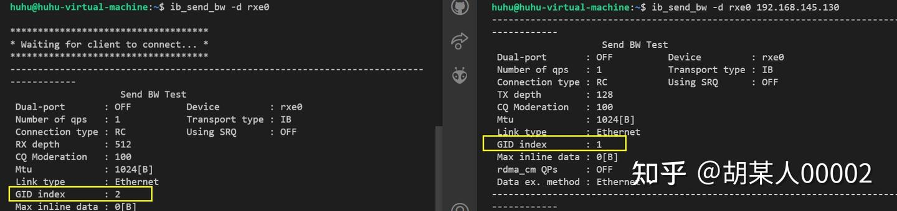

# ROCE

## RoCE与InfiniBand 切换

RoCEv2 是基于无连接协议的UDP 协议，相比面向连接的 TCP 协议，UDP 协议更加快速、占用 CPU 资源更少，但其不像 TCP 协议那样有滑动窗口、确认应答等机制来实现可靠传输，一旦出现丢包，RoCEv2 需要依靠上层应用检查到了再做重传，会大大降低 RDMA 的传输效率。

###  [RoCE和InfiniBand比较](https://support.huawei.com/enterprise/zh/doc/EDOC1100203347)

|        | InfiniBand | iWARP             | RoCE             |
| ------ | ---------- | ----------------- | ---------------- |
| 性能   | 最好       | 稍差（受TCP影响） | 与InfiniBand相当 |
| 成本   | 高         | 中                | 低               |
| 稳定性 | 好         | 差                | 较好             |
| 交换机 | IB交换机   | 以太网交换机      | 以太网交换机     |

由上表可知，三种RDMA网络的特点总结如下：

- InfiniBand：设计之初就考虑了 RDMA，从硬件级别保证可靠传输，提供更高的带宽和更低的时延。但是成本高，需要支持IB网卡和交换机。
- RoCE：基于 Ethernet 做 RDMA，消耗的资源比 iWARP 少，支持的特性比 iWARP 多。可以使用普通的以太网交换机，但是需要支持RoCE的网卡。
- iWARP：基于TCP的RDMA网络，利用TCP达到可靠传输。相比RoCE，在大型组网的情况下，iWARP的大量TCP连接会占用大量的内存资源，对系统规格要求更高。可以使用普通的以太网交换机，但是需要支持iWARP的网卡。

### 分布式存储中常用的网络协议

- IB：常用于DPC场景中的存储前端网络。
- RoCE：常用于存储后端网络。
- TCP/IP：常用于业务网络。

###  MFT 工具

#### 安装 MFT 工具

需要安装MFT工具 [Firmware for ConnectX®-5 VPI (nvidia.com)](https://network.nvidia.com/support/firmware/connectx5ib/)，完了后就可以做切换步骤：

1. mst start
2. mst status 获取 mst devices
3. 查询当前端口信息：mlxconfig -d /dev/mst/<mst_dev> q | grep LINK_TYPE_
4. 切换模式：mlxconfig -d /dev/mst/<mst_dev> set LINK_TYPE_P1=2

 

#### 查看当前端口等信息

```shell
mlxconfig -d /dev/mst/<mst_dev> q | grep LINK_TYPE_

# LINK_TYPE_P1 IB(1) 
# 1是指ib模式，2是指eth模式
```


#### 修改网卡的工作模式为RoCE：

```shell
mlxconfig -d /dev/mst/<mst_dev> set LINK_TYPE_P1=2
```

修改网卡的工作模式为RoCE,，网卡已修改为Ethernet模式，修改后需要重启机器后才生效，因为修改的是下一次（Next boot）的网卡启动的工作模式。

```shell
 $ mlxconfig -d /dev/mst/mt4119_pciconf0 set LINK_TYPE_P1=2
Device #1:
----------
Device type:    ConnectX5
Name:           N/A
Description:    N/A
Device:         /dev/mst/mt4119_pciconf0

Configurations:                                      Next Boot       New
LINK_TYPE_P1                                IB(1)           ETH(2)

Apply new Configuration? (y/n) [n] : y
Applying... Done!
-I- Please reboot machine to load new configurations.
root@bcloud-node6:/home/lynxi/mft-4.24.0-72-x86_64-deb#
```

## PORT_DOWN 

两台服务器直连，一台Link layer是InfiniBand，另一台是Ethernet，那么用ibstat查看，两台的状态就会都是PORT_DOWN (1)，如果当两台都切换为Ethernet，就会同时变为Active


## RoCE编程

RoCEv2和Infiniband的RDMA虽然都可以使用相同的verbs进行编程，但是RoCEv2一些细节还是有所不同：

- 不需要子网管理员Subnet Mangaer
- LID为0，需要使用GRH，gid_idx要大于等于0
- RC QP中的alternate path（即ibv_qp_attr中的alt_ah_attr）不需要设置

**LID在IB与RoCE中的区别**

DeepSeek 总结:

| **特性**     | **LID（IB）**                                                | **LID（RoCE）**                                              |
| ------------ | ------------------------------------------------------------ | ------------------------------------------------------------ |
| **存在性**   | 核心概念：IB网络中必须存在LID，用于二层本地寻址[3](https://blog.csdn.net/asterfusion/article/details/143573475)[6](https://blog.csdn.net/yuzhangfeng/article/details/132425617)。IB独有的概念。 | **无LID**：RoCE基于以太网协议栈，链路层使用MAC地址，无LID概念[3](https://blog.csdn.net/asterfusion/article/details/143573475)[4](https://www.toutiao.com/article/7434038965022835212/)。 |
| **分配方式** | 由IB子网管理器（SM）动态分配，16位整数标识[3](https://blog.csdn.net/asterfusion/article/details/143573475)[6](https://blog.csdn.net/yuzhangfeng/article/details/132425617)。 | 不适用                                                       |
| **作用范围** | 仅在IB子网内有效，跨子网需结合GRH（Global Routing Header）[3](https://blog.csdn.net/asterfusion/article/details/143573475)。 | 不适用                                                       |

**GID在IB与RoCE中的区别**

| **特性**     | **GID（IB）**                                                | **GID（RoCE）**                                              |
| ------------ | ------------------------------------------------------------ | ------------------------------------------------------------ |
| **定义方式** | 由IB子网前缀（64位）和端口的GUID（64位）组合生成，标识全局唯一性[3](https://blog.csdn.net/asterfusion/article/details/143573475)[6](https://blog.csdn.net/yuzhangfeng/article/details/132425617)。 | 基于IP地址映射生成： • **RoCEv1**：基于MAC地址+VLAN生成GID[3](https://blog.csdn.net/asterfusion/article/details/143573475)[4](https://www.toutiao.com/article/7434038965022835212/)。 • **RoCEv2**：直接对应IPv4/IPv6地址[3](https://blog.csdn.net/asterfusion/article/details/143573475)[4](https://www.toutiao.com/article/7434038965022835212/)。 |
| **路由能力** | 依赖IB子网管理器和GRH实现跨子网路由[3](https://blog.csdn.net/asterfusion/article/details/143573475)[6](https://blog.csdn.net/yuzhangfeng/article/details/132425617)。 | **RoCEv2支持三层路由**：通过IP地址实现跨子网通信，无需依赖子网管理器[3](https://blog.csdn.net/asterfusion/article/details/143573475)[4](https://www.toutiao.com/article/7434038965022835212/)。 |
| **封装协议** | 通过IB的GRH（Global Routing Header）携带GID[3](https://blog.csdn.net/asterfusion/article/details/143573475)。 | **RoCEv2**：GID封装在IP+UDP头中，UDP目标端口固定为4791[3](https://blog.csdn.net/asterfusion/article/details/143573475)[4](https://www.toutiao.com/article/7434038965022835212/)。 |

### RoCE编程中的常见错误

#### Unable to Connect the HCA's through the link

需要绑定 IP 与 RoCE 卡


#### Failed to change qp to rtr. Errno: Invalid argument.

我遇到这个问题是因为当初没有使用gid。RoCEv2与Infiniband的不同之一就是RoCEv2底层是使用的传统Ethernet，用不到LID（LID是在IB子网中用到的一种数据，RoCE中LID恒为0）。在RoCE中，即使是一台主机上的两台虚拟机通信，也要用到gid，即is_global要为1.

```cpp
if (target_lid == 0)
{
    qp_attr.ah_attr.is_global = 1;
    qp_attr.ah_attr.port_num = IB_PORT; /* Must */
    qp_attr.ah_attr.grh.sgid_index = config_info.gid_idx;
    memcpy(&qp_attr.ah_attr.grh.dgid, dgid, 16);
    qp_attr.ah_attr.grh.hop_limit = 0xFF;
    qp_attr.ah_attr.grh.flow_label = 0;
    qp_attr.ah_attr.grh.traffic_class = 0;
}
```

### Failed to change qp to rtr. Errno: Connection timeout

这个问题是我解决了前一个问题后才新冒出来的，后来在网上查了很久的资料也没找到有效方法解决。其实这个问题的原因其实就是 `gid_index`没有设置对。

首先得知道gid是啥，gid我把它看作是传统网络里的IP地址，在代码中是一个16个uint8_t的数组。RDMA设备的一个物理端口（port_num）其实对应不只一个gid，我们可以通过函数 `ibv_query_gid`获取到一个设备的某个端口上的第x个gid。

然后得知道，一个设备不同gid分别支持哪些协议，例如一些博客中写的 `show_gids`指令：

```bash
$ show_gids
DEV     PORT    INDEX   GID                                     IPv4            VER     DEV
---     ----    -----   ---                                     ------------    ---     ---
mlx5_4  1       0       fe80:0000:0000:0000:ee0d:9aff:fe2f:c21a                 v1      p1p1
mlx5_4  1       1       fe80:0000:0000:0000:ee0d:9aff:fe2f:c21a                 v2      p1p1
```

其中的VER就是表明这个gid是可以用在RoCEv1还是RoCEv2上。

然而show_gids指令是必须安装了OFED驱动才有的指令，我的Linux系统还没安装OFED驱动，因此也没有这个指令。后来我用了一种取巧的方法解决了此问题，那就是用 `ibv_send_bw`测试指令。（在我的环境里rping、ibv_send_bw测试都能跑通，ibv_rc_pingpong测试跑不了，后来查阅资料说pingpong测试只支持Infiniband）



如上图，可以看到在ib_send_bw中，服务器端（左）用的gid_index为2，客户端（右）用的gid_index为1，因此我在代码中也是硬编码地让服务器端使用gid_index=2，客户端使用gid_index=1，这样就解决了此问题。（使用RDMA verbs的话貌似程序可以自动选择正确的gid_index，在这里只用了VPI verbs）

参考 [RDMA学习-如何在两台虚拟机之间使用Soft-RoCE进行编程实验](https://zhuanlan.zhihu.com/p/449803157?utm_id=0)

## RoCEv2 测试


可以看出在传输层是 InfiniBand 协议，在链路层是 Ethernet 协议，确实是 RoCE。

### 查看是RoCEv1还是RoCEv2

### **通过网卡信息查询**

使用 `ibv_devinfo` 命令

运行以下命令查看网卡支持的 RDMA 协议类型：

```shell
ibv_devinfo -v | grep "transport"
输出：
transport:                    InfiniBand (0)          # 表示支持 IB 协议  
transport:                    Ethernet (1)            # 表示支持 RoCEv1/v2 
```

若输出包含 **`Ethernet`**，需进一步确认是 v1 还是 v2。RoCEv2 依赖 IP 路由，需通过 GID（Global Identifier）索引绑定 IPv4/IPv6 地址，通过检查 GID 表，即可知道是 v1还是v2：

```shell
$ ibv_devinfo -v | grep "GID" -A 5

打印：
                        GID[  0]:               fe80::6a91:d0ff:fe6e:ef18, RoCE v2

hca_id: rocep101s0f1
        transport:                      InfiniBand (0)
        fw_ver:                         1.73
        node_guid:                      6a91:d0ff:fe6e:ef19
--
                        GID[  0]:               fe80::6a91:d0ff:fe6e:ef19, RoCE v2
                        GID[  1]:               fe80::818d:77e7:ab1b:6998, RoCE v2
                        GID[  2]:               ::ffff:192.168.99.100, RoCE v2
```

当前的机器 IP 是 192.168.99.100，根据 “ GID[  2]:               ::ffff:192.168.99.100, RoCE v2” 也可以知道该机器的 gid_idx = 2

## 参考

- [ROCE技术深度解析](https://www.bilibili.com/video/BV1GPaseFEwD?spm_id_from=333.788.recommend_more_video.0&vd_source=2d2ac911095577ab30d116171d315a7c)

- [Mellanox迈络思bilibili账号](https://space.bilibili.com/3493279043684810)
