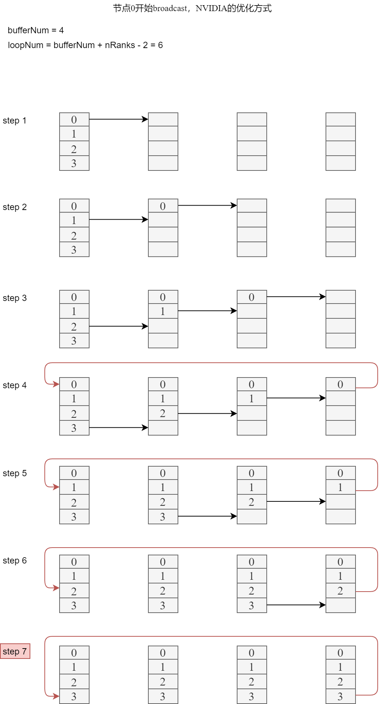
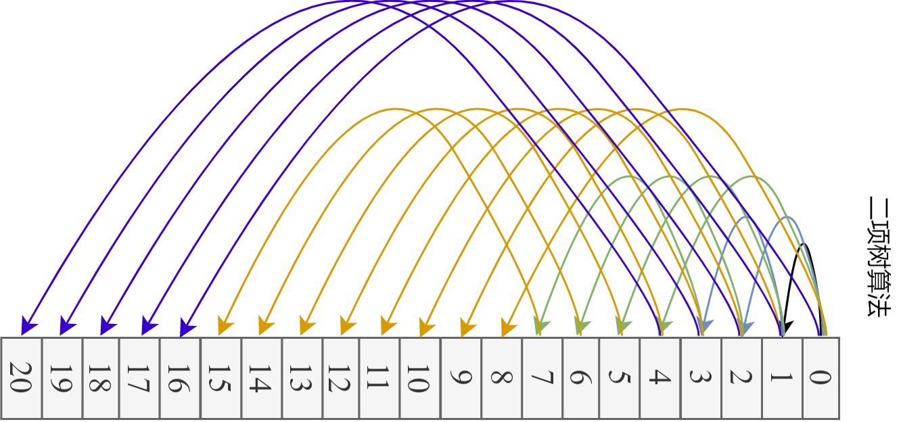
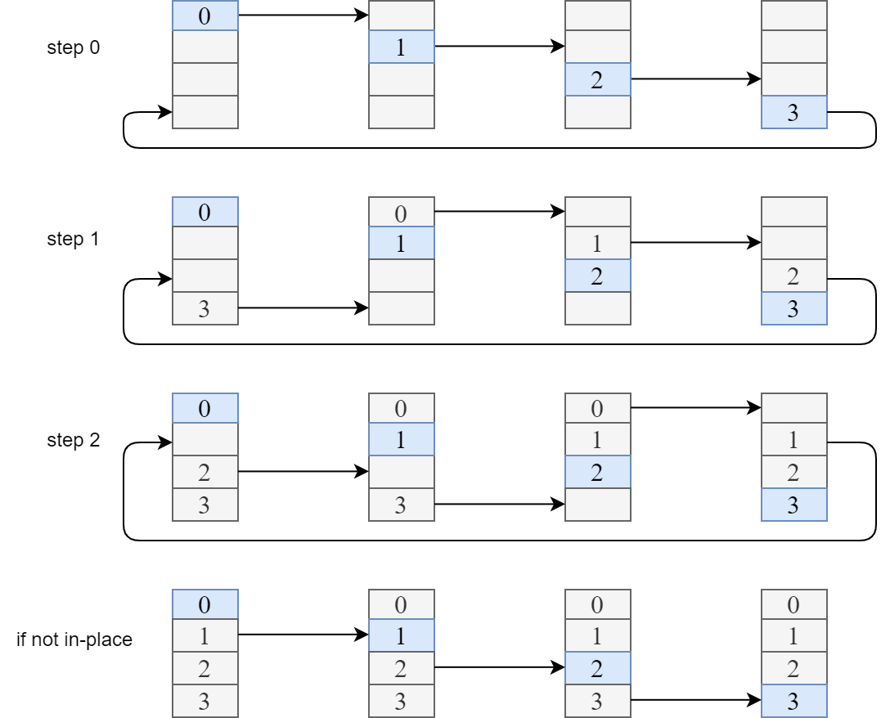
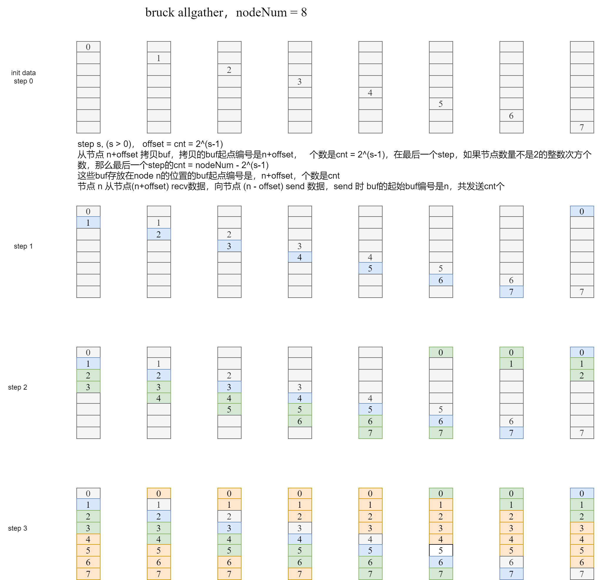
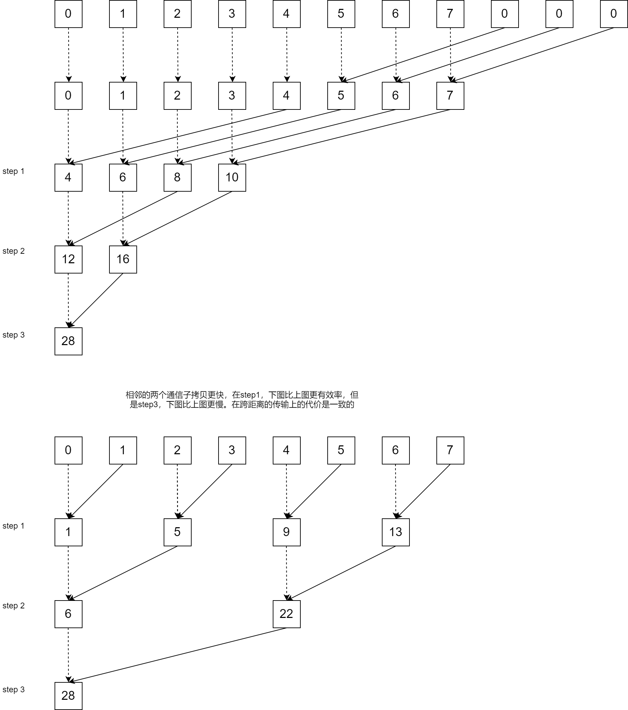
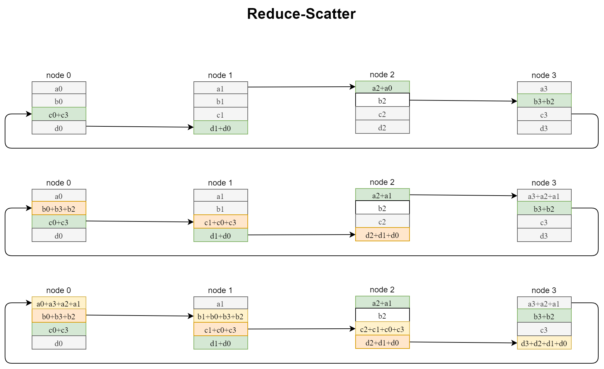
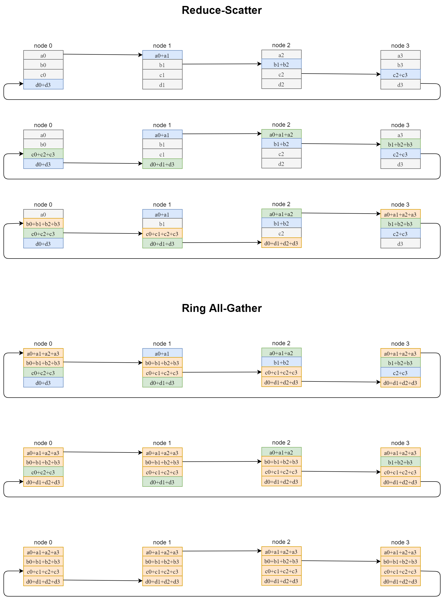
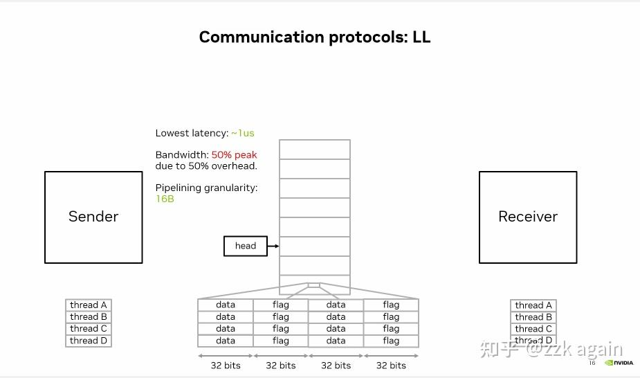
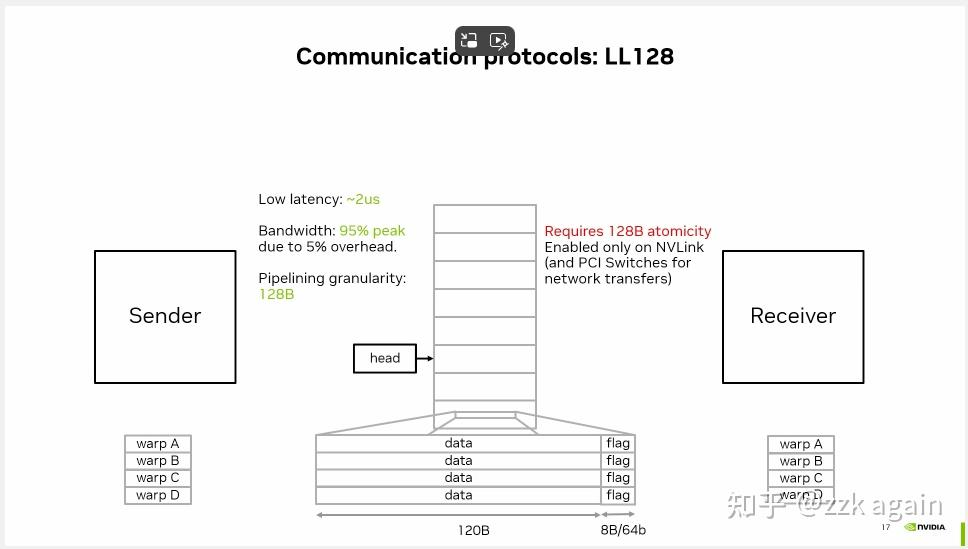

# 算法

## 算法原理与实现

### Broadcast Ring

其中红色箭头为不是 in-place 场景下的行为。其实红色箭头的行为完全可以让 root 节点的sendbuff往自己节点的recvBuffer 拷贝，但某些国产芯片同芯片间的P2P比跨芯片间的P2P慢的多，因此就多了红色箭头的拷贝路径，这在GPU中是不存在的。

### Broadcast Tree

### AllGather Full Mesh

### AllGather Ring

### AllGather Bruck

### Reduce Tree

### ReduceScatter Ring

### AllReduce Ring

## 算法耗时总结

HCCL采用α–β模型（Hockney）进行性能评估，算法耗时计算用到的变量定义如下：

- α：每次通信的固定时延。

- β：每byte数据传输耗时。

- n：节点间通信的数据大小，单位为byte。这里指集合通信接口里的 sizeof(type) * count

- N：节点间通信的数据总大小，单位为byte。一般指 AllGather\Gather里的 recvBuf 大小，即 p * sizeof(type) * count

- γ：每byte数据规约计算耗时。

- p：通信域节点个数，影响通信步数。

- s：切片的个数

  其中单步传输并规约计算n byte数据的耗时为： t = α + nβ + nγ。
  
  在计算耗时时，假设均为in-place操作。
  
  Recursive Havling-Doubling为递归二分和倍增算法
  
  SHM指利用本机的共享内存作传输的算法

|       原语       |                          算法/拓扑                           |       耗时（有root节点的以root为准，假设都是in-place）       | 备注                                                         |
| :--------------: | :----------------------------------------------------------: | :----------------------------------------------------------: | ------------------------------------------------------------ |
| `gather/scatter` |                          Full Mesh                           |                        (α + βn)(p-1)                         | 所有场景                                                     |
|   `broadcast`    |                             Ring                             | (s+p-2)(β n/s+α) = (s+p-2)β n/s + (s+p-2) α，当 s >> n 时，约等于 βn + sα | 大数据                                                       |
|                  |                             Tree                             |                    ceil(log2 p) (α + βn)                     | 节点数多，数据量少                                           |
|   `AllGather`    |                          Full Mesh                           |                        (p-1) (α + βn)                        | 每一步间不存在依赖                                           |
|                  |                             Ring                             |                        (p-1) (α + βn)                        | 每一步间存在依赖                                             |
|                  |                            Bruck                             |                   ceil(log2 p) α + (p-1)βn                   | 每一步间存在依赖，节点数多，数据量少                         |
|    `AllToAll`    |                          Full Mesh                           |                        (p-1) (α + βn)                        |                                                              |
|     `Reduce`     |                             Tree                             |                        ceil(log2 p) t                        | 注意非root节点只有sendBuffer有数据，因此该算法内部要分配临时的buffer |
|                  |                             SHM                              |                                                              |                                                              |
| `RedduceScatter` |                             Ring                             |                           (p-1) t                            | 每一步间存在依赖                                             |
|                  |                             SHM                              |                                                              |                                                              |
|   `AllReduce`    |                       Reduce+Broadcast                       |                                                              |                                                              |
|                  |                             Ring                             |    (p-1) (α + βn) + (p-1) t = 2 (p-1) (α + βn) + (p-1) nγ    |                                                              |
|                  | [Double Tree](https://developer.nvidia.com/blog/massively-scale-deep-learning-training-nccl-2-4/) |                                                              |                                                              |

参考

- HCCL：https://gitee.com/ascend/cann-hccl#/ascend/cann-hccl/blob/master/docs/Mesh.md

# NCCL源码分析

## UniqueId的创建

## [NCCL Protocol](https://zhuanlan.zhihu.com/p/699178659)

### Simple协议

LL低延迟应该是和Simple相比而言，因为Simple使用了`__threadfence_system`，这个操作比较重。

### L(ow)L(atency)协议

NCCL通信协议一共有Simple, LL, LL128。

以往NCCL为了保证同步，会引入 memory fence，这就导致延迟比较大。

**而在小数据量下，往往打不满传输带宽，此时优化点在于同步带来的延迟。**

LL协议依赖前提是 CUDA的memory 8Bytes大小的操作是atomic的，因此通信时会将数据排列组合成 4B Data + 4B Flag 进行传输。

而对端则会对Flag值进行校验，当达到预期值后，代表4B Data已经成功传输过来，便可进行下一步的操作。因为 Flag 占了整个数据包的一半，因此有效带宽是 50%，LL协议也因为这个不适用大数据量的传输。

### L(ow)L(atency)128协议

该协议与LL特别像，**但是又依赖于一些特殊硬件**(NVLink)。

在NVLink下，memory operation 是以 128B 的粒度顺序可见的。考虑每个thread依旧是用128bit(16B)传输，那么128B这个粒度只需要每8个thread为一组，并且让最后一个thread承担flag校验的任务即可。

计算下来可以得到有效数据为：16B * 7 + 8B = 120B

Flag校验位为：8B

有效带宽为：120B / 128B = 93.75%

LL128能够以较低的延迟达到较大的带宽率，NCCL会在带有NVLink的机器上默认使用该Protocol。

# 千卡训练经验

**为什么千卡训练是困难的**？

千卡训练和八卡训练的区别是—显卡多了一百多倍。意味着通信时间增加、故障概率增加。

故障上，一个节点出问题的概率是p，128个节点就是`1-(1-p)^128`。也就是说如果一个操作在一个训练当中的出错概率是1%，那么在128节点当中的出错概率就是72.37%。

那千卡训练到底难在哪里了？首先，就是难在之前提及的工程上面了 —— **简单假设一个卡在一天内不挂掉的概率是p，那么现在现在千卡同时一天内不挂掉的概率是多少？**算算你就知道，对于p^1000，其实有机器挂掉才是正常的。如果是万卡呢？你可见的是，机器N越多，p^N就越小，这个事情就是越难。有人要说“我单机训练的时候，几年都遇不到问题，老黄的GPU稳定的一塌糊涂。”对此，我也只有呵呵，没人告诉你训练不下去都是GPU的问题。你大概是选择性忘记了各种自己训练中遇到的事情 —— 比如，上次实验中断，GPU进程没杀干净，还占着内存；和人共享的服务器上，有个卧龙觉得你训练的时候CPU占用率低了点，给你加了点任务；好巧不巧，默认的缓存地址没地方了，包装不上了，预训练模型下不来了…… 说这么多看似和训练无关的事情是因为，所有这些都要能自动化，因为里面有一个地方翻车了，你训练就进行不下去了。通信连不上，磁盘满了，遇上了奇葩的GPU，IO巨慢 …… 不管什么原因挂掉了，关键的是之后应该怎么办？有没有可能对这个出问题的机器进行热替换？怎么办才能最大程度不影响训练进程？怎么样才能在下次避免同样的问题。当然，实际情况可以更加复杂，GPU不见的是同批次的，模型也可以大到，哪怕在A100上也只能这个机器放一部分，那个机器放一部分……

 **如何提高计算效率**？

这件事情其实是一个case by case的事情。因为通信、计算速度啥的受硬件影响更多。而每一个集群的硬件拓扑都是不一样的。同样是A100

集群，我全DGX节点，每一张A100都是SXM接口并配一块儿专属的IB网卡。你一个小破普惠服务器插8张PCI-E A100，IB卡一个节点只给一张。那咱俩遇到的问题就完全不是一个问题。

**计算-通信重叠**

在PyTorch当中，梯度的通信和反向传播是交叠进行的。也就是说，每完成一层的梯度计算，都会立即触发当前层的同步。实现起来也很简单，每个进程在完成自己第k层的梯度计算后都会触发一个钩子来给计数器+1s。当计数器达到进程数是开火进行梯度通信。有很多同学在计算梯度过程中遇到过RuntimeError: Expected to have finished reduction in the prior iteration before starting a new one.错误，这就是因为有的模块没有参与计算loss，导致梯度同步卡住了。需要注意，当find_unused_parameters=True时，PyTorch分布式使用nn.Module.__init__当中定义sub-module的反向顺序来作为梯度桶的构建顺序。因此，确保模块定义和调用的顺序一致对于高效训练来说很重要。

**梯度合桶**

尽管理论上来说，同步发生的越及时，重合度越高，性能越好。但实际上每次发起通信都是有上头的。因此，现实当中梯度同步并不是越多越好越快越好。为此，PyTorch引入了梯度合桶机制，通过把多个Tensor装在一个桶里再通信桶来减少通信次数从而减少总耗时。合桶的Buffer Size等等参数往往需要针对硬件和模型来调整从而取得最好的通信效果。PyTorch的默认参数是从0.x时代祖传下来的，这一参数通常都需要调节。

**梯度累加**

当你做完所有操作之后，惊喜的发现TMD怎么同步时间还是单节点的好几倍。这其实是正常情况……实际上超过256卡的训练想要把通信盖掉就是一件不可能的事情。你说老师我看FB论文说他们256卡就是线性提升啊…那这里不得不提的一个策略就是梯度累加了。梯度累加会执行k次forward+backward之后再执行优化器步进。这有很多好处，首先对于大模型batch size通常不能开多大，梯度累加可以提升等效batch size。其次累加期间的backward不需要通信梯度，加快了训练速度。

**捕捉不致命的异常**

故障率高的问题其实很好解决。在训练当中，大部分异常都是非致命异常，捉住他们就好了。

在实际应用当中，我们遇到的最常见的问题是存ckpt写满了磁盘（不准笑，从商汤到深势再到上海AI Lab，这个问题在哪儿都有出现。咱也不知道为啥肯买那么多显卡但不肯多插点儿硬盘，咱也不敢问）。catch住所有保存操作，如果你有闲心可以在回调里删一下之前的ckpt。没嫌心的话…大不了重训一次嘛（逃。第二常见的问题，你猜对了……存log写满了硬盘……所以所有logging操作也都是要catch的。这就是为啥我都用tmux然后开很长的缓存窗口，总是能抢救一些log出来的。

咳咳，说点儿正经的。任何联网操作都是需要catch的，常见的联网操作主要包括从ceph读取数据和…写log到远程（逃。其他就没啥了吧，我见过有大哥尝试恢复OOM的，但效果似乎不是很好，至少我自己没用过。简单来说，唯一不应捕捉的错误是集群炸了。

**弹性训练**

实际上当你的训练超过2048个GPU日时，在整个训练过程当中发生单个GPU甚至单个节点下线是再正常不过的事情了。

PyTorch在1.10就引入了torchelastic

弹性训练机制，用过的都骂娘。等下，让我先骂一遍，呸。ok咱们继续吧。

我印象当中在微软的最后一轮面试当中被问到了这个问题：如何设计一个弹性分布式系统。

我的回答很教科书。每k分钟，系统会做一次AllReduce来统计存活进程数，然后选举出一个主进程。主进程会计算好每个进程的rank和local  rank进行broadcast。所有进程每次forward开始时向主进程发送一个心跳包来汇报状态。主进程会根据心跳包来确定这一个step参与同步的机器有多少。

**大小梯度同步**

我一直认为梯度同步不应该以GPU/进程为单位。而应该分为大同步（节点间同步）和小同步（节点内同步）。小同步可以更高频的进行，大同步则可以更慢的执行。这样不仅能提高实际的梯度同步频率，降低同步总耗时，并且还能天然的去结合小batch和大batch训练的优点—节点内小batch关注个体，节点间大batch关注整体。