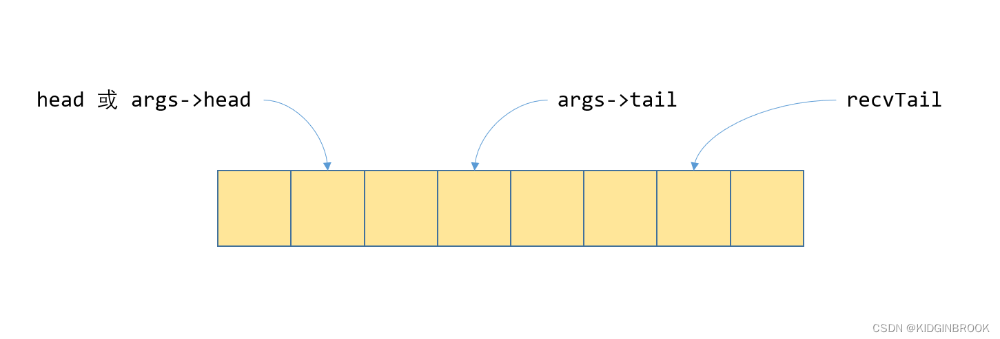

# 算法

## 算法原理与实现

### Broadcast Ring


其中红色箭头为不是 in-place 场景下的行为。其实红色箭头的行为完全可以让 root 节点的sendbuff往自己节点的recvBuffer 拷贝，但某些国产芯片同芯片间的P2P比跨芯片间的P2P慢的多，因此就多了红色箭头的拷贝路径，这在GPU中是不存在的。

### Broadcast Tree


### AllGather Full Mesh

### AllGather Ring


### AllGather Bruck


### Reduce Tree


### ReduceScatter Ring


### AllReduce Ring


## 算法耗时总结

HCCL采用α–β模型（Hockney）进行性能评估，算法耗时计算用到的变量定义如下：

- α：每次通信的固定时延。

- β：每byte数据传输耗时。

- n：节点间通信的数据大小，单位为byte。这里指集合通信接口里的 sizeof(type) * count

- N：节点间通信的数据总大小，单位为byte。一般指 AllGather\Gather里的 recvBuf 大小，即 p * sizeof(type) * count

- γ：每byte数据规约计算耗时。

- p：通信域节点个数，影响通信步数。

- s：切片的个数

  其中单步传输并规约计算n byte数据的耗时为： t = α + nβ + nγ。
  
  在计算耗时时，假设均为in-place操作。
  
  Recursive Havling-Doubling为递归二分和倍增算法
  
  SHM指利用本机的共享内存作传输的算法

|       原语       |                          算法/拓扑                           |       耗时（有root节点的以root为准，假设都是in-place）       | 备注                                                         |
| :--------------: | :----------------------------------------------------------: | :----------------------------------------------------------: | ------------------------------------------------------------ |
| `gather/scatter` |                          Full Mesh                           |                        (α + βn)(p-1)                         | 所有场景                                                     |
|   `broadcast`    |                             Ring                             | (s+p-2)(β n/s+α) = (s+p-2)β n/s + (s+p-2) α，当 s >> n 时，约等于 βn + sα | 大数据                                                       |
|                  |                             Tree                             |                    ceil(log2 p) (α + βn)                     | 节点数多，数据量少                                           |
|   `AllGather`    |                          Full Mesh                           |                        (p-1) (α + βn)                        | 每一步间不存在依赖                                           |
|                  |                             Ring                             |                        (p-1) (α + βn)                        | 每一步间存在依赖                                             |
|                  |                            Bruck                             |                   ceil(log2 p) α + (p-1)βn                   | 每一步间存在依赖，节点数多，数据量少                         |
|    `AllToAll`    |                          Full Mesh                           |                        (p-1) (α + βn)                        |                                                              |
|     `Reduce`     |                             Tree                             |                        ceil(log2 p) t                        | 注意非root节点只有sendBuffer有数据，因此该算法内部要分配临时的buffer |
|                  |                             SHM                              |                                                              |                                                              |
| `RedduceScatter` |                             Ring                             |                           (p-1) t                            | 每一步间存在依赖                                             |
|                  |                             SHM                              |                                                              |                                                              |
|   `AllReduce`    |                       Reduce+Broadcast                       |                                                              |                                                              |
|                  |                             Ring                             |    (p-1) (α + βn) + (p-1) t = 2 (p-1) (α + βn) + (p-1) nγ    |                                                              |
|                  | [Double Tree](https://developer.nvidia.com/blog/massively-scale-deep-learning-training-nccl-2-4/) |                                                              |                                                              |


参考

- HCCL：https://gitee.com/ascend/cann-hccl#/ascend/cann-hccl/blob/master/docs/Mesh.md


# NCCL源码分析

## UniqueId的创建

```c
static ncclResult_t createListenSocket(int *fd, union socketAddress *localAddr) {
  /* IPv4/IPv6 support */
  int family = localAddr->sa.sa_family;
  int salen = (family == AF_INET) ? sizeof(sockaddr_in) : sizeof(sockaddr_in6);
 
  /* Create socket and bind it to a port */
  int sockfd = socket(family, SOCK_STREAM, 0);
  if (sockfd == -1) {
    WARN("Net : Socket creation failed : %s", strerror(errno));
    return ncclSystemError;
  }
 
  if (socketToPort(&localAddr->sa)) {
    // Port is forced by env. Make sure we get the port.
    int opt = 1;
#if defined(SO_REUSEPORT)
    SYSCHECK(setsockopt(sockfd, SOL_SOCKET, SO_REUSEADDR | SO_REUSEPORT, &opt, sizeof(opt)), "setsockopt");
#else
    SYSCHECK(setsockopt(sockfd, SOL_SOCKET, SO_REUSEADDR, &opt, sizeof(opt)), "setsockopt");
#endif
  }
 
  // localAddr port should be 0 (Any port)
  SYSCHECK(bind(sockfd, &localAddr->sa, salen), "bind");
 
  /* Get the assigned Port */
  socklen_t size = salen;
  SYSCHECK(getsockname(sockfd, &localAddr->sa, &size), "getsockname");
 
#ifdef ENABLE_TRACE
  char line[1024];
  TRACE(NCCL_INIT|NCCL_NET,"Listening on socket %s", socketToString(&localAddr->sa, line));
#endif
 
  /* Put the socket in listen mode
   * NB: The backlog will be silently truncated to the value in /proc/sys/net/core/somaxconn
   */
  SYSCHECK(listen(sockfd, 16384), "listen");
  *fd = sockfd;
  return ncclSuccess;
}
```

创建监听fd，ip由localaddr指定，初始端口为0，bind时随机找一个可用端口，并通过getsockname(sockfd, &localAddr->sa, &size)将ip端口写回到localaddr，这里localaddr就是UniqueId。

**到这里UniqueId也就产生了，其实就是当前机器的ip和port**

https://blog.csdn.net/KIDGIN7439/article/details/126712106

## bootstrap网络连接的建立

rank0节点执行ncclGetUniqueId生成ncclUniqueId，通过mpi将Id广播到所有节点，然后所有节点都会执行ncclCommInitRank，这里其他节点也会进行初始化bootstrap网络和通信网络的操作，然后会执行到ncclCommInitRankSync----->initTransportsRank

```c
static ncclResult_t initTransportsRank(struct ncclComm* comm, ncclUniqueId* commId) {
  // We use 3 AllGathers
  // 1. { peerInfo, comm }
  // 2. ConnectTransport[nranks], ConnectValue[nranks]
  // 3. { nThreads, nrings, compCap, prev[MAXCHANNELS], next[MAXCHANNELS] }
 
  int rank = comm->rank;
  int nranks = comm->nRanks;
  uint64_t commHash = getHash(commId->internal, NCCL_UNIQUE_ID_BYTES);
  TRACE(NCCL_INIT, "comm %p, commHash %lx, rank %d nranks %d - BEGIN", comm, commHash, rank, nranks);
  NCCLCHECK(bootstrapInit(commId, rank, nranks, &comm->bootstrap)); // 初始化
 
  // AllGather1 - begin
  struct {
    struct ncclPeerInfo peerInfo;
    struct ncclComm* comm;
  } *allGather1Data;
    
    /***
    // ncclPeerInfo是rank的一些基本信息，比如rank号，在哪个机器的哪个进程等
struct ncclPeerInfo {
  int rank;
  int cudaDev;
  int gdrSupport;
  uint64_t hostHash;
  uint64_t pidHash;
  dev_t shmDev;
  int64_t busId; 
  // busId并不是指的总线号，指的其实是定位一个PCIe设备用到的id，即BDF(bus + device + function)，
  // 一个bus上有多个设备，一个设备有多个功能，因此通过BDF就可以定位一个设备，
  // 在机器启动完成PCIe的配置之后会将相关信息通过sysfs提供给用户，NCCL就是通过sysfs来完成拓扑检测的
};
	下文通过 bootstrapAllGather 交换所有rank的 ncclPeerInfo 信息，使每一个rank 进程拥有所以其它rank的基本信息。
    */
  NCCLCHECK(ncclCalloc(&allGather1Data, nranks));
  allGather1Data[rank].comm = comm;
  struct ncclPeerInfo* myInfo = &allGather1Data[rank].peerInfo;
  NCCLCHECK(fillInfo(comm, myInfo, commHash));
  NCCLCHECK(bootstrapAllGather(comm->bootstrap, allGather1Data, sizeof(*allGather1Data)));
 
  NCCLCHECK(ncclCalloc(&comm->peerInfo, nranks+1)); // Extra rank to represent CollNet root
  for (int i = 0; i < nranks; i++) {
    memcpy(comm->peerInfo+i, &allGather1Data[i].peerInfo, sizeof(struct ncclPeerInfo));
    if ((i != rank) && (comm->peerInfo[i].hostHash == myInfo->hostHash) && (comm->peerInfo[i].busId == myInfo->busId)) {
      WARN("Duplicate GPU detected : rank %d and rank %d both on CUDA device %x", rank, i, myInfo->busId);
      return ncclInvalidUsage;
    }
  }
```


原文链接：https://blog.csdn.net/KIDGIN7439/article/details/126938077


##  机器内拓扑分析

bootstrap网络建立时通过 allGather1Data 获取了所有rank的 ncclPeerInfo信息，此时allGather1Data，包含当前卡的rank，[PCIe](https://so.csdn.net/so/search?q=PCIe&spm=1001.2101.3001.7020) busId，/dev/shm的设备号、是否支持GDR等。

根据每个rank的bdf，可以完成拓扑检测的。通过sysfs将gpu和网卡对应的pci树结构建立出来了xml树

## 建图过程

上次分析到nccl对机器PCI系统进行拓扑分析的过程，产出的结果为xml格式，接下来，nccl会根据这个xml进图的建立过程以便之后进行路径搜索。

ncclTopoGetSystem的最后会执行ncclTopoGetSystemFromXml将xml格式转成图格式。

由于拓扑分析产出的xml不便于进行后续的路径搜索，所以本节基于xml对PCI系统进行了建图。

## 路径计算

上节NCCL完成了对机器PCI系统拓扑的建图，其中建好的图如下所示，其中GPU之间是通过NVLink连接起来的

 为了方便之后的搜索channel，接下来NCCL会先计算GPU和NIC节点到其他任意节点之间的最优路径，以及对应的带宽，即最优路径上所有边的带宽的最小值。

那么抽象一下，这个问题可以建模为给定一个无向图，每条边有一个权值，给定查询(u, v)，求节点u到节点v的路径，使得路径上的最小边的权值最大，类似无向图的最小瓶颈路，可以用生成树+LCA的方法解决；如果查询中的u是固定的，那么也可以使用类似SPFA的方法解决，将松弛方法改一下即可。

其中type为路径的类型，一共有如下几种枚举值

```c
#define PATH_LOC 0 // 自己
#define PATH_NVL 1 // 路径上的边都是NVLink
#define PATH_PIX 2 // 经过最多一个PCIe switch
#define PATH_PXB 3 // 经过了多个PCIe witch，但是没有经过CPU
#define PATH_PHB 4 // 经过了CPU
#define PATH_SYS 5 // 不同numa之间的路径
#define PATH_NET 6
```

PATH_LOC为节点到自己，PATH_NVL表示路径上的边都是NVLink，PATH_PIX表示经过最多一个PCIe switch，PATH_PXB表示经过了多个PCIe witch，但是没有经过CPU，PATH_PHB表示经过了CPU，PATH_SYS表示不同numa之间的路径。

原文链接：https://blog.csdn.net/KIDGIN7439/article/details/127849771

## channel 搜索

nccl中channel的概念表示一个通信路径，为了更好的利用带宽和网卡，以及同一块数据可以通过多个channel并发通信，另外后续可以看到一个channel对应了一个GPU SM，所以基于这些原因，nccl会使用多channel，搜索的过程就是搜索出来一组channel。


看下ncclTopoCompute，这里就是实际搜索channel的过程，目标是搜索出来尽可能多，带宽尽可能大的一系列channel，本质就是暴力搜索，先设置一系列的条件搜答案，如果搜不出来则降低条件继续搜。

由于此时没有NET节点，所以crossNic为0，然后初始化graph，首先设置最高的条件，限制节点内部只能使用不超过PATH_NVL路径，节点间只能使用不超过PATH_PIX的路径，然后通过system-maxWidth设置speedIntra和speedInter，接着执行ncclTopoSearchRec搜索出一个答案存储到tmpGraph中。

如果此时就是最优的结果，channel数等于maxChannel，并且speedInter也等于maxWidth，则直接退出，否则就开始逐步降低条件，比如将sameChannel设置为0，允许channel之间不一样；调大typeIntra和typeInter；允许crossNic；调小speedInter和speedIntra


原文链接：https://blog.csdn.net/KIDGIN7439/article/details/128074716

## 机器间channel连接

上节中完成了单机内部的channel搜索，仍然以ringGraph为例的话，相当于在单台机器内部搜索出来了一系列的环，接下来需要将机器之间的环连接起来。

为了方便理解假设两机十六卡的情况下第一台机器的一个ring为：

    graph->intra: GPU/0 GPU/7 GPU/6 GPU/3 GPU/2 GPU/5 GPU/4 GPU/1
    graph->inter: NET/0 NET/0

第二个机器对应的ring为：

    graph->intra: GPU/10 GPU/9 GPU/8 GPU/13 GPU/12 GPU/15 GPU/14 GPU/11
    graph->inter: NET/0 NET/0

allGather3Data用于rank间聚合channel的信息，ncclGraphInfo记录了环的信息，比如speed和type.

然后通过bootstrapAllGather获取全局的allGather3Data信息，计算出当前rank所在的node保存在comm->node，以及每个node的第一个rank保存在nodesFirstRank，因此例子中：

    nodesFirstRank[0]: 0
    nodesFirstRank[1]: 10

然后开始将每个机器的环首尾相连组成大环。

原文链接：https://blog.csdn.net/KIDGIN7439/article/details/128144057

## 数据通信链路transport的建立

上节以ringGraph为例介绍了机器间channel的连接过程，现在环里每个rank都知道了从哪个rank接收数据以及将数据发送给哪个rank，本节具体介绍下[P2P](https://so.csdn.net/so/search?q=P2P&spm=1001.2101.3001.7020)和rdma NET场景下数据通信链路的建立过程。

nccl现共有三个transport，P2P通过卡间p2p通信，SHM通过机器内共享的host内存通信，NET通过网络通信，nccl会依次通过这三个transport的canConnect判断是否可用，然后选择第一个可用的。

这里涉及到 IB 的连接

## 单机内ncclSend和ncclRecv的过程

单机内的通信都是通过kernel来进行的，所以整个通信的过程可以分为两步，第一步是准备kernel相关的参数，第二步是实际执行kernel的过程。


最下边send0和recv0表示用户为rank0准备的数据buffer。

之前在建立ringGraph的时候有搜索出一系列的环，并根据这些环建立了channel，假设现在一共有nChannels个channel，而p2p需要p2pnChannels个channel，那么如果p2pnChannels大于nChannles，会再创建p2pnChannels - nChannels个channel，其他的复用；否则直接复用即可。

对于每个send/recv操作，会使用p2pnChannelsPerPeer个channel并行发送/接收，那么当p2pnChannelsPerPeer比较小，p2pnChannels比较大，会导致只用了前边的几个channel，无法充分利用所有的channel，举个例子，p2pnChannelsPerPeer = 2，p2pnChannels = 32，rank0和rank1，rank2的通信都会使用channel[1]和channel[2]， 为了解决这个问题，nccl使用数组p2pChannels[p2pnChannelsPerPeer]作为偏移，比如p2pChannels[0] = 0, p2pChannels[1] = 16，那么rank0和rank1的通信会使用channel[1]和channel[17]，rank0和rank2的通信会使用channel[2]和channel[18]，更充分的利用了channel。

为了方便理解，后续举例时假定p2pnChannels和p2pnChannelsPerPeer都为1。

然后我们来看下刚刚提到的这些变量都是干嘛的，在p2p transport的setup阶段，即第八节中讲的，每个rank都创建了用于协调发送接收过程的变量，如下所示，由于支持p2p read，所以buff位于发送端；tail位于接收端，发送端和接收端共同持有，由发送端更新，head位于发送端，发送端和接收端共同持有，由接收端进行更新；在ncclPrimitives的接收端，tail叫做recvConnTailPtr，head叫做recvConnHeadPtr；而在发送端，tail叫做sendConnTailPtr，head叫做sendConnHeadPtr。


 然后看下这些变量是如何协调发送接收过程的


中间黄色的框就是图四里标的buff，整个buff被划分为NCCL_STEP块，图五只画出来六块。

sendConnHead，sendConnTailPtr，sendStep由发送端更新，每次发送都会加一，这几个值其实是相等的（所以感觉这几个变量有些冗余）。

recvConnTail，recvConnHeadPtr，recvStep由接收端更新，每次接收都会加一，这几个值其实是相等的。


到这里基本就完成了单机内部ncclSend/ncclRecv的过程，主要就是两步，先通过peerlist将用户的操作记录下来，根据记录生成kernel所需要的参数，然后启动kernel执行拷贝即可。**对于不同卡的情况**，send将数据从用户指定的sendbuff拷贝到nccl p2p transport的buff，recv将数据从buff拷贝到用户指定的recvbuff，**buff在这里其实就是一个fifo，nccl通过head，tail指针来完成对发送和接收过程的协调**；**对于同卡的情况**直接通过kernel将数据从sendbuff拷贝到recvbuff即可。


原文链接：https://blog.csdn.net/KIDGIN7439/article/details/128326053

## 多机间ncclSend和ncclRecv的过程

多机间网络通信的过程是由独立的proxy线程执行的，ncclProxyArgs保存了通信需要的参数，proxy线程会根据这些args执行相应的通信流程。然后执行SaveProxy。


ncclProxyArgs被组织成图一分层的链式结构，comm中的proxyState->ops为第一层的第一个args，图中纵向的一列表示在同一个connector上边的所有args，第一层（黄色框）为该connector的第一个args，第二层（绿色框）为该connector的第二个args，层间通过next_peer指针索引；一行就是所有connector的对应位置的args，层内通过next指针索引。

当有ProxyArgs被添加进来并唤醒proxy线程之后，proxy线程就开始执行图一的第一层args，拿到第一个args op，然后执行op的progress函数，对于send场景，progress就是netTransport的netSendProxy，receive就是netRecvProxy。执行op的progress之后遍历到下一个args next，如果next的状态不是ncclProxyOpNone，表示next还没有执行结束，那么将op设置为next，下一次将会执行next；如果状态为ncclProxyOpNone，表示next已经执行完成，那么需要将next从args链中去除，这个时候尝试将next的next_peer替换next，如果next没有next_peer，那么直接将next从第一层链中删除，否则将next_peer提到第一层链来替换next。

首先看下send端的proxy线程和kernel是如何协作的，类似单机内部send和recv之间的队列，proxy和kernel间也是通过这种生产者消费者队列来协调的，整体结构如下图所示


核心就是队列的head，tail和SizesFifo，通信过程中的buf，这些都会保存到connector的conn中。对于kernel端，当执行了loadSendConn和loadSendSync之后kernel就持有了ncclConnector的变量，如图二左侧框

对于proxy线程，ncclConnector被保存到了ncclProxyArgs中，所以proxy也可以拿到这些变量，如图二的右侧框。


对于kernel端，过程和单机一致，在搬运数据之前，通过判断sendConnHeadPtr和sendConnTailPtr之间的距离来判断队列是否已满，注意这里sendConnHead其实是sendConnTailPtr。然后将数据长度写入到sendConnFifoPtr中，即sizesFifo，这样proxy就能知道这次写的数据的长度。



recvTail由kernel更新，表示kernel端产生了这么多的数据，head由proxy更新，表示proxy完成了这些数据的发送；由于proxy使用异步发送，所以引入了tail变量，head和tail之间的数据为proxy执行了异步发送，但还没确定发送完成，tail和recvTail之间为proxy还没有执行发送的数据。

具体看下，proxy拿到一个新的ncclProxyArgs args（state为ncclProxyOpReady）之后，首先计算head，tail和end，其中head和tail表示队列的首尾，end表示完成当前这个args的数据发送一共需要多少步，然后状态转变为ncclProxyOpProgress.

单机过程中的队列其实是逻辑的，并没有实际分配一个队列，多机这里可以将sizesFifo理解为实际分配的队列，fifo中每一项代表了这块数据的长度，可以看到proxy在拿到fifo对应项之后直接通过ncclNetIsend执行数据的发送过程。

如果head小于tail，说明有执行了异步发送的请求，通过ncclNetTest判断是否发送完成，如果发送完成了，那么更新head。最后如果head等于end，说明这个args执行完成了，将state转为ncclProxyOpNone。

最后总结下多机通信的整体流程:

- 通信由kernel和proxy线程协调完成，send端kernel负责将数据从input搬运到buf，proxy线程负责将buf中数据通过网络发送给recv端
- kernel和proxy间通过队列实现生产者消费者模式
- send端通过rdma send发送数据，和recv端通过队列实现生产者消费者模式，队列位于send端，recv端每次下发一个wr到rq之后会执行rdma write通知send端


原文链接：https://blog.csdn.net/KIDGIN7439/article/details/130936177

## double binary tree

上节我们以ring allreduce为例看到了集合通信的过程，但是随着训练任务中使用的gpu个数的扩展，ring allreduce的延迟会线性增长，为了解决这个问题，NCCL引入了tree算法，即double binary tree。
double binary tree

朴素的tree算法将所有机器节点构造成一棵二叉树，支持broadcast，reduce，前缀和。假设root节点要broadcast一个消息M给所有节点，root会将M发送给他的子节点，其他所有的节点收到消息M后再发送给子节点，叶节点因为没有子节点，所以叶结点只会接收M。这个过程可以将M切分为k个block，从而可以流水线起来。

但这个朴素算法有一个问题，叶节点只接收数据，不发送，因此只利用了带宽的一半，为了解决这个问题，MPI提出了double binary tree算法，假设一共有N个节点，MPI会构建两个大小为N的树T1和T2，T1的中间节点在T2中是叶节点，T1和T2同时运行，各自负责消息M的一半，这样每个节点的双向带宽可以都被利用到。以十台机器为例，构建出的结构如下：


**ring和tree的选择**：

主体思想很简单，对于用户传入的nBytes长度数据，总耗时time = latency + nBytes / algo_bw，其中algo_bw为算法带宽，基础总线带宽为busBw，就是每个channel的带宽乘channel数，然后会根据实测的数据对带宽进行一些修正，比如tree场景会乘0.9。然后计算算法带宽，tree的话会除以2，因为上行一次，下行一次相当于发送了两倍的数据量，ring的话会除以2 * (nranks - 1) / nranks，原因见第十一节。latency计算不再赘述，最后将计算出的每种协议和算法的带宽延迟保存到bandwidths和latencies。
当用户执行allreduce api的时候会通过getAlgoInfo计算出每种算法和协议组合的执行时间，选出最优的。

原文链接：https://blog.csdn.net/KIDGIN7439/article/details/135102930

## [NCCL Protocol](https://zhuanlan.zhihu.com/p/699178659)

### Simple协议

LL低延迟应该是和Simple相比而言，因为Simple使用了`__threadfence_system`，这个操作比较重。

### L(ow)L(atency)协议

NCCL通信协议一共有Simple, LL, LL128。

以往NCCL为了保证同步，会引入 memory fence，这就导致延迟比较大。

**而在小数据量下，往往打不满传输带宽，此时优化点在于同步带来的延迟。**

LL协议依赖前提是 CUDA的memory 8Bytes大小的操作是atomic的，因此通信时会将数据排列组合成 4B Data + 4B Flag 进行传输。

而对端则会对Flag值进行校验，当达到预期值后，代表4B Data已经成功传输过来，便可进行下一步的操作。因为 Flag 占了整个数据包的一半，因此有效带宽是 50%，LL协议也因为这个不适用大数据量的传输。


### L(ow)L(atency)128协议

该协议与LL特别像，**但是又依赖于一些特殊硬件**(NVLink)。

在NVLink下，memory operation 是以 128B 的粒度顺序可见的。考虑每个thread依旧是用128bit(16B)传输，那么128B这个粒度只需要每8个thread为一组，并且让最后一个thread承担flag校验的任务即可。

计算下来可以得到有效数据为：16B * 7 + 8B = 120B

Flag校验位为：8B

有效带宽为：120B / 128B = 93.75%

LL128能够以较低的延迟达到较大的带宽率，NCCL会在带有NVLink的机器上默认使用该Protocol。


### Simple 协议

**Simple**：这是NCCL的基础通信协议，实现上相对简单，适用于不需要特别优化的通信场景。


### LL 和 LL128 协议的对比

|     特性     |             LL 协议              |                LL128 协议                 |
| :----------: | :------------------------------: | :---------------------------------------: |
|  数据块大小  |     较小（通常为 128 字节）      | 较大（通常为 128 字节的倍数，如 128 * N） |
|     延迟     |                低                |                   较低                    |
|  带宽利用率  |               较高               |                   极高                    |
| 适用数据规模 |   中等规模（几百 KB 到几 MB）    |         大规模（几 MB 到几百 MB）         |
|   硬件优化   | 优化 NVLink 和 PCIe 的低延迟特性 |     优化 NVLink 和 PCIe 的高带宽特性      |
|   适用场景   |  单节点多 GPU、中等规模数据传输  |      多节点 GPU 集群、大规模数据传输      |

### 为什么 LL128 协议的数据块较大？

LL128 协议是 LL 协议的扩展，其核心思想是通过增加数据块大小来减少通信开销，从而提高带宽利用率。具体来说：

- 减少通信次数：较大的数据块意味着每次传输的数据量增加，从而减少通信次数，降低通信开销。

- 提高带宽利用率：大数据块能够更好地利用 NVLink 和 PCIe 的高带宽特性，最大化传输效率。

参考：https://blog.csdn.net/bandaoyu/article/details/146133103

# 千卡训练经验

**为什么千卡训练是困难的**？

千卡训练和八卡训练的区别是—显卡多了一百多倍。意味着通信时间增加、故障概率增加。

故障上，一个节点出问题的概率是p，128个节点就是`1-(1-p)^128`。也就是说如果一个操作在一个训练当中的出错概率是1%，那么在128节点当中的出错概率就是72.37%。

那千卡训练到底难在哪里了？首先，就是难在之前提及的工程上面了 —— **简单假设一个卡在一天内不挂掉的概率是p，那么现在现在千卡同时一天内不挂掉的概率是多少？**算算你就知道，对于p^1000^，其实有机器挂掉才是正常的。如果是万卡呢？你可见的是，机器N越多，p^N就越小，这个事情就是越难。有人要说“我单机训练的时候，几年都遇不到问题，老黄的GPU稳定的一塌糊涂。”对此，我也只有呵呵，没人告诉你训练不下去都是GPU的问题。你大概是选择性忘记了各种自己训练中遇到的事情 —— 比如，上次实验中断，GPU进程没杀干净，还占着内存；和人共享的服务器上，有个卧龙觉得你训练的时候CPU占用率低了点，给你加了点任务；好巧不巧，默认的缓存地址没地方了，包装不上了，预训练模型下不来了…… 说这么多看似和训练无关的事情是因为，所有这些都要能自动化，因为里面有一个地方翻车了，你训练就进行不下去了。通信连不上，磁盘满了，遇上了奇葩的GPU，IO巨慢 …… 不管什么原因挂掉了，关键的是之后应该怎么办？有没有可能对这个出问题的机器进行热替换？怎么办才能最大程度不影响训练进程？怎么样才能在下次避免同样的问题。当然，实际情况可以更加复杂，GPU不见的是同批次的，模型也可以大到，哪怕在A100上也只能这个机器放一部分，那个机器放一部分……

 **如何提高计算效率**？

这件事情其实是一个case by case的事情。因为通信、计算速度啥的受硬件影响更多。而每一个集群的硬件拓扑都是不一样的。同样是A100 集群，我全DGX节点，每一张A100都是SXM接口并配一块儿专属的IB网卡。你一个小破普惠服务器插8张PCI-E A100，IB卡一个节点只给一张。那咱俩遇到的问题就完全不是一个问题。

**计算-通信重叠**

在PyTorch当中，梯度的通信和反向传播是交叠进行的。也就是说，每完成一层的梯度计算，都会立即触发当前层的同步。实现起来也很简单，每个进程在完成自己第k层的梯度计算后都会触发一个钩子来给计数器+1s。当计数器达到进程数是开火进行梯度通信。有很多同学在计算梯度过程中遇到过RuntimeError: Expected to have finished reduction in the prior iteration before starting a new one.错误，`这就是因为有的模块没有参与计算loss，导致梯度同步卡住了`。需要注意，当find_unused_parameters=True时，PyTorch分布式使用nn.Module.__init__当中定义sub-module的反向顺序来作为梯度桶的构建顺序。因此，确保模块定义和调用的顺序一致对于高效训练来说很重要。

**梯度合桶**

尽管理论上来说，同步发生的越及时，重合度越高，性能越好。但实际上每次发起通信都是有上头的。因此，现实当中梯度同步并不是越多越好越快越好。为此，PyTorch引入了梯度合桶机制，通过把多个Tensor装在一个桶里再通信桶来减少通信次数从而减少总耗时。合桶的Buffer Size等等参数往往需要针对硬件和模型来调整从而取得最好的通信效果。PyTorch的默认参数是从0.x时代祖传下来的，这一参数通常都需要调节。

**梯度累加**

当你做完所有操作之后，惊喜的发现TMD怎么同步时间还是单节点的好几倍。这其实是正常情况……实际上超过256卡的训练想要把通信盖掉就是一件不可能的事情。你说老师我看FB论文说他们256卡就是线性提升啊…那这里不得不提的一个策略就是梯度累加了。梯度累加会执行k次forward+backward之后再执行优化器步进。这有很多好处，首先对于大模型batch size通常不能开多大，梯度累加可以提升等效batch size。其次累加期间的backward不需要通信梯度，加快了训练速度。

**捕捉不致命的异常**

故障率高的问题其实很好解决。在训练当中，大部分异常都是非致命异常，捉住他们就好了。

在实际应用当中，我们遇到的最常见的问题是存ckpt写满了磁盘（不准笑，从商汤到深势再到上海AI Lab，这个问题在哪儿都有出现。咱也不知道为啥肯买那么多显卡但不肯多插点儿硬盘，咱也不敢问）。catch住所有保存操作，如果你有闲心可以在回调里删一下之前的ckpt。没嫌心的话…大不了重训一次嘛（逃。第二常见的问题，你猜对了……`存log写满了硬盘`……所以所有logging操作也都是要catch的。这就是为啥我都用tmux然后开很长的缓存窗口，总是能抢救一些log出来的。

咳咳，说点儿正经的。任何联网操作都是需要catch的，常见的联网操作主要包括从ceph读取数据和…写log到远程（逃。其他就没啥了吧，我见过有大哥尝试恢复OOM的，但效果似乎不是很好，至少我自己没用过。简单来说，唯一不应捕捉的错误是集群炸了。

**弹性训练**

实际上当你的训练超过2048个GPU日时，在整个训练过程当中发生单个GPU甚至单个节点下线是再正常不过的事情了。

PyTorch在1.10就引入了torchelastic

弹性训练机制，用过的都骂娘。等下，让我先骂一遍，呸。ok咱们继续吧。

我印象当中在微软的最后一轮面试当中被问到了这个问题：如何设计一个弹性分布式系统。

我的回答很教科书。每k分钟，系统会做一次AllReduce来统计存活进程数，然后选举出一个主进程。主进程会计算好每个进程的rank和local  rank进行broadcast。所有进程每次forward开始时向主进程发送一个心跳包来汇报状态。主进程会根据心跳包来确定这一个step参与同步的机器有多少。

**大小梯度同步**

我一直认为梯度同步不应该以GPU/进程为单位。而应该分为大同步（节点间同步）和小同步（节点内同步）。`小同步可以更高频的进行，大同步则可以更慢的执行`。这样不仅能提高实际的梯度同步频率，降低同步总耗时，并且还能天然的去结合小batch和大batch训练的优点—节点内小batch关注个体，节点间大batch关注整体。

# 其它命令


## 查看拓扑

```shell
nvidia-smi topo -m
```

最典型的当然有 nvidia-smi 和 nvidia-smi topo -m。前者都非常熟悉了，这里我对比下两台集群的 nvidia-smi topo -m 的输出：

    GPU0    GPU1    GPU2    GPU3    GPU4    GPU5    GPU6    GPU7    CPU Affinity    NUMA Affinity   GPU NUMA ID
    GPU0     X  SYS SYS SYS SYS SYS SYS SYS 0-15,32-47  0       N/A
    GPU1    SYS  X  SYS SYS SYS SYS SYS SYS 0-15,32-47  0       N/A
    GPU2    SYS SYS  X  SYS SYS SYS SYS SYS 0-15,32-47  0       N/A
    GPU3    SYS SYS SYS  X  SYS SYS SYS SYS 0-15,32-47  0       N/A
    GPU4    SYS SYS SYS SYS  X  SYS SYS SYS 16-31,48-63 1       N/A
    GPU5    SYS SYS SYS SYS SYS  X  SYS SYS 16-31,48-63 1       N/A
    GPU6    SYS SYS SYS SYS SYS SYS  X  SYS 16-31,48-63 1       N/A
    GPU7    SYS SYS SYS SYS SYS SYS SYS  X  16-31,48-63 1       N/A
     
    Legend:
     
      X    = Self
      SYS  = Connection traversing PCIe as well as the SMP interconnect between NUMA nodes (e.g., QPI/UPI)
      NODE = Connection traversing PCIe as well as the interconnect between PCIe Host Bridges within a NUMA node
      PHB  = Connection traversing PCIe as well as a PCIe Host Bridge (typically the CPU)
      PXB  = Connection traversing multiple PCIe bridges (without traversing the PCIe Host Bridge)
      PIX  = Connection traversing at most a single PCIe bridge
      NV#  = Connection traversing a bonded set of # NVLinks
      
    GPU0    GPU1    GPU2    GPU3    GPU4    GPU5    GPU6    GPU7    CPU Affinity    NUMA Affinity   GPU NUMA ID
    GPU0     X      NV18    NV18    NV18    NV18    NV18    NV18    NV18    0-47,96-143     0               N/A
    GPU1    NV18     X      NV18    NV18    NV18    NV18    NV18    NV18    0-47,96-143     0               N/A
    GPU2    NV18    NV18     X      NV18    NV18    NV18    NV18    NV18    0-47,96-143     0               N/A
    GPU3    NV18    NV18    NV18     X      NV18    NV18    NV18    NV18    0-47,96-143     0               N/A
    GPU4    NV18    NV18    NV18    NV18     X      NV18    NV18    NV18    48-95,144-191   1               N/A
    GPU5    NV18    NV18    NV18    NV18    NV18     X      NV18    NV18    48-95,144-191   1               N/A
    GPU6    NV18    NV18    NV18    NV18    NV18    NV18     X      NV18    48-95,144-191   1               N/A
    GPU7    NV18    NV18    NV18    NV18    NV18    NV18    NV18     X      48-95,144-191   1               N/A
     
    Legend:
     
      X    = Self
      SYS  = Connection traversing PCIe as well as the SMP interconnect between NUMA nodes (e.g., QPI/UPI)
      NODE = Connection traversing PCIe as well as the interconnect between PCIe Host Bridges within a NUMA node
      PHB  = Connection traversing PCIe as well as a PCIe Host Bridge (typically the CPU)
      PXB  = Connection traversing multiple PCIe bridges (without traversing the PCIe Host Bridge)
      PIX  = Connection traversing at most a single PCIe bridge
      NV#  = Connection traversing a bonded set of # NVLinks

可以读出很多有趣的信息：

通过对比这两个集群的拓扑信息，我可以得出以下几个重要结论：

**互联方式**
第一个集群：所有 GPU 之间通过 PCIe 和 NUMA 节点间的 SMP 互联（标记为 SYS）
第二个集群：所有 GPU 之间通过 18 条 NVLink 连接（标记为 NV18）
性能影响：第二个集群的 GPU 间通信性能显著优于第一个集群，因为 NVLink 的带宽和延迟都优于 PCIe+SMP 方案

**NUMA 架构**
两个集群都采用双 NUMA 节点设计：
GPU 0-3 属于 NUMA 节点 0
GPU 4-7 属于 NUMA 节点 1
GPU 通信：应尽量将相关任务分配到同一 NUMA 节点内的 GPU，以避免跨 NUMA 节点的频繁数据传输

**CPU 核心分配**：
第一个集群：每个 NUMA 节点分配 32 个核心（如 0-15,32-47）
第二个集群：每个 NUMA 节点分配 96 个核心（如 0-47,96-143）

**系统规模**
GPU 数量：两个集群都是 8 GPU 配置
CPU 核心总数：
第一个集群：64 核心
第二个集群：192 核心

**拓扑完整性**
每个 GPU 都与其他所有 GPU 直接相连

参考：https://zhuanlan.zhihu.com/p/6160835906