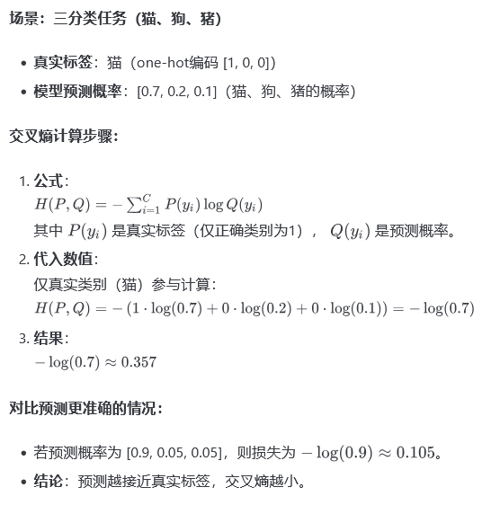
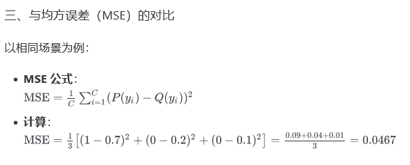

### 交叉熵

交叉熵误差（Cross-Entropy Error）是机器学习中用于衡量**概率分布差异**的损失函数，尤其在分类任务中应用广泛。其核心作用是**量化模型预测概率分布与真实分布的偏离程度**，值越小表示预测越接近真实标签。以下是详细说明和计算示例：

交叉熵误差的作用：

**衡量概率分布差异**
 交叉熵通过比较真实分布**P**和预测分布**Q**  的差异，计算 
$$
H(P,Q)=−∑P(x)logQ(x)
$$

当 Q 完全匹配 P 时，交叉熵最小（等于真实分布的熵）

**优化分类模型**

- **对错误预测更敏感**：若真实类别概率预测偏低，交叉熵会给出较大的梯度更新信号，加速模型修正错误。
- **避免梯度消失**：与均方误差（MSE）相比，交叉熵的梯度与误差成正比（，不会因激活函数饱和（如Sigmoid输出接近0或1）导致梯度趋近于0。

**与最大似然估计等价**
 最小化交叉熵等价于最大化样本的似然函数，即寻找最可能生成观测数据的模型参数。

下面是一个简单的计算例子

|  |  |
| ------------------------------------------------------------ | ------------------------------------------------------------ |

| **特性**     | **交叉熵**                               | **均方误差（MSE）**                     |
| ------------ | ---------------------------------------- | --------------------------------------- |
| 梯度特性     | 梯度与误差成正比，更新速度快             | 梯度易饱和（尤其Sigmoid输出接近0/1时）  |
| 对概率敏感度 | 对概率偏差惩罚更严厉，如 -log(0.1) = 2.3 | 对概率偏差不敏感，如 (1 - 0.1)^2 = 0.81 |
| 适合场景     | 分类任务（概率输出）                     | 回归任务（连续值输出）                  |

