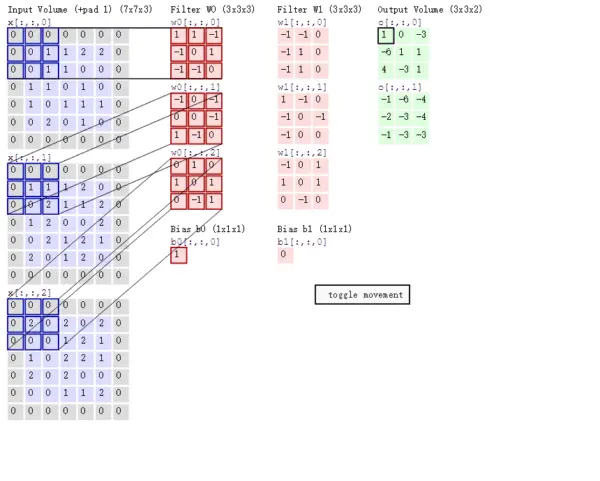
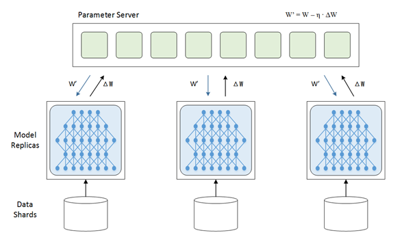
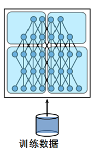
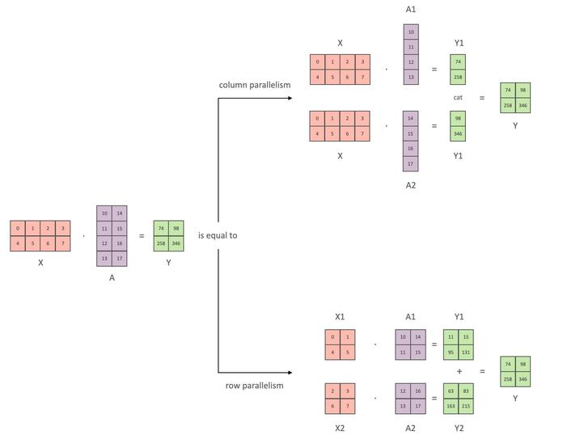
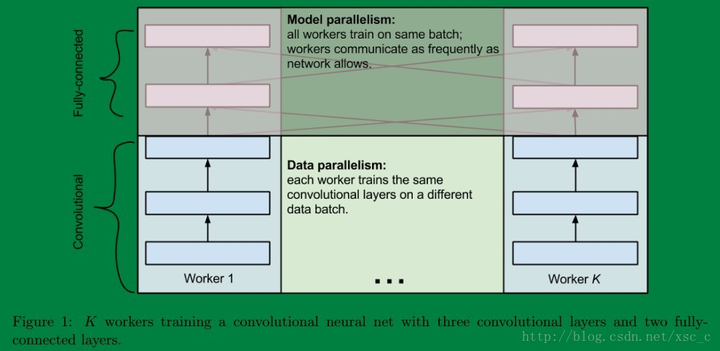
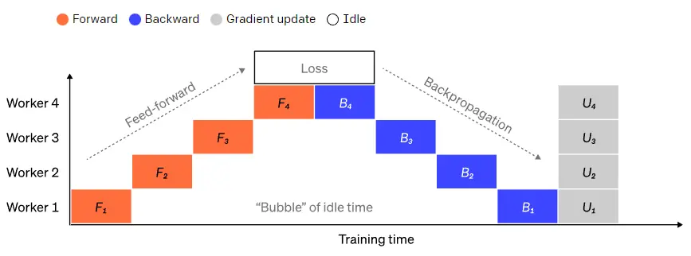
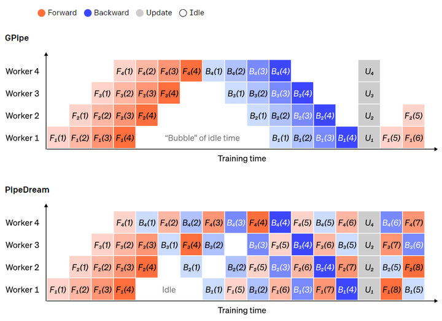

## [卷积](https://zhuanlan.zhihu.com/p/77471866)



## [NLP领域中的token和tokenization到底指的是什么？](https://www.zhihu.com/question/64984731/answer/3492419541)

所以了解 token 是什么，在如今的自然语言处理中，不仅是理论的需要，也是应用的需要。我们小时候学语文，都是字组成词，词连成句，句连成文。而 token 可以是上述的任何一个单位，或者是其中某一个部分。也就是：**字、词、短语、句子**等。而**英文**里面就不太一样了，可能是：**字母、单词、单词的子词、句子**等。

Token对应着文本中的一个元素，通过Tokenization将文本划分成一个个的Token。

**word（词）粒度**

在英文语系中，word（词）级别分词实现很简单，因为有天然的分隔符。在中文里面word（词）粒度，需要一些分词工具比如[jieba](https://zhida.zhihu.com/search?content_id=608942506&content_type=Answer&match_order=1&q=jieba&zhida_source=entity)

，以下是中文和英文的例子：

```text
中文句子：我喜欢看电影和读书。
分词结果：我 | 喜欢 | 看 | 电影 | 和 | 读书。
英文句子：I enjoy watching movies and reading books.
分词结果：I | enjoy | watching | movies | and | reading | books.
```

word（词）粒度的优点有：

- **语义明确**：以词为单位进行分词可以更好地保留每个词的语义，使得文本在后续处理中能够更准确地表达含义。
- **上下文理解**：以词为粒度进行分词有助于保留词语之间的关联性和上下文信息，从而在语义分析和理解时能够更好地捕捉句子的意图。

缺点：

- **长尾效应和稀有词问题**： 词表可能变得巨大，包含很多不常见的词汇，增加存储和训练成本，稀有词的训练数据有限，难以获得准确的表示。
- **OOV（Out-of-Vocabulary）**： 词粒度分词模型只能使用词表中的词来进行处理，无法处理词表之外的词汇，这就是所谓的OOV问题。
- **形态关系和词缀关系**： 无法捕捉同一词的不同形态，也无法有效学习词缀在不同词汇之间的共通性，限制了模型的语言理解能力，比如love和loves在word（词）粒度的词表中将会是两个词。

**2.char（字符）粒度**

以字符为单位进行分词，即将文本拆分成一个个单独的字符作为最小基本单元，这种字符粒度的分词方法适用于多种语言，无论是英文、中文还是其他不同语言，都能够一致地使用字符粒度进行处理，因为英文就26个字母以及其他的一些符号，中文常见字就6000个左右。

```text
中文句子：我喜欢看电影和读书。
分词结果：我 | 喜 | 欢 | 看 | 电 | 影 | 和 | 读 | 书 | 。

英文句子：I enjoy watching movies and reading books.
分词结果：I |   | e | n | j | o | y |   | w | a | t | c | h | i | n | g |   | m | o | v | i | e | s |   | a | n | d |   | r | e | a | d | i | n | g |   | b | o | o | k | s | .
```

char（字符）粒度的优点有：

- **统一处理方式**：字符粒度分词方法适用于不同语言，无需针对每种语言设计不同的分词规则或工具，具有通用性。
- **解决OOV问题**：由于字符粒度分词可以处理任何字符，无需维护词表，因此可以很好地处理一些新创词汇、专有名词等问题。

缺点：

- **语义信息不明确**：字符粒度分词无法直接表达词的语义，可能导致在一些语义分析任务中效果较差。
- **处理效率低**：由于文本被拆分为字符，处理的粒度较小，增加后续处理的计算成本和时间。

**3.subword（子词）粒度**

在很多情况下，既不希望将文本切分成单独的词（太大），也不想将其切分成单个字符（太小），而是希望得到介于词和字符之间的子词单元。这就引入了 subword（子词）粒度的分词方法。

参考：https://www.zhihu.com/question/64984731/answer/3492419541

### **什么是Tokenizer？**

Tokenizer是将文本切分成多个tokens的工具或算法。它负责将原始文本分割成tokens 序列。在NLP中，有多种不同类型的tokenizer，每种tokenizer都有其特定的应用场景和适用范围。

1. **基于字符的Tokenizer**：将文本按照字符分割成token，适用于处理中文等没有空格分隔的语言。但是，正如 GPT-3.5 的切分效果，现在的大模型并不一定会按照这个方式划分，但是但是 [bert-base-chinese](https://zhida.zhihu.com/search?content_id=665058060&content_type=Answer&match_order=1&q=bert-base-chinese&zhida_source=entity) 还是按照这个规则进行划分的。
2. **基于词的Tokenizer**：将文本按照语言的语法规则分割成单词。适用于大部分语言，但对于某些复合词语言效果可能不佳。而最简单的语法规则应该是基于空格分割，它将文本字符串按照空白字符（如空格、制表符、换行符等）进行分割。这种方法适用于英文等使用空格分隔单词的语言，但在处理中文、日语等不使用空格分隔单词的语言时效果不佳。
3. 基于句子的Tokenizer：将文本按照句子进行划分。但是这种在实际应用中并不多见。
4. 基于深度学习的Tokenizer：利用神经网络模型来学习文本字符串的最佳分割方式。这种方法通常使用大量的标注数据进行训练，从而让模型能够捕捉到文本中的复杂特征和规律。基于深度学习的 `Tokenization` 在处理中文等不使用空格分隔单词的语言时表现出色，因为它可以学习到单词和句子的语义信息。

## [大模型参数量和显存的换算关系](https://www.zhihu.com/question/612046818/answer/3438795176)

### **1B参数对应多少G显存？**

B和G都是十亿（1000M或1024M）的意思，M是100万的意思，平时说模型参数有**x**B就是说有**x**十亿个参数，平时说显存有多少G/M是说有多少G/M个**字节**（byte），1个字节=8比特（bit），那么，1B模型参数对应多少G内存和参数的精度有关，如果是全精度训练（fp32），一个参数对应32比特，也就是4个字节，参数换算到显存的时候要乘4，也就是1B模型参数对应4G显存，如果是fp16或者bf16就是乘2，1B模型参数对应2G显存。

### 有哪几部分显存开销，他们所占显存分别是参数的多少倍？

除了模型参数本身外，训练时的显存开销还有这几个部分：

- 梯度：一个参数对应一个梯度值，所以梯度所占显存是参数的1倍
- 优化器状态：取决于优化器的具体类型，如果是裸SGD就不需要额外显存开销，如果是带一阶动量（momentum）的SGD就是1倍，如果是Adam的话就要在momentum的基础上加上二阶动量，优化器状态所占显存就是参数的2倍。

小结：假设我们全参数微调训练一个参数量为1B的大模型，优化器为Adam，精度为fp32，忽略数据和hidden states部分的显存占用，那么显存占用为：参数的4G+梯度的4G+优化器状态的8G，共16G。如果是bf16精度训练则要减半，就是8G。如果是混合精度训练则根据各部分的精度调整计算过程。

## 目前训练超大规模语言模型技术路线：GPU + PyTorch + Megatron-LM + DeepSpeed。这几个工具在训练中各自的作用是什么？

|             | DeepSeed | DeepSeed代表性功能                | Megatron | Megatron代表性功能 | 备注                                                         |
| :---------: | -------- | --------------------------------- | -------- | ------------------ | ------------------------------------------------------------ |
| GPU底层优化 | 有       | 开创性的全栈 GPU 内核设计FP6 量化 | 更牛逼   | Fused CUDA Kernels | 毕竟Megatron是Nvidia亲儿子，底层优化信手拈来。               |
|  数据并行   | 更牛逼   | Zero系列的分布式数据并行方案      | 有       | 优化器分片         | Megatron 也做了类似 Zero1 的优化器分片，但数据并行没有 deepspeed 强 |
|  模型并行   | 有       |                                   | 更牛逼   |                    | Megatron的张量并行很牛                                       |


 `PyTorch` 提供动态图机制和自动微分（Autograd），是模型定义、数据处理和训练流程编排的核心框架。

- **动态计算图**：支持复杂控制流（如条件分支、循环），便于调试与实验。
- **分布式接口**：提供`torch.distributed` 模块（如AllReduce通信原语）和`DistributedDataParallel`（DDP）封装。

**与深度优化的结合**

- **扩展接口**：通过`torch.nn.Module` 和`torch.autograd.Function` 允许用户自定义并行策略。
- **生态兼容**：与Megatron-LM和DeepSpeed的API深度集成，例如通过`deepspeed.initialize()` 无缝加载优化器。

`Megatron-LM`：模型并行的核心引擎

1. **核心作用**
    由NVIDIA开发的Megatron-LM专注于**模型并行**，通过张量并行（Tensor Parallelism）和流水线并行（Pipeline Parallelism）拆分超大规模模型。
   - **张量并行**：将单个矩阵运算（如GEMM）按行或列拆分到多卡，例如将Transformer层的MLP和注意力头分布到不同GPU。
   - **流水线并行**：将模型按层拆分（如将前10层分配至GPU 1，后10层至GPU 2），通过微批次（Microbatches）隐藏通信开销。
2. **关键技术细节**
   - **通信优化**：在张量并行中，使用AllReduce同步梯度；在流水线并行中，通过气泡（Bubble）压缩技术减少空闲时间。
   - **显存效率**：结合激活检查点（Activation Checkpointing），仅保留关键中间结果，降低显存占用。

`DeepSpeed`：内存与训练效率的终极优化

1. **核心作用**
    DeepSpeed（微软开发）通过ZeRO（Zero Redundancy Optimizer）系列技术优化显存占用和通信效率，同时提供分布式训练工具链。
   - ZeRO阶段1/2/3
     - **阶段1**：拆分优化器状态（Optimizer States）到多卡，显存降低4倍。
     - **阶段2**：进一步拆分梯度（Gradients），显存降低8倍。
     - **阶段3**：拆分模型参数（Parameters），显存降低至理论极限（与GPU数量成反比）。
   - **混合精度与卸载**：支持FP16/BF16训练，结合CPU/NVMe Offloading，扩展模型规模至万亿参数。
2. **附加功能**
   - **3D并行**：整合数据并行（ZeRO）、模型并行（Megatron-LM）和流水线并行，支持超线性扩展。
   - **通信压缩**：通过梯度稀疏化（如1-bit Adam）减少通信数据量。
   - **容错训练**：自动保存检查点（Checkpoint），支持训练中断恢复。


## 并行

### 数据并行



### 模型并行

#### Tensor并行

在上面的这张图里，每一个节点（或者叫进程）都有一份模型，然后各个节点取不同的数据，通常是一个batch_size，然后各自完成前向和后向的计算得到梯度，这些进行训练的进程我们成为worker，除了worker，还有参数服务器，简称ps server，这些worker会把各自计算得到的梯度送到ps server，然后由ps server来进行update操作，然后把update后的模型再传回各个节点。因为在这种并行模式中，被划分的是数据，所以这种并行方式叫数据并行



深度学习的计算其实主要是矩阵运算，而在计算时这些矩阵都是保存在内存里的，如果是用GPU卡计算的话就是放在显存里，可是有的时候矩阵会非常大，比如在CNN中如果num_classes达到千万级别，那一个FC层用到的矩阵就可能会大到显存塞不下。这个时候就不得不把这样的超大矩阵给拆了分别放到不同的卡上去做计算，从网络的角度来说就是把网络结构拆了，其实从计算的过程来说就是把矩阵做了分块处理。

比较好理解，具体看Megatron论文，就是把一个神经网络层Tensor切成了多个小的Tensor，每个tensor放在不同的gpu。主要就是列并行、行并行。在transformer里的应用具体体现在MLP、Attention层里。




有的时候呢数据并行和模型并行会被同时用上。比如深度的卷积神经网络中卷积层计算量大，但所需参数系数 W 少，而FC层计算量小，所需参数系数 W 多。因此对于卷积层适合使用数据并行，对于全连接层适合使用模型并行。 就像这样



#### 流水线并行

流水并行是指按顺序将模型切分为不同的部分至不同的GPU上运行。每个GPU上只有部分参数，因此每个部分的模型消耗GPU的显存成比例减少。

将大型模型分为若干份连续的layer很简单。但是，layer的输入和输出之间存在顺序依赖关系，因此在一个GPU等待其前一个GPU的输出作为其输入时，朴素的实现会导致出现大量空闲时间。这些空闲时间被称作“气泡”，而在这些等待的过程中，空闲的机器本可以继续进行计算。



一个朴素的流水并行设置，其中模型按layer垂直分成 4 个部分。worker 1托管网络第一层（离输入最近）的模型参数，而 worker 4 托管第 4 层（离输出最近）的模型参数。“F”、“B”和“U”分别代表前向、反向和更新操作。下标指示数据在哪个节点上运行。由于顺序依赖性，数据一次只能在一个节点上运行。

了减少气泡的开销，在这里可以复用数据并行的打法，核心思想是将大批次数据分为若干个微批次数据（microbatches），每个节点每次只处理一个微批次数据，这样在原先等待的时间里可以进行新的计算。


每个微批次数据的处理速度会成比例地加快，每个节点在下一个小批次数据释放后就可以开始工作，从而加快流水执行。有了足够的微批次，节点大部分时间都在工作，而气泡在进程的开头和结束的时候最少。梯度是微批次数据梯度的平均值，并且只有在所有小批次完成后才会更新参数。

模型拆分的节点数通常被称为流水线深度（pipeline depth）。

在前向传递过程中，节点只需将其layer块的输出（激活）发送给下一个节点；在反向传递过程中，节点将这些激活的梯度发送给前一个节点。如何安排这些进程以及如何聚合微批次的梯度有很大的设计空间。GPipe 让每个节点连续前向和后向传递，在最后同步聚合多个微批次的梯度。PipeDream则是让每个节点交替进行前向和后向传递。



GPipe 和 PipeDream 流水方案对比。每批数据分为4个微批次，微批次1-8对应于两个连续大批次数据。图中，“（编号）”表示在哪个微批次上执行操作，下标表示节点 ID。其中，PipeDream使用相同的参数执行计算，可以获得更高的效率。


**参考：**

- https://www.zhihu.com/question/53851014
- [流水并行讲的好](https://www.zhihu.com/question/53851014/answer/2530594788)
- [图解大模型训练之：数据并行上篇(DP, DDP与ZeRO)](https://zhuanlan.zhihu.com/p/617133971)
- [图解大模型训练之：数据并行下篇( DeepSpeed ZeRO，零冗余优化)](https://zhuanlan.zhihu.com/p/618865052)


