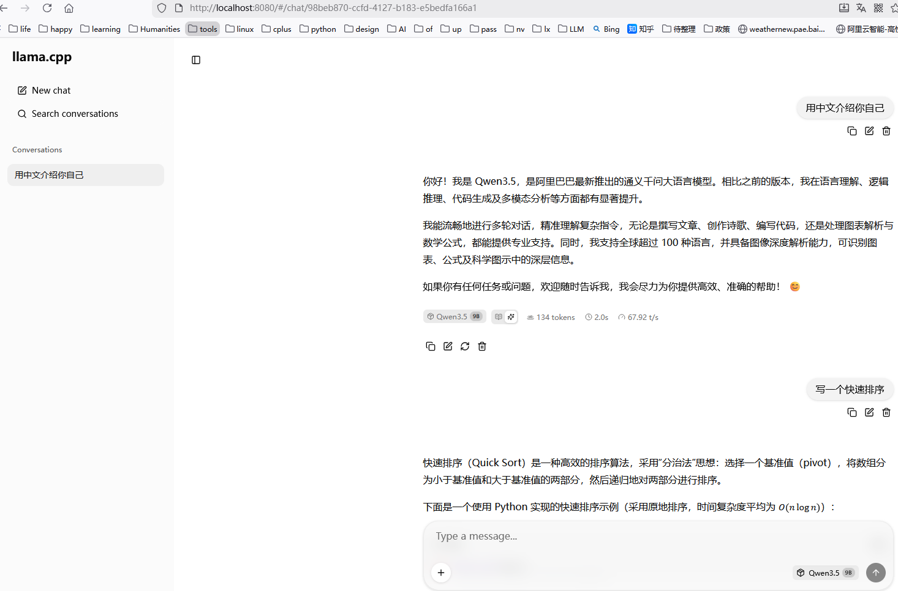

# 部署

## 编译 `llama.cpp`

### 编译 CPU 版本

```bash
mkdir -p build
cd build
cmake ..
cmake --build . -j
```

编译完成后，主要可执行文件在：

- `build/bin/llama-cli`：命令行推理
- `build/bin/llama-server`：HTTP/WebSocket 推理服务

### 编译 GPU（CUDA）版本

建议单独建一个 GPU 版本的构建目录：

```bash
mkdir -p build-cuda
cd build-cuda

cmake .. -DLLAMA_CUDA=ON
cmake --build . -j
```

完成后，GPU 版本的可执行文件位于：`build-cuda/bin/llama-cli`、`build-cuda/bin/llama-server` 等，会优先把计算 offload 到 GPU。

## 用 `llama-cli` 启动模型（会看到 Thinking 输出）

### CPU 版本

```bash
./bin/llama-cli \
  -m ../model/Qwen3.5-0.8B-GGUF/Qwen3.5-0.8B-UD-Q4_K_XL.gguf \
  -p "用中文简单介绍一下你自己和你的能力。只输出给用户看的最终回答一小段话。" \
  -n 256
```

- **`-m`**：模型路径（相对 `build` 目录）  
- **`-p`**：提示词（Prompt）  
- **`-n`**：最多生成多少个 token

很多 Qwen3.5 GGUF（包括 0.8B / 9B 等 UD 与非 UD 版本）在这种直接使用 `llama-cli -p` 的方式下，会输出类似：

- `[Start thinking]` / `Thinking Process:` / `[End thinking]`

这部分文本是**模型本身学到的思维链格式**，`llama-cli` 只是原样打印，不会自动帮你隐藏。

### 2. GPU 版本

```bash
./bin/llama-cli \
  -m ../model/Qwen3.5-0.8B-GGUF/Qwen3.5-0.8B-UD-Q4_K_XL.gguf \
  -ngl 999 \
  -t 48 \
  -p "用中文简单介绍一下你自己和你的能力。只输出给用户看的最终回答一小段话。" \
  -n 256
```

- **`-ngl 999`**：尽可能把所有层都 offload 到 GPU（显存足够时这么写最省心）。  
- **`-t 48`**：使用 48 个 CPU 线程做辅助调度，可根据实际 CPU 核数微调。

如果想进入交互式对话，只需要把上面的 `-p ... -n ...` 换成 `-i`：

```bash
./bin/llama-cli \
  -m ../model/Qwen3.5-0.8B-GGUF/Qwen3.5-0.8B-UD-Q4_K_XL.gguf \
  -ngl 999 \
  -t 48 \
  -i
```

在 `llama-cli` 模式下，如果你看到完整的 Thinking 段落，这是**模型的设计行为**，不是 `llama.cpp` 的额外“功能开关”。

## 用 `llama-server` 部署 HTTP 服务

如果你希望像网上某些示例中那样，以 **Non-Thinking 模式** 使用 Qwen3.5，适合作为 HTTP 接口给前端或其他服务调用，推荐使用 `llama-server` + Qwen 的 chat-template 参数来**隐藏思考过程**。

### 1. 启动 `llama-server`

CPU/GPU命令一致：

```bash
./bin/llama-server \
  -m ../model/Qwen3.5-0.8B-GGUF/Qwen3.5-0.8B-UD-Q4_K_XL.gguf \
  --ctx-size 4096 \
  --host 0.0.0.0 \
  --port 8080 \
  --chat-template-kwargs '{"enable_thinking":false}'
```

- **`--ctx-size`**：上下文长度（可按需调大到 8192 / 16384，取决于显存与需求）。  
- **`--host` / `--port`**：服务监听地址与端口。  
- **`--chat-template-kwargs '{"enable_thinking":false}'`**：通过 Qwen chat-template 参数显式关闭 Thinking 模式，服务器内部仍可利用思考能力，但返回给客户端的内容只保留最终回答。

### 2. 用 HTTP 客户端调用

最简单可以直接用 `curl`：

```bash
curl -s http://127.0.0.1:8080/completion -d '{
  "prompt": "用中文简单介绍一下你自己和你的能力。只输出给用户看的最终回答一小段话。",
  "n_predict": 256
}'
```

在这种模式下，返回结果中一般不会再包含 `[Start thinking] ... [End thinking]` 这类思考过程，更适合作为正式服务接口。

```text
$ curl http://127.0.0.1:8080/v1/chat/completions \
  -H "Content-Type: application/json" \
  -d '{
    "model": "Qwen3.5-9B-Q4_K_M.gguf",
    "messages": [
      { "role": "user", "content": "用中文简单介绍一下你自己和你的能力。只输出给用户看的最终回答一小段话。" }
    ]
  }'

{"choices":[{"finish_reason":"stop","index":0,"message":{"role":"assistant","content":"你好！我是 Qwen3.5，阿里巴巴最新推出的通义千问大语言模型。我具备强大的语言理解与生成能力，能流畅地进行多轮对话、逻辑推理、数学计算及代码编写，甚至支持长文档深度分析与多语言交互。无论是创作文章、解决复杂问题，还是处理视觉或音频任务，我都能提供精准、高效的协助，致力于成为你得力的智能伙伴。"}}],"created":1773281158,"model":"Qwen3.5-9B-Q4_K_M.gguf","system_fingerprint":"b8281-0cec84f99","object":"chat.completion","usage":{"completion_tokens":87,"prompt_tokens":30,"total_tokens":117},"id":"chatcmpl-0v8VuHVM5p0qCwNvCfsxx0Obtch4kcU9","timings":{"cache_n":0,"prompt_n":30,"prompt_ms":75.458,"prompt_per_token_ms":2.5152666666666668,"prompt_per_second":397.57215934692147,"predicted_n":87,"predicted_ms":1200.565,"predicted_per_token_ms":13.799597701149425,"predicted_per_second":72.46588064786164}}

$ curl http://127.0.0.1:8080/v1/chat/completions   -H "Content-Type: application/json"   -d '{
    "model": "Qwen3.5-9B-Q4_K_M.gguf",
    "messages": [
      { "role": "user", "content": "写一个冒泡排序。" }
    ]
  }'
{"choices":[{"finish_reason":"stop","index":0,"message":{"role":"assistant","content":"下面是一个用 Python 实现的冒泡排序示例：\n\n```python\ndef bubble_sort(arr):\n    n = len(arr)\n    # 外层循环控制趟数\n    for i in range(n - 1):\n        # 标记是否发生交换，用于优化（如果某趟没有交换，说明已排序完成）\n        swapped = False\n        # 内层循环进行相邻元素比较和交换\n        for j in range(0, n - 1 - i):\n            if arr[j] > arr[j + 1]:\n                # 交换\n                arr[j], arr[j + 1] = arr[j + 1], arr[j]\n                swapped = True\n        # 如果这一趟没有发生任何交换，说明已经有序，提前结束\n        if not swapped:\n            break\n    return arr\n\n# 测试\nnums = [5, 3, 8, 4, 2]\nprint(\"原始列表:\", nums)\nsorted_nums = bubble_sort(nums)\nprint(\"排序后: \", sorted_nums)\n```\n\n如果你需要其他语言版本（如 C/C++/Java/JavaScript 等），告诉我即可。"}}],"created":1773281200,"model":"Qwen3.5-9B-Q4_K_M.gguf","system_fingerprint":"b8281-0cec84f99","object":"chat.completion","usage":{"completion_tokens":251,"prompt_tokens":18,"total_tokens":269},"id":"chatcmpl-lCvHF2zi0n7a2BTKNiWSgIMzBj6Mzs8O","timings":{"cache_n":0,"prompt_n":18,"prompt_ms":60.923,"prompt_per_token_ms":3.384611111111111,"prompt_per_second":295.45491850368495,"predicted_n":251,"predicted_ms":3516.378,"predicted_per_token_ms":14.009474103585658,"predicted_per_second":71.38026685413229}}
```

### 在浏览器中与大模型交互

