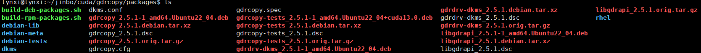

# 常用的依赖安装方式

## CUDA Toolkit

[点击访问 cuda toolkit 下载页面](https://developer.nvidia.com/cuda-downloads?target_os=Linux&target_arch=x86_64&Distribution=Ubuntu&target_version=22.04&target_type=deb_local)，之后就可以看到安装的下载与命令，如下所示

```shell
# Installation Instructions:
wget https://developer.download.nvidia.com/compute/cuda/repos/ubuntu2204/x86_64/cuda-ubuntu2204.pin
sudo mv cuda-ubuntu2204.pin /etc/apt/preferences.d/cuda-repository-pin-600
wget https://developer.download.nvidia.com/compute/cuda/13.0.0/local_installers/cuda-repo-ubuntu2204-13-0-local_13.0.0-580.65.06-1_amd64.deb
sudo dpkg -i cuda-repo-ubuntu2204-13-0-local_13.0.0-580.65.06-1_amd64.deb
sudo cp /var/cuda-repo-ubuntu2204-13-0-local/cuda-*-keyring.gpg /usr/share/keyrings/
sudo apt-get update
sudo apt-get -y install cuda-toolkit-13-0
```

可以在 `/var/cuda-repo-ubuntu*local` 下看到很多的 deb 包。

之后再安装驱动

```shell
# To install the proprietary kernel module flavor
# 安装专有内核模块版本，用于高性能计算
sudo apt-get install -y cuda-drivers
```

## gdrcopy

可以参考博客：[ubuntu 20.04 安装使用 nvidia gdrcopy](https://blog.csdn.net/eloudy/article/details/143486017)

```shell
git clone --recursive https://github.com/NVIDIA/gdrcopy.git
cd gdrcopy/
cd packages/

# 编译，生成 deb，一共是 4 个
CUDA=/usr/local/cuda ./build-deb-packages.sh

# 安装
sduo dpkg -i *.deb
```

